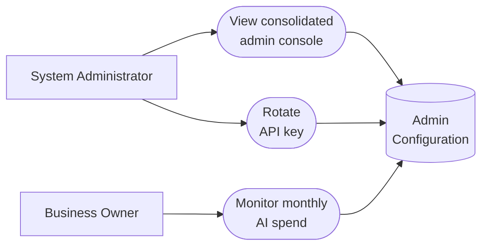

# PART 5 — USE CASES
## Module 11: Admin Configuration
### Product: P2 — AI Marketing & Sales RevOps Engine | Layer 2 — Product & Functional

---

## Use Case Diagram

## UC-P2-030: View Consolidated Admin Console

| Field | Detail |
|---|---|
| Actor | System Administrator |
| Preconditions | Administrator is authenticated with admin access |
| **Main Flow** | 1. Administrator opens the admin console. 2. System displays an index of all configurable parameters across modules with links to each (AI-FR-072). 3. Administrator navigates to the relevant module's configuration. |
| **Alternate Flows** | None |
| **Exceptions** | None defined |
| Postconditions | Administrator can locate any configuration item without prior knowledge of which module owns it. |

## UC-P2-031: Rotate API Key

| Field | Detail |
|---|---|
| Actor | System Administrator |
| Preconditions | An active API key exists for an LLM or telephony provider |
| **Main Flow** | 1. Administrator opens API key management. 2. Administrator initiates key rotation, entering the new key value. 3. System validates the new key format (AI-FR-074). 4. System completes in-flight requests using the cached old key, then switches fully to the new key. 5. System masks the key value in all UI displays going forward (AI-BR-034). |
| **Alternate Flows** | None |
| **Exceptions** | E1. New key entered in invalid format → "This does not look like a valid [Provider] API key." Save blocked. |
| Postconditions | The new key is active with no mid-conversation failures during the transition; the old key value is never re-displayed. |

## UC-P2-032: Monitor Monthly AI Spend

| Field | Detail |
|---|---|
| Actor | Business Owner |
| Preconditions | Business Owner has "View cost monitoring dashboard" permission |
| **Main Flow** | 1. Business Owner opens the Cost Monitoring dashboard. 2. System displays current month-to-date spend against the configured threshold (<$1,000/month) (AI-FR-075). 3. Business Owner assesses whether spend is on track. |
| **Alternate Flows** | None |
| **Exceptions** | E1. Spend exceeds the configured threshold → alert delivered to Business Owner and System Admin (non-blocking). |
| Postconditions | Business Owner has current visibility into AI spend relative to budget. |

---

**Layer 2 Gate Check:** ✅ One use case per user story (3 of 3). ✅ Each includes at least one alternate flow or exception.

*P2 Master SRS — Part 5, Module 11 of 17.*
