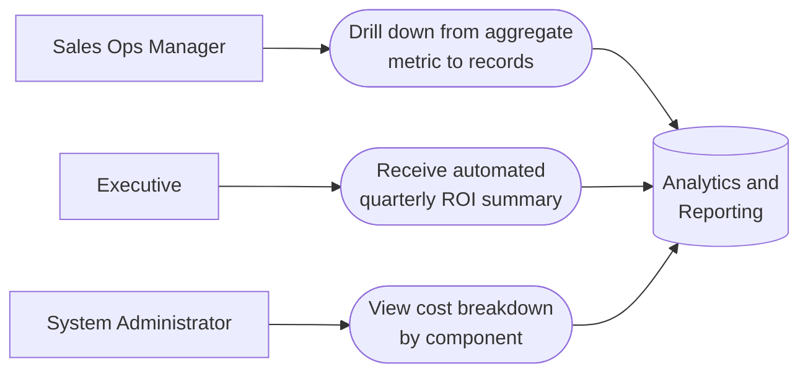

# PART 5 — USE CASES
## Module 12: Analytics & Reporting Dashboard
### Product: P2 — AI Marketing & Sales RevOps Engine | Layer 2 — Product & Functional

---

## Use Case Diagram

## UC-P2-033: Drill Down from Aggregate Metric to Records

| Field | Detail |
|---|---|
| Actor | Sales Ops Manager |
| Preconditions | A dashboard displaying an aggregate metric is open |
| **Main Flow** | 1. Sales Ops Manager clicks an aggregate metric (e.g., "12 stalled leads"). 2. System opens a filtered list of exactly those underlying records (AI-FR-083). 3. Sales Ops Manager reviews/acts on individual records. |
| **Alternate Flows** | None |
| **Exceptions** | E1. Zero records match the drill-down → "No records match this view." Empty state, not an error. |
| Postconditions | Sales Ops Manager has actionable, record-level detail behind any summary number. |

## UC-P2-034: Receive Automated Quarterly ROI Summary

| Field | Detail |
|---|---|
| Actor | Executive |
| Preconditions | Quarterly reporting schedule is configured |
| **Main Flow** | 1. System generates the Executive ROI Summary on the quarterly schedule, combining conversion and cost data (AI-FR-081, Part 1.6). 2. System delivers the report via the configured channel (AI-FR-082). 3. Executive reviews the summary without manually requesting it. |
| **Alternate Flows** | None |
| **Exceptions** | E1. Schedule falls before month-end reconciliation completes → report is flagged "preliminary" rather than presented as final. |
| Postconditions | Executive receives a timely, clearly-labeled ROI summary each quarter. |

## UC-P2-035: View Cost Breakdown by Component

| Field | Detail |
|---|---|
| Actor | System Administrator |
| Preconditions | Administrator has "View Cost Monitoring view" permission |
| **Main Flow** | 1. Administrator opens the Cost Monitoring Report. 2. System displays LLM API spend, GPU usage cost, and voice/telephony cost as separate line items, plus a combined total (AI-FR-080). 3. Administrator identifies which component is driving spend. |
| **Alternate Flows** | None |
| **Exceptions** | E1. Billing provider outage prevents fresh data retrieval → dashboard shows last successfully retrieved figures with a "data as of [timestamp]" notice, not blank/zero values. |
| Postconditions | Administrator can attribute cost to a specific component rather than facing one opaque total. |

---

**Layer 2 Gate Check:** ✅ One use case per user story (3 of 3). ✅ Each includes at least one alternate flow or exception.

*P2 Master SRS — Part 5, Module 12 of 17.*
