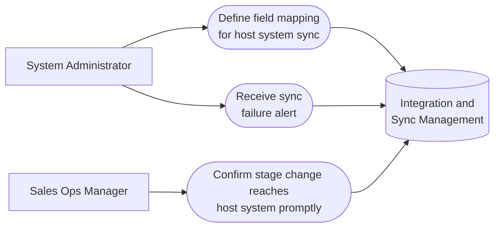

# PART 5 — USE CASES
## Module 13: Integration & Sync Management
### Product: P2 — AI Marketing & Sales RevOps Engine | Layer 2 — Product & Functional

---

## Use Case Diagram

## UC-P2-036: Define Field Mapping for Host System Sync

| Field | Detail |
|---|---|
| Actor | System Administrator |
| Preconditions | A host system integration is being configured (e.g., P1) |
| **Main Flow** | 1. Administrator opens Integration & Sync configuration. 2. Administrator maps P2 fields to host system fields, specifying sync direction (AI-FR-085). 3. Administrator selects sync trigger type: webhook or scheduled batch (AI-FR-086). 4. System saves the mapping and begins syncing per configuration. |
| **Alternate Flows** | None |
| **Exceptions** | E1. A mapped field no longer exists in the host schema (drift) → "Mapped field [X] no longer exists in the host system. Please update the mapping." That field's sync pauses; others continue. |
| Postconditions | Only explicitly mapped fields sync between systems, in the specified direction. |

## UC-P2-037: Receive Sync Failure Alert

| Field | Detail |
|---|---|
| Actor | System Administrator |
| Preconditions | A sync integration is active |
| **Main Flow** | 1. System attempts a scheduled or webhook-triggered sync. 2. Sync fails (e.g., host system unreachable). 3. System queues the sync for retry per backoff schedule (AI-BR-039). 4. System alerts the Administrator if failures persist beyond a threshold (AI-FR-089). |
| **Alternate Flows** | None |
| **Exceptions** | E1. P2's own internal functionality continues operating normally despite the sync failure (AI-BR-039) — a guaranteed system behavior, not an exception requiring user action. |
| Postconditions | Administrator is alerted promptly; P2 itself remains fully functional during the outage. |

## UC-P2-038: Confirm Stage Change Reaches Host System Promptly

| Field | Detail |
|---|---|
| Actor | Sales Ops Manager |
| Preconditions | A webhook-based sync integration is configured and healthy |
| **Main Flow** | 1. Sales Ops Manager changes a lead's stage in P2. 2. System triggers a webhook sync to the host system (AI-FR-086). 3. System confirms the change reflects in the host system within the configured latency target (e.g., under 30 seconds). 4. Sales Ops Manager can view sync health/last-successful-sync timestamp to confirm (AI-FR-088). |
| **Alternate Flows** | None |
| **Exceptions** | E1. The same record is updated in both systems near-simultaneously → conflict resolution rule applies (AI-BR-038), and the outcome is logged. |
| Postconditions | Sales Ops Manager has confidence and visibility that changes propagate promptly. |

---

**Layer 2 Gate Check:** ✅ One use case per user story (3 of 3). ✅ Each includes at least one alternate flow or exception.

*P2 Master SRS — Part 5, Module 13 of 17.*
