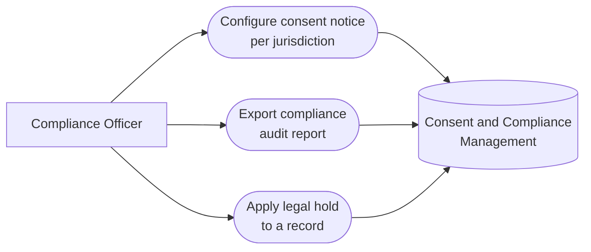

# PART 5 — USE CASES
## Module 14: Consent & Compliance Management
### Product: P2 — AI Marketing & Sales RevOps Engine | Layer 2 — Product & Functional

---

## Use Case Diagram

## UC-P2-039: Configure Consent Notice per Jurisdiction

| Field | Detail |
|---|---|
| Actor | Compliance Officer |
| Preconditions | Compliance Officer has "Configure consent notice text/jurisdiction mapping" permission |
| **Main Flow** | 1. Compliance Officer opens consent configuration. 2. Compliance Officer defines consent notice text for a specific jurisdiction (AI-FR-092). 3. System maps the jurisdiction to its consent rule without a code change (AI-FR-097). 4. System applies the configured notice to all future calls/chats in that jurisdiction. |
| **Alternate Flows** | None |
| **Exceptions** | E1. Jurisdiction code is undefined/unrecognized → "This jurisdiction is not recognized. Please check the code." Save blocked. |
| Postconditions | Prospects in the configured jurisdiction receive the correct, jurisdiction-specific consent notice. |

## UC-P2-040: Export Compliance Audit Report

| Field | Detail |
|---|---|
| Actor | Compliance Officer |
| Preconditions | Consent, retention, and deletion events exist in the system logs |
| **Main Flow** | 1. Compliance Officer opens the Compliance Audit Report (AI-FR-096). 2. Compliance Officer specifies a date range. 3. System compiles every consent, retention, and deletion event in that window. 4. Compliance Officer exports the report (CSV/PDF) for the regulator request. |
| **Alternate Flows** | None |
| **Exceptions** | None defined beyond standard date-range validation |
| Postconditions | Compliance Officer has a complete, exportable audit trail within minutes. |

## UC-P2-041: Apply Legal Hold to a Record

| Field | Detail |
|---|---|
| Actor | Compliance Officer |
| Preconditions | Compliance Officer has learned of a dispute requiring record preservation |
| **Main Flow** | 1. Compliance Officer locates the relevant call or lead record. 2. Compliance Officer applies a legal hold with a documented reason (AI-FR-094). 3. System overrides the record's scheduled deletion date (AI-BR-019, AI-BR-040). |
| **Alternate Flows** | None |
| **Exceptions** | E1. A right-to-be-forgotten request later arrives for the same record → system flags the conflict for Compliance Officer manual decision rather than auto-deleting or auto-rejecting. E2. Non-Compliance-Officer role attempts to remove the hold → "Only a Compliance Officer can remove a legal hold." Action blocked, logged. |
| Postconditions | The record is preserved past its original deletion date until the Compliance Officer removes the hold. |

---

**Layer 2 Gate Check:** ✅ One use case per user story (3 of 3). ✅ Each includes at least one alternate flow or exception.

*P2 Master SRS — Part 5, Module 14 of 17.*
