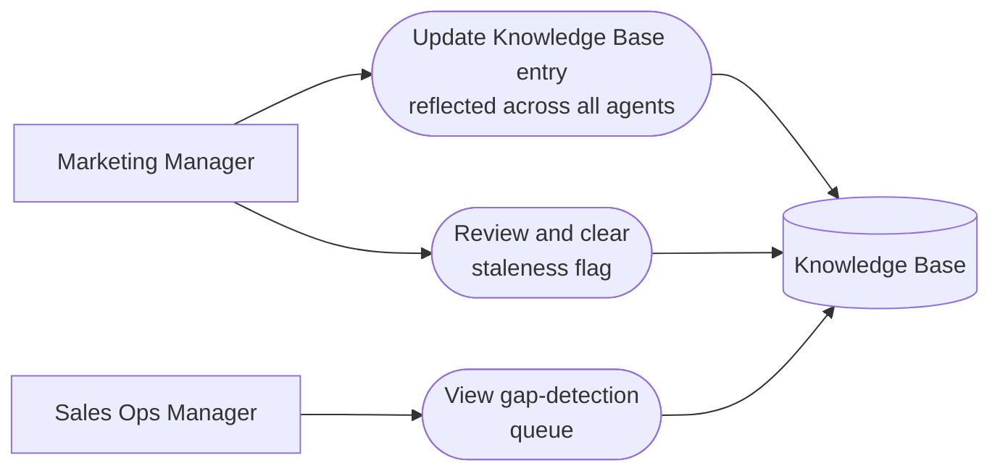

# PART 5 — USE CASES
## Module 15: Knowledge Base / Agent Content Management
### Product: P2 — AI Marketing & Sales RevOps Engine | Layer 2 — Product & Functional

---

## Use Case Diagram

## UC-P2-042: Update Knowledge Base Entry Reflected Across All Agents

| Field | Detail |
|---|---|
| Actor | Marketing Manager |
| Preconditions | A Knowledge Base entry exists and is cited by one or more agent modules |
| **Main Flow** | 1. Marketing Manager edits a Knowledge Base entry (e.g., a pricing fact) (AI-FR-098). 2. System versions the entry, retaining the prior version (AI-FR-099). 3. Modules 2, 3, 4, and 6 retrieve the updated value on their next reference via the retrieval API (AI-FR-101). |
| **Alternate Flows** | None |
| **Exceptions** | E1. Entry deleted while actively cited by live agent flows → "This entry is in use by [N] active agent flows. Confirm deletion?" Dependent flows fall back to "insufficient data" if confirmed. E2. Two content owners edit the same entry simultaneously → last-save-wins for the entry body, both versions retained in history. |
| Postconditions | All agent modules reflect the updated fact on their next reference; no module uses a cached old value. |

## UC-P2-043: View Gap-Detection Queue

| Field | Detail |
|---|---|
| Actor | Sales Ops Manager |
| Preconditions | At least one agent conversation has logged an unanswered question |
| **Main Flow** | 1. Sales Ops Manager opens the gap-detection queue (AI-FR-103). 2. System displays unanswered questions, deduplicated by similarity, with frequency counts. 3. Sales Ops Manager flags high-frequency gaps for the Marketing Manager to add content. |
| **Alternate Flows** | None |
| **Exceptions** | None defined |
| Postconditions | Content gaps are visible and prioritized by frequency, informing Knowledge Base additions. |

## UC-P2-044: Review and Clear Staleness Flag

| Field | Detail |
|---|---|
| Actor | Content reviewer (Marketing Manager) |
| Preconditions | An entry has not been reviewed within the configured staleness period (default 180 days) |
| **Main Flow** | 1. Marketing Manager opens the Knowledge Base management view. 2. System displays entries flagged stale (AI-FR-102), with last-reviewed date. 3. Marketing Manager reviews and updates or confirms the entry, clearing the staleness flag. |
| **Alternate Flows** | None |
| **Exceptions** | None defined beyond standard validation |
| Postconditions | Reviewed entries have an updated "last reviewed" timestamp and no longer display the staleness flag. |

---

**Layer 2 Gate Check:** ✅ One use case per user story (3 of 3). ✅ Each includes at least one alternate flow or exception.

*P2 Master SRS — Part 5, Module 15 of 17.*
