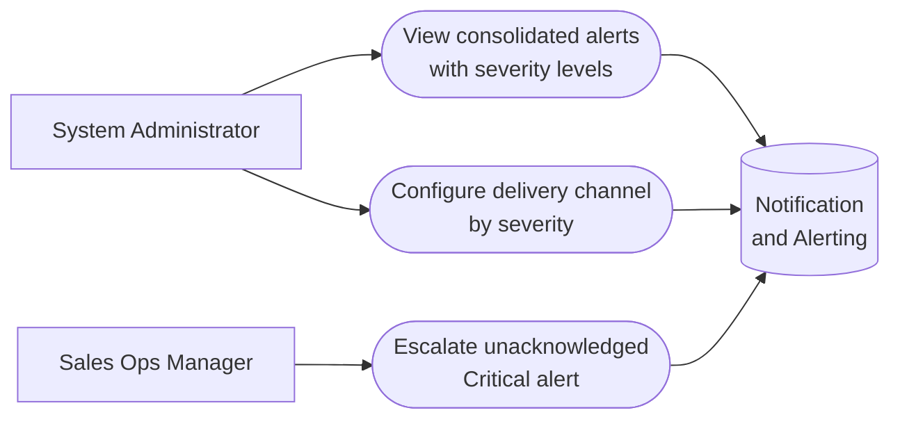

# PART 5 — USE CASES
## Module 16: Notification & Alerting
### Product: P2 — AI Marketing & Sales RevOps Engine | Layer 2 — Product & Functional

---

## Use Case Diagram

## UC-P2-045: View Consolidated Alerts with Severity Levels

| Field | Detail |
|---|---|
| Actor | System Administrator |
| Preconditions | At least one alert-triggering condition exists across modules |
| **Main Flow** | 1. Administrator opens the alert center. 2. System displays all alerts via the central registry (AI-FR-104), each classified by severity tier (AI-FR-107). 3. Administrator reviews alerts in a single consistent view. |
| **Alternate Flows** | None |
| **Exceptions** | E1. An alert references a deprecated module event → orphaned rule flagged for cleanup, not silently retained. |
| Postconditions | Administrator has one consistent alert view rather than five disparate styles. |

## UC-P2-046: Configure Delivery Channel by Severity

| Field | Detail |
|---|---|
| Actor | Business Owner (via System Administrator configuration) |
| Preconditions | Administrator has "Configure alert delivery channel per type" permission |
| **Main Flow** | 1. Administrator opens delivery channel configuration. 2. Administrator configures Critical alerts to deliver via SMS + email, and lower-severity alerts via dashboard only (AI-FR-105, AI-FR-107). 3. System applies the configuration to future alerts. |
| **Alternate Flows** | None |
| **Exceptions** | E1. SMS delivery fails (invalid number) → falls back to email; failure logged. |
| Postconditions | Business Owner receives only Critical alerts by SMS; other alerts reach the dashboard. |

## UC-P2-047: Escalate Unacknowledged Critical Alert

| Field | Detail |
|---|---|
| Actor | Sales Ops Manager (recipient), System (escalator) |
| Preconditions | A Critical-severity alert has been delivered and not yet acknowledged |
| **Main Flow** | 1. System delivers a Critical alert to the primary recipient. 2. Recipient does not acknowledge within the configured threshold (default 15 minutes) (AI-FR-108). 3. System automatically escalates to a secondary recipient or role (AI-BR-045). |
| **Alternate Flows** | None |
| **Exceptions** | E1. Two Critical alerts fire simultaneously for the same recipient → both deliver and track acknowledgment independently, not merged into one notification. |
| Postconditions | A Critical alert is never left unaddressed solely because one recipient missed it. |

---

**Layer 2 Gate Check:** ✅ One use case per user story (3 of 3). ✅ Each includes at least one alternate flow or exception.

*P2 Master SRS — Part 5, Module 16 of 17.*
