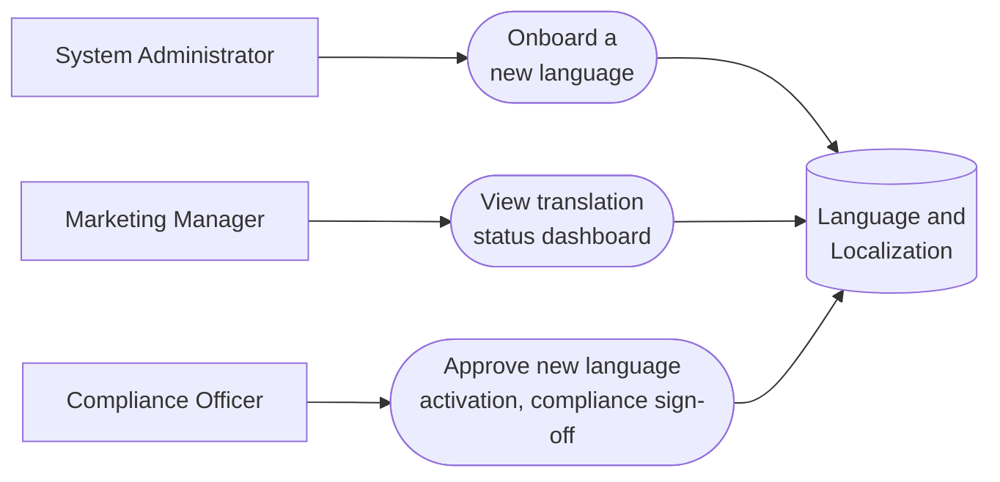

# PART 5 — USE CASES
## Module 17: Language & Localization Management
### Product: P2 — AI Marketing & Sales RevOps Engine | Layer 2 — Product & Functional

---

## Use Case Diagram

## UC-P2-048: Onboard a New Language

| Field | Detail |
|---|---|
| Actor | System Administrator |
| Preconditions | A new language is requested for a deployment |
| **Main Flow** | 1. Administrator opens the language onboarding workflow (AI-FR-112). 2. Administrator adds the language to the registry, setting the RTL flag if applicable (AI-FR-110, AI-FR-111). 3. System triggers Knowledge Base translation (Module 15) and voice STT/TTS verification (Module 3). 4. System holds the language in "pending" status until both readiness checks pass (AI-FR-115). 5. Once ready, Administrator activates the language for live use. |
| **Alternate Flows** | 4a. Knowledge Base passes but voice support lags → system allows chat-only activation while blocking voice specifically. |
| **Exceptions** | E1. Activation attempted before the readiness gate passes → "This language cannot go live until Knowledge Base and voice support are verified ready." Blocked. E2. RTL flag missing for a language requiring it → "Arabic requires the RTL flag to be enabled." Save blocked. |
| Postconditions | The new language is either live (fully or chat-only) or held pending, never partially live without an explicit channel-specific gate. |

## UC-P2-049: View Translation Status Dashboard

| Field | Detail |
|---|---|
| Actor | Marketing Manager |
| Preconditions | Knowledge Base entries exist across one or more languages |
| **Main Flow** | 1. Marketing Manager opens the translation status dashboard (AI-FR-113). 2. System displays, per language, the percentage of natively reviewed vs. machine-translated entries. 3. Marketing Manager prioritizes native translation work for high-usage, low-coverage languages. |
| **Alternate Flows** | None |
| **Exceptions** | None defined |
| Postconditions | Marketing Manager has visibility to prioritize translation effort. |

## UC-P2-050: Approve New Language Activation (Compliance Sign-Off)

| Field | Detail |
|---|---|
| Actor | Compliance Officer |
| Preconditions | A new language has passed the readiness gate |
| **Main Flow** | 1. Compliance Officer reviews the readiness status for the new language. 2. Compliance Officer provides sign-off for live activation. 3. System Administrator completes activation following sign-off. |
| **Alternate Flows** | None |
| **Exceptions** | E1. Readiness gate has not actually passed despite an activation attempt → system blocks activation regardless of Compliance Officer sign-off intent, since the technical gate (AI-FR-115) is enforced independently of compliance approval. |
| Postconditions | A new language goes live only with both technical readiness and compliance sign-off in place. |

---

**Layer 2 Gate Check:** ✅ One use case per user story (3 of 3). ✅ Each includes at least one alternate flow or exception.

**Part 5 — Use Cases is now complete: 50 use cases (UC-P2-001 through UC-P2-050) across all 17 modules. Layer 2 (Parts 4–5) is content-complete for P2.**

*P2 Master SRS — Part 5, Module 17 of 17 (final module).*
