# PART 6 — UI/UX SPECIFICATIONS
## Product: P2 — AI Marketing & Sales RevOps Engine
### Layer 3 — UI/UX & Experience | Audience: Designers, Frontend Developers, QA

---

## 6.1 Design Principles

1. Every primary admin action is reachable within 2 clicks from the Dashboard.
2. All data tables (Pipeline, Conversations, Campaigns, Knowledge Base) support sort, filter, and search without a full page reload.
3. Critical-severity alerts are visually distinct from Info/Warning alerts via a dedicated color + icon + fixed top-of-screen position (per Module 16's severity tiers).
4. All configuration forms validate inline, surfacing an error within 200ms of field blur.
5. The prospect-facing chat widget loads and becomes interactive within 2 seconds on a 3G-equivalent connection.

## 6.2 Navigation Structure

```mermaid
flowchart TD
  ROOT[Dashboard] --> LEADS[Leads and Pipeline]
  ROOT --> CONV[Conversations]
  ROOT --> CAMP[Campaigns]
  ROOT --> RES[Research]
  ROOT --> KB[Knowledge Base]
  ROOT --> ANA[Analytics]
  ROOT --> ADM[Admin]

  LEADS --> LEADS1[Pipeline funnel view]
  LEADS --> LEADS2[Lead/deal detail]

  CONV --> CONV1[Active conversations]
  CONV --> CONV2[Escalation queue]

  CAMP --> CAMP1[Campaign approval queue]
  CAMP --> CAMP2[Copy variant review]

  RES --> RES1[Request research report]
  RES --> RES2[Report library]

  KB --> KB1[Entry management]
  KB --> KB2[Gap-detection queue]

  ANA --> ANA1[Pipeline conversion]
  ANA --> ANA2[Cost monitoring]
  ANA --> ANA3[Executive ROI summary]

  ADM --> ADM1[Intake channels]
  ADM --> ADM2[Escalation rules]
  ADM --> ADM3[Integration and sync]
  ADM --> ADM4[Consent and compliance]
  ADM --> ADM5[Language and localization]
  ADM --> ADM6[Alerts and notifications]
```

The structure has two distinct surfaces:
- **Internal admin/ops interface** — the tree above.
- **Prospect-facing chat/voice widget** — a separate, minimal surface embedded wherever a deployment configures it (web, WhatsApp, etc.), covered in Part 7.

## 6.3 Design System Basics

### Typography Scale

| Token | Size | Weight | Usage |
|---|---|---|---|
| `text-xs` | 12px | Regular | Table metadata, timestamps |
| `text-sm` | 14px | Regular | Body text, table cells |
| `text-base` | 16px | Regular | Default body, form labels |
| `text-lg` | 18px | Semibold | Section headers |
| `text-xl` | 24px | Semibold | Page titles |
| `text-2xl` | 32px | Bold | Dashboard KPI numbers |

### Color Palette

| Token | Hex | Usage |
|---|---|---|
| `color-primary` | #3C3489 | Primary actions, active nav state |
| `color-primary-light` | #CECBF6 | Module/feature-map node fill, secondary backgrounds |
| `color-success` | #085041 | Success states, positive trend |
| `color-success-light` | #9FE1CB | Success backgrounds |
| `color-warning` | #8A5A00 | Warning-severity alerts |
| `color-warning-light` | #FBE39A | Warning backgrounds |
| `color-critical` | #993C1D | Critical-severity alerts, error states |
| `color-critical-light` | #F0997B | Critical backgrounds |
| `color-neutral-900` | #1A1A1A | Primary text |
| `color-neutral-500` | #6B6B6B | Secondary text, placeholders |
| `color-neutral-100` | #F4F4F4 | Page background |

### Spacing Scale

| Token | Value |
|---|---|
| `space-1` | 4px |
| `space-2` | 8px |
| `space-3` | 12px |
| `space-4` | 16px |
| `space-6` | 24px |
| `space-8` | 32px |

### Grid System
12-column grid, 24px gutter, max content width 1280px on desktop. Admin tables span full content width; detail panels use a 4/8 column split (sidebar/main).

### Iconography Rules
Single icon set throughout (outline style, 20px default, 16px in dense tables). Severity icons (Info/Warning/Critical, Module 16) use a fixed shape-plus-color pairing so meaning isn't conveyed by color alone.

## 6.4 Responsive Breakpoints

| Breakpoint | Width | Layout Change | Component Behavior |
|---|---|---|---|
| Mobile | < 640px | Single column; nav collapses to hamburger menu | Tables convert to stacked cards; charts simplify to single-series view |
| Tablet | 640–1024px | Two-column where applicable (e.g., list + detail) | Sidebar nav collapses to icon-only rail |
| Desktop | > 1024px | Full multi-column layout, persistent sidebar | Full table views, multi-series charts, drill-down panels |

## 6.5 Accessibility Standards

| Item | Standard | Applies To |
|---|---|---|
| Color contrast | ≥ 4.5:1 normal text, ≥ 3:1 large text | All interfaces |
| Keyboard navigation | All interactive elements reachable via Tab, visible focus indicator | All admin interfaces |
| Screen reader support | All icons have text alternatives; severity/status conveyed in text, not color alone | All admin interfaces |
| RTL support | Full mirrored layout for Arabic/Urdu | All admin interfaces (Section 6.6) |
| Form errors | Announced via ARIA live region, not just visual color change | All forms |
| Chat widget accessibility | Real-time text transcript available for any voice interaction | Prospect-facing widget |

## 6.6 RTL Language Rules

1. Layout mirrors fully (nav rail, table column order, icon directionality) for Arabic and Urdu.
2. Font substitution: Latin-script font substitutes to a font family with full Arabic/Urdu glyph coverage when an RTL language is active; numerals remain LTR within RTL text per standard convention.
3. Mixed LTR/RTL content follows Unicode bidirectional text rules — the system does not force one direction globally when content is code-switched.
4. Charts and data visualizations mirror axis direction for RTL locales; numeric values remain in standard numeral form.

---

**Layer 3 Gate Check, Part 6:** ✅ Design principles (5, measurable). ✅ Navigation tree (covers all 17 modules). ✅ Design system (typography, colors with hex, spacing, grid, iconography). ✅ Responsive breakpoints. ✅ Accessibility (WCAG 2.1 AA). ✅ RTL rules.

*P2 Master SRS — Part 6 of 17 + Appendices.*
