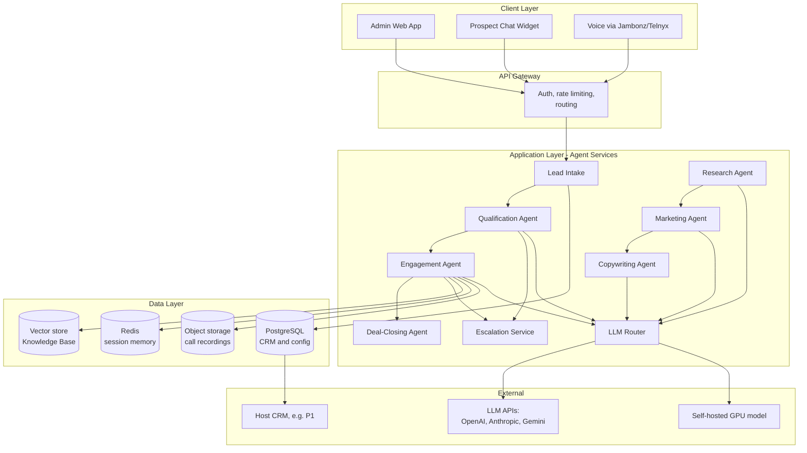
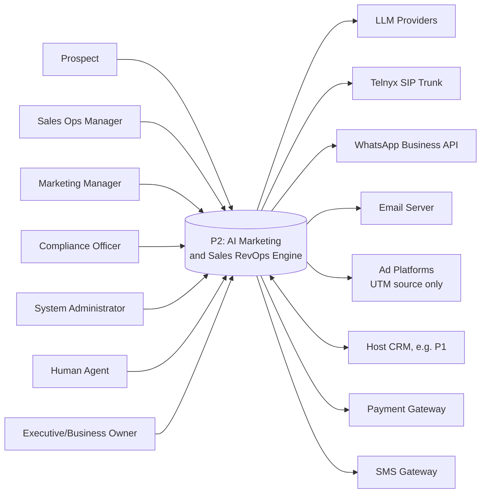
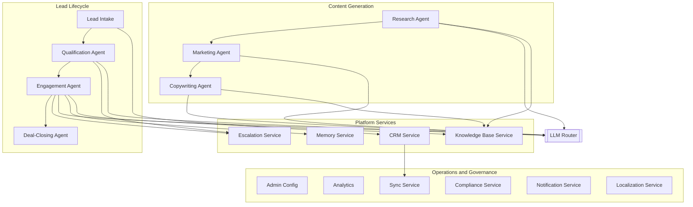

# PART 8 — SOLUTION ARCHITECTURE
## Product: P2 — AI Marketing & Sales RevOps Engine
### Layer 4 — Technical & Architecture | Audience: Architects, Developers, DevOps, Security

---

## 8.1 Platform Analysis

### Agent Orchestration Framework

| Option | Features | Cost | License | Community | Fit |
|---|---|---|---|---|---|
| **LangGraph** | Multi-agent state graphs, native streaming, per-node model routing | Open source; optional paid observability (LangSmith) | MIT | Large, active | **High** — state-graph model maps directly onto the CRM pipeline stages and AI-BR escalation rules |
| CrewAI | Role-based agent "crews," simpler abstraction | Open source | MIT | Growing | Medium — weaker state management for the escalation/handoff logic Modules 2/3/9 require |
| Microsoft AutoGen | Conversable agents, group-chat pattern | Open source | MIT | Large | Medium — oriented toward conversational multi-agent chat, not pipeline/business-process flows |
| Fully custom orchestration | Full control | Engineering time only | N/A | N/A | Low — reinvents solved problems; slower to ship within the <$1,000/month, lean-team constraint |

**Recommendation: LangGraph.** Its explicit state-graph model maps directly onto the locked CRM pipeline (Lead → Qualified → Engaged → Submitted → Converted) and the escalation business rules (AI-BR-001–004), and it natively supports routing each node to either the self-hosted model or a commercial API per Part 1's hybrid architecture decision.

### CRM / Data Layer

| Option | Features | Cost | License | Community | Fit |
|---|---|---|---|---|---|
| **Custom schema on PostgreSQL** | Full control, generic entity model (Lead/Account/Contact/Deal) | Engineering time + hosting | N/A | N/A | **High** — directly satisfies the G9 decision (P2 owns a vertical-agnostic CRM) |
| Open-source CRM (e.g., Twenty, SuiteCRM) as base | Pre-built UI/data model | Self-hosted, free | AGPL/GPL variants | Medium | Low — imposes CRM-specific schema assumptions that work against the vertical-agnostic requirement |
| Commercial CRM API (HubSpot/Salesforce) as backing store | Mature, supported | Subscription, scales with usage | Proprietary | Large | Low — contradicts the "P2 owns its own CRM" decision, creates vendor lock-in and recurring cost beyond the locked budget |

**Recommendation: Custom schema on PostgreSQL.** Satisfies Constraint 3 (Part 1.8) directly, avoids vendor lock-in, fits within the <$1,000/month ceiling.

## 8.2 High-Level Architecture

Four layers: Client (admin web app, prospect chat widget, voice via Jambonz/Telnyx) → API Gateway (auth, rate limiting, routing) → Application Layer (agent services + LLM Router) → Data Layer (PostgreSQL, vector store, Redis, object storage) → External (LLM APIs, self-hosted GPU model, host CRM).

## 8.3 System Context Diagram

P2 as a black box: internal actors (Prospect, Sales Ops Manager, Marketing Manager, Compliance Officer, System Administrator, Human Agent, Executive/Business Owner) on one side; external systems (LLM Providers, Telnyx, WhatsApp Business API, Email, Ad platforms, Host CRM, Payment Gateway, SMS Gateway) on the other.

## 8.4 Component Architecture

| Component/Service | Maps to Module | Responsibility |
|---|---|---|
| Lead Intake Service | Module 1 | Multi-channel capture, normalization, dedup |
| Qualification Agent Service | Module 2 | LLM-driven qualifying conversation |
| Engagement Agent Service | Module 3 | Chat/voice engagement, sentiment, consent |
| Research Agent Service | Module 4 | Market/competitor/pricing research |
| Marketing Agent Service | Module 5 | Campaign/funnel/landing page/email generation |
| Copywriting Agent Service | Module 6 | Ad/social/email/voice-script copy generation |
| Deal-Closing Service | Module 7 | Payment links, fulfillment handoff, human-approval gate |
| CRM Service | Module 8 | System of record: Lead/Account/Contact/Deal, pipeline config |
| Escalation Service | Module 9 | Trigger evaluation, routing, claim/handoff |
| Memory Service | Module 10 | Short/long-term conversation memory, retrieval API |
| Admin Config Service | Module 11 | Cross-module configuration, API keys, deployment provisioning |
| Analytics Service | Module 12 | Dashboards, drill-down, scheduled reports |
| Sync Service | Module 13 | Field mapping, webhook/batch sync to host systems |
| Compliance Service | Module 14 | Consent, retention, legal hold, right-to-be-forgotten |
| Knowledge Base Service | Module 15 | Fact/FAQ/pricing store, RAG retrieval, versioning |
| Notification Service | Module 16 | Alert registry, delivery, severity routing |
| Localization Service | Module 17 | Language registry, RTL rules, onboarding gate |
| LLM Router (cross-cutting) | Part 1, Constraint 1 | Routes each agent call to self-hosted or commercial-API tier |

## 8.5 Integration Architecture

| Integration | Purpose | Data Flow Direction |
|---|---|---|
| LLM Providers (OpenAI, Anthropic, Gemini) | Complex-reasoning model tier | Bidirectional (request/response) |
| Self-hosted GPU model (open-weight) | High-volume routine model tier | Bidirectional (internal) |
| Telnyx SIP Trunk (via Jambonz) | Voice call PSTN access | Bidirectional (audio + call control) |
| WhatsApp Business API | Lead intake + engagement channel | Bidirectional |
| Email server (SMTP/IMAP) | Lead intake + outbound sequences | Bidirectional |
| Ad platforms | UTM attribution capture | Inbound only |
| Host CRM (e.g., P1) | Cross-system lead/deal sync | Bidirectional, per Module 13 conflict-resolution rule |
| Payment Gateway (deployment-configured) | Payment link generation, confirmation webhook | Outbound (link) + Inbound (webhook) |
| SMS Gateway | Critical alert delivery (Module 16) | Outbound only |

## 8.6 Data Architecture Overview

| Data Domain | Owning Module | Storage |
|---|---|---|
| Lead/CRM (Lead, Account, Contact, Deal) | Module 8 | PostgreSQL (primary) |
| Conversation/Memory | Module 10 | Redis (short-term/session) + PostgreSQL (long-term profile/history) |
| Knowledge Base | Module 15 | PostgreSQL + vector index (pgvector or dedicated vector store) for RAG |
| Campaign/Content | Modules 4/5/6 | PostgreSQL |
| Configuration | Modules 11/16/17 | PostgreSQL |
| Compliance/Audit | Module 14 | PostgreSQL (structured logs) + Object storage (call recordings, lifecycle-managed per AI-BR-008/032) |

## 8.7 AI Architecture

- **LLM Selection**: Hybrid — self-hosted open-weight model (single GPU instance) for high-volume routine tasks; commercial APIs (OpenAI/Anthropic/Gemini) reserved for complex reasoning, per Part 1's locked Constraint 1.
- **Agent Design**: LangGraph state machine, one graph per pipeline stage transition (Lead→Qualified→Engaged→Submitted→Converted), each node configurable to route to either model tier.
- **Memory**: Module 10's short-term (session) + long-term (profile/history) split, exposed via a bounded-latency retrieval API.
- **RAG**: Module 15's Knowledge Base, vector-indexed, queried by Modules 2/3/4/6 before generating any factual claim.
- **Guardrails**: No-fabrication discipline (AI-BR-018/020/024/042) enforced at the retrieval layer — agents may only state what the Knowledge Base or Research Agent output contains; human-approval gate on final deal close (AI-BR-005); escalation rules (AI-BR-001–004) as behavioral guardrails, not just routing logic; consent enforcement (AI-BR-007) gates all voice recording.

## 8.8 Security Architecture

| Layer | Control |
|---|---|
| Internal admin auth | SSO/JWT-based RBAC, enforced against the Part 2.4 permissions matrix per request |
| Prospect-facing auth | No login required; session-token based, rate-limited per IP/session |
| Data protection at rest | AES-256 (PostgreSQL, object storage) |
| Data protection in transit | TLS 1.3 |
| API key handling | Encrypted at rest, masked in all UI after entry (AI-BR-034) |
| Network zones | Public ingress (chat widget, voice) in a DMZ; internal admin behind SSO; GPU inference and database in private subnets, no public access |

## 8.9 Cloud Architecture

- **Cloud services**: Primary cloud (AWS/Azure/GCP — final selection deferred to client's existing cloud relationship) for PostgreSQL, Redis, object storage, and the API Gateway/agent services; GPU inference hosted on a neocloud provider (RunPod/Lambda-class) per the earlier cost analysis.
- **Regions**: Deployment-configurable, defaulting to the region nearest the first configured target market (AI-BR-006) — no hardcoded region.
- **Availability zones**: Multi-AZ for PostgreSQL and Redis; single-AZ acceptable for the GPU instance given the cost ceiling, with API-tier fallback if the GPU instance is unavailable.
- **Scaling strategy**: Stateless agent services (Modules 1–7, 9, 12, 13, 16) auto-scale horizontally behind the API Gateway; GPU inference scales vertically only (single instance, budget-constrained), overflowing to the commercial API tier under load per the LLM Router's routing rules.

---

**Layer 4 Gate Check, Part 8:** ✅ All architecture diagrams present and annotated (high-level, system context, component). ✅ Platform analysis with comparison tables and justified recommendations. ✅ Integration map, data architecture, AI architecture, security architecture, cloud architecture all present.

*P2 Master SRS — Part 8 of 17 + Appendices.*
