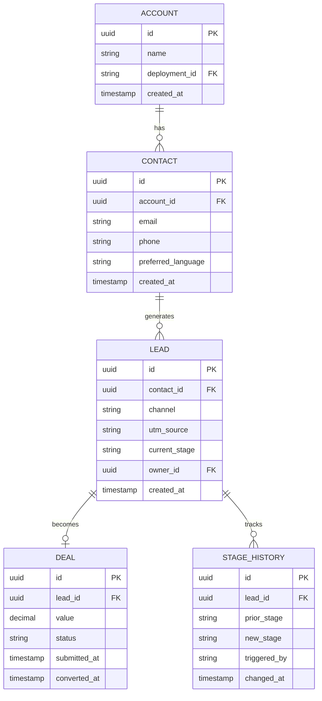
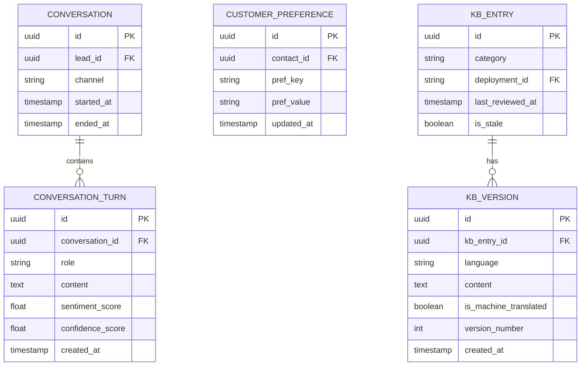
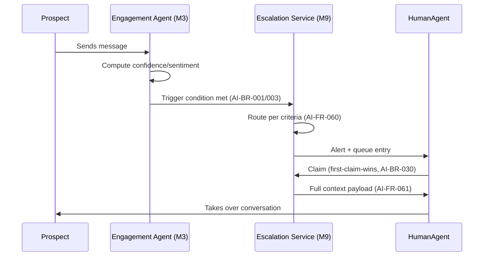

# PART 9 — TECHNICAL SPECIFICATIONS
## Product: P2 — AI Marketing & Sales RevOps Engine
### Layer 4 — Technical & Architecture | Audience: Architects, Developers, DevOps

---

## 9.1 Frontend Stack

| Layer | Choice | Notes |
|---|---|---|
| Framework | React 18 | Admin web app |
| Language | TypeScript 5 | Strict mode enforced |
| State management | TanStack Query (server state) + Zustand (local UI state) | Server state separated from UI state |
| UI components | shadcn/ui (Tailwind-based) | Matches token system in Part 6.3 |
| Charting | Recharts | Powers Module 12 dashboards |
| Build tool | Vite | Fast dev/build cycle |
| Prospect chat widget | Web Component (vanilla TS, framework-agnostic shell) | Must embed in arbitrary host pages/WhatsApp web flows |

## 9.2 Backend Stack

| Layer | Choice | Notes |
|---|---|---|
| Language | Python 3.11+ | Matches LangGraph's most mature SDK |
| Framework | FastAPI | Async-native, OpenAPI generation built in |
| Agent orchestration | LangGraph | Per Part 8.1 recommendation |
| ORM / migrations | SQLAlchemy 2.0 + Alembic | |
| Async task queue | Celery + Redis | Research report generation, sync jobs, scheduled reports |
| Schema validation | Pydantic v2 | Shared between API layer and LangGraph state schemas |
| API protocol | REST (OpenAPI/Swagger) + WebSocket | WebSocket for live chat/voice signaling and live dashboard updates |

## 9.3 Database Design

### ER Diagram — CRM Domain

### ER Diagram — Conversation & Knowledge Domain

### Data Dictionary — Core Tables

**LEAD**

| Field | Type | Constraints | Default | Description |
|---|---|---|---|---|
| id | UUID | PK | gen_random_uuid() | Unique lead identifier |
| contact_id | UUID | FK → CONTACT.id, NOT NULL | — | Linked contact |
| channel | VARCHAR(20) | NOT NULL, CHECK IN (web, ads, whatsapp, referral, email) | — | Originating channel (AI-BR-014) |
| utm_source | VARCHAR(100) | NULLABLE | NULL | Campaign attribution |
| current_stage | VARCHAR(50) | NOT NULL, FK → deployment's configured stage list | "Lead" | Current pipeline stage (AI-FR-052) |
| owner_id | UUID | FK → USER.id, NULLABLE | NULL | Assigned Sales Ops Manager/Human Agent |
| deployment_id | UUID | FK → DEPLOYMENT.id, NOT NULL | — | Tenant isolation (AI-BR-035) |
| created_at | TIMESTAMP | NOT NULL | now() | — |
| updated_at | TIMESTAMP | NOT NULL | now() | — |

**DEAL**

| Field | Type | Constraints | Default | Description |
|---|---|---|---|---|
| id | UUID | PK | gen_random_uuid() | — |
| lead_id | UUID | FK → LEAD.id, NOT NULL, UNIQUE | — | One deal per lead |
| value | DECIMAL(12,2) | NULLABLE | NULL | Deal value if applicable |
| status | VARCHAR(20) | NOT NULL, CHECK IN (Submitted, Converted, Stalled) | "Submitted" | (AI-FR-046/049) |
| payment_link_token | VARCHAR(255) | NULLABLE | NULL | (AI-BR-026) |
| payment_link_expires_at | TIMESTAMP | NULLABLE | NULL | — |
| approved_by | UUID | FK → USER.id, NULLABLE | NULL | Human-approval record (AI-BR-005) |
| submitted_at | TIMESTAMP | NULLABLE | NULL | — |
| converted_at | TIMESTAMP | NULLABLE | NULL | — |

**CONTACT**

| Field | Type | Constraints | Default | Description |
|---|---|---|---|---|
| id | UUID | PK | gen_random_uuid() | — |
| account_id | UUID | FK → ACCOUNT.id, NULLABLE | NULL | — |
| email | VARCHAR(254) | NULLABLE, RFC 5322 format check | NULL | (Module 1 validation) |
| phone | VARCHAR(15) | NULLABLE, E.164 format check | NULL | — |
| preferred_language | VARCHAR(5) | NOT NULL, ISO 639-1 | "en" | (AI-FR-009) |
| created_at | TIMESTAMP | NOT NULL | now() | — |

**KB_ENTRY**

| Field | Type | Constraints | Default | Description |
|---|---|---|---|---|
| id | UUID | PK | gen_random_uuid() | — |
| category | VARCHAR(20) | NOT NULL, CHECK IN (Fact, FAQ, Pricing, Offer) | — | (AI-FR-098) |
| deployment_id | UUID | FK → DEPLOYMENT.id, NOT NULL | — | — |
| last_reviewed_at | TIMESTAMP | NOT NULL | now() | (AI-FR-102) |
| is_stale | BOOLEAN | NOT NULL, computed (>180 days since last_reviewed_at) | false | — |

**KB_VERSION**

| Field | Type | Constraints | Default | Description |
|---|---|---|---|---|
| id | UUID | PK | gen_random_uuid() | — |
| kb_entry_id | UUID | FK → KB_ENTRY.id, NOT NULL | — | — |
| language | VARCHAR(5) | NOT NULL, ISO 639-1 | — | — |
| content | TEXT | NOT NULL, max 2000 chars | — | — |
| content_embedding | VECTOR(1536) | NULLABLE | NULL | For RAG retrieval |
| is_machine_translated | BOOLEAN | NOT NULL | false | (AI-BR-043) |
| version_number | INTEGER | NOT NULL | 1 | (AI-FR-099) |
| created_at | TIMESTAMP | NOT NULL | now() | — |

*Remaining tables (Research Report, Campaign, Copy Variant, Deployment Config, Consent Log, Legal Hold, Sync Mapping, Alert Rule) follow the same documentation pattern — full data dictionary for all tables is compiled in Appendix A at final delivery.*

### Indexes

| Table | Index | Purpose |
|---|---|---|
| LEAD | (deployment_id, current_stage) | Pipeline funnel queries |
| LEAD | (contact_id) | Dedup lookup (AI-BR-010) |
| CONVERSATION_TURN | (conversation_id, created_at) | Transcript ordering |
| KB_VERSION | content_embedding (vector index, HNSW or IVFFlat) | RAG similarity search |

### Constraints

- `DEAL.lead_id` UNIQUE — enforces one active deal per lead (AI-FR-046).
- `LEAD.current_stage` checked at application layer against the deployment's configured stage list (AI-BR-028), since stage lists are dynamic, not a fixed enum.
- `CONTACT.email` and `CONTACT.phone` — at least one must be non-null (application-level constraint).

## 9.4 API Specifications

### Endpoint Catalog (representative — full catalog in Appendix C)

| Method | Path | Auth | Request Body | Response | Errors |
|---|---|---|---|---|---|
| POST | /api/v1/leads | API key (channel-specific) | `{contact, channel, utm_source?}` | `201 {lead_id}` | 400 invalid contact format, 409 duplicate (merged) |
| GET | /api/v1/leads/{id} | JWT (RBAC) | — | `200 {lead, contact, stage_history}` | 404, 403 |
| PATCH | /api/v1/leads/{id}/stage | JWT (RBAC) | `{new_stage, reason?}` | `200 {lead}` | 403 (AI-BR-029), 400 invalid stage |
| POST | /api/v1/conversations/{id}/messages | Session token (public) | `{content, channel}` | `200 {agent_response}` or `202 {status: escalated}` | 429 rate-limited, 500 |
| POST | /api/v1/research-requests | JWT (RBAC) | `{product, market, priority?}` | `202 {request_id}` | 400 empty market field |
| GET | /api/v1/reports/{id} | JWT (RBAC) | — | `200 {report, is_stale}` | 404 |
| POST | /api/v1/campaigns/{id}/approve | JWT (RBAC) | `{variant_id?}` | `200 {campaign}` | 403 |
| POST | /api/v1/deals/{id}/approve-close | JWT (RBAC, Human Agent/Sales Ops only) | `{}` | `200 {deal, status: handoff_pending}` | 403, 409 handoff already in progress |
| GET | /api/v1/kb/entries | JWT (RBAC) | query params | `200 {entries[]}` | — |
| POST | /api/v1/admin/api-keys | JWT (System Admin only) | `{provider, key}` | `200 {masked_key}` | 400 invalid format |

### Sequence Diagram — Escalation Handoff

### Rate Limiting

| Endpoint Group | Limit | Window |
|---|---|---|
| Public chat/voice intake | 60 requests | per session, per minute |
| Admin API (JWT) | 600 requests | per user, per minute |
| Webhook receivers (payment, sync) | 1,000 requests | per source, per minute |

### Error Code Matrix

| Code | Meaning | Typical Cause |
|---|---|---|
| 400 | Bad Request | Validation failure |
| 401 | Unauthorized | Missing/invalid auth token |
| 403 | Forbidden | RBAC permission denied |
| 404 | Not Found | Record doesn't exist or deployment-scoped mismatch |
| 409 | Conflict | Duplicate (dedup), concurrent edit conflict (AI-BR-038) |
| 429 | Too Many Requests | Rate limit exceeded |
| 500 | Internal Server Error | Unhandled exception, logged to Module 16 |
| 503 | Service Unavailable | LLM provider/GPU instance unreachable, falls back per LLM Router rules |

## 9.5 Third-Party Integrations

| Integration | API Type | Auth Method | Data Exchanged | Frequency | Failure Handling |
|---|---|---|---|---|---|
| OpenAI/Anthropic/Gemini | REST | API key (masked, AI-BR-034) | Prompt + completion | Per agent turn | Falls back to alternate provider or self-hosted tier |
| Self-hosted GPU model | Internal REST | Internal service token | Prompt + completion | Per agent turn (high-volume) | Falls back to commercial API tier on instance failure |
| Jambonz/Telnyx | SIP + REST | API key + SIP credentials | Call audio, control signals | Per call | Retry with backoff; escalate to Human Agent on repeated failure |
| WhatsApp Business API | REST webhook | OAuth token | Messages, media | Real-time | Queued retry; alert System Admin |
| Host CRM (e.g., P1) | REST/webhook | API key or OAuth, per Module 13 config | Mapped lead/deal fields | Webhook or scheduled batch | Queued retry, P2 continues independently (AI-BR-039) |
| Payment Gateway | REST + webhook | API key | Payment link, confirmation | Per transaction | Link expiry handling (AI-BR-026); webhook retry |
| SMS Gateway | REST | API key | Alert text | Per Critical alert | Falls back to email |

## 9.6 Security Specifications

| Control | Standard | Implementation | Testing Method |
|---|---|---|---|
| Encryption at rest | AES-256 | Database and object storage encryption | Annual penetration test |
| Encryption in transit | TLS 1.3 | Enforced at API Gateway and load balancer | TLS scan per release |
| Authentication | JWT + RBAC | Per Part 2.4 permissions matrix, enforced per request | Automated RBAC test suite per release |
| API key storage | Encrypted, masked display | AI-BR-034 | Code review checklist |
| Injection (SQL/NoSQL) | OWASP Top 10 — A03 | Parameterized queries via SQLAlchemy ORM | SAST scan per CI build |
| Broken access control | OWASP Top 10 — A01 | RBAC middleware on every endpoint | Automated permission-matrix test |
| Rate limiting / DoS | OWASP Top 10 — A04 | Per Section 9.4 rate limiting table | Load test pre-launch |
| Sensitive data exposure | OWASP Top 10 — A02 | Masked API keys, no plaintext credentials in logs | Log audit |
| Consent/PII handling | GDPR-aligned | Module 14 (consent, retention, right-to-be-forgotten) | Compliance audit |

---

**Layer 4 Gate Check, Part 9:** ✅ ERDs present. ✅ Data dictionary (core tables). ✅ Indexes/constraints. ✅ API catalog with examples. ✅ Sequence diagram. ✅ Rate limiting/error code matrix. ✅ Third-party integrations. ✅ Security specs mapped to OWASP Top 10.

*P2 Master SRS — Part 9 of 17 + Appendices.*
