# MASTER SRS — P3 AI STUDENT COACH
## Part 11 — Infrastructure & DevOps (closes Layer 4)

*Layer 4 — Technical & Architecture*

| Field | Value |
|---|---|
| Product | P3 — AI Student Coach |
| Document | Master SRS — Part 11 of 17 |
| Identifier prefix | AIC-TR (continues from Part 9/10) |
| Identifier range | AIC-TR-235 → AIC-TR-270 |

---

## 11.1  Cloud Infrastructure

Builds directly on Section 8.9; this section adds the concrete sizing specification not previously stated.

| Resource | Phase 1 (current, 500–2,000 students) | Phase 2 (Year 1, ~20,000) | Phase 3 (Year 3, 100,000+) |
|---|---|---|---|
| AKS node pool | 3 nodes (1 per AZ), Standard_D4s_v5 (4 vCPU/16GB) | 6–9 nodes, same SKU, autoscale 6–12 | 15–24 nodes, autoscale, mixed SKU (CPU-optimized for CRUD services, memory-optimized for Model Gateway) |
| PostgreSQL Flexible Server | General Purpose, 4 vCPU/32GB, zone-redundant HA | General Purpose, 8 vCPU/64GB + 1 read replica | Memory Optimized, 16+ vCPU/128GB+ + 2–3 read replicas |
| Redis | Standard C1 (1GB) | Standard C3 (6GB) | Premium P3+ (26GB+), cluster mode |
| Blob Storage | Standard, locally-redundant within zone-redundant config | Standard, zone-redundant | Standard, geo-redundant (matches DR requirement) |

**AIC-TR-235:** Phase transitions (1→2, 2→3) shall be triggered by the AIC-NFR-015/016/017 concurrent-user thresholds being approached (at 70% of the current phase's stated capacity), not by calendar date alone, since enrollment growth may not match the originally projected timeline.
**AIC-TR-236:** Each phase's sizing in this table is a starting estimate for budget purposes (Part 13); actual provisioning shall be confirmed against real load-test results (Part 15.4) before each phase's go-live, not deployed on the estimate alone.

---

## 11.2  Environment Strategy

| Environment | Purpose | Data Policy | Access Control |
|---|---|---|---|
| Dev | Active feature development | Synthetic/anonymized data only; no real student data under any circumstance | Engineering team, no MFA requirement beyond standard SSO |
| QA | Automated + manual test execution (Part 15) | Synthetic data, including adversarial test fixtures (prompt-injection payloads, edge-case content) | Engineering + QA team |
| UAT | Client/school stakeholder acceptance testing | Anonymized production-shaped data, or a small set of consented pilot-school real data if the client opts in for realism — never real Wellbeing/Psychometric data without explicit additional consent for this specific use | Client stakeholders + consultant team, MFA required |
| Production | Live service | Real student data, full security controls per Part 8.8/9.6 | Per the live RBAC model; MFA mandatory for all admin-tier roles |

**AIC-TR-237:** Real Wellbeing & Safety or Psychometric domain data shall never be copied into Dev or QA under any circumstance, including for debugging a production issue — production debugging of these domains occurs in a tightly access-controlled, audited production-data-viewing process, not by exporting data to a lower environment.
**AIC-TR-238:** UAT shall not use real data from the Consent Records or Wellbeing & Safety domains unless a specific, separate consent has been obtained for UAT participation — standard platform consent (Module 4.10) does not implicitly cover UAT data use.
**AIC-TR-239:** Each environment shall have its own isolated set of LLM provider API keys (Dev/QA using lower-tier or sandboxed provider accounts where available) to prevent a Dev/QA cost overrun or bug from consuming the production token budget (Part 13).
**AIC-TR-240:** Promotion from QA to UAT to Production shall require passing the defined automated test suite (Part 15.2) at each stage; a failing test blocks promotion regardless of deadline pressure — this is a governance rule, not merely a technical default.

---

## 11.3  CI/CD Pipeline

```mermaid
flowchart LR
    A[Commit / PR] --> B[Lint + Unit Tests]
    B --> C[Dependency/Secret Scan]
    C --> D[Build Container Image]
    D --> E[Push to Container Registry]
    E --> F[Deploy to Dev]
    F --> G[Integration Tests]
    G --> H{Approval Gate 1}
    H -->|Approved| I[Deploy to QA]
    I --> J[Full Automated Test Suite incl. Security/Permission/Tenant-Isolation tests]
    J --> K{Approval Gate 2}
    K -->|Approved| L[Deploy to UAT]
    L --> M[Client UAT Sign-off]
    M --> N{Approval Gate 3}
    N -->|Approved| O[Deploy to Production — canary/staged rollout]
    O --> P[Post-deploy smoke test]
    P -->|Fail| Q[Automatic Rollback]
    P -->|Pass| R[Full Production Traffic]
```

**Figure 13 — CI/CD pipeline with three approval gates.**

| Stage | Automated Tests | Approval Gate |
|---|---|---|
| Dev deploy | Lint, unit tests, dependency/secret scan (AIC-TR-128) | None (automatic) |
| QA deploy | Integration tests | Gate 1: Engineering lead |
| QA test execution | Full Part 15 automated suite — functional, permission-matrix, tenant-isolation, prompt-injection, webhook-signature tests | Gate 2: QA lead + Security review for any change touching 9.6 controls |
| UAT deploy | Smoke tests | Gate 3: Client/consultant joint sign-off |
| Production deploy | Post-deploy smoke test | Automatic rollback on smoke-test failure |

**AIC-TR-241:** A change touching the Wellbeing & Safety domain, the Consent & Safety service, or any prompt-template/guardrail logic (8.7.5) shall require an additional manual security/safety review at Gate 2, beyond the standard QA lead approval, regardless of how small the change appears.
**AIC-TR-242:** Production deployment shall use a staged/canary rollout (e.g., 5% → 25% → 100% of traffic) for any change to the AI-orchestration services, not an instant 100% cutover, given the harder-to-predict failure modes of AI-involving changes versus standard CRUD changes.
**AIC-TR-243:** Automatic rollback (on smoke-test failure) shall be a tested, working capability — verified periodically by a deliberate rollback drill — not an assumed-but-unverified safety net.
**AIC-TR-244:** The CI/CD pipeline itself (build agents, registry, deployment credentials) shall be covered by the same secrets-management standard as application services (AIC-TR-095) — pipeline credentials are not exempt from the Key Vault requirement.

---

## 11.4  Containerization & Orchestration

| Element | Choice | Detail |
|---|---|---|
| Container runtime | Docker (OCI-compliant images) | One image per application service (AIC-TR-004) |
| Orchestration platform | Azure Kubernetes Service (AKS) | Per Section 8.9.1 |
| Scaling policy | Horizontal Pod Autoscaler (HPA) per service, tuned per AIC-NFR-020/021 | Independent policy per service (AIC-TR-110) |
| Health checks | Liveness probe (process responsive) + readiness probe (dependencies — DB, Redis, Model Gateway reachable — confirmed) per pod | Drives API Gateway routing decisions (AIC-TR-012) |
| Resource limits | CPU/memory requests and limits set per service based on Part 15.4 load-test profiling, not a uniform default across all 13 services | Prevents one service's resource spike from starving another on a shared node |
| Service mesh | Not implemented at v1.0 | Direct service-to-service calls within the Application Zone are sufficient at Phase 1/2 scale; a service mesh is a Phase 3 consideration, not a v1.0 requirement |

**AIC-TR-245:** Readiness probes for AI-orchestration services shall specifically check Model Gateway reachability, not just database/cache connectivity, since these services are non-functional without inference access even if their own process and data connections are healthy.
**AIC-TR-246:** A pod failing its liveness probe shall be automatically restarted by AKS; a pod failing its readiness probe shall be removed from the load-balancing pool without being restarted, distinguishing "broken, restart me" from "temporarily not ready, wait" failure modes.
**AIC-TR-247:** Resource limits shall be reviewed and adjusted after each Part 15.4 load test, not set once at launch and left static through all three growth phases.

---

## 11.5  Monitoring & Alerting

| Category | Tool | Metrics Monitored | Alert Threshold | Escalation Path |
|---|---|---|---|---|
| Application performance | Azure Monitor + Application Insights | Per-endpoint latency (p50/p95/p99), error rate, throughput | p95 latency exceeds AIC-NFR target for 5 consecutive minutes | On-call engineer (Tier 1) → Engineering lead (Tier 2) |
| Infrastructure | Azure Monitor (VM/AKS metrics) | CPU, memory, disk, network per node | >85% sustained utilization for 5 minutes | On-call engineer |
| AI-specific | Custom dashboard (Application Insights custom metrics) | Inference latency, token usage per student, groundedness/hallucination sampling, provider failover events | Token-cap adherence drops below KPI-AIC-08 target; failover rate exceeds baseline by 3x | Engineering lead; Super Admin notified for cost-related anomalies |
| Security | Azure Sentinel (or equivalent SIEM) | Failed auth attempts, permission-denial rate, webhook signature failures, cross-tenant access attempts (should be zero) | Any cross-tenant access attempt (zero-tolerance alert); failed-auth rate exceeding P1's lockout threshold pattern | Immediate security on-call; DPO notified for Wellbeing/Consent-domain events |
| Wellbeing/Safety-specific | Dedicated dashboard, restricted access | Escalation case volume, recipient-alert delivery time (against the 60s/1h SLAs), backup-recipient usage rate | Any delivery failure without successful backup-recipient fallback (zero-tolerance alert) | Psychologist + School Admin + Engineering lead simultaneously |
| Business/usage | Custom dashboard | WAU, feature adoption, KPI-AIC-01 through 10 tracking | Weekly review, not real-time alerting | CEO/Director reporting cadence |

**AIC-TR-248:** The Wellbeing/Safety-specific monitoring dashboard shall have its own access control, restricted to Psychologist, designated School Admin, and Engineering Lead roles only, consistent with the confidentiality boundary established in Part 9.3.11.
**AIC-TR-249:** Any zero-tolerance alert (cross-tenant access, failed wellbeing-escalation delivery with no successful backup) shall page the on-call engineer regardless of time of day, with no "business hours only" suppression.
**AIC-TR-250:** Alert thresholds in this table shall be reviewed quarterly and adjusted if found to produce excessive false positives or, conversely, found to have missed a real incident in retrospect.
**AIC-TR-251:** Monitoring data itself (logs, metrics) shall be retained for a minimum of 13 months, enabling year-over-year comparison for business/usage trend metrics, distinct from the data-domain retention policies in Part 9.3 which govern student data, not operational telemetry.

---

## 11.6  Backup & Recovery

| Element | Detail |
|---|---|
| What is backed up | Full PostgreSQL database (all schemas, including `wellbeing`); Redis is explicitly NOT backed up as a system of record (AIC-TR-061); Blob Storage backed up via geo-redundant replication |
| Backup frequency | Full daily backup + continuous transaction log backup (point-in-time recovery to any 5-minute granularity point, per AIC-NFR-032) |
| Retention period | 35 days for daily backups; the Audit Log Store's own retention (Part 3.5/9.3.5) governs separately and is not subject to the 35-day backup-rotation deletion |
| Restoration procedure | (1) Identify target restore point. (2) Provision a new PostgreSQL instance from the backup/transaction-log combination. (3) Validate restored data integrity via a defined checksum/row-count comparison. (4) Cut over application services to the restored instance. (5) Confirm via smoke test before resuming full traffic. |
| Test schedule | Full restoration drill at minimum twice yearly (AIC-NFR-033), in an isolated environment that never touches production |
| Backup encryption | AES-256, same standard as production (AIC-TR-096) |
| Backup access control | Same RBAC tier as production data access — no separate, looser "backup admin" role |

**AIC-TR-252:** The restoration procedure's step 3 shall specifically verify that the `audit_log` table's append-only property held through the backup/restore cycle, given the compliance significance of this table.
**AIC-TR-253:** A restoration drill that reveals the actual RTO exceeds the AIC-NFR-029/030 targets shall trigger a documented remediation plan before the next drill, not simply be noted and repeated unchanged.
**AIC-TR-254:** Backup data for the `wellbeing` schema specifically shall be included in every backup cycle without exception (restates AIC-TR-064) — confidentiality is access control, not omission from backup.
**AIC-TR-255:** The Phase 3 (100,000+ student) backup strategy shall be re-evaluated for backup-window duration before that scale is reached, as a documented Phase 3 planning item.

---

## 11.7  Cross-Cutting Infrastructure & DevOps Requirements

**AIC-TR-256:** Infrastructure-as-Code (e.g., Terraform or Bicep) shall be used to provision all Azure resources described in 11.1, version-controlled alongside application code.
**AIC-TR-257:** Any manual change made directly in the Azure portal for an emergency fix shall be reconciled back into the IaC definition within 48 hours, to prevent configuration drift.
**AIC-TR-258:** The Dev and QA environments shall be torn down and rebuilt from IaC definitions on a periodic basis (e.g., monthly) to verify the IaC definitions remain accurate and complete.
**AIC-TR-259:** Cost monitoring (Azure Cost Management) shall be configured with budget alerts per the Part 13 budget figures once finalized.
**AIC-TR-260:** The cross-cloud Gemini API calls shall be monitored within this Part 11 monitoring stack using the same dashboard, not a separate Google Cloud-side monitoring system.
**AIC-TR-261:** Every environment shall run the same container images promoted through the pipeline; environment-specific behavior is achieved through configuration injected at deploy time, never environment-specific code branches.
**AIC-TR-262:** The Model Gateway's provider routing configuration shall be independently overridable per environment without requiring a code change, only a configuration change.
**AIC-TR-263:** On-call rotation and escalation contact information shall be maintained in a system separate from this SRS document and merely referenced here.
**AIC-TR-264:** A documented runbook shall exist for each zero-tolerance alert category — cross-tenant access attempt, wellbeing-escalation delivery failure — before production launch, not improvised during a live incident.
**AIC-TR-265:** The CI/CD pipeline and the Part 9.6 security testing automation shall share the same test-execution infrastructure, avoiding a parallel, divergent test-running setup.
**AIC-TR-266:** Environment-specific LLM provider keys shall have their own cost caps configured at the provider level as a second line of defense beyond P3's own token-cap enforcement.
**AIC-TR-267:** The disaster-recovery failover test and the backup-restoration drill are related but distinct exercises and both shall be performed; one is not a substitute for the other.
**AIC-TR-268:** This Part 11 infrastructure specification shall be reviewed for currency at the start of each major phase transition (Phase 1→2, Phase 2→3).
**AIC-TR-269:** Any change to the CI/CD approval-gate structure that would reduce the number of gates or remove the safety/security-specific review at Gate 2 shall require a Part 17 change request.
**AIC-TR-270:** Part 11's monitoring and infrastructure setup shall itself be load-tested as part of the Part 15.4 performance test scenarios.

---

### Layer 4 gate status — Part 11

| Gate item | Minimum Standard | Status |
|---|---|---|
| 11.1 Cloud infrastructure | Services list, regions, AZs, sizing | Pass — 3-phase sizing table |
| 11.2 Environment strategy | Dev/QA/UAT/Prod differences, access, data policy per environment | Pass |
| 11.3 CI/CD pipeline | Stages, triggers, automated tests, approval gates, rollback | Pass — Figure 13 + gate table |
| 11.4 Containerization | Strategy, orchestration, scaling policy, health checks | Pass |
| 11.5 Monitoring & alerting | Tools, metrics, alert thresholds, escalation path per type | Pass — 6 categories |
| 11.6 Backup & recovery | What's backed up, frequency, retention, restoration, test schedule | Pass |

---

## LAYER 4 — CLOSE-OUT (Parts 8–11)

| Part | Title | ID Range | Count |
|---|---|---|---|
| 8 | Solution Architecture | AIC-TR-001–118 | 118 |
| 9 | Technical Specifications | AIC-TR-119–234 | 116 |
| 10 | Non-Functional Requirements | AIC-NFR-001–052 | 52 |
| 11 | Infrastructure & DevOps | AIC-TR-235–270 | 36 |
| **Total Layer 4** | **4 parts** | **270 AIC-TR + 52 AIC-NFR** | **322 requirements** |

*Layer 4 (Technical & Architecture) is now fully complete. Combined with Layers 1–3 (Parts 1–7), the SRS now stands at 11 of 17 parts complete. Open items carried forward into Layer 5: Gap G12 (latency test, affects Part 13 cost confirmation), Gap G13 (LLM pricing re-verification before Part 13), Gap G14 (wellbeing retention, affects Part 16 risk register and AIC-NFR-034), Gap G15 (mobile framework decision, affects Part 12 resourcing). Next: Layer 5 — Part 12 (Resource Plan).*
