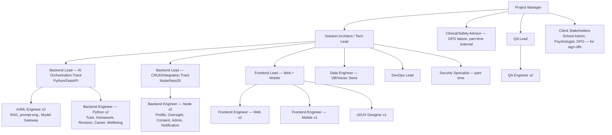

# MASTER SRS — P3 AI STUDENT COACH
## Part 12 — Resource Plan

*Layer 5 — Project & Financial*

| Field | Value |
|---|---|
| Product | P3 — AI Student Coach |
| Document | Master SRS — Part 12 of 17 |
| Identifier prefix | AIC-RES |
| Sizing basis | Team structure sized against the confirmed scope: 11 functional modules (Part 4, 210 FRs), 57 specified screens (Part 7), 13 application services on a polyglot Python/Node stack (Part 9), v1.0 build through Phase 1 launch (500–2,000 students) |
| Open dependency | Gap G15 (mobile framework — React Native vs. native) changes the Frontend/Mobile headcount below. Figures assume the **React Native recommendation** is confirmed; the native-alternative impact is noted at 12.1.1. |

---

## 12.1  Team Structure

**Figure 14 — P3 team org chart, Phase 1 build.**

**AIC-RES-001:** The Clinical/Safety Advisor role is an external, part-time consulting engagement (not a full-time team member), engaged specifically to validate Module 4.5 (Wellbeing Coach) crisis wording, thresholds, and escalation protocol per ASM-AIC-03 — this role does not write code and is scoped narrowly to clinical/safety review.

### 12.1.1  Mobile Framework Impact (Gap G15)

| Scenario | Mobile headcount impact |
|---|---|
| React Native confirmed (current recommendation) | 1 Frontend Engineer — Mobile, shared codebase with Web Frontend Lead's oversight; no separate native specialists needed |
| Native Swift/Kotlin required instead | Add 1 dedicated iOS Engineer (Swift) + 1 dedicated Android Engineer (Kotlin), replacing the single React Native role — net +1 FTE versus the React Native path, and removes the shared-codebase efficiency assumed in the Part 9.1 frontend stack decision |

---

## 12.2  Roles & Responsibilities

| Role | Responsibilities | Required Skills | Seniority | Commitment |
|---|---|---|---|---|
| Project Manager | Overall delivery, client liaison, scope/timeline/budget tracking, Part 17 governance execution | Agile/PM methodology, education-sector or SaaS delivery experience, stakeholder management | Senior | Full-time |
| Solution Architect / Tech Lead | Owns Part 8/9 architecture fidelity during build, cross-service design decisions, code review for architectural compliance | Microservices design, AI system architecture, polyglot backend oversight (Python + Node) | Senior | Full-time |
| Clinical/Safety Advisor (external) | Validates Wellbeing Coach wording/thresholds/escalation protocol (ASM-AIC-03), reviews safe-response templates | Licensed psychologist/counselor background, child-safeguarding expertise, familiarity with crisis-response standards | Senior/Expert | Part-time (engagement-based, concentrated around Module 4.5 build and pre-launch sign-off) |
| Backend Lead — AI Orchestration | Leads Python/FastAPI services (Tutor, Homework, Revision, Career, Wellbeing, Knowledge Graph, Personalization, Model Gateway) | Python, FastAPI, async patterns, LLM API integration experience | Senior | Full-time |
| AI/ML Engineer (x2) | RAG pipeline build, prompt engineering, embedding pipeline, evaluation harness (Part 15.6), guardrail implementation (8.7.5) | RAG/vector search, prompt engineering, LLM evaluation methodology, Python | Mid–Senior | Full-time |
| Backend Engineer — Python (x2) | Implements module-level logic for the AI-orchestration services under the AI/ML Engineers' and Backend Lead's design | Python, FastAPI, SQLAlchemy, async Postgres | Mid | Full-time |
| Backend Lead — CRUD/Integration | Leads Node/NestJS services (Profile, Oversight, Consent & Safety, Admin & Configuration, Notification) | TypeScript, NestJS, Prisma, RBAC implementation | Senior | Full-time |
| Backend Engineer — Node (x2) | Implements module-level logic for CRUD/integration services | TypeScript, NestJS, Prisma, BullMQ | Mid | Full-time |
| Data Engineer | Owns Part 9.3 schema implementation, migrations, pgvector indexing strategy, tenant-isolation enforcement at the DB layer | PostgreSQL, pgvector, schema design, row-level security | Senior | Full-time (heavier early, tapering after Part 9.3 build-out) |
| Frontend Lead — Web + Mobile | Owns Part 6/7 design-system fidelity, component architecture, shared logic between Web (React) and Mobile (React Native) | React, React Native, TypeScript, design-token systems | Senior | Full-time |
| Frontend Engineer — Web (x2) | Builds Student/Parent web surfaces and Teacher/Admin consoles per Part 7 screen specs | React, TypeScript, Tailwind, accessibility implementation (WCAG 2.1 AA) | Mid | Full-time |
| Frontend Engineer — Mobile (x1, or +1 native split per 12.1.1) | Builds Student/Parent mobile apps | React Native (or Swift/Kotlin per G15 outcome) | Mid | Full-time |
| UI/UX Designer | Maintains Part 6 design system, produces high-fidelity designs from the Part 7 wireframe specs, RTL design validation | Figma, design systems, RTL/bidi design experience, accessibility design | Mid–Senior | Full-time (heavier during Part 7 hand-off, tapering during pure backend phases) |
| DevOps Lead | Owns Part 11 IaC, CI/CD pipeline, monitoring stack, environment provisioning | Azure (AKS, Key Vault, Monitor), Terraform/Bicep, Kubernetes | Senior | Full-time |
| Security Specialist (part-time) | Leads Part 9.6 control implementation review, coordinates penetration testing (Part 15.5), prompt-injection test design | Application security, OWASP, AI-specific security (prompt injection, model abuse) | Senior/Expert | Part-time (concentrated pre-launch and at each major release) |
| QA Lead | Owns Part 15 test strategy execution, manages the QA Engineers, signs off Gate 2 (Part 11.3) | Test strategy design, test automation frameworks, AI evaluation familiarity | Senior | Full-time |
| QA Engineer (x2) | Executes functional, permission-matrix, tenant-isolation, and regression test suites | Test automation (e.g., Playwright/Cypress for web, API test tooling), manual exploratory testing | Mid | Full-time |

**AIC-RES-002:** The Clinical/Safety Advisor and Security Specialist roles, while part-time, are **not optional or deferrable** — their sign-off is a named precondition in Part 4 (ASM-AIC-03) and Part 11 (Gate 2 review) respectively; the Part 13 budget shall cost these roles as committed engagements, not contingency-only line items.

---

## 12.3  Hours Matrix (Role × Module)

Estimated person-hours per role per module, for the Phase 1 v1.0 build. Figures cover design, implementation, and unit/integration testing for that role's contribution to the module; they exclude the cross-cutting QA/Security/DevOps effort captured in the dedicated rows at the bottom of the table, and exclude Part 9.1/9.2 foundational stack setup (captured separately at the foot of this table since it is not module-specific).

| Role | 4.1 Tutor | 4.2 HW | 4.3 Revision | 4.4 Career | 4.5 Wellbeing | 4.6 Profile | 4.7 KG/RAG | 4.8 Personal. | 4.9 Oversight | 4.10 Consent | 4.11 Admin |
|---|---|---|---|---|---|---|---|---|---|---|---|
| AI/ML Engineer | 180 | 140 | 120 | 100 | 160 | — | 220 | 140 | — | 40 | — |
| Backend Eng. (Python) | 140 | 120 | 110 | 90 | 130 | 80 | 100 | 90 | — | 30 | — |
| Backend Eng. (Node) | — | — | — | — | — | 100 | — | — | 120 | 110 | 140 |
| Frontend Eng. (Web) | 110 | 70 | 130 | 80 | 60 | 50 | — | 50 | 90 | 50 | 100 |
| Frontend Eng. (Mobile) | 90 | 60 | 100 | 60 | 50 | 40 | — | 30 | — | 30 | — |
| UI/UX Designer | 50 | 35 | 60 | 45 | 50 | 25 | — | 25 | 40 | 30 | 50 |
| Data Engineer | 30 | 25 | 25 | 20 | 35 | 40 | 60 | 25 | 10 | 25 | 15 |
| QA Engineer | 80 | 70 | 70 | 50 | 90 | 40 | 50 | 40 | 50 | 60 | 50 |
| Clinical/Safety Advisor | — | 10 (integrity review) | — | 10 (boundary review) | 120 | — | — | — | — | 15 | — |
| Security Specialist | 15 | 20 | 10 | 10 | 25 | 10 | 20 | 10 | 10 | 25 | 15 |
| **Module subtotal (hrs)** | **695** | **550** | **625** | **465** | **720** | **400** | **450** | **410** | **320** | **415** | **370** |

| Cross-cutting (not module-specific) | Hours |
|---|---|
| Solution Architect — overall design oversight, cross-service review | 320 |
| Project Manager — full Phase 1 duration | 480 |
| DevOps Lead — Part 11 environment/CI-CD/monitoring build | 360 |
| Data Engineer — Part 9.3 foundational schema (pre-module) | 120 |
| Frontend Lead — Part 6 design system build + component library foundation | 180 |
| QA Lead — Part 15 test strategy + Gate 2 ownership | 240 |
| **Cross-cutting subtotal** | **1,700** |

**Phase 1 total estimated effort: 5,420 + 1,700 = approximately 7,120 person-hours** (module subtotals sum to 5,420; combined with cross-cutting above).

**AIC-RES-003:** The hours matrix above is a **Phase 1 (v1.0, current confirmed scale) estimate only**; it shall be re-baselined for Phase 2/3 work (additional features, scale-driven re-architecture per Part 8.9/11.1 phase triggers) as separate change requests, not assumed to be a fixed total covering the product's entire lifecycle.
**AIC-RES-004:** Module 4.5 (Wellbeing) carries the highest combined hours of any single module (720), driven specifically by the Clinical/Safety Advisor's concentrated 120-hour engagement and the AI/ML Engineer's 160 hours — both reflecting the defense-in-depth guardrail work (8.7.5) and the higher testing burden (4.5's 10 edge cases, the escalation drill requirement) relative to other modules.
**AIC-RES-005:** This hours matrix feeds directly into the Part 13.1 cost-per-module table; any change to this matrix after Part 13 is finalized requires the figures to be reconciled in both places.

---

## 12.4  Skill Requirements

| Skill Area | Required Proficiency | Applies To |
|---|---|---|
| Python (async, FastAPI) | Advanced | Backend Lead (AI), AI/ML Engineers, Backend Engineers (Python) |
| LLM API integration (Anthropic/OpenAI/Google SDKs) | Advanced | AI/ML Engineers; Intermediate for Backend Engineers (Python) |
| RAG / vector search (pgvector or equivalent) | Advanced | AI/ML Engineers, Data Engineer |
| Prompt engineering + LLM evaluation methodology | Advanced | AI/ML Engineers |
| TypeScript / NestJS / Prisma | Advanced | Backend Lead (CRUD), Backend Engineers (Node) |
| React + TypeScript | Advanced | Frontend Lead, Frontend Engineers (Web) |
| React Native (or Swift/Kotlin per G15) | Advanced | Frontend Engineer (Mobile) |
| PostgreSQL (schema design, RLS, performance tuning) | Advanced | Data Engineer; Intermediate for both Backend Leads |
| Azure (AKS, Key Vault, Monitor, AI Foundry) | Advanced | DevOps Lead; Intermediate for Solution Architect |
| Terraform or Bicep (IaC) | Advanced | DevOps Lead |
| Application security / OWASP / AI-specific security (prompt injection) | Advanced | Security Specialist; Intermediate for Solution Architect and both Backend Leads |
| Child safeguarding / crisis-response protocol design | Expert | Clinical/Safety Advisor |
| WCAG 2.1 AA accessibility implementation | Intermediate–Advanced | Frontend Engineers, UI/UX Designer |
| RTL/bidi design and implementation (Urdu/Arabic) | Intermediate–Advanced | UI/UX Designer, Frontend Engineers |
| Multi-tenant SaaS architecture | Advanced | Solution Architect, Data Engineer |
| Test automation (Playwright/Cypress, API testing tools) | Advanced | QA Lead, QA Engineers |
| Agile/PM delivery in a regulated/sensitive-data context | Advanced | Project Manager |

**AIC-RES-006:** No role in 12.2 shall be filled by a candidate below the stated minimum proficiency in that role's primary skill area; where a near-miss candidate is considered (e.g., Intermediate where Advanced is required), a documented mentorship/ramp-up plan with a defined timeline is required before they take independent ownership of safety-critical modules (4.5, 4.10) specifically.
**AIC-RES-007:** The Clinical/Safety Advisor's Expert-level proficiency requirement is non-negotiable and shall not be substituted with an Intermediate-level hire plus self-study, given the direct safeguarding consequence of getting Module 4.5's crisis-response design wrong.

---

### Layer 5 gate status — Part 12

| Gate item | Minimum Standard | Status |
|---|---|---|
| Team structure | Org chart showing all roles and reporting lines | Pass — Figure 14 |
| Roles & responsibilities | Role/responsibilities/skills/seniority/FTE | Pass — 17 roles, all fields populated |
| Hours matrix | Role vs. module cross-tabulation | Pass — 11 modules × 10 roles + cross-cutting subtotal |
| Skill requirements | Specific skills per role with minimum proficiency | Pass — 17 skill areas with proficiency levels |

*Open dependency: Gap G15 (mobile framework) confirmation changes the Frontend/Mobile row in 12.1/12.2/12.3 — figures above assume React Native. Next: Part 13 — Budget Plan (cost per module, cost per phase, total project budget, operational costs, licence/infra costs, contingency) — this is where Gap G12/G13's pending figures get resolved into real numbers, or explicitly flagged as still-pending in the budget itself.*
