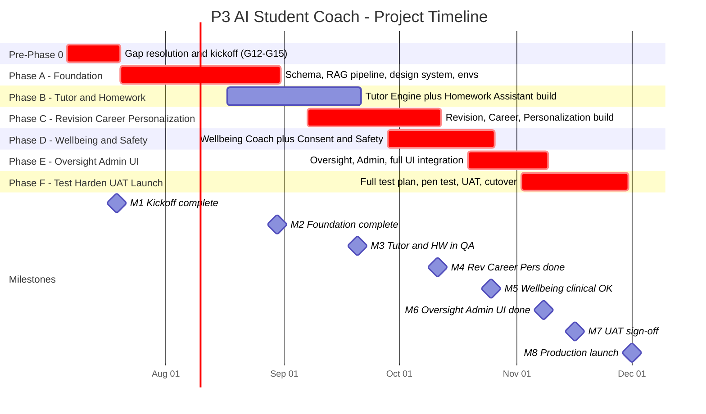
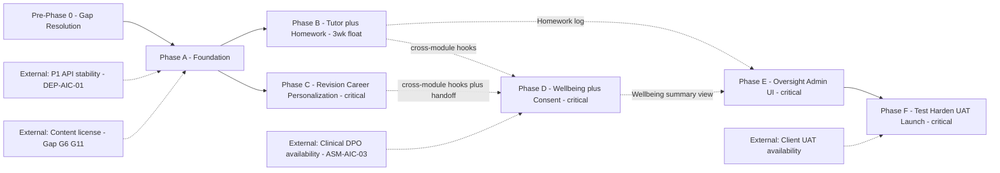

# MASTER SRS — P3 AI STUDENT COACH
## Part 14 — Project Timeline

*Layer 5 — Project & Financial*

| Field | Value |
|---|---|
| Product | P3 — AI Student Coach |
| Document | Master SRS — Part 14 of 17 |
| Identifier prefix | AIC-TL |
| Assumed kickoff date | Monday, 06 July 2026 (first available week after current SRS authoring date; adjust all dates below proportionally once the actual kickoff date is confirmed) |
| Reconciliation note | Part 13.2 presented phase costs against a **naive serial duration of 27 weeks** (phases run back-to-back, for clean per-phase budget attribution). This Part 14 timeline applies **fast-tracking** — running independent phases in parallel where the dependency structure genuinely allows it — compressing calendar time to **19 weeks of phase work (21 weeks including Pre-Phase 0)**. This does not reduce the total budgeted hours or cost in Part 13; it reflects more people working concurrently rather than fewer people working longer. The two Parts are not in conflict: Part 13 answers "what does this cost," Part 14 answers "how fast can it be delivered with that team." |

---

## 14.1  Development Phases

| Phase | Objectives | Deliverables | Duration |
|---|---|---|---|
| Pre-Phase 0 — Gap Resolution & Kickoff | Close open architectural/legal decisions before build begins, per AIC-BUD-008 | Gaps G12 (latency test), G13 (LLM pricing re-verification), G14 (wellbeing retention period), G15 (mobile framework) resolved; Scope Lock Agreement signed; Dev environment provisioned | 2 weeks |
| Phase A — Foundation | Build the shared backbone every module depends on | Database schema (Part 9.3) live; Knowledge Graph & RAG ingestion pipeline operational with an initial licensed-content subset; Model Gateway with Tier A/B/C routing configured; Part 6 design-system component library v1; Dev/QA environments fully operational (Part 11.2) | 6 weeks |
| Phase B — Core Tutoring & Integrity | Build the highest-traffic, integrity-critical modules | Tutor Engine (4.1) and Homework Assistant (4.2) feature-complete and passing the Part 15 functional + integrity guardrail test suite in QA | 5 weeks |
| Phase C — Revision, Career, Personalization | Build the remaining AI-orchestration modules that primarily compose Phase A's primitives | Revision Coach (4.3), Career Coach (4.4), Personalization & Recommendation (4.8) feature-complete and passing QA, including the gradebook-firewall test (BR-AIC-R-01) | 5 weeks |
| Phase D — Wellbeing & Safety | Build the highest-risk module with dedicated clinical review time | Wellbeing Coach (4.5) and Consent & Safety (4.10) feature-complete; escalation drill executed successfully in QA; clinical/DPO sign-off obtained (ASM-AIC-03) | 4 weeks |
| Phase E — Oversight & Admin + UI Integration | Build the remaining cross-cutting modules and complete all 57 Part 7 screens | Teacher Oversight (4.9) and Admin & Configuration (4.11) feature-complete; full UI integration across all 5 surfaces; WCAG 2.1 AA accessibility audit passed | 3 weeks |
| Phase F — Testing, Security Hardening, UAT, Launch | Final validation and go-live | Full Part 15 test plan executed; penetration test completed and Critical/High findings remediated; UAT sign-off from client; production launch | 4 weeks |

**AIC-TL-001:** Phase boundaries in this section are the same six phases costed in Part 13.2; no phase is added, removed, or renamed between the two Parts, satisfying the cross-document consistency principle already established for Parts 12/13.

---

## 14.2  Milestone Schedule

| Milestone | Deliverable | Target Date | Owner | Acceptance Criteria |
|---|---|---|---|---|
| M1 — Kickoff Complete | Gaps closed, Scope Lock signed, environments live | 19 Jul 2026 | Project Manager | All four gaps (G12–G15) have a documented resolution; Scope Lock Agreement carries both signatures; Dev environment passes a smoke deployment |
| M2 — Foundation Complete | Phase A deliverables | 30 Aug 2026 | Solution Architect | Schema migrations applied with zero errors in QA; RAG retrieval returns grounded results for the initial corpus subset; design-system component library reviewed and approved |
| M3 — Core Tutoring & Integrity in QA | Phase B deliverables | 20 Sep 2026 | Backend Lead — AI Orchestration | Tutor Engine and Homework Assistant pass 100% of their Part 15 functional test cases; the graded-answer Layer 2 deterministic check blocks 100% of adversarial test attempts in the security suite |
| M4 — Revision/Career/Personalization Complete | Phase C deliverables | 11 Oct 2026 | Backend Lead — AI Orchestration | All three modules pass their functional test suites; an automated check confirms zero writes from Revision Coach to any P1 gradebook table across the full QA test run |
| M5 — Wellbeing & Consent Complete, Clinical Sign-off | Phase D deliverables | 25 Oct 2026 | Clinical/Safety Advisor + Project Manager | L1/L2/L3 escalation drill completes with all recipients notified within their SLA (1h/60s/immediate); fail-closed behavior confirmed under simulated classifier outage; clinical/DPO sign-off document executed |
| M6 — Oversight & Admin Complete, UI Integration Done | Phase E deliverables | 08 Nov 2026 | Frontend Lead | All 57 Part 7 screens implemented across all 5 surfaces; automated accessibility scan reports zero WCAG 2.1 AA violations; RTL rendering verified for Urdu and Arabic on a sample of 10 representative screens |
| M7 — UAT Sign-off | Client acceptance | 16 Nov 2026 | School Admin (client) + Project Manager | All Part 15.3 UAT scenarios executed by client stakeholders; client provides written sign-off, or a documented punch-list with agreed resolution owners |
| M8 — Production Launch | Go-live | 01 Dec 2026 | Project Manager + DevOps Lead | Production smoke test passes; monitoring dashboards confirmed live and alerting; rollback procedure dry-run completed successfully within 7 days prior to launch |

---

## 14.3  Gantt Chart (Figure 15)

**Figure 15 caption:** Bars marked `crit` (Pre-Phase 0, A, C, D, E, F) sit on the critical path per Section 14.4. Phase B (Tutor & Homework) is shown without the `crit` marker — it has float, explained below.

---

## 14.4  Critical Path

**The critical path is: Pre-Phase 0 → Phase A → Phase C → Phase D → Phase E → Phase F.**

**Phase B is not on the critical path**, despite appearing as a substantial 5-week phase in the Gantt. Both Phase B (Tutor + Homework) and Phase C (Revision + Career + Personalization) depend only on Phase A's foundation completing — they do not depend on each other, and can run as genuinely parallel branches with different engineers. Phase D (Wellbeing) requires cross-module interaction-logging hooks from *both* B and C before its escalation-detection logic (which spans every module) can be fully tested — meaning Phase D's true start gate is whichever of B or C finishes later. Phase C (ending 11 Oct) finishes three weeks after Phase B (ending 20 Sep), so **Phase C is the binding constraint on Phase D**, not Phase B.

| Phase | Scheduled Finish | Phase D's Need Date | Float |
|---|---|---|---|
| Phase B (Tutor + Homework) | 20 Sep 2026 | ~11 Oct 2026 (when D's cross-module work intensifies) | ≈3 weeks |
| Phase C (Revision/Career/Personalization) | 11 Oct 2026 | 11 Oct 2026 | 0 weeks (critical) |

**AIC-TL-002:** Phase B's 3-week float shall be used productively, not left idle — recommended uses include front-loading Phase E's Teacher Oversight UI work (which depends on Phase B's Homework integrity log, available from 20 Sep) ahead of Phase E's official start, or absorbing any Phase A schedule slip without it cascading directly into Phase D's start date.
**AIC-TL-003:** If a future re-plan moves Career Coach (part of Phase C) to start later than currently scheduled, the critical path recalculates — the project's end date is more sensitive to Phase C's finish date than to Phase B's, and schedule-risk monitoring (Part 16) should weight Phase C accordingly.
**AIC-TL-004:** The five `crit`-marked phases (Pre-Phase 0, A, C, D, E, F) have zero schedule float between them; a one-week slip in any one of these five phases shifts the 01 Dec 2026 launch date by one week, with no absorption capacity remaining in the current plan.

---

## 14.5  Dependencies Map (Figure 16)

**Figure 16 caption:** Solid arrows are hard, near-zero-float dependencies on the critical path. Dashed arrows are softer dependencies (B/C feeding D and E) where float exists, per Section 14.4. The four external dependency boxes are outside the engineering team's direct control and are the most likely source of schedule risk (carried into Part 16).

**AIC-TL-005:** The two external dependencies feeding Phase A (P1 API stability and content licensing) are the same hard dependencies already flagged as DEP-AIC-01 (Part 1.9) and Gap G6/G11 — this timeline assumes both are resolved by Pre-Phase 0's end (19 Jul 2026); if either slips, Phase A's start slips with it, and the entire critical path shifts accordingly.
**AIC-TL-006:** Client UAT availability (external dependency into Phase F) is a scheduling risk distinct from engineering execution risk — the Project Manager shall confirm client stakeholder (School Admin, Psychologist, sample Teachers) availability for the 16 Nov 2026 UAT window at least 4 weeks in advance, not assume availability close to the date.

---

## 14.6  Go-Live Plan

### 14.6.1  Pre-Launch Checklist

| Item | Owner | Confirms |
|---|---|---|
| All Part 15 test suites passed (functional, security, permission-matrix, tenant-isolation, prompt-injection) | QA Lead | 100% pass rate, zero open Critical/High security findings |
| Clinical/DPO sign-off on Wellbeing Coach (ASM-AIC-03) | Clinical/Safety Advisor + DPO | Signed document on file |
| UAT sign-off (M7) | School Admin (client) | Signed document or resolved punch-list |
| Production environment provisioned and matches IaC definition | DevOps Lead | Infrastructure diff against Part 11.1 Phase 1 sizing shows zero drift |
| Monitoring dashboards live and alert routing tested | DevOps Lead | Test alert fires and reaches on-call correctly |
| Helpline registry populated and approved for all launch regions | School Admin + DPO | Approval status = approved, not pending, for every launch-region helpline entry |
| Consent register confirms zero under-18 students activated without recorded consent | Consent & Safety Service (automated check) | Query returns zero violating rows |
| Rollback procedure dry-run completed within 7 days of launch | DevOps Lead | Documented successful rollback in a staging rehearsal |
| Backup/restore drill completed at least once before launch | DevOps Lead | Documented successful restoration test |
| LLM provider production API keys active with confirmed enterprise-tier (no-training) terms | Solution Architect | Provider contract confirms enterprise tier, not consumer/free tier |
| Final LLM pricing re-verification against Gap G13 | Project Manager | Section 13.4 operational cost figures re-confirmed against live provider pricing |

### 14.6.2  Data Migration Plan

P3 has no legacy data to migrate — it is a net-new product reading from an already-live P1. The "migration" activity at launch is P1-integration validation, not data conversion:

| Step | Detail |
|---|---|
| 1 | Confirm P1 production API endpoints (not QA/staging) are configured in P3's production environment per the documented integration contract (Section 9.5.1) |
| 2 | Run a read-validation pass against a sample of real (consented) P1 student records, confirming mirrored-domain data populates correctly |
| 3 | Confirm zero write-path activity occurs against P1 until explicitly enabled post-launch (recommendation/summary/flag writeback tested read-only-safe first) |
| 4 | Enable write-back only after step 2/3 pass, as a distinct go/no-go sub-gate within the overall launch |

### 14.6.3  Cutover Procedure

| Step | Action |
|---|---|
| 1 | Enable P3 for a single pilot section first, not all sections simultaneously |
| 2 | Monitor the pilot section for 48 hours against all Part 10 NFR targets and the zero-tolerance alerts |
| 3 | If the 48-hour pilot window is clean, expand enablement section-by-section over the following week, using the same canary/staged rollout pattern already established for AI-orchestration deploys |
| 4 | Full launch (all confirmed Phase 1 sections enabled) only after the staged expansion completes without a zero-tolerance alert firing |

### 14.6.4  Rollback Plan

| Trigger | Rollback Action |
|---|---|
| Smoke test failure immediately post-deploy | Automatic rollback (already a tested CI/CD capability) |
| Zero-tolerance alert fires during the pilot-section window | Immediate P3 disablement for the affected section, incident investigation, no further section expansion until root-caused |
| A Critical-severity issue discovered after full launch | School Admin/Super Admin can disable P3 per-section or platform-wide without requiring a full deployment rollback, since the feature-flag/enablement mechanism provides a faster kill-switch than redeploying |
| Database-level corruption or data-integrity issue | Restore from the most recent backup per the Part 11.6 restoration procedure, accepting the RPO-bounded data loss |

**AIC-TL-007:** The staged, per-section cutover (14.6.3) is the primary risk-reduction mechanism at launch — a launch issue affects one pilot section's worth of students, not the full Phase 1 population, before being caught and addressed.
**AIC-TL-008:** Go-live plan execution shall itself be treated as a milestone-tracked activity within the Part 17 governance structure, with the Pre-Launch Checklist serving as the literal go/no-go gate for M8 — launch does not proceed on calendar date alone if checklist items remain open.

---

### Layer 5 gate status — Part 14

| Gate item | Minimum Standard | Status |
|---|---|---|
| 14.1 Development phases | Phase name/objectives/deliverables/duration | Pass — 7 phases (incl. Pre-Phase 0) |
| 14.2 Milestone schedule | Milestone/deliverable/target date/owner/acceptance criteria | Pass — 8 milestones, all fields populated |
| 14.3 Gantt chart | Phases, tasks, dependencies, critical path highlighted | Pass — Figure 15 |
| 14.4 Critical path | Identified tasks directly determining end date | Pass — explicit analysis, incl. the non-obvious finding that Phase B has float |
| 14.5 Dependencies map | Internal and external dependencies | Pass — Figure 16, 4 external dependencies flagged |
| 14.6 Go-live plan | Pre-launch checklist, data migration, cutover, rollback | Pass — all four sub-elements |

*Next: Part 15 — Testing & QA Plan (testing strategy/pyramid, test types & coverage, UAT plan, performance test scenarios, security test requirements, AI evaluation framework, acceptance criteria matrix) — this is where every test referenced throughout Part 14's milestones gets fully specified.*
