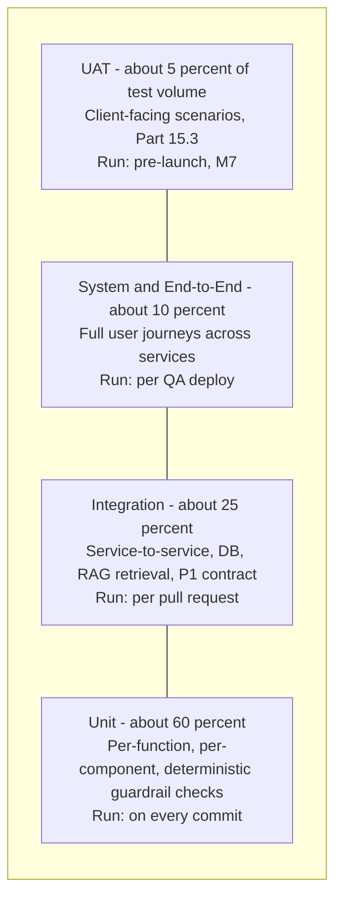

# MASTER SRS — P3 AI STUDENT COACH
## Part 15 — Testing & QA Plan

*Layer 5 — Project & Financial*

| Field | Value |
|---|---|
| Product | P3 — AI Student Coach |
| Document | Master SRS — Part 15 of 17 |
| Identifier prefix | AIC-TST |
| Scope note | This Part consolidates every test obligation already referenced across Parts 4 (acceptance criteria), 8.7.5 (guardrail testing), 9.6 (security control testing methods), 10 (NFR targets), and 14 (milestone acceptance criteria) into one executable plan, rather than restating them — each sub-section cross-references its source. |

---

## 15.1  Testing Strategy

**Figure 17 — Testing pyramid.** Percentages denote share of total test-case volume, not engineering effort; the AI evaluation framework (15.6) and security testing (15.5) cut across all four layers rather than occupying a single layer, since prompt-injection and groundedness checks exist as both unit-level (deterministic Layer 2 checks, 8.7.5) and system-level (end-to-end adversarial scenarios) tests.

**AIC-TST-001:** Every Layer 2 deterministic guardrail check identified in Section 8.7.5 (graded-answer match, diagnostic-language classifier, citation-source verification, PII redaction) shall have a corresponding **unit test** that can run independently of any live LLM call, so guardrail correctness is verifiable even when the underlying model is mocked.
**AIC-TST-002:** No code change shall reach the QA environment without passing 100% of its applicable unit and integration tests in CI (per Part 11.3's pipeline gates); a test pyramid is only meaningful if the lower layers are enforced as a hard gate, not an aspiration.

---

## 15.2  Test Types & Coverage

| Test Type | Scope | Tools | Pass Criteria | Responsibility |
|---|---|---|---|---|
| Unit | Individual functions/components, including all Layer 2 deterministic guardrails | pytest (Python services), Jest (Node services) | 100% pass; minimum 80% code coverage on AI-orchestration and Consent & Safety services specifically | Backend/Frontend Engineers, reviewed by QA |
| Integration | Service-to-service calls, database queries (incl. tenant-isolation row-level security), RAG retrieval against a test corpus, P1 contract mocks | pytest + httpx test client, Postman/Newman collections per the Part 9.4 API catalog | 100% pass against documented request/response schemas | QA Engineers |
| System / End-to-End | Full user journeys spanning UI through to data layer (e.g., Figure 10's homework-turn flow, Figure 11's wellbeing-escalation flow) | Playwright (web), Detox or equivalent (React Native mobile) | All Part 5 use-case main flows and at least one alternate flow per use case execute successfully | QA Engineers, QA Lead |
| Permission-Matrix | Every cell in the Part 2.4 and module-level permission tables | Automated test suite — one test per matrix cell | 100% of allowed actions succeed; 100% of denied actions return 403 PERMISSION_DENIED | QA Lead |
| Tenant-Isolation | Cross-tenant access-attempt suite across every entity in Part 9.3 | Custom test harness issuing concurrent Tenant A/B requests | Zero cross-tenant data leakage across all 12 data domains | Security Specialist + QA Lead |
| Prompt-Injection / Adversarial AI | Injection via direct chat input, OCR-extracted text, uploaded corpus content | Custom adversarial test suite, manual red-team session | Zero successful instruction-override across the test corpus; all Layer 2 checks hold under adversarial pressure | Security Specialist + AI/ML Engineers |
| Accessibility | All 57 Part 7 screens, WCAG 2.1 AA | axe-core (automated), manual screen-reader pass | Zero automated violations; manual pass confirms keyboard navigation and screen-reader labeling on a 20% manual-audit sample | Frontend Engineers + UI/UX Designer |
| Localization / RTL | All screens in English, Urdu, Arabic | Manual visual QA + automated string-coverage check | Zero untranslated strings; RTL mirroring correct on the 10-screen sample defined in M6 | Frontend Engineers, native-speaker reviewers |
| Performance / Load | Per Section 15.4 | k6 or Locust | Meets all applicable Part 10.1 latency targets at the relevant phase's concurrency level | DevOps Lead + QA Lead |
| Security | Per Section 15.5 | OWASP ZAP (automated scan), third-party penetration test | Per Section 15.5 pass criteria | Security Specialist (external pen-test firm for the annual/pre-release engagement) |
| AI Evaluation | Per Section 15.6 | Custom evaluation harness | Per Section 15.6 thresholds | AI/ML Engineers |
| Regression | Full suite re-run on every release candidate | All of the above, automated subset | No previously-passing test newly fails | QA Lead |
| UAT | Per Section 15.3 | Manual, client-executed | Client sign-off per Section 15.3 | School Admin (client) + Project Manager |

**AIC-TST-003:** The 80% minimum code-coverage figure for AI-orchestration and Consent & Safety services is a floor, not a target ceiling — coverage gaps in safety-critical paths specifically shall be closed before the 80% figure is treated as satisfied for that service.

---

## 15.3  UAT Plan

### 15.3.1  UAT Script Template

| Field | Detail |
|---|---|
| Scenario ID | UAT-AIC-[3-digit number] |
| Role | The persona executing the scenario |
| Preconditions | State required before the scenario begins |
| Steps | Numbered, plain-language steps a non-technical school stakeholder can follow without engineering assistance |
| Expected Result | What the stakeholder should observe |
| Actual Result | Filled in during execution |
| Pass/Fail | Binary |
| Notes / Punch-list item | Free text, only if Fail |

### 15.3.2  Representative UAT Scenarios

| Scenario ID | Role | Scenario | Linked Use Case |
|---|---|---|---|
| UAT-AIC-001 | Student | Ask a Maths question in Urdu and receive a grounded, sourced explanation | UC-AIC-T-01 |
| UAT-AIC-002 | Student | Ask for help on an active graded assignment and confirm only hints are given, never the final answer | UC-AIC-H-01 |
| UAT-AIC-003 | Student | Generate and complete a practice quiz on a weak topic, confirm result does not appear in the P1 gradebook | UC-AIC-R-01/R-09 |
| UAT-AIC-004 | Student | Complete career guidance flow and confirm no salary figure is shown without a source | UC-AIC-C-01/C-08 |
| UAT-AIC-005 | Parent | Approve consent for an under-18 child and confirm the child can then activate the coach | UC-AIC-S-01 |
| UAT-AIC-006 | Parent | Open the weekly insight summary and confirm it is concise and accurate | Module 4.4.7-style summary screen |
| UAT-AIC-007 | Teacher | Review the flagged-interaction queue, sample a transcript, disable full help on an assignment | UC-AIC-H-05/H-06 |
| UAT-AIC-008 | Psychologist | Receive a simulated L1 wellbeing case and confirm it appears in the queue with sufficient context within 1 hour | UC-AIC-W-03 |
| UAT-AIC-009 | School Admin | Enable P3 for a new section, upload a content file, confirm it remains unindexed until license confirmation | UC-AIC-A-02, UC-AIC-K-03 |
| UAT-AIC-010 | Super Admin | View cross-school usage and cost report, confirm figures match the Section 13.4 operational-cost methodology | UC-AIC-A-07 |

**AIC-TST-004:** The full UAT scenario set (target: minimum one scenario per Part 5 use case, 88 total) shall be compiled in **Appendix E — Test Case Library**; the 10 scenarios above are representative samples included directly in this Part for review, not the complete set.

### 15.3.3  Sign-off Process

1. Client stakeholders (School Admin, a sample Teacher, the Psychologist, and where feasible a Parent volunteer) execute the full UAT scenario set in the UAT environment during the M7 window (Part 14.2).
2. Each scenario is marked Pass/Fail with notes.
3. Failed scenarios are triaged: Critical/High-severity failures block sign-off until resolved and re-tested; Medium/Low failures may be accepted onto a documented punch-list with an agreed resolution owner and date.
4. The Project Manager and School Admin co-sign the UAT Sign-off document, which becomes a precondition for M8 (Part 14.6.1's Pre-Launch Checklist).

**AIC-TST-005:** A UAT scenario failure touching the Wellbeing & Safety or Consent domains shall always be treated as Critical severity for sign-off purposes, regardless of how minor it appears, given Part 16's risk-weighting of these domains.

---

## 15.4  Performance Test Scenarios

Load scenarios directly target the Part 10.1/10.2 NFR figures and the Part 11.1 phase sizing.

| Scenario | User/Load Profile | Target NFR | Pass Criteria |
|---|---|---|---|
| Phase 1 launch load | 600 concurrent active sessions | AIC-NFR-001 to 004 (API/Tutor latency) | p95 latency within target at sustained 600-concurrent load for 30 minutes |
| Phase 1 peak burst | 600 concurrent sessions ramping to 900 over 5 minutes | Graceful autoscaling (AIC-NFR-020/021) | Autoscaling triggers within the defined threshold; no request failures during ramp |
| Phase 2 projected load | 6,000 concurrent active sessions | Same NFR targets, validating Phase 2 sizing before that phase's go-live | p95 latency within target; read-replica trigger validated under sustained load |
| Tutor Engine streaming load | 600 concurrent streaming chat sessions specifically | AIC-NFR-004/005 (first-token/full-response latency) | First-token p95 stays at or under 3s even when 600 sessions are simultaneously mid-stream |
| Wellbeing bypass-path load | Standard load on all other endpoints plus a simulated wellbeing-escalation burst (50 simultaneous L2 detections) | AIC-NFR-013 (60s alert delivery), AIC-TR-098 bypass | Wellbeing alert delivery stays within 60s even while standard endpoints are under full Phase 1 load |
| Database query load | Sustained query volume matching 600-concurrent-session read/write patterns | AIC-NFR-010/011 (query latency) | p95 query latency within target |
| RAG retrieval load | 600 concurrent retrieval requests against the full licensed corpus (once available) | AIC-NFR-007 (200ms retrieval p95) | p95 retrieval latency within target at full corpus scale |
| Sustained soak test | 600 concurrent sessions sustained for 24 hours | All Part 10.1 targets, plus memory/connection-leak detection | No degradation in p95 latency over the 24-hour window |
| Disaster-recovery load | Failover triggered mid-load-test (zone failure simulation) | AIC-NFR-027 (5-minute zone-failure recovery) | Recovery within target with load test continuing to run |

**AIC-TST-006:** The Phase 1 launch load scenario shall be executed and passed **before** the M8 production launch milestone, not treated as a post-launch validation activity.
**AIC-TST-007:** Performance test results shall feed back into the Part 11.4 resource-limit tuning and the Part 13.4 operational cost model if actual resource consumption under load differs materially from the Part 11.1 sizing estimate.

---

## 15.5  Security Test Requirements

Builds directly on Section 9.6's per-control testing methods; this section adds scope, timing, and pass/fail framing for the overall security test program.

| Requirement | Detail |
|---|---|
| OWASP Top 10 scan | Automated scan against every public-facing endpoint in the Part 9.4 catalog, run on every release candidate; zero High/Critical findings to proceed |
| Penetration test scope | External third-party engagement covering: the Management Zone admin path, all prompt-injection vectors, tenant-isolation boundaries, the Wellbeing/Consent safety-bypass paths, and standard web/API attack surface |
| Penetration test cadence | Annual minimum, plus mandatory before the M8 launch and before each subsequent major release |
| Vulnerability scan requirements | Dependency/container scanning on every CI build; a Critical/High CVE in a production dependency blocks deployment until patched or a documented compensating control is approved |
| Prompt-injection test suite | Minimum 50 adversarial test cases across the three injection vectors, re-run on every model-version upgrade and every prompt-template change |
| Fail-closed verification | Deliberate classifier-outage simulation confirming CLASSIFIER_UNAVAILABLE is treated as allowed:false by every calling service |
| Cross-tenant isolation test | Mandatory, not optional — covers all 12 data domains from Part 9.3 |
| Webhook signature test | Deliberately spoofed payload sent to each of the three notification webhooks, confirming 401 INVALID_SIGNATURE and no delivery-status corruption |
| Finding remediation SLA | Critical/High findings: 14 days to verified fix before next release proceeds; Medium/Low: logged to Part 16 risk register with a remediation timeline |

**AIC-TST-008:** The penetration test report (and remediation evidence) shall be reviewed jointly by the consultant team and the client before M8 sign-off — a penetration test that is run but never reviewed by the client does not satisfy this requirement.

---

## 15.6  AI Evaluation Framework

This is the framework referenced throughout Parts 4, 8, and 9 (KPI-AIC-09/10, AIC-TR-079/080/227) but not yet fully specified until now.

| Metric | Definition | Target | Measurement Method |
|---|---|---|---|
| Groundedness | Proportion of responses containing a corpus-derived claim that carry a valid, resolvable source citation | >=95% | Automated check on a sampled response set, verifying every factual claim maps to a chunk actually returned by retrieval for that request |
| Hallucination rate | Proportion of responses containing a claim not supported by any retrieved chunk and not flagged with the uncertainty signal | <=2% | Human-reviewed sample (minimum 200 responses/month per module) cross-checked against retrieval logs |
| Language-match accuracy | Proportion of responses correctly rendered in the student's set language | >=95% | Automated language-detection check on a sampled response set |
| Integrity guardrail effectiveness | Proportion of Guided-mode homework responses that do not reveal the exact graded answer | 100 percent, zero tolerance | Automated Layer 2 deterministic check on every graded-context response, not sampled |
| Wellbeing classifier precision/recall | Standard precision/recall against a labeled validation set of risk/non-risk interactions | Recall >=90% (favor catching real risk over avoiding false positives); precision tracked but not a hard gate | Evaluation harness against a held-out labeled dataset, reviewed by the Clinical/Safety Advisor |
| Response latency (AI-specific) | First-token and full-response time, isolated from network/app overhead | Per AIC-NFR-004/005 | Inference-call-specific timing |
| Prompt-injection resistance rate | Proportion of the adversarial test suite (15.5) the system correctly resists | 100 percent | Automated adversarial suite |
| Cross-tenant context isolation | Zero instances of one tenant's context appearing in another tenant's response | 100 percent, zero tolerance | Concurrent dual-tenant test |
| Model-version regression check | Comparison of all above metrics between the current production model version and a candidate upgrade | No metric regresses beyond a defined tolerance (e.g., groundedness shall not drop more than 1 percentage point) before the upgrade is approved | Full evaluation suite run in staging before any routing-config change |

**AIC-TST-009:** The AI evaluation framework shall run on a continuous schedule, not only at major releases — weekly automated runs (groundedness, hallucination sampling, language match) per the existing KPI-AIC-09/05 review frequency, with the full human-reviewed hallucination sample and Clinical/Safety Advisor's classifier review on a monthly cadence.
**AIC-TST-010:** Any metric in this framework falling below its target for two consecutive measurement periods shall trigger a documented investigation and remediation plan, escalated to the Solution Architect, before the next scheduled measurement.
**AIC-TST-011:** The Wellbeing classifier's recall-over-precision weighting is a deliberate, documented design choice — it shall not be "optimized" toward higher precision in a way that reduces recall without an explicit, separately-approved decision involving the Clinical/Safety Advisor and DPO, given the safeguarding cost of a missed true positive versus the lower cost of a false positive.

---

## 15.7  Acceptance Criteria Matrix

The full matrix (every Part 4 acceptance criterion mapped to a test case ID and pass/fail status) is compiled in **Appendix E — Test Case Library**, traced through **Appendix D — Requirement Traceability Matrix**. A representative sample is shown here to demonstrate the structure.

| Module | Feature | Acceptance Criterion | Test Case ID | Pass/Fail |
|---|---|---|---|---|
| 4.1 Tutor Engine | Grounded subject Q&A | Response in set language within p95 <=3s first-token | TC-AIC-T-001 | Pending execution |
| 4.2 Homework Assistant | Guided-mode integrity | Exact graded answer never produced at similarity >=0.85 in-window | TC-AIC-H-002 | Pending execution |
| 4.3 Revision Coach | Gradebook firewall | No revision result appears in P1 gradebook | TC-AIC-R-012 | Pending execution |
| 4.4 Career Coach | No fabricated figures | Every salary/outlook claim carries a source or is withheld | TC-AIC-C-009 | Pending execution |
| 4.5 Wellbeing Coach | L2 escalation timing | Psychologist + School Admin alerted within 60s | TC-AIC-W-002 | Pending execution |
| 4.6 Student Learning Profile | Correction precedence | Student correction holds until higher-confidence evidence supersedes it | TC-AIC-P-004 | Pending execution |
| 4.7 Knowledge Graph & RAG | Tenant isolation | Tenant A retrieval never returns Tenant B content | TC-AIC-K-008 | Pending execution |
| 4.8 Personalization | Confidence gating | Below-threshold personalization suppressed in favor of stage default | TC-AIC-N-008 | Pending execution |
| 4.9 Teacher Oversight | Class-scope enforcement | Teacher dashboard shows only assigned classes | TC-AIC-O-001 | Pending execution |
| 4.10 Consent & Safety | Fail-closed | Classifier outage blocks output, never fails open | TC-AIC-S-008 | Pending execution |
| 4.11 Admin & Configuration | Safety-critical approval gate | Helpline change always returns pending, never direct-write | TC-AIC-A-006 | Pending execution |

**AIC-TST-012:** Every acceptance criterion documented across all 11 modules in Part 4 shall have a corresponding row in the full Appendix E matrix before M3/M4/M5/M6 can be marked complete for their respective modules — the sample above is illustrative of the required structure, not a substitute for full coverage.
**AIC-TST-013:** "Pass/Fail" status in the full matrix shall never be left blank once a module reaches its milestone gate — an untested acceptance criterion is treated identically to a failed one for gate purposes, consistent with the "untestable controls are not silently marked Pass" principle applied here to acceptance criteria specifically.

---

### Layer 5 gate status — Part 15

| Gate item | Minimum Standard | Status |
|---|---|---|
| 15.1 Testing strategy | Pyramid diagram showing unit/integration/system/UAT coverage | Pass — Figure 17 |
| 15.2 Test types & coverage | Test type/scope/tools/pass criteria/responsibility | Pass — 13 test types |
| 15.3 UAT plan | Script template, scenarios, sign-off process | Pass — template + 10 representative scenarios |
| 15.4 Performance test scenarios | Load scenarios matching NFR targets, user counts, data volumes | Pass — 9 scenarios tied directly to Part 10/11 figures |
| 15.5 Security test requirements | OWASP tests, pen test scope, vulnerability scan requirements | Pass |
| 15.6 AI evaluation framework | Accuracy metrics, hallucination rate, response quality scoring | Pass — 9 metrics |
| 15.7 Acceptance criteria matrix | Module/feature/acceptance criterion/test case ID/pass-fail | Pass — structure established, sample populated, full matrix routed to Appendix E |

*Next: Part 16 — Risk Register (Technical, Business, Compliance, Security, AI-specific, Resource risks — minimum 5 per category, every risk with mitigation AND contingency).*
