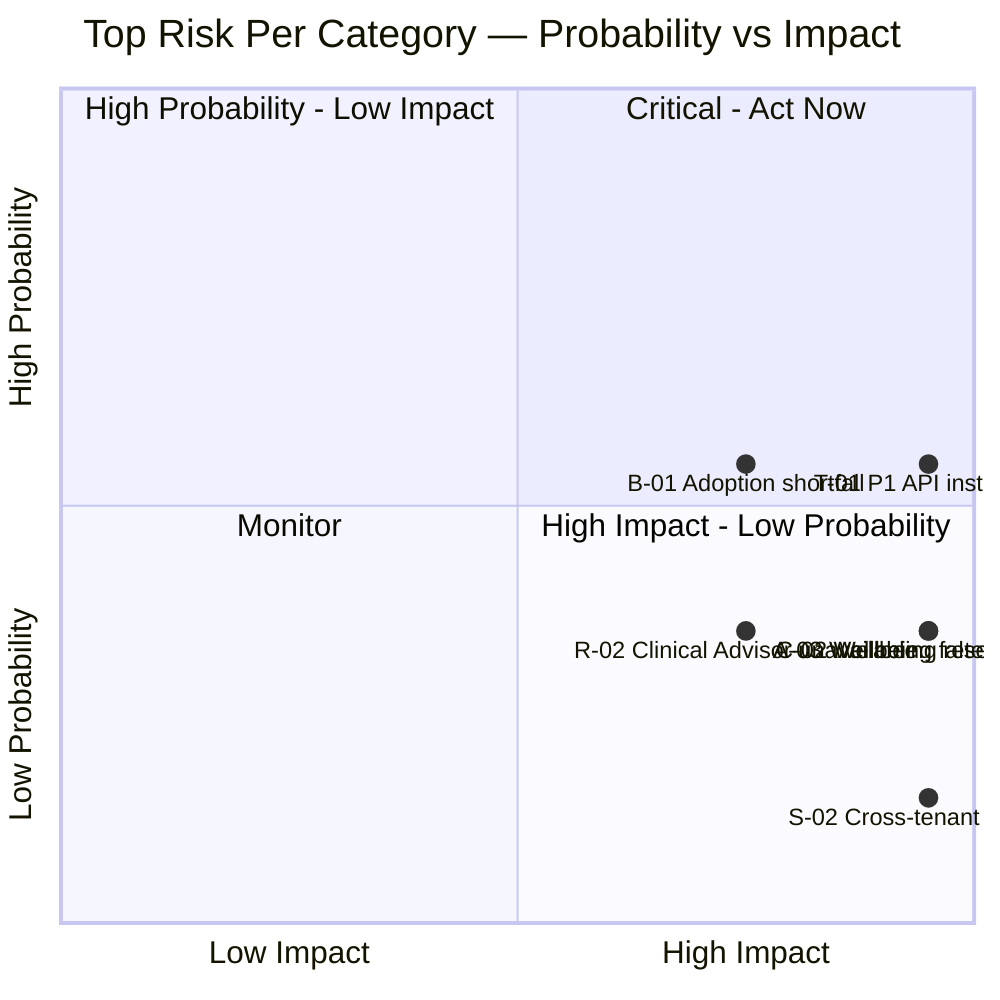

# MASTER SRS — P3 AI STUDENT COACH
## Part 16 — Risk Register

*Layer 5 — Project & Financial*

| Field | Value |
|---|---|
| Product | P3 — AI Student Coach |
| Document | Master SRS — Part 16 of 17 |
| Identifier prefix | RISK-AIC |
| Scoring | Probability (1–5) x Impact (1–5) = Score (1–25). Bands: 1–6 Low · 7–12 Medium · 13–19 High · 20–25 Critical |
| Review cadence | Quarterly for all risks by default; **monthly** for any risk touching the Wellbeing & Safety or Consent domains, consistent with the monthly clinical-review cadence already set in Part 15.6 |

---

## 16.1  Risk Probability/Impact Matrix (Figure 18)

The highest-scoring risk per category is plotted below; the complete 32-risk register with individual scores follows in Sections 16.2–16.7.

**Figure 18 caption:** Risks plotted toward the top-right require active, continuous mitigation. Notably, three of the six category-leading risks (C-02, S-02, A-03) sit in the high-impact/lower-probability quadrant — low likelihood but severe consequence, which is the typical and expected shape for a safety-critical, multi-tenant product, and is why Sections 16.4 (Compliance), 16.5 (Security), and 16.6 (AI-specific) carry disproportionate mitigation detail relative to their raw probability scores.

---

## 16.2  Technical Risks

| ID | Description | Probability | Impact | Score | Mitigation | Contingency | Owner | Review Date |
|---|---|---|---|---|---|---|---|---|
| RISK-AIC-T-01 | P1 API instability or late delivery blocks Phase A foundation work (DEP-AIC-01) | 3 | 5 | 15 (High) | Early integration testing against P1's documented contract during Pre-Phase 0; weekly sync with P1 team | Build Phase A against a mock P1 server per the documented contract; hold a 2-week schedule buffer before declaring Phase A blocked | Solution Architect | Monthly |
| RISK-AIC-T-02 | Vector store performance degrades before the Phase 3 (100,000+) migration trigger fires in time | 2 | 4 | 8 (Medium) | Load testing at each phase boundary (Part 15.4); documented migration trigger (Section 8.1.3) monitored continuously | Emergency migration to Pinecone/Azure AI Search using a pre-validated runbook, executed out of cycle if needed | Data Engineer | Quarterly |
| RISK-AIC-T-03 | Cross-cloud Gemini (Tier B) latency or cost drifts unfavorably from the Section 8.1 assumption | 3 | 3 | 9 (Medium) | Quarterly cross-cloud cost/latency review (AIC-TR-217) | Reroute Tier B traffic to a same-cloud alternative (Azure-hosted model) if drift exceeds a defined threshold | DevOps Lead | Quarterly |
| RISK-AIC-T-04 | Both primary Tier A providers (Anthropic and OpenAI) experience simultaneous outage | 1 | 5 | 5 (Low) | Three-provider failover chain including Gemini as a last-resort Tier A fallback (8.4.2) | Temporary explicit "reduced service" banner to students while running on Tier B/C only, rather than a full outage | Solution Architect | Quarterly |
| RISK-AIC-T-05 | P1 schema drifts over time, breaking the mirrored-domain sync (Section 8.6) | 3 | 3 | 9 (Medium) | Versioned integration contract with automated contract tests in CI (AIC-TR-219) | Pin to the last-known-good schema version on drift detection; manual reconciliation before resuming live sync | Data Engineer | Quarterly |
| RISK-AIC-T-06 | Gap G15 resolves toward native mobile after React Native work has already begun, forcing rework | 2 | 4 | 8 (Medium) | Resolve G15 definitively in Pre-Phase 0, before any Frontend-Mobile engineering hours are spent | Apply the Part 12.1.1 native-path headcount addition and re-baseline Phase B/C/E timelines for the affected mobile work only | Project Manager | At Pre-Phase 0 close |

---

## 16.3  Business Risks

| ID | Description | Probability | Impact | Score | Mitigation | Contingency | Owner | Review Date |
|---|---|---|---|---|---|---|---|---|
| RISK-AIC-B-01 | Student weekly-active-usage falls short of the KPI-AIC-01 target (≥60% by month 6) | 3 | 4 | 12 (Medium) | Onboarding wizard, teacher engagement incentives, in-app nudges informed by Personalization (4.8) | Revise interim KPI targets with client agreement; launch a targeted School Admin re-engagement campaign | Project Manager | Quarterly |
| RISK-AIC-B-02 | Scope creep accumulates outside the formal Part 17 change-request process | 3 | 3 | 9 (Medium) | Strict change-request gating (Part 17.1); PM tracks all incoming requests against the Scope Lock Agreement | Any out-of-process work discovered is retroactively logged and either formally approved (with timeline/budget impact disclosed) or rolled back | Project Manager | Quarterly |
| RISK-AIC-B-03 | Operational budget overruns due to LLM pricing volatility (Gap G13) | 3 | 3 | 9 (Medium) | Monthly LLM pricing re-verification; hard token-cap enforcement (architectural control, not just policy) | Tighten the per-student token cap or shift a larger share of traffic to Tier C/cheaper models temporarily until pricing stabilizes | Solution Architect | Monthly |
| RISK-AIC-B-04 | Client UAT stakeholders are unavailable during the scheduled M7 window | 2 | 3 | 6 (Low) | Confirm stakeholder availability at least 4 weeks in advance (AIC-TL-006) | Extend Phase F by up to 1 week using Phase B's existing schedule float (AIC-TL-002), without moving the M8 launch date | Project Manager | Per Part 14 milestone |
| RISK-AIC-B-05 | Competing AI-tutoring products erode P3's market differentiation | 2 | 3 | 6 (Low) | Emphasize genuine differentiators: native Urdu/Arabic tutoring, psychometrics-integrated career guidance, integrity-aware homework help | Accelerate the Phase 2 feature roadmap to maintain a feature-currency lead | Project Manager | Quarterly |
| RISK-AIC-B-06 | Gap G11 (career/university dataset) is never licensed, permanently limiting Career Coach to qualitative-only output | 2 | 3 | 6 (Low) | Pursue dataset licensing in parallel with the build; the qualitative-only fallback is already architected (BR-AIC-C-03), so this risk degrades value, not safety | Permanently ship Career Coach in qualitative-only mode and reset client expectations for that module's scope | Project Manager | Quarterly |

---

## 16.4  Compliance Risks

| ID | Description | Probability | Impact | Score | Mitigation | Contingency | Owner | Review Date |
|---|---|---|---|---|---|---|---|---|
| RISK-AIC-C-01 | Consent jurisdiction is misconfigured for a tenant (wrong child-data regime applied) | 2 | 5 | 10 (Medium) | Jurisdiction set only by DPO-approved configuration (Module 4.10/4.11); activation blocked for minors until configured (BR-AIC-S-01) | Emergency tenant-wide P3 suspension via the feature-flag kill-switch (Module 4.11) until corrected | DPO | Monthly |
| RISK-AIC-C-02 | Gap G14 (wellbeing record retention period) is resolved with an incorrect or non-compliant figure | 2 | 5 | 10 (Medium) | DPO/legal counsel confirmation required before Phase D ships (already gating M5 in Part 14.2) | Default to the longer, safer retention period stated in AIC-NFR-034 until a corrected figure is confirmed; retroactively apply any correction with legal counsel oversight | DPO | Monthly |
| RISK-AIC-C-03 | Cambridge/Cognia accreditation evidence export is judged insufficient by the accrediting body | 2 | 4 | 8 (Medium) | Evidence export format (RPT-AIC-06) reviewed against published accreditation evidence requirements during Phase E | School Admin compiles supplemental manual evidence to fill any gap identified during an accreditation review | Project Manager | Quarterly |
| RISK-AIC-C-04 | Student data is inadvertently processed or stored outside the approved tenant region | 1 | 5 | 5 (Low) | Tenant-pinned storage enforced at the infrastructure level (Section 8.6), not by application convention alone | Formal incident response per AIC-TR-104, including regulator notification within the jurisdiction's required timeline | DPO | Quarterly |
| RISK-AIC-C-05 | Licensed corpus content is used beyond its license scope (e.g., after license expiry or revocation) | 2 | 4 | 8 (Medium) | License gate (BR-AIC-K-01) mechanically blocks indexing/retrieval of unconfirmed or revoked content | Immediate content removal from the index (per the BR-AIC-K-06 removal window) and legal review if a violation is discovered post-hoc | Super Admin | Quarterly |

---

## 16.5  Security Risks

| ID | Description | Probability | Impact | Score | Mitigation | Contingency | Owner | Review Date |
|---|---|---|---|---|---|---|---|---|
| RISK-AIC-S-01 | A prompt-injection technique bypasses the defense-in-depth guardrails (Section 8.7.5) post-launch | 2 | 4 | 8 (Medium) | Adversarial test suite (Part 15.5), re-run on every model/prompt change; Layer 2 deterministic checks independent of model behavior | Emergency prompt-template patch; temporary fallback to stricter Guided-mode-only behavior platform-wide until the bypass is closed | Security Specialist | Monthly |
| RISK-AIC-S-02 | A defect causes cross-tenant data leakage despite row-level security and testing | 1 | 5 | 5 (Low) | Mandatory tenant-isolation test category (AIC-TR-103) covering all 12 data domains, run on every release | Immediate tenant-isolation incident response; affected-tenant notification per the breach-notification process (AIC-TR-104) | Security Specialist | Monthly |
| RISK-AIC-S-03 | An LLM provider's consumer/free tier is used in error instead of the contracted enterprise (no-training) tier | 1 | 4 | 4 (Low) | Provider contract and tier confirmed before launch (AIC-TR-221), checked again at the M8 pre-launch checklist | Immediate account tier upgrade and a formal data-deletion request to the provider for any data processed under the wrong tier | Solution Architect | At each major release |
| RISK-AIC-S-04 | Provider API keys or encryption keys leak (e.g., committed to source control by accident) | 2 | 4 | 8 (Medium) | Key Vault-only secret storage; automated secret-scanning in CI (AIC-TR-128) | Immediate key rotation; audit of all activity during the exposure window | DevOps Lead | Quarterly |
| RISK-AIC-S-05 | The platform experiences a DDoS or other availability-targeting attack | 2 | 3 | 6 (Low) | Azure Front Door DDoS protection; per-identity rate limiting (Section 9.4.17) | Traffic-scrubbing activation; temporary geo-restriction if the attack source is geographically concentrated | DevOps Lead | Quarterly |

---

## 16.6  AI-Specific Risks

| ID | Description | Probability | Impact | Score | Mitigation | Contingency | Owner | Review Date |
|---|---|---|---|---|---|---|---|---|
| RISK-AIC-A-01 | Hallucination rate exceeds the 2% target (KPI-AIC-10) in production | 3 | 3 | 9 (Medium) | Continuous AI evaluation (Part 15.6); RAG relevance-threshold tuning | Temporarily tighten the relevance threshold and increase the frequency of the uncertainty-response path until the rate recovers | AI/ML Engineer (lead) | Monthly |
| RISK-AIC-A-02 | A Tier A model is deprecated by its provider with short notice | 2 | 3 | 6 (Low) | Model Gateway abstraction (8.4.2) allows a provider/model swap without application code changes | Emergency re-routing to the documented failover provider; accelerated evaluation-suite run (Part 15.6) against the replacement model before full traffic cutover | Solution Architect | Quarterly |
| RISK-AIC-A-03 | The Wellbeing classifier produces a false negative — a real risk signal is missed | 2 | 5 | 10 (Medium) | Recall-favoring tuning (AIC-TST-011, recall ≥90% target weighted over precision); monthly human-reviewed sampling by the Clinical/Safety Advisor | Formal incident review with the Clinical/Safety Advisor; immediate threshold tightening; retrospective audit of similar recent cases for any other missed signals | Clinical/Safety Advisor | Monthly |
| RISK-AIC-A-04 | Career or other AI-generated recommendations show bias across demographic groups | 2 | 4 | 8 (Medium) | Evaluation sampling stratified by available demographic dimensions where appropriate; Clinical/Safety Advisor and DPO review of recommendation patterns | Suspend the affected recommendation category pending a dedicated bias audit; resume only after a documented correction | Solution Architect | Quarterly |
| RISK-AIC-A-05 | Abusive or jailbreak-style usage drives unexpected AI inference cost overrun | 2 | 3 | 6 (Low) | Hard architectural token-cap enforcement (Section 8.4.2) — not merely a soft warning | Temporary per-student lockout pending investigation of the usage pattern; pattern fed back into the Content Safety Filter's training/rules if it represents a new abuse vector | AI/ML Engineer (lead) | Monthly |

---

## 16.7  Resource Risks

| ID | Description | Probability | Impact | Score | Mitigation | Contingency | Owner | Review Date |
|---|---|---|---|---|---|---|---|---|
| RISK-AIC-R-01 | A key technical role (Solution Architect or AI/ML Lead) departs mid-project | 2 | 4 | 8 (Medium) | Documentation-first culture (this SRS is itself the primary mitigation artifact); pair-programming/shared ownership on the most critical modules (4.5, 4.7, 4.10) | Pre-identified backup-hire pipeline; a documented knowledge-transfer buffer is built into any replacement's onboarding before they take independent ownership | Project Manager | Quarterly |
| RISK-AIC-R-02 | The Clinical/Safety Advisor is unavailable during the Phase D review window, delaying M5 | 2 | 4 | 8 (Medium) | Engagement contracted with availability windows matching the Phase D schedule (Part 12.2), confirmed before Phase D begins | Pre-identified backup clinical consultant engaged on short notice; Phase D's schedule has been deliberately isolated (AIC-BUD-002) to absorb a short delay without immediately cascading | Project Manager | At Phase D start |
| RISK-AIC-R-03 | The hired team has a genuine skill gap in RAG/LLM evaluation methodology | 2 | 3 | 6 (Low) | Hiring bar set at Advanced proficiency (Part 12.4); a documented mentorship/ramp-up plan is mandatory for any near-miss hire (AIC-RES-006) | Short-term specialist contractor engagement to fill the gap while the team ramps | Solution Architect | Quarterly |
| RISK-AIC-R-04 | Engineering availability is disrupted by competing demands from P1/P2/P4 projects sharing the same consultant pool | 3 | 3 | 9 (Medium) | Dedicated P3 team allocation confirmed at kickoff (M1), not a shared/fractional pool | PM escalates to cross-project resource-allocation governance for priority protection if contention arises | Project Manager | Monthly |
| RISK-AIC-R-05 | A cloud or LLM provider account is suspended for a billing or compliance issue | 1 | 4 | 4 (Low) | Billing alerts configured (AIC-TR-259); provider compliance terms reviewed before contract sign-off | Pre-validated failover to the documented AWS Bedrock alternative (Section 8.1.2) while the primary account issue is resolved | DevOps Lead | Quarterly |

---

## 16.8  Risk Register Governance

**AIC-RISK-001:** This register shall be reviewed at every Part 14 milestone boundary (M1–M8) in addition to its stated cadence, since a milestone is a natural checkpoint to confirm whether a risk's probability or impact has changed.
**AIC-RISK-002:** A risk reaching Critical band (score ≥20) at any review shall trigger an out-of-cycle escalation to the Part 17.4 escalation matrix immediately, not wait for the next scheduled review.
**AIC-RISK-003:** Every risk in this register carries both a mitigation (reduces probability or impact in advance) and a contingency (the defined response if the risk materializes anyway) — per the Production Guide's Layer 5 excellence standard, no risk row in this Part is permitted to have only one of the two.
**AIC-RISK-004:** New risks identified after this SRS's sign-off shall be added to this register via the Part 17.1 change-request process and assigned the next sequential ID within their category, preserving the existing ID sequence rather than renumbering.

---

### Layer 5 gate status — Part 16

| Gate item | Minimum Standard | Status |
|---|---|---|
| Risk categories | All 6 categories present (Technical, Business, Compliance, Security, AI, Resource) | Pass |
| Minimum 5 risks per category | Required | Pass — 6/6/5/5/5/5 = 32 total risks |
| Mitigation AND contingency per risk | Excellence standard | Pass — all 32 risks carry both |
| Probability/impact matrix | Visual required | Pass — Figure 18 |

*Next: Part 17 — Governance (change request process, approval workflow, communication plan, escalation matrix, decision log template, amendment process) — the final numbered part of the Master SRS.*
