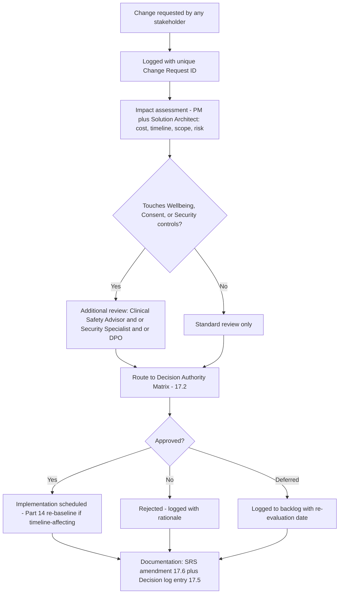

# MASTER SRS — P3 AI STUDENT COACH
## Part 17 — Governance (final numbered part)

*Layer 5 — Project & Financial*

| Field | Value |
|---|---|
| Product | P3 — AI Student Coach |
| Document | Master SRS — Part 17 of 17 |
| Identifier prefix | AIC-GOV |

---

## 17.1  Change Request Process (Figure 19)

**Figure 19 — Change request process.** Every request, regardless of outcome, terminates in a documentation step — a rejected or deferred request is logged with the same rigor as an approved one, so the decision history remains complete.

| Stage | Detail |
|---|---|
| Request | Any stakeholder (client, engineering, QA, DPO) may submit a change request; no role is excluded from initiating one |
| Logging | Assigned a unique ID (CR-AIC-[4-digit number]), timestamped, requester recorded |
| Impact assessment | PM and Solution Architect jointly assess cost (against Part 13), timeline (against Part 14), scope (against Part 1.3's scope-lock tables), and risk (against Part 16) |
| Additional review trigger | Per AIC-TR-241 (already established in Part 11.3), any change touching Wellbeing, Consent & Safety, or guardrail/prompt-template logic requires Clinical/Safety Advisor and/or Security Specialist and/or DPO sign-off before proceeding to the standard approval gate |
| Approval | Routed through the Section 17.2 Decision Authority Matrix |
| Implementation | Scheduled; if timeline-affecting, Part 14's Gantt and critical path are re-baselined, not silently absorbed |
| Documentation | SRS amended per Section 17.6; decision logged per Section 17.5 |

**AIC-GOV-001:** No change request shall bypass the impact-assessment stage, including changes requested directly by the client under time pressure — an expedited *timeline* for the assessment is acceptable; skipping it is not.
**AIC-GOV-002:** A change request that would alter a locked decision from the Master SRS Production Guide's Section 13 (e.g., the 5-layer architecture, the 17-part structure) requires Section 17.2's highest approval tier regardless of the change's apparent size.

---

## 17.2  Approval Workflow — Decision Authority Matrix

| Decision Type | Threshold | Approver(s) |
|---|---|---|
| Scope addition or removal (new/cut feature) | Under $5,000 estimated impact | Project Manager |
| Scope addition or removal | $5,000–$25,000 estimated impact | Project Manager + Solution Architect |
| Scope addition or removal | Over $25,000 estimated impact | Client Executive Sponsor + Project Manager + Solution Architect |
| Safety-critical configuration change (wellbeing thresholds, helpline registry, escalation recipients) | Any value | Psychologist + DPO + Super Admin (restates BR-AIC-A-04/AIC-TR-091 — a pre-existing technical control, not a new governance rule) |
| Architecture decision change (e.g., cloud provider, database technology) | Any value | Solution Architect + Client Executive Sponsor |
| Security-significant change (auth model, encryption approach, guardrail logic) | Any value | Security Specialist (mandatory review) + Solution Architect |
| Budget reallocation within the approved Part 13 total | Any value, within total | Project Manager + Solution Architect |
| Budget increase beyond the approved Part 13 total | Any value | Client Executive Sponsor |
| Timeline change affecting the M8 launch milestone (Part 14.2) | Any value | Client Executive Sponsor + Project Manager |
| Timeline change not affecting M8 (internal phase re-sequencing within existing float) | N/A | Project Manager |
| Mobile framework decision (Gap G15 resolution) | N/A | Client Executive Sponsor + Solution Architect |
| Data retention period change (e.g., resolving Gap G14) | N/A | DPO + Legal Counsel + Client Executive Sponsor |
| Addition of a new third-party integration | N/A | Solution Architect + Security Specialist |

**AIC-GOV-003:** Where a decision falls under more than one row of this matrix (e.g., a safety-critical change that is also a budget increase), the **highest** applicable approval tier governs — approvers are additive, not substitutable.
**AIC-GOV-004:** This matrix itself may only be amended by the Client Executive Sponsor and the consultancy's engagement lead jointly, since it is the control governing all other controls.

---

## 17.3  Communication Plan

| Stakeholder | Information | Frequency | Channel | Owner |
|---|---|---|---|---|
| Client Executive Sponsor | Status summary, budget burn-down, top risks | Bi-weekly | Email summary + scheduled call | Project Manager |
| School Admin (pilot/launch schools) | Feature readiness, UAT scheduling, enablement timing | Weekly during Phases E–F; monthly otherwise | Email + direct messaging channel | Project Manager |
| Psychologist / DPO | Wellbeing module progress, sign-off requests, escalation-drill results | At each Phase D milestone, then monthly post-launch | Direct meeting | Clinical/Safety Advisor + Project Manager |
| Engineering team (internal) | Sprint status, blockers, architecture decisions | Daily standup, weekly architecture sync | Internal project-management tool | Solution Architect |
| Super Admin / platform operations | Infrastructure status, cost trends, provider incidents | Monthly | Dashboard + email digest | DevOps Lead |
| Board / Investors | KPI summary against Part 1.4 targets | Quarterly | Formal report | Project Manager, with CEO/Director sponsor |
| Teachers (end-user representative sample) | Feature changes affecting their oversight workflow | Per relevant release | In-app release notes + email | Project Manager |

**AIC-GOV-005:** The Psychologist/DPO communication line is held distinct from the general School Admin line, even though both may be at the same school, given the confidentiality boundary already established for the Wellbeing & Safety domain throughout Parts 4, 9, and 11.
**AIC-GOV-006:** Any communication to the Board/Investors that includes KPI figures shall be reconciled against the live Part 11.5 business/usage dashboard before sending, so reported figures and operational reality cannot drift apart.

---

## 17.4  Escalation Matrix

| Issue Type | Level 1 | Level 2 | Level 3 | Timeframe per Level |
|---|---|---|---|---|
| Technical blocker (non-safety-critical) | Engineer → Backend/Frontend Lead | Solution Architect | Project Manager | L1: same day · L2: 24h · L3: 48h |
| Wellbeing/safety incident | Psychologist (on-call) | School Admin + Safeguarding Lead | Principal + Emergency Contact | Per the binding SLAs already set in Module 4.5 (L1 within 1h, L2 within 60s, L3 immediate) — this row cross-references, not duplicates, those SLAs |
| Security incident | Security Specialist | Solution Architect + DPO (if a data domain is affected) | Client Executive Sponsor | L1: immediate · L2: 4h · L3: 24h |
| Budget or schedule risk crossing into Medium band or higher (Part 16) | Project Manager | Solution Architect + Client PM counterpart | Client Executive Sponsor | L1: weekly review · L2: bi-weekly · L3: monthly, or immediately if the risk reaches Critical band |
| Client relationship/satisfaction issue | Project Manager | Consultancy Engagement Lead | Consultancy Partner + Client Executive Sponsor | Maximum 48 hours to reach Level 3 if unresolved at Level 2 |
| Zero-tolerance monitoring alert (cross-tenant access, failed wellbeing-escalation delivery) | On-call engineer (pages regardless of hour) | Engineering Lead + relevant domain owner | Solution Architect + Client Executive Sponsor | L1: immediate page · L2: within 30 minutes · L3: within 2 hours if unresolved |

**AIC-GOV-007:** The Wellbeing/safety incident row is deliberately the only row in this matrix that does not introduce new timeframes — it points back to the SLAs already engineered into the product itself, since those SLAs are technical guarantees, not just governance targets.
**AIC-GOV-008:** An issue that remains unresolved at its stated Level 3 timeframe shall trigger a mandatory post-incident review regardless of whether the underlying issue is ultimately resolved satisfactorily.

---

## 17.5  Decision Log Template

| Field | Detail |
|---|---|
| Decision ID | DEC-AIC-[4-digit number] |
| Date | Date the decision was finalized |
| Decision made | Plain-language statement of what was decided |
| Alternatives considered/rejected | What else was on the table, and why it wasn't chosen |
| Rationale | The reasoning, cross-referenced to the relevant SRS Part/Section |
| Approver(s) | Per the Section 17.2 matrix |
| Linked Change Request (if applicable) | CR-AIC-[number] |

### Sample Entries

| Decision ID | Date | Decision Made | Alternatives Rejected | Rationale | Approver(s) |
|---|---|---|---|---|---|
| DEC-AIC-0001 | 29 Jun 2026 | Azure (UAE North) selected as primary cloud platform | AWS (Bedrock), GCP | Native multi-model routing via AI Foundry; education-sector compliance tooling; P4 ecosystem synergy | Solution Architect |
| DEC-AIC-0002 | 29 Jun 2026 | pgvector on managed PostgreSQL selected for v1.0 vector store, with a documented migration trigger | Pinecone, Weaviate, Milvus (deferred as Phase 3 options) | Consolidates with the existing relational layer at current scale; avoids per-query fees that would compound at 100,000+ scale | Solution Architect |
| DEC-AIC-0003 | Pending | Mobile framework: React Native vs. native Swift/Kotlin | — | Awaiting client/PM confirmation per Gap G15 | Client Executive Sponsor + Solution Architect |

**AIC-GOV-009:** The decision log is the authoritative record for "why" a choice was made; the SRS body (Parts 1–16) is the authoritative record for "what" the current state is. Where the two could appear to disagree after a later amendment, the most recent SRS amendment governs the current state, and the decision log explains the history that led there.

---

## 17.6  Amendment Process

| Step | Detail |
|---|---|
| 1. Versioning scheme | Minor amendments increment the decimal (v1.0 to v1.1); changes to a locked decision or a scope/budget/timeline change beyond Section 17.2's lower thresholds increment the major version (v1.0 to v2.0) |
| 2. Proposal | Any stakeholder may propose an amendment via the Section 17.1 change-request process; the amendment itself is the documentation step of an already-approved change request |
| 3. Approval | Per the Section 17.2 Decision Authority Matrix, matched to the nature of the underlying change |
| 4. Cross-Part reconciliation | A single amendment frequently touches more than one Part — e.g., a budget change ripples from Part 13 into Part 14's timeline and Part 16's risk figures. The amendment is not complete until every affected Part is updated in the same change |
| 5. Version history update | The amended document's version-history table is updated with version/date/author/change summary |
| 6. Re-distribution | Amended documents are re-distributed to the Section 17.3 communication list at the appropriate tier |
| 7. Decision log entry | Logged per Section 17.5, with the amendment's version number referenced |

**AIC-GOV-010:** An amendment that updates one Part's numeric figures without checking for ripple effects into cross-referencing Parts is treated as an **incomplete amendment**, not a completed one — Step 4 is mandatory, not best-effort.
**AIC-GOV-011:** This Part 17 (Governance) may itself be amended, but only via the highest-tier approval path (Client Executive Sponsor + consultancy engagement lead jointly), since it is the process governing all other amendments.

---

### Layer 5 gate status — Part 17

| Gate item | Minimum Standard | Status |
|---|---|---|
| 17.1 Change request process | Flowchart: request to impact assessment to approval to implementation to documentation | Pass — Figure 19 |
| 17.2 Approval workflow | Decision authority matrix by type and value | Pass — 13 decision types |
| 17.3 Communication plan | Stakeholder/information/frequency/channel/owner | Pass — 7 stakeholder groups |
| 17.4 Escalation matrix | Issue type/L1/L2/L3/timeframe per level | Pass — 6 issue types |
| 17.5 Decision log template | Decision ID/date/decision/alternatives/rationale/approver | Pass — template + 3 sample entries |
| 17.6 Amendment process | How the SRS is formally updated after sign-off | Pass — 7-step process |

---

## PART 17 CLOSES THE 17-PART MASTER SRS STRUCTURE

| Layer | Parts | Status |
|---|---|---|
| Layer 1 — Business & Strategy | 1–3 | Complete |
| Layer 2 — Product & Functional | 4–5 | Complete |
| Layer 3 — UI/UX & Experience | 6–7 | Complete |
| Layer 4 — Technical & Architecture | 8–11 | Complete |
| Layer 5 — Project & Financial | 12–17 | Complete |

*All 17 parts of the Master SRS for P3 — AI Student Coach are now complete. Remaining: Appendices A–I, and final packaging into the 7 deliverable files once Part 0 (Document Control) is compiled and the still-open client-facing gaps are resolved.*
