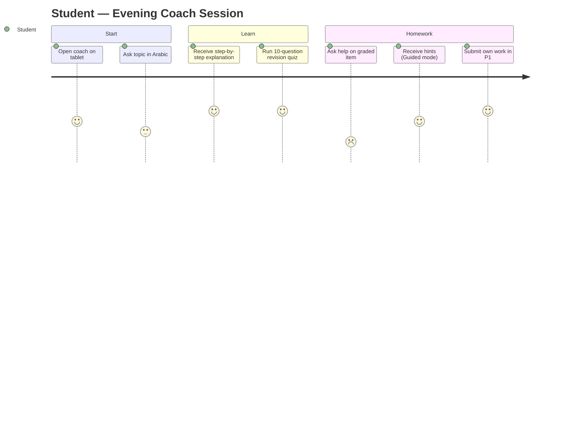
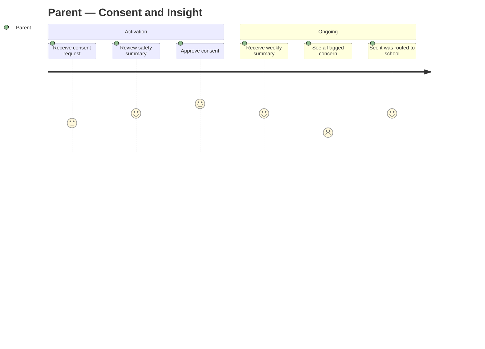
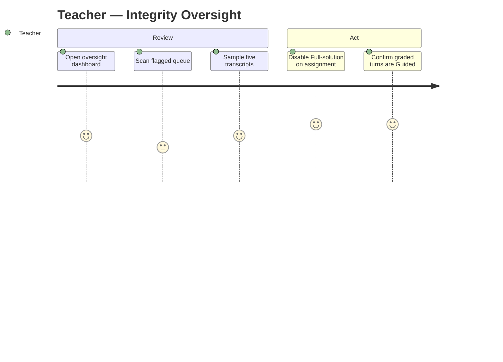
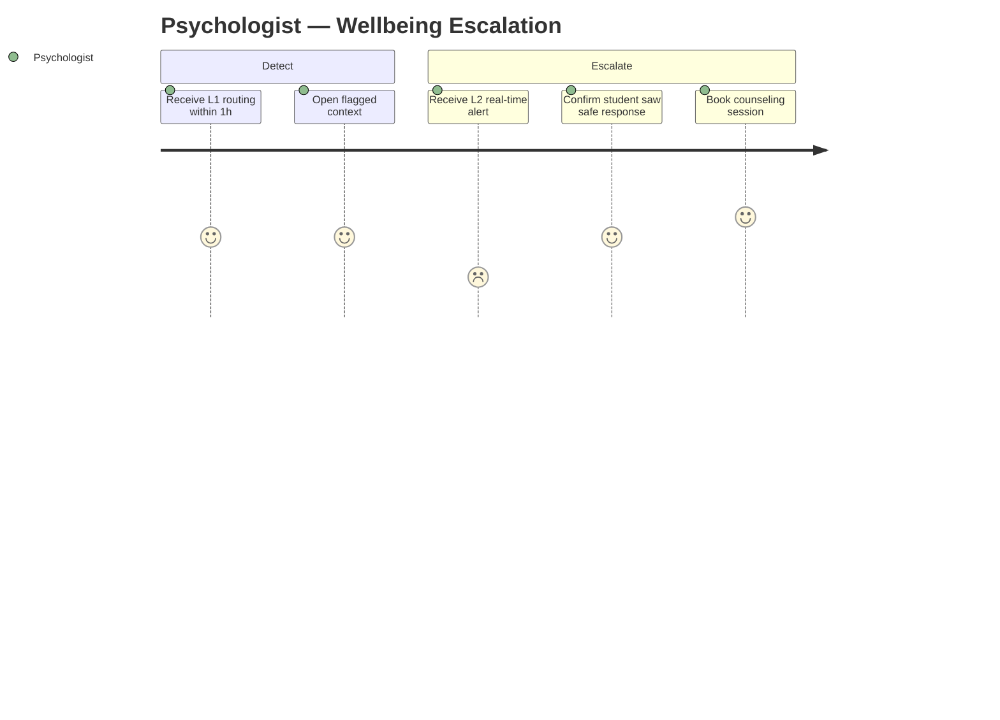
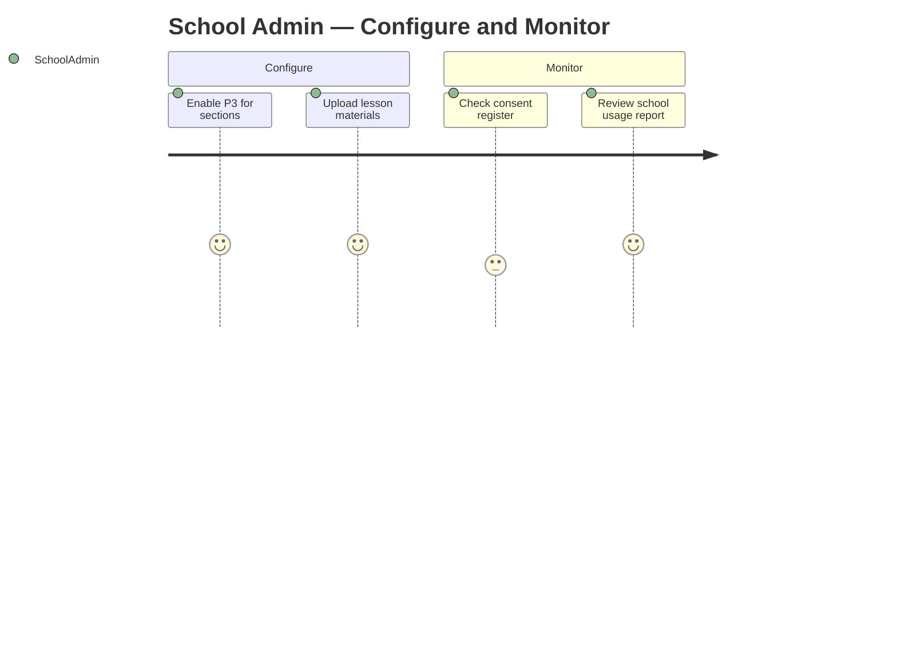
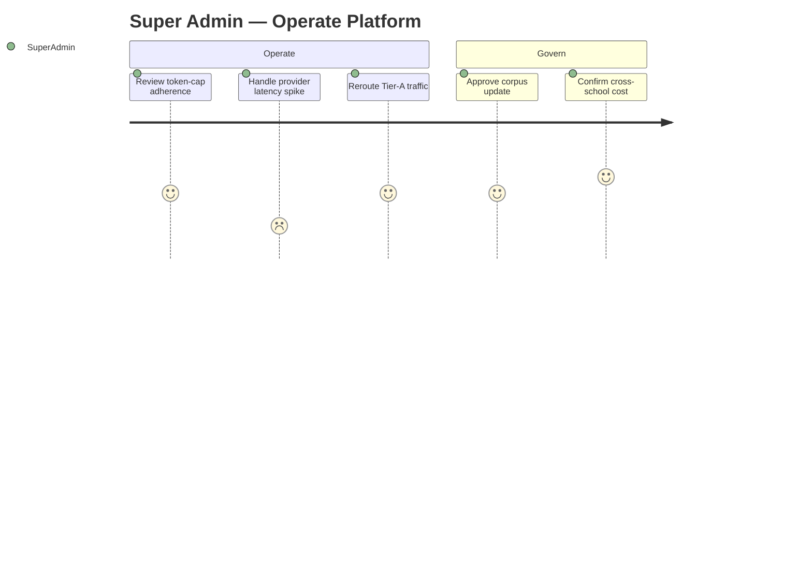

# PART 2 — STAKEHOLDERS & USERS

*Layer 1 — Business & Strategy*

| Field | Value |
|---|---|
| Product | P3 — AI Student Coach |
| Document | Master SRS — Part 2 of 17 |
| Version | 1.0 (Draft — Layer 1 in progress) |
| Classification | Internal — Consultant Use Only |
| Status | Draft for consultant review |
| Identifier prefixes | STK-AIC / PER-AIC / JRN-AIC / ACC-AIC |
| Roles that interact with P3 | Student, Parent, Teacher, Psychologist, School Admin, Super Admin |

---

## 2.1  Stakeholder Register

| ID | Stakeholder | Interest | Influence | Communication Need |
|---|---|---|---|---|
| STK-AIC-01 | Student | Receives tutoring, homework help, revision, career and wellbeing support | High | In-product guidance; release notes in student language |
| STK-AIC-02 | Parent / Guardian | Visibility of child progress; controls activation consent | High | Consent requests; recommendation and alert summaries |
| STK-AIC-03 | Teacher | Oversight of AI use in class; integrity control | High | Oversight dashboard; flagged-interaction alerts |
| STK-AIC-04 | School Psychologist | Receives wellbeing escalations; reviews flagged context | High | Real-time escalation alerts; case detail access |
| STK-AIC-05 | School Admin | Configures P3 per school; monitors usage and consent | Medium | Admin console; usage and compliance reports |
| STK-AIC-06 | Super Admin (platform operator) | Tenant config, model gateway, content corpus, cost caps | High | Platform console; cost and incident reports |
| STK-AIC-07 | CEO / Director | Sponsors product; owns strategic KPIs (Part 1.2) | High | Quarterly KPI summary (Part 1.4) |
| STK-AIC-08 | DPO / Compliance | Owns child-data, consent, retention, residency posture | High | Sign-off on G3/G5/G7/G8 items; audit access |
| STK-AIC-09 | Cambridge / Cognia bodies (external) | Evidence of personalized learning and intervention | Medium | Accreditation evidence exports (Part 3.5) |
| STK-AIC-10 | LLM / Cloud providers (external) | Supply inference, hosting, vector store | Medium | SLAs; cost and availability monitoring |
| STK-AIC-11 | Consultant / Development team | Build, integrate, and operate P3 | High | Requirement reviews; change requests (Part 17) |

---

## 2.2  User Personas

### PER-AIC-01 — Student (primary user)

| Attribute | Detail |
|---|---|
| Name / context | "Zainab Fatima", Grade 9, Cambridge IGCSE track, Lahore, Urdu first language, studies on a shared tablet at home |
| Goals | Understand topics she misses in live class; finish homework without falling behind; raise her Maths and Physics grades |
| Frustrations | Cannot ask a teacher at 9 p.m.; explanations in English-only resources are hard to follow; embarrassed to ask "basic" questions in class |
| Tech comfort | Medium — fluent on mobile apps, less so on desktop |
| Usage frequency | Daily, mostly evenings and weekends |
| Quote | "I just want someone to explain it again, slowly, in my language, without judging me." |
| Day in the life | After dinner Zainab opens the coach on her tablet, asks for a step-by-step on a quadratic equation in Urdu, runs a 10-question revision quiz, then asks for help on her graded homework and receives hints rather than the answer. |

### PER-AIC-02 — Parent / Guardian

| Attribute | Detail |
|---|---|
| Name / context | "Mr. Asif Khan", father of two enrolled students, works long hours, checks the parent app on commute |
| Goals | Know whether his children are using the coach and improving; approve activation with confidence it is safe |
| Frustrations | Too many notifications; no clear signal of what actually matters; worry about AI safety for his children |
| Tech comfort | Medium |
| Usage frequency | Weekly, plus on alerts |
| Quote | "Tell me if something is wrong, and tell me they are getting better. I do not need everything else." |
| Day in the life | Mr. Khan receives a consent request when activation begins, approves it, and later gets a weekly summary showing each child's coach usage, top improvements, and any flagged concern routed to the school. |

### PER-AIC-03 — Teacher

| Attribute | Detail |
|---|---|
| Name / context | "Miss Ayesha Tariq", teaches Grade 9 Maths to 120 students across four sections |
| Goals | Ensure the coach helps rather than enables cheating on graded work; spot students who are struggling |
| Frustrations | No time to read every transcript; needs to trust the integrity controls |
| Tech comfort | High |
| Usage frequency | 2–3 times per week |
| Quote | "I support the help — as long as it is not doing the graded work for them." |
| Day in the life | Miss Ayesha opens the oversight dashboard, reviews the flagged-interaction queue for her sections, samples five transcripts, and disables Full-solution mode on an active graded assignment. |

### PER-AIC-04 — School Psychologist

| Attribute | Detail |
|---|---|
| Name / context | "Dr. Saima Raza", one of two psychologists serving the campus |
| Goals | Receive early, accurate wellbeing signals; act before a situation escalates |
| Frustrations | False positives waste limited time; missing a real signal is unacceptable |
| Tech comfort | High |
| Usage frequency | Daily |
| Quote | "Bring me the real signals fast, with enough context to act — and never let the AI try to counsel a child in crisis." |
| Day in the life | Dr. Saima receives a Level-1 routing within the hour, opens the flagged context in the P1 Psychologist module, and books a counseling session; a Level-2 case earlier that day already alerted both her and the School Admin. |

### PER-AIC-05 — School Admin

| Attribute | Detail |
|---|---|
| Name / context | "Mr. Usman Sheikh", operations lead for a single campus |
| Goals | Configure the coach per school; keep consent and usage compliant; control cost signals |
| Frustrations | Fragmented settings; no single view of consent status |
| Tech comfort | High |
| Usage frequency | Weekly |
| Quote | "I need one console that tells me it is configured, consented, and within budget." |
| Day in the life | Mr. Usman enables P3 for new Grade 9 sections, uploads supplementary lesson materials for indexing, checks the consent register, and reviews the school usage report. |

### PER-AIC-06 — Super Admin (platform operator)

| Attribute | Detail |
|---|---|
| Name / context | "Ms. Hina Malik", platform operator across all tenant schools |
| Goals | Manage the model gateway, token caps, content corpus, and cross-school cost and incidents |
| Frustrations | Cost overruns from a single tenant; provider outages |
| Tech comfort | Expert |
| Usage frequency | Daily |
| Quote | "Keep every tenant inside the cap and route around any provider that degrades." |
| Day in the life | Ms. Hina adjusts Tier-A routing after a provider latency spike, reviews token-cap adherence across tenants, and approves a Cambridge corpus update for a school once its license is confirmed. |

---

## 2.3  User Journey Maps

Each journey shows the emotional arc (score 1 = frustrated, 5 = delighted) followed by a detail table of triggers, system touchpoints, pain points, and outcomes.

### JRN-AIC-01 — Student: evening tutoring + graded homework

| Stage | Trigger | System Touchpoint | Pain Point | Outcome |
|---|---|---|---|---|
| Start | Stuck after live class | Coach chat, language auto-set to Arabic | Slow first response erodes trust | Session begins in correct language |
| Learn | Requests explanation | Tier-A model + RAG over curriculum corpus | Ungrounded answer would mislead | Grounded, step-by-step explanation |
| Practice | Asks to revise | Revision Coach generates quiz/flashcards | Repetitive or off-syllabus items | Targeted practice on weak topic |
| Homework | Asks about active graded item | P1 assignment-context lookup triggers Guided mode | Student wants the answer, not hints | Hints only; submits own work; turn logged for teacher |

### JRN-AIC-02 — Parent: consent and weekly insight

| Stage | Trigger | System Touchpoint | Pain Point | Outcome |
|---|---|---|---|---|
| Activation | Child onboarded to P3 | Parent app consent gate, safety summary | Unclear what is being consented to | Recorded consent; activation enabled |
| Ongoing | Weekly cycle | Recommendation/summary digest | Notification overload | One concise, relevant summary |
| Concern | Wellbeing flag raised | Child-level alert (summary detail only) | Fear of not knowing what happens next | Sees the concern was routed to the psychologist |

### JRN-AIC-03 — Teacher: integrity oversight

| Stage | Trigger | System Touchpoint | Pain Point | Outcome |
|---|---|---|---|---|
| Review | Start of grading window | Teacher oversight dashboard | Too many transcripts to read | Flagged queue + sample focuses attention |
| Verify | Sees a suspicious turn | Logged graded-context turns | Cannot tell graded vs practice | Mode and context shown per turn |
| Act | Wants to lock down a task | Per-assignment mode control | Change does not apply in real time | Full-solution disabled instantly for that assignment |

### JRN-AIC-04 — Psychologist: wellbeing escalation

| Stage | Trigger | System Touchpoint | Pain Point | Outcome |
|---|---|---|---|---|
| Detect | Engagement/sentiment threshold crossed | Escalation log + P1 Psychologist queue | False positives waste time | L1 case queued with context within 1 hour |
| Escalate | Explicit risk language detected | Real-time L2 alert to psychologist + School Admin (<=60s) | Worry the AI tried to counsel | Student shown safe response + helpline; human takes over |
| Resolve | Psychologist reviews | P1 case record | Missing history | Session booked; AIC never the sole responder |

### JRN-AIC-05 — School Admin: configure and monitor

| Stage | Trigger | System Touchpoint | Pain Point | Outcome |
|---|---|---|---|---|
| Configure | New grade/sections added | Admin console; content upload for indexing | Fragmented settings | P3 enabled and grounded on school materials |
| Consent | Compliance check | Consent register view | No single consent status | Clear consented/pending list |
| Monitor | Weekly cycle | School usage and cost report | No actionable signal | Usage, adherence, and flags in one report |

### JRN-AIC-06 — Super Admin: operate the platform

| Stage | Trigger | System Touchpoint | Pain Point | Outcome |
|---|---|---|---|---|
| Operate | Daily cost review | Model gateway console; usage telemetry | One tenant breaches cap | Throttling applied; cap held |
| Incident | Provider latency rises | Gateway routing controls | Degraded student experience | Traffic rerouted to healthy provider |
| Govern | License confirmed | Corpus management | Unlicensed content risk | Approved corpus indexed per tenant |

---

## 2.4  Roles & Permissions Matrix

Access values: **Yes** = full action; **No** = no access; **Own** = own records only; **Child** = own children only; **Class** = own classes/sections only; **Read** = view only; **Summary** = summary-level only.

| # | P3 Feature | Student | Parent | Teacher | Psychologist | School Admin | Super Admin |
|---|---|---|---|---|---|---|---|
| 1 | Chat with AI tutor | Yes | No | No | No | No | No |
| 2 | Homework Assistant — Guided mode | Yes | No | No | No | No | No |
| 3 | Homework Assistant — Full-solution mode | Yes | No | No | No | No | No |
| 4 | Generate revision (quiz/flashcards/summary) | Yes | No | No | No | No | No |
| 5 | Receive career guidance | Yes | No | No | No | No | No |
| 6 | Wellbeing chat with coach | Yes | No | No | No | No | No |
| 7 | View coach recommendations | Own | Child | Class–Read | Read | Read | No |
| 8 | View coach session summaries | Own–Summary | Child–Summary | Class–Summary | Read | Summary | No |
| 9 | View confidential wellbeing detail | No | No | No | Yes | No | No |
| 10 | Receive wellbeing escalation alerts | No | Child–Summary | Class–Summary | Yes | Yes (L2/L3) | No |
| 11 | View flagged-interaction queue | No | No | Class | Yes | Read | No |
| 12 | Sampled transcript review | No | No | Class | Yes | No | No |
| 13 | Enable/disable coach per student | No | No | Class | Yes | Yes | No |
| 14 | Enable/disable coach per assignment | No | No | Class | No | Yes | No |
| 15 | Configure P3 settings per school | No | No | No | No | Yes | Yes |
| 16 | Manage RAG content corpus / indexing | No | No | No | No | Yes (school) | Yes (global) |
| 17 | Configure model gateway & token caps | No | No | No | No | No | Yes |
| 18 | View P3 usage analytics (school) | No | No | Class | Read | Yes | Yes |
| 19 | View P3 usage analytics (cross-school) | No | No | No | No | No | Yes |
| 20 | Manage parental consent records | No | Own | No | No | Yes | No |
| 21 | Export coach interaction data | No | No | No | Yes (with consent) | Yes (school) | Yes (audit) |
| 22 | Set student language / age data | No | No | No | No | Read (from P1) | Read (from P1) |

---

## 2.5  Accessibility Requirements

| ID | Requirement | Target |
|---|---|---|
| ACC-AIC-01 | Conformance level | WCAG 2.1 Level AA across web, iOS, and Android |
| ACC-AIC-02 | Text contrast | >=4.5:1 for normal text; >=3:1 for large text (>=18pt or 14pt bold) and UI components |
| ACC-AIC-03 | Screen reader support | Full ARIA labelling on web; VoiceOver (iOS) and TalkBack (Android) compatibility for all coach actions |
| ACC-AIC-04 | Keyboard navigation | Every action reachable and operable by keyboard; visible focus indicator on all interactive elements |
| ACC-AIC-05 | RTL rendering | Mirrored layout, RTL text flow, and RTL-aware components for Arabic and Urdu |
| ACC-AIC-06 | Language match | Interface and TTS render in the student's set language (English, Arabic, Urdu) per CON-AIC-05 |
| ACC-AIC-07 | TTS captions | Read-aloud output paired with synchronized on-screen text |
| ACC-AIC-08 | Touch target size | >=44x44 px (iOS) / >=48x48 dp (Android) for all interactive controls |
| ACC-AIC-09 | Reduced motion | Honor OS "reduce motion" setting; no essential information conveyed by motion alone |
| ACC-AIC-10 | Non-colour signalling | Status and alerts use text/icon labels, not colour alone |
| ACC-AIC-11 | Resize / reflow | Content readable and operable at 200% zoom without horizontal scrolling at 320 CSS px width |
| ACC-AIC-12 | Error identification | Input errors identified in text with correction guidance, announced to assistive technology |

---

### Layer 1 gate status — Part 2

| Gate item | Status |
|---|---|
| Stakeholder register present | Pass — 11 stakeholders, interest + influence + communication need |
| One persona per interacting role | Pass — 6 persona cards, all fields incl. quote + day-in-the-life |
| One journey map per role | Pass — 6 journeys with emotional arc + touchpoint/pain-point tables |
| Permissions matrix fully filled | Pass — 22 features × 6 roles, no blank cells |
| Accessibility requirements | Pass — WCAG 2.1 AA, contrast ratios, RTL, screen reader, keyboard |

*Open dependency: confirm the role list is final. If the CEO/Director needs an in-product P3 view (currently treated as KPI-summary only, STK-AIC-07), add a 7th persona, journey, and matrix column before Layer 1 sign-off.*
