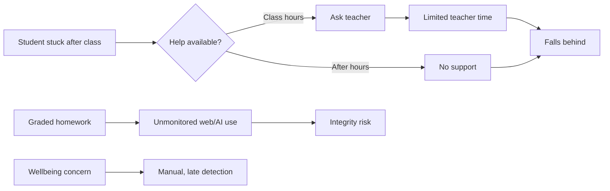
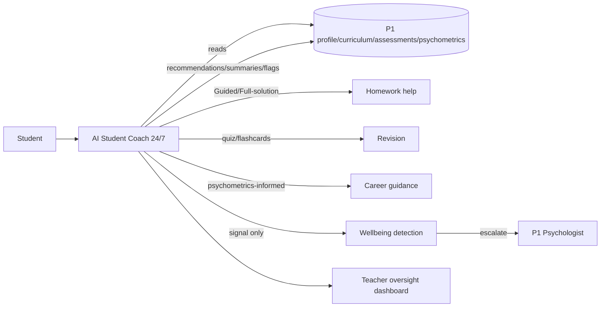
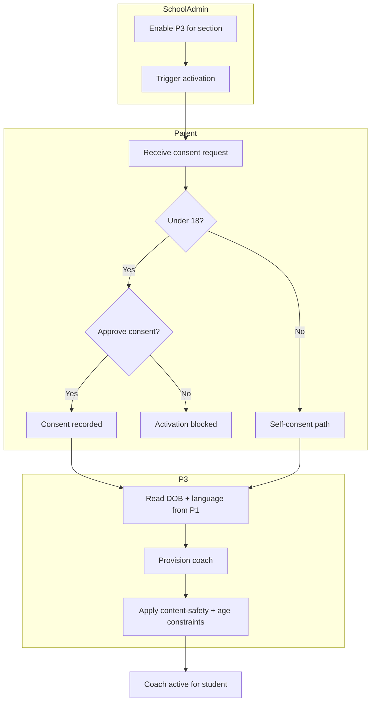
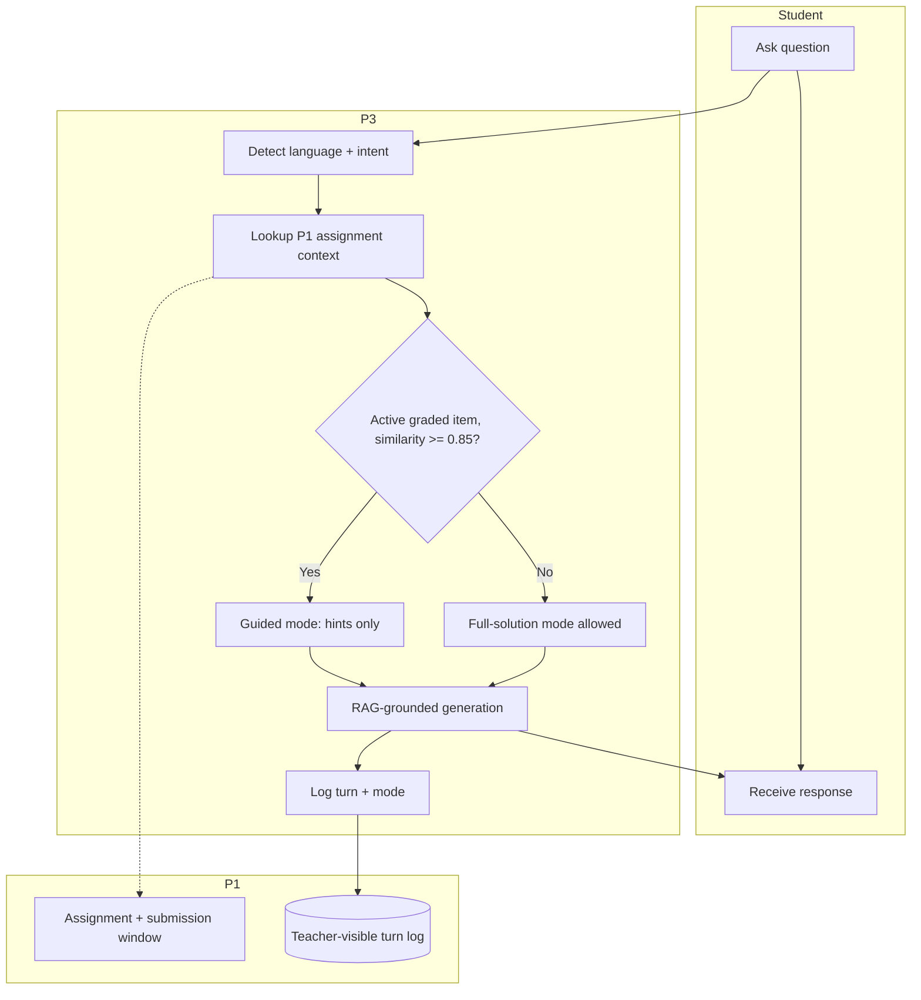
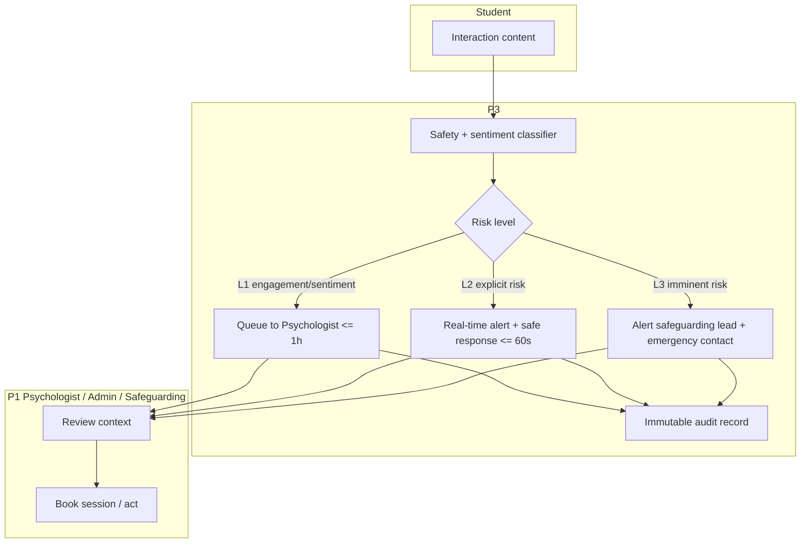
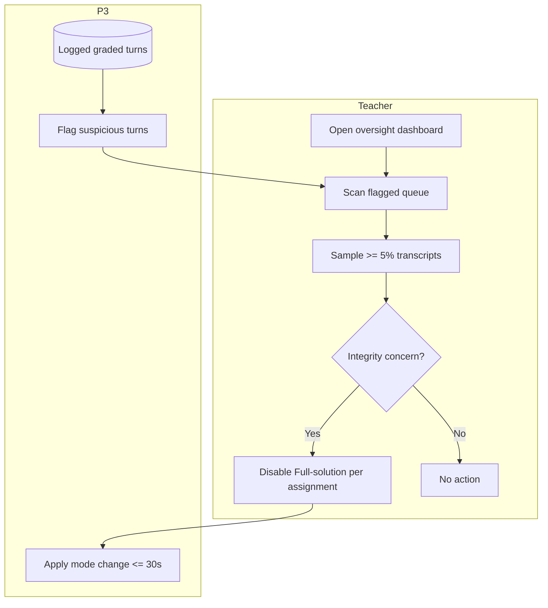
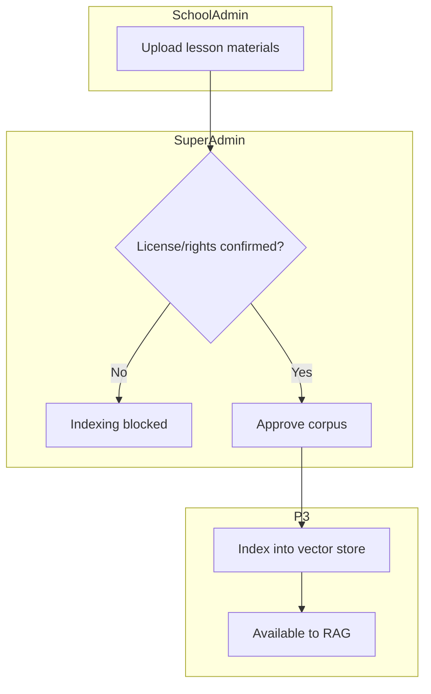
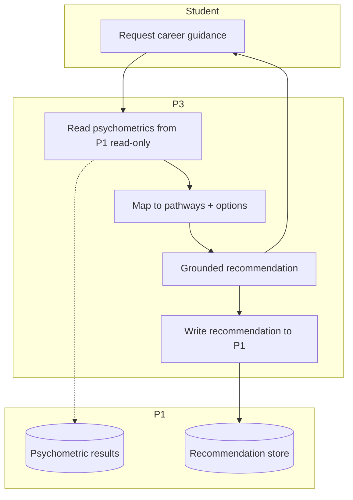

# PART 3 — BUSINESS REQUIREMENTS

*Layer 1 — Business & Strategy*

| Field | Value |
|---|---|
| Product | P3 — AI Student Coach |
| Document | Master SRS — Part 3 of 17 |
| Version | 1.0 (Draft — Layer 1 in progress) |
| Classification | Internal — Consultant Use Only |
| Status | Draft for consultant review |
| Identifier prefixes | BR-AIC (business rules) / CMP-AIC (compliance) / RPT-AIC (reporting) |

---

## 3.1  Current State

The online school operates on the P1 LMS/SMS (under build). No per-student AI tutor exists. Supplemental tutoring is human-delivered, time-bounded, and unavailable at scale. Wellbeing concerns surface through manual observation.

**Pain points**

| ID | Pain Point | Affected Stakeholder | Impact |
|---|---|---|---|
| PP-01 | No individualized help outside class hours | Student | Topics remain unresolved; grades fall |
| PP-02 | Teacher time cannot scale to 1:1 across all students | Teacher, Student | Struggling students are missed |
| PP-03 | Unmonitored external AI use on graded work | Teacher | Academic-integrity risk |
| PP-04 | Help resources are English-centric | Student (Arabic/Urdu) | Comprehension and confidence gaps |
| PP-05 | Wellbeing signals detected late and manually | Psychologist, Student | Delayed intervention |
| PP-06 | No evidence trail of personalized support | School, Accreditation | Accreditation evidence gaps |

**Gaps the system must close**

| ID | Gap | Closed By |
|---|---|---|
| GAP-01 | 24/7 individualized tutoring | In-Scope IN-01, IN-02 |
| GAP-02 | Integrity-aware homework help | In-Scope IN-03; BR-AIC-001..003 |
| GAP-03 | Multilingual delivery | In-Scope IN-08; BR-AIC-008 |
| GAP-04 | Early wellbeing detection + escalation | In-Scope IN-06; BR-AIC-005..006 |
| GAP-05 | Auditable personalized-support evidence | In-Scope IN-10, IN-12; BR-AIC-018 |

---

## 3.2  Future State

The coach delivers grounded tutoring, integrity-aware homework support, revision, career guidance, and wellbeing signal detection in the student's language, across web, iOS, and Android, while teachers retain oversight and psychologists own all clinical action.

**Benefits per stakeholder**

| Stakeholder | Benefit | Linked Objective/KPI |
|---|---|---|
| Student | Always-available, language-matched, grounded help | OBJ-AIC-01/02; KPI-AIC-01/02 |
| Parent | Visibility of progress; safe, consented activation | OBJ-AIC-04; KPI-AIC-01 |
| Teacher | Integrity control without reading every transcript | KPI-AIC-06 |
| Psychologist | Early, contextualized wellbeing signals | OBJ-AIC-05; KPI-AIC-04 |
| School/Accreditation | Auditable evidence of personalized support | DRV-AIC-04 |
| Platform operator | Bounded, predictable inference cost | OBJ-AIC-06; KPI-AIC-08 |

---

## 3.3  Business Process Flows

### BP-01 — Student onboarding & parental consent

### BP-02 — Tutoring session with homework integrity

### BP-03 — Wellbeing signal detection & escalation

### BP-04 — Teacher oversight & integrity control

### BP-05 — Content corpus onboarding

### BP-06 — Career guidance using psychometrics

---

## 3.4  Business Rules

| ID | Rule (testable) |
|---|---|
| BR-AIC-001 | When a student query matches an active graded assignment with topic similarity >= 0.85, the coach operates in Guided mode and shall not output the exact graded answer. |
| BR-AIC-002 | Full-solution mode is permitted only for non-graded or practice content. |
| BR-AIC-003 | Every graded-context turn is logged and visible to the assigned teacher within 30 seconds. |
| BR-AIC-004 | The coach shall not produce a psychological diagnosis or therapeutic treatment. |
| BR-AIC-005 | On detecting explicit risk language, the coach shall display a safe response containing the regional helpline and route an L2 alert to the psychologist and School Admin within 60 seconds. |
| BR-AIC-006 | Level-1 wellbeing signals shall be routed to the P1 Psychologist queue within 1 hour. |
| BR-AIC-007 | A student under 18 shall not activate P3 without a recorded parental consent. |
| BR-AIC-008 | The coach shall respond in the student's set language (English, Arabic, or Urdu). |
| BR-AIC-009 | When a student exceeds 2,000,000 tokens in a calendar month, the coach shall route subsequent requests to Tier B/C models only. |
| BR-AIC-010 | When no retrieved source meets the retrieval confidence threshold, the coach shall state uncertainty and shall not fabricate an answer. |
| BR-AIC-011 | P3 shall write only recommendations, session summaries, and flags to P1; it shall never write to P1 graded records. |
| BR-AIC-012 | Interaction data shall be retained for 24 months, then anonymized, and stored in the tenant's pinned region. |
| BR-AIC-013 | A teacher disabling the coach per student or per assignment shall take effect within 30 seconds. |
| BR-AIC-014 | Content shall be indexed for RAG only after license or indexing rights are confirmed. |
| BR-AIC-015 | Career guidance shall read P1 psychometrics read-only; P3 shall not recompute psychometric scores. |
| BR-AIC-016 | All student input and model output shall pass the content-safety filter before display or storage. |
| BR-AIC-017 | Parents shall receive summary-level wellbeing detail only; confidential detail is restricted to the psychologist. |
| BR-AIC-018 | Every wellbeing escalation shall create an immutable audit record (student, level, timestamp, recipients, action). |
| BR-AIC-019 | The coach shall not request, store, or echo a student's financial data, password, or government ID. |
| BR-AIC-020 | Each response delivered in graded context shall carry a teacher-visible mode tag (Guided or Full-solution). |

---

## 3.5  Compliance Requirements

| ID | Regulation / Standard | Requirement | How the System Meets It | Evidence |
|---|---|---|---|---|
| CMP-AIC-01 | GDPR (EU) | Lawful basis, access, erasure, portability | Consent records, data export and deletion via P1; 24-month retention (BR-AIC-012) | Consent register; deletion logs |
| CMP-AIC-02 | GDPR-K / child-data | Parental consent for under-18 processing | Consent gate blocks activation (BR-AIC-007) | Consent audit trail |
| CMP-AIC-03 | COPPA (US) | Verifiable parental consent for children | Same consent gate; jurisdiction flag per tenant | Consent records by region |
| CMP-AIC-04 | FERPA (US) | Education-record privacy and access control | RBAC (Part 2.4); P1 as system of record | Access logs |
| CMP-AIC-05 | Data residency | Region-pinned storage per tenant | Tenant-pinned storage (BR-AIC-012) | Storage region config |
| CMP-AIC-06 | Cambridge | Evidence of personalized learning support | Coach session summaries + recommendations exportable | Accreditation export (RPT-AIC-06) |
| CMP-AIC-07 | Cognia | Evidence of timely intervention | Wellbeing escalation audit records (BR-AIC-018) | Escalation log export |
| CMP-AIC-08 | Safeguarding | No autonomous AI counseling of minors in crisis | Diagnosis prohibited; human escalation (BR-AIC-004/005) | Escalation audit; safe-response logs |
| CMP-AIC-09 | WCAG 2.1 AA | Accessibility conformance | Part 2.5 accessibility requirements | Accessibility audit (Appendix F) |
| CMP-AIC-10 | AI content safety | Filter harmful input/output for minors | Content-safety filter on all turns (BR-AIC-016) | Filter event logs |

---

## 3.6  Reporting Requirements

| ID | Report | Audience | Frequency | Data Source | Format |
|---|---|---|---|---|---|
| RPT-AIC-01 | Parent insight summary | Parent | Weekly + on flag | Usage events, recommendations, flags | In-app + email digest |
| RPT-AIC-02 | Teacher oversight report | Teacher | On demand + weekly | Flagged queue, graded-turn log, usage | In-app dashboard + PDF |
| RPT-AIC-03 | Wellbeing escalation log | Psychologist, School Admin | Real-time + weekly roll-up | Escalation audit records | In-app + CSV |
| RPT-AIC-04 | School usage & adherence report | School Admin | Weekly | Usage telemetry, token-cap data, consent register | Dashboard + PDF/CSV |
| RPT-AIC-05 | Cross-school cost & token report | Super Admin | Daily | Model-gateway telemetry, billing | Dashboard + CSV |
| RPT-AIC-06 | Accreditation evidence export | School Admin, Accreditation | Per term / on demand | Session summaries, recommendations, intervention records | PDF/CSV bundle |
| RPT-AIC-07 | Consent register report | School Admin, DPO | Monthly + on demand | Consent records | CSV/PDF |
| RPT-AIC-08 | AI evaluation report | Consultant, Super Admin | Weekly | Eval harness (groundedness, hallucination, language match) | Dashboard + CSV |
| RPT-AIC-09 | Compliance / audit log export | DPO, Auditor | On demand | Access logs, change logs, escalation audit | CSV/PDF |

---

### Layer 1 gate status — Part 3

| Gate item | Status |
|---|---|
| Current state with pain-point + gap tables | Pass — process diagram + 6 pain points + 5 gaps |
| Future state with benefits per stakeholder | Pass — process diagram + benefits table |
| Business process flows (swimlane per process) | Pass — 6 swimlane process diagrams (BP-01..06) |
| Business rules numbered and testable | Pass — 20 rules (BR-AIC-001..020) |
| Compliance requirements table | Pass — 10 entries (CMP-AIC-01..10) |
| Reporting requirements table | Pass — 9 reports (RPT-AIC-01..09) |

---

### Layer 1 — overall close-out (Parts 1–3)

| Layer 1 gate (project standard) | Status |
|---|---|
| Objectives numbered with measurable targets | Pass (Part 1.2) |
| All three scope tables present | Pass (Part 1.3) |
| One persona per role, all fields | Pass (Part 2.2) |
| One journey map per role | Pass (Part 2.3) |
| Permissions matrix fully filled | Pass (Part 2.4) |
| All business rules testable | Pass (Part 3.4) |

*Open items carried into later layers: ASM-AIC-02/03/05/06 client/DPO sign-off (03 Jul 2026), ASM-AIC-04 corpus license (10 Jul 2026), ROI figures pending Part 13 inputs, and the CEO/Director-as-user decision from Part 2.*
