# MASTER SRS — P3 AI STUDENT COACH
## Part 4 (Functional Requirements) — Module 4.11: Admin & Configuration

*Layer 2 — Product & Functional · Standalone module document within the Part 4 set*

| Field | Value |
|---|---|
| Product | P3 — AI Student Coach |
| Module | 4.11 — Admin & Configuration |
| Version | 1.0 (Draft — Layer 2 in progress) |
| Classification | Internal — Consultant Use Only |
| Requirement range (this module) | AIC-FR-193 → AIC-FR-210 |
| Note | This module is the console surface for configuration actions defined across Modules 4.1–4.10. It specifies the admin screens and scopes; the governed rules remain in their owning modules and are cross-referenced. |

---

## 4.11.1  Module Overview

The Admin & Configuration console gives the School Admin school-scoped control and the Super Admin global control over P3. It manages tenant provisioning, model-gateway routing, token caps, detection thresholds, the helpline registry, content corpus, consent policy, feature flags, and reporting. Every configuration change is role-scoped, versioned, and audited.

## 4.11.2  Feature Map

```mermaid
flowchart TD
    AC[Admin & Configuration] --> TEN[Tenant & Enablement]
    AC --> AI[AI & Cost]
    AC --> THR[Thresholds]
    AC --> SAFE[Safety & Consent]
    AC --> CON[Content]
    AC --> RPT[Reporting & Audit]

    TEN --> TEN1[Provision tenant / region]
    TEN --> TEN2[Enable P3 per grade/section]
    TEN --> TEN3[Feature flags per school]
    TEN --> TEN4[Language availability]

    AI --> AI1[Model gateway: keys/routing/failover]
    AI --> AI2[Token cap + throttle policy]

    THR --> THR1[Homework similarity]
    THR --> THR2[RAG relevance]
    THR --> THR3[Personalization confidence/volume/cooldown]
    THR --> THR4[Sampling rate]

    SAFE --> SAFE1[Wellbeing thresholds + recipients]
    SAFE --> SAFE2[Helpline registry]
    SAFE --> SAFE3[Consent policy/jurisdiction/expiry]

    CON --> CON1[School corpus upload/metadata]
    CON --> CON2[License/rights confirmation]

    RPT --> RPT1[Usage & cost reports]
    RPT --> RPT2[Consent register report]
    RPT --> RPT3[Notification templates]
    RPT --> RPT4[Audit log + change versioning]
```

## 4.11.3  Functional Requirements

| ID | Requirement | Priority | Source |
|---|---|---|---|
| AIC-FR-193 | The Super Admin shall provision and configure a tenant school for P3 (enable, region, defaults). | Must | Multi-tenant |
| AIC-FR-194 | The School Admin shall enable or disable P3 per grade and section. | Must | Persona PER-AIC-05 |
| AIC-FR-195 | The Super Admin shall configure the model gateway: provider keys, tier routing, and failover order. | Must | Gap G1 |
| AIC-FR-196 | The Super Admin shall configure the per-student monthly token cap and throttle behaviour. | Must | BR-AIC-009 |
| AIC-FR-197 | The Super Admin shall configure detection thresholds: homework similarity, RAG relevance, personalization confidence, recommendation volume cap, and cooldown. | Must | 4.2/4.7/4.8 |
| AIC-FR-198 | The Psychologist and Super Admin shall configure wellbeing thresholds and escalation recipients within their role scope. | Must | AIC-FR-095 |
| AIC-FR-199 | The School Admin and DPO shall manage the regional helpline registry. | Must | BR-AIC-W-10 |
| AIC-FR-200 | The School Admin shall manage the school content corpus (upload, metadata) via the Module 4.7 hooks. | Must | AIC-FR-124 |
| AIC-FR-201 | The Super Admin shall confirm content license/indexing rights. | Must | AIC-FR-125 |
| AIC-FR-202 | The School Admin and DPO shall configure consent policy, jurisdiction, and expiry. | Must | Module 4.10 |
| AIC-FR-203 | Admins shall view usage and cost reports at their scope (school or cross-school). | Must | RPT-AIC-04/05 |
| AIC-FR-204 | The School Admin and DPO shall view the consent register report. | Must | RPT-AIC-07 |
| AIC-FR-205 | The Super Admin shall manage feature flags per school. | Should | Feature mgmt |
| AIC-FR-206 | The School Admin shall configure available languages within {English, Urdu, Arabic}. | Should | i18n |
| AIC-FR-207 | Admins shall configure localized notification templates. | Should | Communication |
| AIC-FR-208 | Admins shall access the audit log within their scope. | Must | BR-AIC-018 |
| AIC-FR-209 | All configuration changes shall be versioned and audited. | Must | Governance |
| AIC-FR-210 | The console shall enforce role scope: School Admin to own school, Super Admin global. | Must | RBAC (Part 2.4) |

## 4.11.4  User Stories

| ID | User Story | Implements |
|---|---|---|
| US-AIC-A-01 | As a Super Admin, I can provision a school and set its region, so that P3 runs correctly per tenant. | AIC-FR-193 |
| US-AIC-A-02 | As a School Admin, I can enable P3 for specific grades/sections, so that rollout is controlled. | AIC-FR-194 |
| US-AIC-A-03 | As a Super Admin, I can configure model routing and failover, so that the coach stays available and cost-efficient. | AIC-FR-195 |
| US-AIC-A-04 | As a Super Admin, I can set token caps, so that cost stays bounded. | AIC-FR-196 |
| US-AIC-A-05 | As a Super Admin, I can tune detection thresholds, so that integrity and quality are balanced. | AIC-FR-197 |
| US-AIC-A-06 | As a DPO/School Admin, I can manage helplines and consent policy, so that we stay safe and compliant. | AIC-FR-199/202 |
| US-AIC-A-07 | As a School Admin, I can manage our content and view usage/cost, so that the coach reflects our curriculum within budget. | AIC-FR-200/203 |
| US-AIC-A-08 | As an auditor, I can see versioned, audited config changes, so that governance holds. | AIC-FR-208/209 |

## 4.11.5  Acceptance Criteria

**US-AIC-A-01 / A-02 (AIC-FR-193/194)**
1. A Super Admin can provision a tenant with a region; a School Admin can enable/disable P3 per section, and the change takes effect for those students.

**US-AIC-A-03 / A-04 (AIC-FR-195/196)**
2. A model-gateway change (routing/failover) applies to subsequent requests; a token-cap change applies from the next billing cycle or immediately per policy.

**US-AIC-A-05 (AIC-FR-197)**
3. A threshold change governs subsequent detections in the owning module (e.g., homework similarity).

**US-AIC-A-06 (AIC-FR-199/202)**
4. A helpline entry and a consent-policy/jurisdiction setting are saved per region and enforced by Modules 4.5 and 4.10.

**US-AIC-A-07 (AIC-FR-200/203)**
5. Uploaded content enters the Module 4.7 pipeline (license-gated); usage and cost reports reflect the school's data.

**US-AIC-A-08 (AIC-FR-208/209)**
6. Every config change writes a versioned, immutable audit entry with actor, before/after, and timestamp.

**Scope (AIC-FR-210)**
7. A School Admin cannot view or change another school's configuration.

## 4.11.6  Module Business Rules

| ID | Rule (testable) |
|---|---|
| BR-AIC-A-01 | A School Admin shall access only their own school's configuration and data. |
| BR-AIC-A-02 | Every configuration change shall be versioned with actor, timestamp, and before/after values. |
| BR-AIC-A-03 | A configuration change shall propagate to the owning module within 60 seconds. |
| BR-AIC-A-04 | Safety-critical settings (wellbeing thresholds, helpline registry, consent policy) shall require the configured approver role before taking effect. |
| BR-AIC-A-05 | A token cap shall not be set to zero; the minimum enforceable cap is the configured floor. |
| BR-AIC-A-06 | Disabling P3 for a section shall end active sessions gracefully and block new ones. |
| BR-AIC-A-07 | Provider keys and secrets shall be stored encrypted and shall never be displayed in full after entry. |

## 4.11.7  Permission Rules

| Action | Student | Parent | Teacher | Psychologist | School Admin | Super Admin |
|---|---|---|---|---|---|---|
| Provision tenant / set region | No | No | No | No | No | Yes |
| Enable/disable P3 per section | No | No | No | No | Yes (school) | Yes |
| Configure model gateway / token cap | No | No | No | No | No | Yes |
| Configure detection thresholds | No | No | No | No | No | Yes |
| Configure wellbeing thresholds/recipients | No | No | No | Yes | Read | Yes |
| Manage helpline registry | No | No | No | Read | Yes | Yes |
| Manage corpus (upload/metadata) | No | No | No | No | Yes (school) | Yes |
| Confirm license/rights | No | No | No | No | Read | Yes |
| Configure consent policy/jurisdiction | No | No | No | No | Yes (DPO) | Yes |
| View usage/cost reports | No | No | No | No | School | Cross-school |
| View consent register report | No | No | No | No | Yes (school) | Read |
| Manage feature flags | No | No | No | No | No | Yes |
| View audit log | No | No | No | No | School | Global |

## 4.11.8  Validation Rules

| Field | Type | Format / Constraint | Required | Min | Max |
|---|---|---|---|---|---|
| Tenant region | Enum | Supported region list | Yes | — | — |
| Provider API key | Secret | Provider-specific format; stored encrypted; masked after save | Yes (per provider) | — | — |
| Tier routing order | Ordered list | Tiers A/B/C with >=1 provider each | Yes | 1 provider/tier | — |
| Token cap | Integer | >= configured floor | Yes | floor (>0) | 50,000,000 |
| Homework similarity threshold | Decimal | 0.50–0.99 | Yes | 0.50 | 0.99 |
| RAG relevance threshold | Decimal | 0.50–0.99 | Yes | 0.50 | 0.99 |
| Recommendation volume cap | Integer | Whole number | No | 1 | 20 |
| Sampling rate | Decimal | 0.05–1.00 | No | 0.05 | 1.00 |
| Helpline entry | Object | Region + channel + contact value (non-empty) | Yes per region | — | — |
| Consent expiry | Integer (months) | Whole number | No | 1 | 36 |
| Available languages | Multi-select | Subset of {en, ur, ar} | No | 1 | 3 |
| Notification template | String | UTF-8; merge fields validated | No | 1 char | 4,000 chars |

## 4.11.9  Error States

| Trigger | Message Shown (English; localized to admin UI language) | System Action |
|---|---|---|
| Invalid/expired provider key | "That provider key was rejected. Check and re-enter it." | Reject save; keep prior key; do not route to that provider |
| Token cap below floor / zero | "Token cap must be at least the minimum allowed value." | Reject; show floor (BR-AIC-A-05) |
| Threshold out of range | "Enter a value between 0.50 and 0.99." | Reject; retain last valid value |
| Cross-school access attempt | "You can only manage your own school." | Deny; log (BR-AIC-A-01) |
| Safety-critical change without approver | "This change needs approval before it takes effect." | Hold pending approver (BR-AIC-A-04) |
| Disable P3 with active sessions | "P3 will be disabled and current sessions will end shortly." | End sessions gracefully; block new (BR-AIC-A-06) |
| Helpline entry incomplete | "Complete the region, channel, and contact before saving." | Reject save |
| Config propagation delayed | "Saved — applying now." | Confirm save; apply within 60s; show pending until applied |

## 4.11.10  Edge Cases

| ID | Scenario | Expected Behaviour |
|---|---|---|
| EC-AIC-A-01 | Provider outage after a routing change | Failover order routes to the next healthy provider; ops alerted |
| EC-AIC-A-02 | Two admins edit the same setting concurrently | Last-write-wins; both versions in audit; second admin sees a change notice |
| EC-AIC-A-03 | Token cap lowered below current usage mid-month | New cap applies per policy; affected students throttle to Tier B/C |
| EC-AIC-A-04 | School Admin removes a language a student currently uses | Affected students prompted to choose an available language; sessions continue |
| EC-AIC-A-05 | Feature flag disabled for a module mid-use | Module ends gracefully; entry points hidden; no error to students |
| EC-AIC-A-06 | Jurisdiction changed for an active tenant | Re-consent gating applied per Module 4.10 where required |
| EC-AIC-A-07 | License revoked via console | Content removed from index within window (inherits BR-AIC-K-06) |
| EC-AIC-A-08 | Audit log queried beyond retention window | Returns available records; expired entries noted as out of window |

---

### Layer 2 gate status — Module 4.11 (Admin & Configuration)

| Gate item | Status |
|---|---|
| Every feature has a requirement ID | Pass — AIC-FR-193..210 |
| Every requirement has a priority | Pass — Must/Should/Could |
| Every user story has testable acceptance criteria | Pass — 8 stories, 7 binary criteria |
| Every input field has validation rules | Pass — 12 fields specified |
| Every error scenario documented with message | Pass — 8 error states |
| Minimum 3 edge cases | Pass — 8 edge cases (EC-AIC-A-01..08) |

---

## PART 4 — CLOSE-OUT (All Modules)

| Module | Title | FR Range | FRs | Gate |
|---|---|---|---|---|
| 4.1 | Tutor Engine | AIC-FR-001–020 | 20 | Pass |
| 4.2 | Homework Assistant | AIC-FR-021–040 | 20 | Pass |
| 4.3 | Revision Coach | AIC-FR-041–060 | 20 | Pass |
| 4.4 | Career Coach | AIC-FR-061–080 | 20 | Pass |
| 4.5 | Wellbeing Coach | AIC-FR-081–100 | 20 | Pass |
| 4.6 | Student Learning Profile | AIC-FR-101–120 | 20 | Pass |
| 4.7 | Knowledge Graph & RAG | AIC-FR-121–140 | 20 | Pass |
| 4.8 | Personalization & Recommendation | AIC-FR-141–160 | 20 | Pass |
| 4.9 | Teacher Oversight Console | AIC-FR-161–175 | 15 | Pass |
| 4.10 | Consent & Safety | AIC-FR-176–192 | 17 | Pass |
| 4.11 | Admin & Configuration | AIC-FR-193–210 | 18 | Pass |
| **Total** | **11 modules** | **AIC-FR-001–210** | **210** | **Pass** |

*Part 4 complete. Next: Part 5 — Use Cases (use-case diagram per module + use-case specifications; minimum one use case per user story).*
