# PART 4 — FUNCTIONAL REQUIREMENTS (continued)

*Layer 2 — Product & Functional*

| Field | Value |
|---|---|
| Product | P3 — AI Student Coach |
| Module | 4.4 — Career Coach |
| Version | 1.0 (Draft — Layer 2 in progress) |
| Classification | Internal — Consultant Use Only |
| Requirement range (this module) | AIC-FR-061 → AIC-FR-080 |

---

## 4.4  CAREER COACH MODULE

### 4.4.1  Module Overview

The Career Coach guides a student toward career options and academic pathways using psychometric results read from P1, academic performance, and stated interests. It maps Cambridge subject choices to careers and universities and explains how each recommendation connects to the student's profile. It reads psychometrics read-only, never recomputes scores, and withholds any quantitative claim it cannot source.

### 4.4.2  Feature Map

```mermaid
flowchart TD
    CC[Career Coach] --> PSY[Psychometric Input]
    CC --> MATCH[Matching]
    CC --> PATH[Pathways]
    CC --> GROW[Growth Guidance]
    CC --> OUT[Output & Boundaries]

    PSY --> PSY1[Read P1 psychometrics read-only]
    PSY --> PSY2[No recompute of scores]
    PSY --> PSY3[Recency check]

    MATCH --> MATCH1[Career options from profile + performance + interests]
    MATCH --> MATCH2[Explainable mapping to profile]
    MATCH --> MATCH3[Update on profile change]

    PATH --> PATH1[University/academic pathways + entry requirements]
    PATH --> PATH2[Cambridge subject-choice mapping]
    PATH --> PATH3[Region-aware requirements]

    GROW --> GROW1[Personality-growth guidance]
    GROW --> GROW2[Interest-exploration conversation]

    OUT --> OUT1[Write recommendations to P1]
    OUT --> OUT2[Career exploration report PDF]
    OUT --> OUT3[Bookmark/save options]
    OUT --> OUT4[Defer wellbeing to Psychologist]
    OUT --> OUT5[Set-language + safety + cost]
```

### 4.4.3  Functional Requirements

| ID | Requirement | Priority | Source |
|---|---|---|---|
| AIC-FR-061 | The module shall read the student's P1 psychometric results (personality, aptitude, IQ, EQ, career/RIASEC) read-only. | Must | BR-AIC-015 |
| AIC-FR-062 | The module shall not recompute, alter, or store new psychometric scores. | Must | BR-AIC-015 |
| AIC-FR-063 | The module shall recommend career options matched to the psychometric profile, academic performance, and stated interests. | Must | Client PDF System C |
| AIC-FR-064 | The module shall present each career option with required education, typical skills, and outlook, grounded on the approved career dataset. | Must | Client PDF System C |
| AIC-FR-065 | The module shall cite a source for any quantitative claim (salary, demand, outlook) and withhold the claim when no source qualifies. | Must | BR-AIC-010 |
| AIC-FR-066 | The module shall recommend university/academic pathways with their entry requirements. | Must | Client PDF System C |
| AIC-FR-067 | The module shall map Cambridge subject choices to target careers and universities. | Must | Derived |
| AIC-FR-068 | The module shall provide personality-growth guidance based on the psychometric profile. | Should | Client PDF System C |
| AIC-FR-069 | The module shall conduct an interest-exploration conversation when requested or when psychometrics are absent. | Should | Derived |
| AIC-FR-070 | The module shall write career recommendations and saved options back to P1 (recommendations only). | Must | BR-AIC-011 |
| AIC-FR-071 | The module shall generate a career exploration report as PDF on request. | Should | Convenience |
| AIC-FR-072 | The module shall let the student bookmark and save career options and pathways. | Should | Usability |
| AIC-FR-073 | The module shall respond in the student's set language. | Must | BR-AIC-008 |
| AIC-FR-074 | The module shall not provide clinical or mental-health advice and shall defer wellbeing concerns to the Wellbeing Coach/Psychologist. | Must | BR-AIC-004 |
| AIC-FR-075 | The module shall require psychometrics before profile-based matching and shall offer interest-based exploration when they are absent. | Should | Derived |
| AIC-FR-076 | The module shall explain how each recommendation maps to the student's psychometric profile. | Should | Explainability |
| AIC-FR-077 | The module shall refresh recommendations when the student's psychometrics or performance change. | Should | Derived |
| AIC-FR-078 | The module shall route requests across model tiers and enforce the token cap (inherited from 4.1). | Must | Gap G1 |
| AIC-FR-079 | The module shall let a parent view their child's career recommendations (read-only). | Must | Permissions (Part 2.4) |
| AIC-FR-080 | The module shall pass all input and output through the content-safety filter. | Must | BR-AIC-016 |

### 4.4.4  User Stories

| ID | User Story | Implements |
|---|---|---|
| US-AIC-C-01 | As a student, I can get career options that fit my strengths and interests, so that I plan my future with evidence. | AIC-FR-061/063 |
| US-AIC-C-02 | As a student, I can see why a career was suggested for me, so that I trust the advice. | AIC-FR-076 |
| US-AIC-C-03 | As a student, I can learn which subjects and universities lead to a career, so that I choose the right path. | AIC-FR-066/067 |
| US-AIC-C-04 | As a student, I can explore interests even before I take the tests, so that I can start thinking early. | AIC-FR-069/075 |
| US-AIC-C-05 | As a student, I can get personality-growth tips from my profile, so that I develop relevant skills. | AIC-FR-068 |
| US-AIC-C-06 | As a student, I can save options and download a report, so that I can discuss it with my family. | AIC-FR-071/072 |
| US-AIC-C-07 | As a parent, I can view my child's career recommendations, so that I can support their choices. | AIC-FR-079 |
| US-AIC-C-08 | As a school, I am assured the coach won't invent salary or outlook figures, so that guidance is credible. | AIC-FR-065 |

### 4.4.5  Acceptance Criteria

**US-AIC-C-01 (AIC-FR-061/063)**
1. Given psychometrics present in P1, the recommendations reflect the RIASEC/aptitude profile and the student's stated interests.
2. Psychometric values displayed match P1 exactly; no new score is computed or written (P1 record check).

**US-AIC-C-02 (AIC-FR-076)**
3. Each recommended career shows the profile factors (e.g., high investigative + strong numerical aptitude) that produced it.

**US-AIC-C-03 (AIC-FR-066/067)**
4. A target career returns the required subjects, qualifications, and at least one viable university pathway with entry requirements.

**US-AIC-C-04 (AIC-FR-069/075)**
5. With no psychometrics in P1, profile-based matching is withheld and an interest-exploration conversation is offered instead.

**US-AIC-C-05 (AIC-FR-068)**
6. Growth guidance references specific psychometric dimensions and gives actionable, non-clinical suggestions.

**US-AIC-C-06 (AIC-FR-071/072)**
7. A saved option is retrievable by the owning student; a generated report renders as PDF containing the recommendations and their profile mapping.

**US-AIC-C-07 (AIC-FR-079)**
8. A linked parent can view the child's recommendations read-only and cannot edit or trigger writeback.

**US-AIC-C-08 (AIC-FR-065)**
9. Any salary/outlook figure shown carries a source reference; when no source qualifies, the figure is omitted and the response says so.

### 4.4.6  Module Business Rules

| ID | Rule (testable) |
|---|---|
| BR-AIC-C-01 | The module shall read psychometrics read-only and shall never write or recompute psychometric scores. |
| BR-AIC-C-02 | The module shall write only career recommendations and saved options to P1, never graded or psychometric records. |
| BR-AIC-C-03 | Any quantitative career claim shall carry a source reference or be withheld. |
| BR-AIC-C-04 | The module shall not provide clinical or mental-health advice; on a wellbeing concern it shall hand off to the Wellbeing Coach (BR-AIC-004). |
| BR-AIC-C-05 | University entry requirements shall be drawn from the confirmed region-aware dataset; unsupported regions return a "data not available" state, not an estimate. |
| BR-AIC-C-06 | When psychometrics are older than 12 months, the module shall display a recency note and recommend a refresh. |
| BR-AIC-C-07 | The module shall not discourage a student's stated aspiration; it shall present balanced, evidence-based information and the gaps to close. |

### 4.4.7  Permission Rules

| Action | Student | Parent | Teacher | Psychologist | School Admin | Super Admin |
|---|---|---|---|---|---|---|
| Get career recommendations | Yes | No | No | No | No | No |
| Explore interests | Yes | No | No | No | No | No |
| View own recommendations | Yes (own) | No | No | No | No | No |
| View child's recommendations | No | Child | No | No | No | No |
| View recommendations (oversight) | No | No | Class–Read | Read | Read | No |
| Save options / generate report | Yes (own) | No | No | No | No | No |
| Trigger writeback to P1 | Yes (own) | No | No | No | No | No |
| Manage career/university dataset | No | No | No | No | Read | Yes |

### 4.4.8  Validation Rules

| Field | Type | Format / Constraint | Required | Min | Max |
|---|---|---|---|---|---|
| Stated interest text | String | UTF-8 | No | 1 char | 500 chars |
| Target career | String | UTF-8 | No | 1 char | 100 chars |
| Target university/region | String / Enum | Region from supported list | No | — | — |
| Bookmark name | String | UTF-8; unique per student | No (auto-named) | 1 char | 100 chars |
| Report request | Boolean | Yes/No | No | — | — |
| Psychometric reference (from P1) | UUID | Valid P1 result ID | System-set | — | — |

### 4.4.9  Error States

| Trigger | Message Shown (English; localized to set language) | System Action |
|---|---|---|
| Psychometrics not yet taken | "You haven't completed the career and aptitude tests yet. Let's explore your interests, or you can take the tests in your school portal." | Offer interest exploration (AIC-FR-069); link to P1 tests |
| No data for a career/salary figure | "I don't have a reliable figure for that, so I won't guess. Here's what I can tell you about the role." | Withhold figure; give qualitative info |
| Unsupported region for entry requirements | "I don't have verified entry requirements for that region yet." | Return data-not-available; suggest supported regions |
| P1 psychometrics read failure | "I can't reach your test results right now. Let's explore interests while I try again." | Fallback to interest mode; retry; log |
| Writeback to P1 failed | "I couldn't save this to your record just now — it's kept here and I'll retry." | Cache locally; retry writeback; log |
| Clinical/mental-health request | "That's important and I want you to get the right support — I'm connecting you with someone who can help." | Hand off to Wellbeing Coach (BR-AIC-C-04) |
| Token cap reached | "You've reached this month's limit for full guidance. I can still show your saved options." | Tier B/C; allow review of saved content |
| Out-of-scope request (visa/legal/immigration) | "That's outside what I can advise on. I can point you to the academic pathway instead." | Decline; redirect to academic pathway |

### 4.4.10  Edge Cases

| ID | Scenario | Expected Behaviour |
|---|---|---|
| EC-AIC-C-01 | Psychometrics absent | Profile-based matching withheld; interest-based exploration offered (AIC-FR-075) |
| EC-AIC-C-02 | Psychometrics older than 12 months | Recency note shown; refresh recommended (BR-AIC-C-06); recommendations still given with caveat |
| EC-AIC-C-03 | Strong aptitude in X but stated interest in unrelated Y | Present both paths with evidence and gaps; no discouragement (BR-AIC-C-07) |
| EC-AIC-C-04 | Salary/outlook data missing from dataset | Figure withheld; qualitative description only (AIC-FR-065) |
| EC-AIC-C-05 | Student in a region with no verified university data | Data-not-available state; supported-region suggestions (BR-AIC-C-05) |
| EC-AIC-C-06 | Wellbeing distress surfaces during career chat | Immediate handoff to Wellbeing Coach; career thread paused (BR-AIC-C-04) |
| EC-AIC-C-07 | Parent opens recommendations before student has any | Parent sees an empty state, not another student's data |
| EC-AIC-C-08 | Psychometrics updated mid-session | Recommendations refresh on next request (AIC-FR-077); prior report retained as historical |
| EC-AIC-C-09 | Student requests a career conflicting with safeguarding (e.g., unsafe activity) | Content-safety filter applies; module declines and redirects |

---

### Layer 2 gate status — Module 4.4 (Career Coach)

| Gate item | Status |
|---|---|
| Every feature has a requirement ID | Pass — AIC-FR-061..080 |
| Every requirement has a priority | Pass — Must/Should/Could |
| Every user story has testable acceptance criteria | Pass — 8 stories, 9 binary criteria |
| Every input field has validation rules | Pass — 6 fields specified |
| Every error scenario documented with exact message | Pass — 8 error states with message text |
| Minimum 3 edge cases | Pass — 9 edge cases (EC-AIC-C-01..09) |

*Open gap flagged below. Next module: 4.5 — Wellbeing Coach (signal detection + escalation). Requirement numbering continues from AIC-FR-081.*

---

### Gap flagged for client (new)

| Ref | Gap | Why it matters | Default until resolved |
|---|---|---|---|
| G11 | Career/university/salary dataset source | AIC-FR-064/065/066 and BR-AIC-C-03/C-05 require a verified dataset for careers, entry requirements, and labour-market figures; the corpus (G6) covers curriculum, not careers | Qualitative guidance only; all quantitative claims withheld until a sourced dataset (e.g., licensed labour-market + university-requirements data, Pakistan + target regions) is supplied. **Owner: Client. Target: 10 Jul 2026.** |
