# MASTER SRS — P3 AI STUDENT COACH
## Part 4 (Functional Requirements) — Module 4.10: Consent & Safety

*Layer 2 — Product & Functional · Standalone module document within the Part 4 set*

| Field | Value |
|---|---|
| Product | P3 — AI Student Coach |
| Module | 4.10 — Consent & Safety |
| Version | 1.0 (Draft — Layer 2 in progress) |
| Classification | Internal — Consultant Use Only |
| Requirement range (this module) | AIC-FR-176 → AIC-FR-192 |
| Note | Consent mechanisms, jurisdictions, and safety-category definitions require DPO sign-off (ASM-AIC-05). This module specifies enforcement behaviour, not legal text. |

---

## 4.10.1  Module Overview

This module enforces the parental-consent gate that blocks activation for under-18 students without a recorded consent, and runs the content-safety filter that screens all input and output across every coach module. It records consent in an auditable register, applies the tenant's child-data regime, redacts financial and identity data, and fails safe when the safety classifier is unavailable. Detected risk signals are routed to the Wellbeing Coach escalation path.

## 4.10.2  Feature Map

```mermaid
flowchart TD
    CS[Consent & Safety] --> CON[Consent]
    CS --> AGE[Age & Jurisdiction]
    CS --> SAFE[Content Safety]
    CS --> PII[PII Protection]
    CS --> GOV[Governance]

    CON --> CON1[Parental-consent gate for under-18]
    CON --> CON2[Consent register record]
    CON --> CON3[Consent withdrawal -> suspend access]
    CON --> CON4[Re-consent on policy change]
    CON --> CON5[Self-consent path 18+]

    AGE --> AGE1[Age from P1 DOB]
    AGE --> AGE2[Jurisdiction regime per tenant]
    AGE --> AGE3[Age-appropriate notice]

    SAFE --> SAFE1[Input/output screening service]
    SAFE --> SAFE2[Block disallowed categories]
    SAFE --> SAFE3[Fail-safe on classifier failure]
    SAFE --> SAFE4[Route risk to Wellbeing escalation]

    PII --> PII1[Block financial/credential/ID]
    PII --> PII2[No storage or echo]

    GOV --> GOV1[Immutable consent + safety audit]
    GOV --> GOV2[Consent status API]
    GOV --> GOV3[Consent expiry/renewal]
    GOV --> GOV4[Localized messaging]
```

## 4.10.3  Functional Requirements

| ID | Requirement | Priority | Source |
|---|---|---|---|
| AIC-FR-176 | The module shall block activation for an under-18 student until a parental consent is recorded. | Must | BR-AIC-007 |
| AIC-FR-177 | The module shall determine student age from the P1 date of birth. | Must | ASM-AIC-07 |
| AIC-FR-178 | The module shall capture and store parental consent in a consent register (consenter, timestamp, scope, policy version). | Must | CMP-AIC-02 |
| AIC-FR-179 | The module shall apply the tenant region's child-data regime (GDPR-K, COPPA, or local). | Must | CMP-AIC-02/03 |
| AIC-FR-180 | The module shall allow consent withdrawal and shall suspend the student's coach access on withdrawal. | Must | GDPR |
| AIC-FR-181 | The module shall re-request consent when the privacy policy or processing scope materially changes. | Should | GDPR |
| AIC-FR-182 | The module shall present an age-appropriate privacy notice at activation. | Must | CMP-AIC-02 |
| AIC-FR-183 | The module shall provide a self-consent path for students aged 18 or over. | Should | Derived |
| AIC-FR-184 | The module shall provide a content-safety filter service that screens all input and output across modules. | Must | BR-AIC-016 |
| AIC-FR-185 | The module shall block disallowed content categories before display or storage. | Must | BR-AIC-016 |
| AIC-FR-186 | The module shall block and not store or echo financial data, credentials, and government IDs. | Must | BR-AIC-019 |
| AIC-FR-187 | The module shall fail safe by blocking output and invoking safe handling when the safety classifier is unavailable. | Must | Safety |
| AIC-FR-188 | The module shall route detected risk signals to the Wellbeing Coach escalation path. | Must | BR-AIC-W-06 |
| AIC-FR-189 | The module shall log all consent actions and safety events immutably. | Must | BR-AIC-018 |
| AIC-FR-190 | The module shall expose consent status to other modules as an activation gate. | Must | Architecture |
| AIC-FR-191 | The module shall support consent expiry and renewal per the configured policy. | Should | Governance |
| AIC-FR-192 | The module shall localize consent and safety messaging to the set/UI language. | Must | i18n |

## 4.10.4  User Stories

| ID | User Story | Implements |
|---|---|---|
| US-AIC-S-01 | As a parent, I am asked to consent before my child uses the coach, so that I control their participation. | AIC-FR-176/178 |
| US-AIC-S-02 | As a parent, I can withdraw consent, so that I can stop my child's use. | AIC-FR-180 |
| US-AIC-S-03 | As a student, I see an age-appropriate notice, so that I understand what the coach does. | AIC-FR-182 |
| US-AIC-S-04 | As a school, harmful content is filtered before students see it, so that students are protected. | AIC-FR-184/185 |
| US-AIC-S-05 | As a school, the coach never stores a student's financial or ID data, so that we limit data risk. | AIC-FR-186 |
| US-AIC-S-06 | As a DPO, consent and safety events are auditable, so that we can demonstrate compliance. | AIC-FR-189 |
| US-AIC-S-07 | As a school, the system fails safe if the safety filter breaks, so that students are never exposed. | AIC-FR-187 |
| US-AIC-S-08 | As a student over 18, I can consent for myself, so that I can use the coach without a guardian. | AIC-FR-183 |

## 4.10.5  Acceptance Criteria

**US-AIC-S-01 (AIC-FR-176/178)**
1. An under-18 student cannot start a coach session until a consent record exists.
2. Age is computed from the P1 DOB; a missing DOB blocks activation pending resolution.

**US-AIC-S-02 (AIC-FR-180)**
3. On consent withdrawal, the student's coach access is suspended within the defined window and an audit entry is written.

**US-AIC-S-03 (AIC-FR-182)**
4. The activation flow presents an age-appropriate notice in the set language before first use.

**US-AIC-S-04 / S-05 (AIC-FR-184/185/186)**
5. Disallowed content is blocked before display or storage.
6. Financial data, credentials, and government IDs entered by a student are not stored or echoed.

**US-AIC-S-06 (AIC-FR-189)**
7. Every consent action and safety event writes an immutable audit entry.

**US-AIC-S-07 (AIC-FR-187)**
8. With the safety classifier unavailable, output is blocked and safe handling is invoked; no unscreened content is shown.

**US-AIC-S-08 (AIC-FR-183)**
9. A student aged 18+ can complete self-consent and activate without a guardian record.

## 4.10.6  Module Business Rules

| ID | Rule (testable) |
|---|---|
| BR-AIC-S-01 | No under-18 student shall access the coach without a current recorded parental consent. |
| BR-AIC-S-02 | Consent withdrawal shall suspend access within the defined window and shall be reversible only by a new consent. |
| BR-AIC-S-03 | The safety filter shall screen both input and output for every module before display or storage. |
| BR-AIC-S-04 | On classifier failure, the module shall fail closed (block), never fail open (allow). |
| BR-AIC-S-05 | Financial data, credentials, and government IDs shall never be stored or echoed. |
| BR-AIC-S-06 | Detected risk signals shall be routed to the Wellbeing Coach escalation path regardless of the originating module. |
| BR-AIC-S-07 | Consent and safety audit records shall be immutable and retained per the compliance policy. |
| BR-AIC-S-08 | A material policy or scope change shall invalidate prior consent until re-consent is recorded. |

## 4.10.7  Permission Rules

| Action | Student | Parent | Teacher | Psychologist | School Admin | Super Admin |
|---|---|---|---|---|---|---|
| Give parental consent | No | Child | No | No | No | No |
| Self-consent (18+) | Yes (own) | No | No | No | No | No |
| Withdraw consent | No | Child | No | No | School (on request) | No |
| View consent register | No | Own (child) | No | No | Yes (school) | Read (audit) |
| Configure safety categories/policy | No | No | No | No | No | Yes |
| Configure jurisdiction per tenant | No | No | No | No | Read | Yes |
| View safety event log | No | No | No | No | Read (school) | Yes |
| Manage consent expiry policy | No | No | No | No | Read | Yes |

## 4.10.8  Validation Rules

| Field | Type | Format / Constraint | Required | Min | Max |
|---|---|---|---|---|---|
| Consenter identity | Object | Linked P1 guardian (under-18) or student (18+) | Yes | — | — |
| Consent scope | Multi-select | Subset of {tutoring, wellbeing, career, data-processing} | Yes | 1 | 4 |
| Policy version | String | Semantic version | System-set | — | — |
| Date of birth (from P1) | Date | ISO-8601; not future | System-set | — | — |
| Jurisdiction (config) | Enum | {GDPR-K, COPPA, local-PK, other-configured} | Yes per tenant | — | — |
| Safety category set (config) | Multi-select | Configured disallowed categories | Yes | 1 | n |
| Consent expiry period (config) | Integer (months) | Whole number | No | 1 | 36 |

## 4.10.9  Error States

| Trigger | Message Shown (English; localized) | System Action |
|---|---|---|
| Under-18, no consent recorded | "A parent or guardian needs to give permission before you can start. We've let them know." | Block activation; notify guardian; log |
| DOB missing in P1 | "We need to confirm a detail with your school before you can start." | Block activation; flag to School Admin to resolve DOB |
| Consent withdrawn | "Access has been paused at your guardian's request." | Suspend access within window; audit |
| Disallowed content (input or output) | "I can't help with that." | Block; if risk, route to Wellbeing escalation (AIC-FR-188) |
| Financial/credential/ID entered | "Please don't share passwords, card details, or ID numbers — I won't store them." | Block/redact; do not store or echo (AIC-FR-186) |
| Safety classifier unavailable | "I can't respond safely right now. Please try again shortly." | Fail closed (block); invoke safe handling (AIC-FR-187); alert ops |
| Policy changed, re-consent needed | "Our terms have changed — your guardian needs to approve before you continue." | Gate access until re-consent (BR-AIC-S-08) |
| Consent expired | "Permission needs renewing before you continue." | Block until renewal (AIC-FR-191) |

## 4.10.10  Edge Cases

| ID | Scenario | Expected Behaviour |
|---|---|---|
| EC-AIC-S-01 | Student turns 18 during enrollment | Self-consent path becomes available; prior guardian consent remains on record |
| EC-AIC-S-02 | Consent withdrawn mid-session | Active session ends gracefully within the suspension window; data handled per retention policy |
| EC-AIC-S-03 | Tenant jurisdiction not configured | Activation blocked for minors until jurisdiction set; School Admin/DPO alerted (no unsafe default) |
| EC-AIC-S-04 | Two guardians linked to one student | Either may consent; withdrawal by either suspends access; both actions audited |
| EC-AIC-S-05 | Safety classifier degraded (partial) | Fail closed for affected categories; unaffected paths continue; ops alerted |
| EC-AIC-S-06 | Repeated PII-entry attempts | Each blocked; persistent attempts surfaced to School Admin per policy |
| EC-AIC-S-07 | DOB corrected in P1 to under-18 after activation | Access re-gated to consent; activation suspended until consent recorded |
| EC-AIC-S-08 | Risk content detected by the filter, not a coach module | Filter routes to Wellbeing escalation directly (BR-AIC-S-06) |

---

### Layer 2 gate status — Module 4.10 (Consent & Safety)

| Gate item | Status |
|---|---|
| Every feature has a requirement ID | Pass — AIC-FR-176..192 |
| Every requirement has a priority | Pass — Must/Should/Could |
| Every user story has testable acceptance criteria | Pass — 8 stories, 9 binary criteria |
| Every input field has validation rules | Pass — 7 fields specified |
| Every error scenario documented with message | Pass — 8 error states |
| Minimum 3 edge cases | Pass — 8 edge cases (EC-AIC-S-01..08) |

*Next module: 4.11 — Admin & Configuration (final Part 4 module). Requirement numbering continues from AIC-FR-193.*
