# PART 4 — FUNCTIONAL REQUIREMENTS (continued)

*Layer 2 — Product & Functional*

| Field | Value |
|---|---|
| Product | P3 — AI Student Coach |
| Module | 4.2 — Homework Assistant |
| Version | 1.0 (Draft — Layer 2 in progress) |
| Classification | Internal — Consultant Use Only |
| Requirement range (this module) | AIC-FR-021 → AIC-FR-040 |

---

## 4.2  HOMEWORK ASSISTANT MODULE

### 4.2.1  Module Overview

The Homework Assistant helps a student with assigned work while preserving academic integrity. It checks each request against the student's active graded assignments in P1 and selects Guided mode for graded items inside their submission window and Full-solution mode for practice or closed-window items. It tags and logs every graded-context turn for the assigned teacher and never produces submittable work for a graded item.

### 4.2.2  Feature Map

```mermaid
flowchart TD
    HA[Homework Assistant] --> CTX[Context Detection]
    HA --> MODE[Mode Selection]
    HA --> GUI[Guided Behaviour]
    HA --> FUL[Full-solution Behaviour]
    HA --> INT[Integrity & Logging]
    HA --> INP[Input & Handoff]

    CTX --> CTX1[P1 active-assignment lookup]
    CTX --> CTX2[Topic-similarity scoring]
    CTX --> CTX3[Submission-window check]

    MODE --> MODE1[Guided if graded + in window + sim>=0.85]
    MODE --> MODE2[Full-solution if practice/closed]
    MODE --> MODE3[Fail-safe default to Guided]

    GUI --> GUI1[Hints / Socratic prompts]
    GUI --> GUI2[Altered-value worked example]
    GUI --> GUI3[Check-my-approach review]
    GUI --> GUI4[No exact graded answer]

    FUL --> FUL1[Complete worked solution]
    FUL --> FUL2[Grounded on corpus]

    INT --> INT1[Mode tag per turn]
    INT --> INT2[Teacher-visible log <=30s]
    INT --> INT3[Repeated-attempt flag]
    INT --> INT4[Respect teacher disable]

    INP --> INP1[Problem text entry]
    INP --> INP2[Problem image upload]
    INP --> INP3[Handback to Tutor Engine]
```

### 4.2.3  Functional Requirements

| ID | Requirement | Priority | Source |
|---|---|---|---|
| AIC-FR-021 | The module shall detect active graded-assignment context by querying P1 for the student's open assignments and submission windows. | Must | Gap G2 / BR-AIC-001 |
| AIC-FR-022 | The module shall compute topic similarity between the student query and each active graded item. | Must | Gap G2 |
| AIC-FR-023 | The module shall select Guided mode when an active graded item is inside its submission window and similarity >= 0.85. | Must | BR-AIC-001 |
| AIC-FR-024 | The module shall select Full-solution mode for practice, non-graded, or closed-window items. | Must | BR-AIC-002 |
| AIC-FR-025 | In Guided mode, the module shall provide hints, Socratic prompts, and analogous worked examples with altered values. | Must | Gap G2 |
| AIC-FR-026 | In Guided mode, the module shall not output the exact graded answer or the item's final values. | Must | BR-AIC-001 |
| AIC-FR-027 | In Full-solution mode, the module shall provide a complete, step-by-step worked solution. | Must | Derived |
| AIC-FR-028 | The module shall tag every graded-context turn with its mode (Guided or Full-solution). | Must | BR-AIC-020 |
| AIC-FR-029 | The module shall log every graded-context turn and make it visible to the assigned teacher within 30 seconds. | Must | BR-AIC-003 |
| AIC-FR-030 | The module shall decline to produce submittable work for a graded item and shall offer to teach the concept instead. | Must | EC / Persona PER-AIC-03 |
| AIC-FR-031 | The module shall apply a teacher's per-assignment or per-student disable within 30 seconds. | Must | BR-AIC-013 |
| AIC-FR-032 | The module shall ground hints and solutions on the approved corpus and state uncertainty when no source qualifies. | Must | BR-AIC-010 |
| AIC-FR-033 | The module shall display an integrity notice to the student whenever Guided mode is active. | Should | Transparency |
| AIC-FR-034 | The module shall let the student enter a problem statement as text. | Must | Usability |
| AIC-FR-035 | The module shall switch an item to Full-solution mode once its submission window has closed. | Should | Learning value |
| AIC-FR-036 | The module shall flag repeated direct-answer attempts on a graded item to the assigned teacher. | Should | Integrity |
| AIC-FR-037 | The module shall accept an image of a problem (photo/worksheet) and extract its text. | Could | Convenience |
| AIC-FR-038 | The module shall provide a "check my approach" review that critiques the student's method without revealing the graded answer. | Should | Persona PER-AIC-01 |
| AIC-FR-039 | The module shall hand conceptual follow-ups not tied to a graded item back to the Tutor Engine. | Must | AIC-FR-018 |
| AIC-FR-040 | The module shall route requests across model tiers and enforce the token cap (inherited from 4.1). | Must | Gap G1 |

### 4.2.4  User Stories

| ID | User Story | Implements |
|---|---|---|
| US-AIC-H-01 | As a student, I can get hints on my graded homework, so that I learn the method without being given the answer. | AIC-FR-023/025/026 |
| US-AIC-H-02 | As a student, I can get a full worked solution for practice problems, so that I can study the complete method. | AIC-FR-024/027 |
| US-AIC-H-03 | As a student, I can ask the coach to check my approach, so that I find my mistake myself. | AIC-FR-038 |
| US-AIC-H-04 | As a student, I can type or photograph the problem, so that I can ask quickly. | AIC-FR-034/037 |
| US-AIC-H-05 | As a teacher, I can see which graded-context turns happened and in which mode, so that I can trust integrity. | AIC-FR-028/029 |
| US-AIC-H-06 | As a teacher, I can disable full help on a specific assignment, so that I control integrity per task. | AIC-FR-031 |
| US-AIC-H-07 | As a teacher, I am alerted when a student repeatedly tries to extract a graded answer, so that I can intervene. | AIC-FR-036 |
| US-AIC-H-08 | As a school, I am assured the coach never writes submittable graded work, so that integrity holds. | AIC-FR-030 |

### 4.2.5  Acceptance Criteria

**US-AIC-H-01 (AIC-FR-023/025/026)**
1. Given an active graded item in window and a query at similarity >= 0.85, the response contains hints or an altered-value example and no exact final answer.
2. The response that matches the item's final numeric/text answer verbatim is never produced in Guided mode (automated check on logged turns).
3. The turn is tagged Guided and appears in the teacher log within 30 seconds.

**US-AIC-H-02 (AIC-FR-024/027)**
4. Given a practice item or a closed-window item, the module returns a complete worked solution with ordered steps.
5. The same query against an open graded item returns Guided behaviour, not the full solution.

**US-AIC-H-03 (AIC-FR-038)**
6. Given the student's submitted approach, the review identifies whether the method is valid and points to the first error step without stating the correct final answer for a graded item.

**US-AIC-H-04 (AIC-FR-034/037)**
7. A typed problem of up to 4,000 characters is accepted.
8. An uploaded image up to 10 MB in JPG/PNG is accepted; extracted text is shown for student confirmation before processing.

**US-AIC-H-05 (AIC-FR-028/029)**
9. Every graded-context turn carries a mode tag and appears in the teacher oversight log with student, item, timestamp, and mode within 30 seconds.

**US-AIC-H-06 (AIC-FR-031)**
10. After a teacher disables help on an assignment, a subsequent matching query within 30 seconds returns the disabled-state message and no help content.

**US-AIC-H-07 (AIC-FR-036)**
11. When >= 3 direct-answer attempts occur on the same graded item within one session, a flag is raised to the assigned teacher with the turn references.

**US-AIC-H-08 (AIC-FR-030)**
12. A request to "write/finish/rewrite for submission" on a graded item is declined with an offer to teach; no submittable artifact is produced.

### 4.2.6  Module Business Rules

| ID | Rule (testable) |
|---|---|
| BR-AIC-H-01 | When the P1 assignment-context lookup fails or is unavailable, the module shall default to Guided mode (fail-safe toward integrity). |
| BR-AIC-H-02 | The module shall treat an item as "in window" only when current time is within the P1 submission open/close timestamps. |
| BR-AIC-H-03 | The module shall not reveal the graded item's final answer, even when the student asserts the item is practice, if it matches an active graded item at similarity >= 0.85. |
| BR-AIC-H-04 | The module shall recompute mode on every turn; a single conversation may contain both Guided and Full-solution turns. |
| BR-AIC-H-05 | The module shall not store an uploaded problem image beyond extraction; only extracted text is retained per BR-AIC-012. |
| BR-AIC-H-06 | A teacher disable shall override any student request and persist until the teacher re-enables it. |
| BR-AIC-H-07 | The integrity log entry shall be immutable once written. |

### 4.2.7  Permission Rules

| Action | Student | Parent | Teacher | Psychologist | School Admin | Super Admin |
|---|---|---|---|---|---|---|
| Request homework help | Yes | No | No | No | No | No |
| Receive Guided hints | Yes | No | No | No | No | No |
| Receive Full-solution (practice) | Yes | No | No | No | No | No |
| Upload problem image | Yes | No | No | No | No | No |
| View graded-context turn log | No | No | Class | No | Read | No |
| Disable help per assignment | No | No | Class | No | Yes | No |
| Disable help per student | No | No | Class | Yes | Yes | No |
| Receive repeated-attempt flag | No | No | Class | No | Read | No |
| Configure similarity threshold | No | No | No | No | No | Yes |

### 4.2.8  Validation Rules

| Field | Type | Format / Constraint | Required | Min | Max |
|---|---|---|---|---|---|
| Problem text | String | UTF-8 | Yes (if no image) | 1 char | 4,000 chars |
| Problem image | File | JPG or PNG | Yes (if no text) | 1 KB | 10 MB |
| Extracted-text confirmation | Boolean | Yes/No | Yes (if image used) | — | — |
| Approach text ("check my approach") | String | UTF-8 | Yes (for AIC-FR-038) | 1 char | 4,000 chars |
| Assignment link (resolved from P1) | UUID | Valid P1 assignment ID | System-set | — | — |
| Similarity threshold (config) | Decimal | 0.50–0.99 | No (Super Admin) | 0.50 | 0.99 |

### 4.2.9  Error States

| Trigger | Message Shown (English; localized to set language) | System Action |
|---|---|---|
| P1 assignment lookup unavailable | "I'll help carefully while I confirm your assignment details — I can give hints, not full answers right now." | Default to Guided mode (BR-AIC-H-01); retry lookup; log degraded state |
| Help disabled by teacher on this item | "Your teacher has turned off full help for this assignment. I can explain the topic in general." | Block item-specific help; offer general concept teaching |
| Image unreadable / no text extracted | "I couldn't read that image. Please retype the problem or upload a clearer photo." | Reject image; prompt text entry |
| Image too large | "That image is too large. Please upload one under 10 MB." | Reject upload; preserve session |
| Direct graded answer requested | "I can't give the answer to graded work, but here's a hint to get you moving." | Stay in Guided mode; provide hint; increment attempt counter |
| Repeated direct-answer attempts (>=3) | "Let's focus on understanding this together. I've also let your teacher know you're stuck here." | Raise teacher flag (AIC-FR-036); continue Guided |
| Request to write submittable work | "I won't write graded work for you, but I'll teach you how to do it yourself." | Decline artifact (AIC-FR-030); offer teaching |
| No grounded source for hint | "I'm not certain here and don't have a reliable source. Let's reason through it, or I can note it for your teacher." | Uncertainty path; no fabrication |

### 4.2.10  Edge Cases

| ID | Scenario | Expected Behaviour |
|---|---|---|
| EC-AIC-H-01 | Similarity = 0.84 (just below threshold) but clearly the assigned item | Treated as non-match by rule; mitigated by repeated-attempt flag (AIC-FR-036) and teacher sampling; threshold tunable by Super Admin |
| EC-AIC-H-02 | Graded item exists but submission window not yet open | Full-solution withheld; Guided behaviour applied as a safe default until window opens |
| EC-AIC-H-03 | Submission window closes mid-conversation | Item switches to Full-solution mode on the next turn (AIC-FR-035) |
| EC-AIC-H-04 | Student paraphrases the graded question to disguise it | Similarity scoring on topic/semantics still triggers Guided mode; verbatim-answer block holds |
| EC-AIC-H-05 | Teacher disables help mid-conversation | Next matching turn within 30s returns disabled-state message (AIC-FR-031) |
| EC-AIC-H-06 | Group/collaborative graded assignment | Guided mode applies to all members; each member's turns logged under their own account |
| EC-AIC-H-07 | Multiple active graded items match the query | Highest-similarity in-window item governs mode; if any qualifying item is in window, Guided applies |
| EC-AIC-H-08 | Student claims "this is just practice" but it matches an active graded item | Guided mode holds per BR-AIC-H-03; final answer withheld |
| EC-AIC-H-09 | Image contains another student's name/work | Extraction proceeds for the problem only; the assistant declines to process it as the requester's submittable work |

---

### Layer 2 gate status — Module 4.2 (Homework Assistant)

| Gate item | Status |
|---|---|
| Every feature has a requirement ID | Pass — AIC-FR-021..040 |
| Every requirement has a priority | Pass — Must/Should/Could |
| Every user story has testable acceptance criteria | Pass — 8 stories, 12 binary criteria |
| Every input field has validation rules | Pass — 6 fields specified |
| Every error scenario documented with exact message | Pass — 8 error states with message text |
| Minimum 3 edge cases | Pass — 9 edge cases (EC-AIC-H-01..09) |

*Next module: 4.3 — Revision Coach (quizzes, flashcards, summaries). Requirement numbering continues from AIC-FR-041.*
