# MASTER SRS — P3 AI STUDENT COACH
## Part 4 (Functional Requirements) — Module 4.7: Knowledge Graph & RAG

*Layer 2 — Product & Functional · Standalone module document within the Part 4 set*

| Field | Value |
|---|---|
| Product | P3 — AI Student Coach |
| Module | 4.7 — Knowledge Graph & RAG |
| Version | 1.0 (Draft — Layer 2 in progress) |
| Classification | Internal — Consultant Use Only |
| Requirement range (this module) | AIC-FR-121 → AIC-FR-140 |

---

## 4.7.1  Module Overview

This module provides the grounding layer for every coach module: a knowledge graph linking Student, Course, Learning Objective, Topic, Assessment, Resource, and Recommendation, and a retrieval-augmented-generation pipeline over the approved curriculum corpus. It indexes content only after license or indexing rights are confirmed, retrieves chunks scoped to the student's stage and tenant, and returns source citations or an uncertainty signal. It isolates each tenant's graph and corpus and logs retrievals for evaluation.

## 4.7.2  Feature Map

```mermaid
flowchart TD
    KR[Knowledge Graph & RAG] --> KG[Knowledge Graph]
    KR --> ING[Corpus Ingestion]
    KR --> RET[Retrieval]
    KR --> GRD[Grounding]
    KR --> GOV[Governance & Multi-tenancy]

    KG --> KG1[Entities: Student/Course/Objective/Topic/Assessment/Resource/Recommendation]
    KG --> KG2[Sync nodes/edges from P1]
    KG --> KG3[Traversal for personalization]

    ING --> ING1[License/rights gate]
    ING --> ING2[Chunk + embed]
    ING --> ING3[Vector store]
    ING --> ING4[Reindex on change]
    ING --> ING5[Safety screening of content]

    RET --> RET1[Semantic retrieval + threshold]
    RET --> RET2[Stage/subject/tenant scope]
    RET --> RET3[Multilingual EN/UR/AR]
    RET --> RET4[Out-of-syllabus filter]

    GRD --> GRD1[Citations/source refs]
    GRD --> GRD2[Uncertainty when below threshold]
    GRD --> GRD3[Groundedness signal per response]

    GOV --> GOV1[Tenant isolation]
    GOV --> GOV2[Source metadata + versioning]
    GOV --> GOV3[Stale/duplicate detection]
    GOV --> GOV4[Retrieval audit log]
```

## 4.7.3  Functional Requirements

| ID | Requirement | Priority | Source |
|---|---|---|---|
| AIC-FR-121 | The module shall build and maintain a knowledge graph linking Student, Course, Learning Objective, Topic, Assessment, Resource, and Recommendation. | Must | Client PDF System C |
| AIC-FR-122 | The module shall sync graph nodes and edges from P1 (courses, objectives, assessments, enrollment). | Must | DEP-AIC-01 |
| AIC-FR-123 | The module shall support graph-traversal queries for personalization and recommendation. | Must | Client PDF System C |
| AIC-FR-124 | The module shall ingest approved/licensed content and P1-uploaded materials into the RAG corpus. | Must | Gap G6 |
| AIC-FR-125 | The module shall index content only after license or indexing rights are confirmed. | Must | BR-AIC-014 |
| AIC-FR-126 | The module shall chunk and embed documents and store vectors in a vector store. | Must | Architecture |
| AIC-FR-127 | The module shall retrieve relevant chunks by semantic similarity using a configurable relevance threshold. | Must | Architecture |
| AIC-FR-128 | The module shall return an uncertainty signal when no chunk meets the threshold and shall not fabricate content. | Must | BR-AIC-010 |
| AIC-FR-129 | The module shall generate citations/source references for retrieved content. | Must | KPI-AIC-09 |
| AIC-FR-130 | The module shall scope retrieval to the student's stage and subject and to the tenant corpus. | Must | BR-AIC-R-02 |
| AIC-FR-131 | The module shall isolate each tenant's corpus and knowledge graph. | Must | Multi-tenant security |
| AIC-FR-132 | The module shall support multilingual retrieval across English, Urdu, and Arabic. | Must | BR-AIC-008 |
| AIC-FR-133 | The module shall reindex on content add, update, or removal. | Should | Freshness |
| AIC-FR-134 | The module shall version corpus content and track source metadata (title, stage, subject, license, date). | Should | Auditability |
| AIC-FR-135 | The module shall detect and flag stale or duplicate content. | Should | Quality |
| AIC-FR-136 | The module shall filter out-of-syllabus and above-stage content from retrieval. | Must | Scope |
| AIC-FR-137 | The module shall produce a groundedness signal per response for evaluation. | Should | KPI-AIC-09/10 |
| AIC-FR-138 | The module shall expose a retrieval API to the coach modules. | Must | Architecture |
| AIC-FR-139 | The module shall apply content-safety screening to ingested content. | Must | BR-AIC-016 |
| AIC-FR-140 | The module shall log retrieval queries and returned sources for audit and evaluation. | Should | Evaluation |

## 4.7.4  User Stories

| ID | User Story | Implements |
|---|---|---|
| US-AIC-K-01 | As a coach module, I can retrieve grounded, in-syllabus content scoped to the student, so that answers are accurate. | AIC-FR-127/130/138 |
| US-AIC-K-02 | As a student, I get answers with sources, so that I can verify them. | AIC-FR-129 |
| US-AIC-K-03 | As a School Admin, I can upload materials that the coach uses once approved, so that the coach reflects our curriculum. | AIC-FR-124/125 |
| US-AIC-K-04 | As a Super Admin, I confirm license/rights before indexing, so that we stay compliant. | AIC-FR-125 |
| US-AIC-K-05 | As a module, I can traverse the graph to find related objectives and assessments, so that I personalize. | AIC-FR-121/123 |
| US-AIC-K-06 | As an evaluator, I can see groundedness per response, so that I track the hallucination and groundedness KPIs. | AIC-FR-137 |
| US-AIC-K-07 | As a Super Admin, I am assured one school's content never reaches another, so that tenants stay isolated. | AIC-FR-131 |

## 4.7.5  Acceptance Criteria

**US-AIC-K-01 (AIC-FR-127/130/138)**
1. A retrieval request returns only chunks within the student's stage, subject, and tenant corpus.
2. When the top chunk's similarity is below the configured threshold, the response carries an uncertainty signal and no fabricated content (AIC-FR-128).

**US-AIC-K-02 (AIC-FR-129)**
3. Every response containing corpus-derived content includes at least one resolvable source reference.

**US-AIC-K-03 / K-04 (AIC-FR-124/125)**
4. Uploaded content is not retrievable until its license/rights flag is confirmed.
5. On confirmation, the content becomes retrievable within the defined reindex window.

**US-AIC-K-05 (AIC-FR-121/123)**
6. A traversal query from a Topic node returns linked Learning Objectives and Assessments.

**US-AIC-K-06 (AIC-FR-137)**
7. Each response logs a groundedness score usable by the Part 15.6 evaluation harness.

**US-AIC-K-07 (AIC-FR-131)**
8. A retrieval scoped to Tenant A never returns Tenant B content (isolation test).

## 4.7.6  Module Business Rules

| ID | Rule (testable) |
|---|---|
| BR-AIC-K-01 | Content shall not be indexed or retrievable until its license/indexing-rights flag is confirmed. |
| BR-AIC-K-02 | Retrieval shall be scoped to the student's tenant, stage, and subject; cross-tenant retrieval is prohibited. |
| BR-AIC-K-03 | When no chunk meets the relevance threshold, the module shall return uncertainty, not generated facts. |
| BR-AIC-K-04 | Every corpus-derived claim shall carry a resolvable source reference. |
| BR-AIC-K-05 | Ingested content shall pass safety screening before it is indexed. |
| BR-AIC-K-06 | License revocation shall remove the affected content from the index within the defined window. |
| BR-AIC-K-07 | Tenant corpora and graphs shall be physically or logically isolated with no shared retrieval path. |

## 4.7.7  Permission Rules

| Action | Student | Parent | Teacher | Psychologist | School Admin | Super Admin |
|---|---|---|---|---|---|---|
| Retrieve via module API | System (scoped) | No | No | No | No | Config |
| Receive cited sources in responses | Yes | No | No | No | No | No |
| Upload school content | No | No | No | No | Yes (school) | Yes (global) |
| Confirm license/indexing rights | No | No | No | No | Read | Yes |
| Configure relevance threshold | No | No | No | No | No | Yes |
| Trigger reindex | No | No | No | No | School scope | Yes |
| View retrieval/eval logs | No | No | No | No | Read (school) | Yes |
| Manage knowledge-graph schema | No | No | No | No | No | Yes |

## 4.7.8  Validation Rules

| Field | Type | Format / Constraint | Required | Min | Max |
|---|---|---|---|---|---|
| Content upload | File | PDF, DOCX, TXT, HTML, MD | Yes | 1 KB | 100 MB |
| Content metadata: stage | Enum | Valid Cambridge stage | Yes | — | — |
| Content metadata: subject | Enum | Valid subject in stage | Yes | — | — |
| License/rights flag | Enum | {confirmed, pending, none} | Yes | — | — |
| Relevance threshold (config) | Decimal | 0.50–0.99 | No (Super Admin) | 0.50 | 0.99 |
| Source title | String | UTF-8 | Yes | 1 char | 300 chars |
| Language tag | Enum | {en, ur, ar} | Yes | — | — |

## 4.7.9  Error States

| Trigger | Message / Signal | System Action |
|---|---|---|
| Retrieval below threshold | Uncertainty signal to calling module | Module shows its uncertainty message (e.g., 4.1.9); no fabrication |
| Indexing blocked — no confirmed license | "This content can't be used by the coach until its rights are confirmed." (admin screen) | Hold content; exclude from index (BR-AIC-K-01) |
| Unsupported file format on ingest | "That file type isn't supported. Use PDF, DOCX, TXT, HTML, or MD." (admin screen) | Reject upload |
| File too large | "That file exceeds the 100 MB limit." (admin screen) | Reject upload |
| Vector store unavailable | (No student-facing fabrication) | Serve cached/last-good index if available; else uncertainty; retry; alert ops |
| Cross-tenant retrieval attempt | n/a (system) | Deny; raise security event (BR-AIC-K-02) |
| Unsafe content detected on ingest | "This content was flagged by the safety filter and was not indexed." (admin screen) | Quarantine; do not index; notify admin |
| License revoked | n/a (system) | Remove content from index within window (BR-AIC-K-06) |

## 4.7.10  Edge Cases

| ID | Scenario | Expected Behaviour |
|---|---|---|
| EC-AIC-K-01 | Content only in one language, student set to another | Retrieve and translate; cite the original source (links EC-AIC-R-08) |
| EC-AIC-K-02 | Two sources conflict | Return both with a discrepancy note and lowered confidence (links EC-AIC-T-08) |
| EC-AIC-K-03 | Large corpus reindex during peak hours | Run as background job; serve existing index; no student-facing downtime |
| EC-AIC-K-04 | License revoked while content is in use | Content removed from index; in-flight responses complete; new retrievals exclude it |
| EC-AIC-K-05 | Identical content uploaded by two tenants | Indexed separately per tenant; no cross-tenant dedup or sharing (BR-AIC-K-07) |
| EC-AIC-K-06 | P1 graph sync drops a node (e.g., assessment removed) | Graph degrades gracefully; dependent retrieval falls back to topic-level scope |
| EC-AIC-K-07 | Embedding model upgraded | Full reindex scheduled; old and new vectors not mixed in a single query space |
| EC-AIC-K-08 | Student stage changes mid-term | Retrieval scope updates to the new stage; prior-stage content excluded going forward |

---

### Layer 2 gate status — Module 4.7 (Knowledge Graph & RAG)

| Gate item | Status |
|---|---|
| Every feature has a requirement ID | Pass — AIC-FR-121..140 |
| Every requirement has a priority | Pass — Must/Should/Could |
| Every user story has testable acceptance criteria | Pass — 7 stories, 8 binary criteria |
| Every input field has validation rules | Pass — 7 fields specified |
| Every error scenario documented with message/signal | Pass — 8 error states |
| Minimum 3 edge cases | Pass — 8 edge cases (EC-AIC-K-01..08) |

*Next module: 4.8 — Personalization & Recommendation Engine. Requirement numbering continues from AIC-FR-141.*
