# MASTER SRS — P3 AI STUDENT COACH
## Part 4 (Functional Requirements) — Module 4.8: Personalization & Recommendation Engine

*Layer 2 — Product & Functional · Standalone module document within the Part 4 set*

| Field | Value |
|---|---|
| Product | P3 — AI Student Coach |
| Module | 4.8 — Personalization & Recommendation Engine |
| Version | 1.0 (Draft — Layer 2 in progress) |
| Classification | Internal — Consultant Use Only |
| Requirement range (this module) | AIC-FR-141 → AIC-FR-160 |

---

## 4.8.1  Module Overview

The Personalization & Recommendation Engine adapts tutoring depth, style, and pace to the Student Learning Profile and generates ranked recommendations for next topics, revision items, and resources using the knowledge graph. It explains why each recommendation was made, learns from accept/dismiss feedback, and writes recommendations back to P1. It scopes all output to the student's stage and syllabus and suppresses low-confidence personalization.

## 4.8.2  Feature Map

```mermaid
flowchart TD
    PR[Personalization & Recommendation] --> PERS[Personalization]
    PR --> REC[Recommendations]
    PR --> RANK[Ranking & Explainability]
    PR --> FB[Feedback Loop]
    PR --> GOV[Scope & Governance]

    PERS --> PERS1[Depth/style/pace from profile]
    PERS --> PERS2[Adaptive-difficulty signal to Revision]
    PERS --> PERS3[Confidence-gated personalization]

    REC --> REC1[Next-best topic/step]
    REC --> REC2[Revision items for weak topics]
    REC --> REC3[Resource recommendations]
    REC --> REC4[Personalized study plan]
    REC --> REC5[Write recommendations to P1]

    RANK --> RANK1[Transparent scoring]
    RANK --> RANK2[Why-recommended explanation]
    RANK --> RANK3[Volume cap / fatigue control]

    FB --> FB1[Accept/dismiss capture]
    FB --> FB2[Adjust future recommendations]
    FB --> FB3[Refresh on new data]

    GOV --> GOV1[Stage/syllabus scope]
    GOV --> GOV2[Set-language + safety + cost]
    GOV --> GOV3[Generation/outcome logging]
    GOV --> GOV4[Oversight read for Teacher/Psychologist]
```

## 4.8.3  Functional Requirements

| ID | Requirement | Priority | Source |
|---|---|---|---|
| AIC-FR-141 | The module shall personalize explanation depth, style, and pace from the Student Learning Profile. | Must | Client PDF System C |
| AIC-FR-142 | The module shall recommend the next-best topic or learning step using the knowledge graph and profile. | Must | Client PDF System C |
| AIC-FR-143 | The module shall recommend revision items targeting the student's weak topics. | Must | Derived |
| AIC-FR-144 | The module shall recommend resources drawn from the corpus and knowledge graph. | Should | Client PDF System C |
| AIC-FR-145 | The module shall generate a personalized study plan/sequence on request. | Should | Derived |
| AIC-FR-146 | The module shall rank recommendations by a transparent scoring method. | Should | Quality |
| AIC-FR-147 | The module shall explain why each recommendation was made. | Should | Explainability |
| AIC-FR-148 | The module shall capture accept/dismiss feedback and adjust future recommendations. | Should | Feedback loop |
| AIC-FR-149 | The module shall handle cold-start with stage-default recommendations at low confidence. | Must | Cold-start |
| AIC-FR-150 | The module shall write recommendations to P1 (recommendations only). | Must | BR-AIC-011 |
| AIC-FR-151 | The module shall scope all personalization and recommendations to the student's stage and syllabus. | Must | Scope |
| AIC-FR-152 | The module shall respect confidence thresholds and suppress low-confidence personalization. | Should | Quality |
| AIC-FR-153 | The module shall cap recommendation volume to avoid fatigue. | Should | UX |
| AIC-FR-154 | The module shall share adaptive-difficulty signals with the Revision Coach. | Must | Integration |
| AIC-FR-155 | The module shall refresh recommendations when new profile or assessment data arrives. | Should | Freshness |
| AIC-FR-156 | The module shall provide recommendations to the Teacher and Psychologist as read-only where relevant. | Should | Oversight |
| AIC-FR-157 | The module shall localize recommendations to the student's set language. | Must | BR-AIC-008 |
| AIC-FR-158 | The module shall route requests across model tiers and enforce the token cap (inherited from 4.1). | Must | Gap G1 |
| AIC-FR-159 | The module shall pass output through the content-safety filter. | Must | BR-AIC-016 |
| AIC-FR-160 | The module shall log recommendation generation and accept/dismiss outcomes for evaluation. | Should | Evaluation |

## 4.8.4  User Stories

| ID | User Story | Implements |
|---|---|---|
| US-AIC-N-01 | As a student, the coach adapts to how I learn, so that explanations fit me. | AIC-FR-141 |
| US-AIC-N-02 | As a student, I get suggestions for what to study next, so that I make steady progress. | AIC-FR-142/143 |
| US-AIC-N-03 | As a student, I can see why something was recommended, so that I trust it. | AIC-FR-147 |
| US-AIC-N-04 | As a student, I can dismiss a suggestion and get better ones, so that recommendations stay relevant. | AIC-FR-148 |
| US-AIC-N-05 | As a student, I can get a study plan, so that I have a clear path. | AIC-FR-145 |
| US-AIC-N-06 | As a teacher, I can view a student's recommendations, so that I align my support. | AIC-FR-156 |
| US-AIC-N-07 | As a new student, I still get useful starter suggestions, so that I am not stuck at the start. | AIC-FR-149 |
| US-AIC-N-08 | As a Super Admin, I can set volume caps and confidence thresholds, so that we control quality and fatigue. | AIC-FR-152/153 |

## 4.8.5  Acceptance Criteria

**US-AIC-N-01 (AIC-FR-141)**
1. Tutoring responses reflect the profile's explanation-style preference; a change in preference changes subsequent responses.

**US-AIC-N-02 (AIC-FR-142/143)**
2. Recommendations include at least one next-best topic and one revision item, all within the student's stage syllabus.

**US-AIC-N-03 (AIC-FR-147)**
3. Each recommendation displays a short reason referencing the profile/graph signal that produced it.

**US-AIC-N-04 (AIC-FR-148)**
4. A dismissed recommendation is recorded and is deprioritized in the next generation.

**US-AIC-N-05 (AIC-FR-145)**
5. A study plan returns an ordered sequence of topics with target dates within the stage syllabus.

**US-AIC-N-06 (AIC-FR-156)**
6. A teacher can view a student's recommendations read-only and cannot edit them.

**US-AIC-N-07 (AIC-FR-149)**
7. With no interaction history, recommendations are stage-defaults marked low confidence.

**US-AIC-N-08 (AIC-FR-152/153)**
8. With volume cap N, no more than N recommendations are surfaced per cycle; personalization below the confidence threshold is suppressed.

## 4.8.6  Module Business Rules

| ID | Rule (testable) |
|---|---|
| BR-AIC-N-01 | All personalization and recommendations shall stay within the student's stage and syllabus. |
| BR-AIC-N-02 | The module shall write only recommendations to P1, never graded or psychometric records. |
| BR-AIC-N-03 | Personalization below the configured confidence threshold shall be suppressed in favor of stage defaults. |
| BR-AIC-N-04 | Recommendation volume shall not exceed the configured per-cycle cap. |
| BR-AIC-N-05 | Each recommendation shall carry an explanation referencing its source signal. |
| BR-AIC-N-06 | A dismissed recommendation shall be deprioritized for a configured cooldown period. |
| BR-AIC-N-07 | Adaptive-difficulty signals shall remain within the student's stage bounds (consistent with BR-AIC-R-03). |

## 4.8.7  Permission Rules

| Action | Student | Parent | Teacher | Psychologist | School Admin | Super Admin |
|---|---|---|---|---|---|---|
| Receive personalized tutoring | Yes | No | No | No | No | No |
| Receive recommendations | Yes | No | No | No | No | No |
| Request study plan | Yes (own) | No | No | No | No | No |
| Accept/dismiss recommendations | Yes (own) | No | No | No | No | No |
| View recommendations (oversight) | Own | Child–Summary | Class–Read | Read | Read | No |
| Configure scoring/volume/threshold | No | No | No | No | No | Yes |
| View generation/outcome logs | No | No | No | No | Read | Yes |

## 4.8.8  Validation Rules

| Field | Type | Format / Constraint | Required | Min | Max |
|---|---|---|---|---|---|
| Feedback action | Enum | {accept, dismiss} | Yes (for AIC-FR-148) | — | — |
| Dismiss reason | String | UTF-8 | No | 0 char | 300 chars |
| Study-plan horizon | Integer (days) | Whole number | No (default 14) | 1 | 90 |
| Volume cap (config) | Integer | Whole number | No (Super Admin) | 1 | 20 |
| Min confidence (config) | Decimal | 0.00–1.00 | No (Super Admin) | 0.00 | 1.00 |
| Cooldown period (config) | Integer (days) | Whole number | No (default 7) | 1 | 60 |

## 4.8.9  Error States

| Trigger | Message Shown (English; localized to set language) | System Action |
|---|---|---|
| Insufficient data (cold start) | "I'm still learning what works for you — here are some good starting points." | Serve stage-default recommendations at low confidence (AIC-FR-149) |
| All personalization below threshold | (No personalized tone; stage-default behaviour) | Suppress personalization (BR-AIC-N-03); log |
| Profile/graph unavailable | "Here are some general suggestions for now." | Fall back to stage defaults; retry; log degraded state |
| Writeback to P1 failed | (No student-facing change) | Cache locally; retry writeback; log |
| Token cap reached | "You've reached this month's limit for new suggestions. Your saved plan is still available." | Tier B/C; allow review of saved plan |
| Volume cap reached | "That's enough for now — focus on these first." | Withhold extra recommendations until next cycle |
| Out-of-stage recommendation attempt | n/a (system) | Block; re-scope to stage syllabus (BR-AIC-N-01) |

## 4.8.10  Edge Cases

| ID | Scenario | Expected Behaviour |
|---|---|---|
| EC-AIC-N-01 | New student, no history | Stage-default recommendations at low confidence; refined as data accrues |
| EC-AIC-N-02 | Conflicting signals (profile vs recent performance) | Recent higher-confidence performance weighted; explanation reflects the basis |
| EC-AIC-N-03 | Student dismisses every recommendation | Cooldown applied; engine diversifies sources; avoids repeating dismissed items |
| EC-AIC-N-04 | Recommendations stale after long inactivity | Refresh on return; old recommendations re-scored against current profile |
| EC-AIC-N-05 | Confidence below threshold across the board | Personalization suppressed; stage defaults served (BR-AIC-N-03) |
| EC-AIC-N-06 | Knowledge-graph node for a topic missing | Recommend at the parent-topic level; log the gap |
| EC-AIC-N-07 | Student requests study plan beyond stage scope | Plan limited to in-stage topics; out-of-stage request declined |
| EC-AIC-N-08 | Profile updated mid-cycle | Next generation reflects the update; current surfaced set unchanged until cycle end |

---

### Layer 2 gate status — Module 4.8 (Personalization & Recommendation Engine)

| Gate item | Status |
|---|---|
| Every feature has a requirement ID | Pass — AIC-FR-141..160 |
| Every requirement has a priority | Pass — Must/Should/Could |
| Every user story has testable acceptance criteria | Pass — 8 stories, 8 binary criteria |
| Every input field has validation rules | Pass — 6 fields specified |
| Every error scenario documented with message | Pass — 7 error states |
| Minimum 3 edge cases | Pass — 8 edge cases (EC-AIC-N-01..08) |

*Next module: 4.9 — Teacher Oversight Console. Requirement numbering continues from AIC-FR-161.*
