# PART 4 — FUNCTIONAL REQUIREMENTS (continued)

*Layer 2 — Product & Functional*

| Field | Value |
|---|---|
| Product | P3 — AI Student Coach |
| Module | 4.3 — Revision Coach |
| Version | 1.0 (Draft — Layer 2 in progress) |
| Classification | Internal — Consultant Use Only |
| Requirement range (this module) | AIC-FR-041 → AIC-FR-060 |

---

## 4.3  REVISION COACH MODULE

### 4.3.1  Module Overview

The Revision Coach generates practice quizzes, flashcards, and topic summaries from the student's stage curriculum and identified weak topics. It auto-scores objective practice, gives formative feedback, and schedules flashcards by spaced repetition. All revision output is practice only and is never written to the P1 gradebook.

### 4.3.2  Feature Map

```mermaid
flowchart TD
    RC[Revision Coach] --> QZ[Quizzes]
    RC --> FC[Flashcards]
    RC --> SM[Summaries]
    RC --> SRC[Sourcing & Scope]
    RC --> PERF[Performance & Scheduling]

    QZ --> QZ1[Generate from topic/weak-set/exam scope]
    QZ --> QZ2[MCQ / T-F / fill-blank / short answer]
    QZ --> QZ3[Adaptive difficulty]
    QZ --> QZ4[Auto-score + formative feedback]
    QZ --> QZ5[Timed mock test]
    QZ --> QZ6[Answer review with explanations]

    FC --> FC1[Generate flashcards]
    FC --> FC2[Spaced-repetition schedule]
    FC --> FC3[Save/organize decks]

    SM --> SM1[Topic revision notes]
    SM --> SM2[Source references]

    SRC --> SRC1[Corpus-grounded items only]
    SRC --> SRC2[In-stage syllabus scope]
    SRC --> SRC3[Set-language generation]

    PERF --> PERF1[Feed Learning Profile]
    PERF --> PERF2[Revision reminders]
    PERF --> PERF3[Flag bad question]
    PERF --> PERF4[Export deck/summary]
```

### 4.3.3  Functional Requirements

| ID | Requirement | Priority | Source |
|---|---|---|---|
| AIC-FR-041 | The module shall generate practice quizzes from the student's stage curriculum and identified weak topics. | Must | Client PDF System C |
| AIC-FR-042 | The module shall support MCQ (single and multiple correct), true/false, fill-in-the-blank, and short-answer question types. | Must | Derived |
| AIC-FR-043 | The module shall adapt quiz difficulty to the student's recent performance. | Should | Client PDF (adaptive) |
| AIC-FR-044 | The module shall auto-score objective questions and return formative feedback per question. | Must | Derived |
| AIC-FR-045 | The module shall mark all revision quizzes as practice and shall not write results to the P1 gradebook. | Must | BR-AIC-011 |
| AIC-FR-046 | The module shall generate flashcards for a chosen topic or weak-topic set. | Must | Client PDF System C |
| AIC-FR-047 | The module shall schedule flashcards by spaced repetition. | Should | Derived |
| AIC-FR-048 | The module shall generate concise topic summaries grounded on the approved corpus. | Must | Client PDF System C |
| AIC-FR-049 | The module shall display source references on generated summaries. | Should | KPI-AIC-09 |
| AIC-FR-050 | The module shall generate revision content from a chosen topic, a past-mistake set, or an upcoming-exam scope. | Must | Derived |
| AIC-FR-051 | The module shall produce a timed mock test on request. | Should | Derived |
| AIC-FR-052 | The module shall let the student save and organize flashcard decks and summaries for reuse. | Should | Usability |
| AIC-FR-053 | The module shall send revision reminders when spaced-repetition items are due. | Should | Engagement |
| AIC-FR-054 | The module shall generate all revision content in the student's set language. | Must | BR-AIC-008 |
| AIC-FR-055 | The module shall feed revision performance to the Student Learning Profile and Personalization engine. | Must | Client PDF (profile) |
| AIC-FR-056 | The module shall let the student review answers with explanations after completing a quiz. | Must | Learning value |
| AIC-FR-057 | The module shall generate only items grounded on corpus content within the student's stage syllabus. | Must | BR-AIC-010 |
| AIC-FR-058 | The module shall route requests across model tiers and enforce the token cap (inherited from 4.1). | Must | Gap G1 |
| AIC-FR-059 | The module shall let the student flag a generated question as incorrect or out of scope. | Could | Quality loop |
| AIC-FR-060 | The module shall export a deck or summary as PDF. | Could | Convenience |

### 4.3.4  User Stories

| ID | User Story | Implements |
|---|---|---|
| US-AIC-R-01 | As a student, I can generate a quiz on my weak topic, so that I can practise where I struggle. | AIC-FR-041/043 |
| US-AIC-R-02 | As a student, I can take the quiz and see my score with feedback, so that I learn from mistakes. | AIC-FR-044/056 |
| US-AIC-R-03 | As a student, I can make flashcards and revise them on a schedule, so that I retain material. | AIC-FR-046/047 |
| US-AIC-R-04 | As a student, I can get a short summary of a topic, so that I can revise quickly. | AIC-FR-048/049 |
| US-AIC-R-05 | As a student, I can take a timed mock test, so that I can prepare for exam conditions. | AIC-FR-051 |
| US-AIC-R-06 | As a student, I can save my decks and summaries, so that I can reuse them. | AIC-FR-052 |
| US-AIC-R-07 | As a student, I receive reminders when revision is due, so that I keep up. | AIC-FR-053 |
| US-AIC-R-08 | As a student, I can flag a wrong question, so that quality improves. | AIC-FR-059 |
| US-AIC-R-09 | As a teacher, I am assured revision results never become graded records, so that integrity holds. | AIC-FR-045 |

### 4.3.5  Acceptance Criteria

**US-AIC-R-01 (AIC-FR-041/043)**
1. A quiz generated for a stated weak topic contains only items within that topic and the student's stage syllabus.
2. After the student scores high on a generated quiz, the next generated quiz on the same topic raises difficulty by at least one level.

**US-AIC-R-02 (AIC-FR-044/056)**
3. Objective questions are auto-scored on submission and a per-question feedback note is shown.
4. The student can open an answer-review view showing the correct answer and an explanation for each item.

**US-AIC-R-03 (AIC-FR-046/047)**
5. A generated deck contains the requested count of flashcards, each with a front prompt and back answer.
6. Each reviewed card is rescheduled by the spaced-repetition rule and reappears on or after its due date.

**US-AIC-R-04 (AIC-FR-048/049)**
7. A summary is <= 400 words by default and displays at least one source reference.

**US-AIC-R-05 (AIC-FR-051)**
8. A timed mock test enforces its duration, auto-submits at expiry, and saves answers entered before expiry.

**US-AIC-R-06 (AIC-FR-052)**
9. A saved deck or summary is retrievable by the owning student and by no other account.

**US-AIC-R-07 (AIC-FR-053)**
10. When spaced-repetition items are due, a reminder is sent on the student's chosen channel, capped per BR-AIC-R-04.

**US-AIC-R-08 (AIC-FR-059)**
11. A flagged question is recorded with the item and reason and is excluded from the student's next generation on that topic.

**US-AIC-R-09 (AIC-FR-045)**
12. No revision quiz result appears in the P1 gradebook (verified by P1 record check).

### 4.3.6  Module Business Rules

| ID | Rule (testable) |
|---|---|
| BR-AIC-R-01 | Revision results shall never be written to the P1 gradebook or any graded record. |
| BR-AIC-R-02 | Generated items shall be drawn only from corpus content within the student's enrolled stage syllabus. |
| BR-AIC-R-03 | Adaptive difficulty shall stay within the bounds of the student's stage (no above-stage or below-foundation items). |
| BR-AIC-R-04 | Revision reminders shall not exceed 2 per student per day. |
| BR-AIC-R-05 | A question flagged by >= 3 students shall be withheld pending review. |
| BR-AIC-R-06 | A mock test in progress shall auto-save answers at least every 30 seconds. |
| BR-AIC-R-07 | Summaries shall not exceed 400 words unless the student requests an extended version. |

### 4.3.7  Permission Rules

| Action | Student | Parent | Teacher | Psychologist | School Admin | Super Admin |
|---|---|---|---|---|---|---|
| Generate quiz / flashcards / summary | Yes | No | No | No | No | No |
| Take quiz / mock test | Yes | No | No | No | No | No |
| Save / organize decks | Yes (own) | No | No | No | No | No |
| Export deck / summary | Yes (own) | No | No | No | No | No |
| Flag a question | Yes | No | No | No | No | No |
| View revision performance | Own | Child–Summary | Class–Summary | Read | Read | No |
| Review flagged-question queue | No | No | No | No | Read | Yes |
| Configure spaced-repetition policy | No | No | No | No | No | Yes |

### 4.3.8  Validation Rules

| Field | Type | Format / Constraint | Required | Min | Max |
|---|---|---|---|---|---|
| Topic | String | UTF-8; must resolve to in-stage syllabus topic | Yes | 1 char | 200 chars |
| Question count | Integer | Whole number | No (default 10) | 1 | 50 |
| Question types | Multi-select | Subset of {MCQ, T/F, fill-blank, short answer} | No (default MCQ) | 1 type | 4 types |
| Difficulty | Enum | {easy, medium, hard, adaptive} | No (default adaptive) | — | — |
| Deck/summary name | String | UTF-8; unique per student | No (auto-named) | 1 char | 100 chars |
| Mock test duration | Integer (minutes) | Whole number | No (default 30) | 5 | 180 |
| Reminder channel | Enum | {push, email, none} | No (default push) | — | — |
| Flag reason | String | UTF-8 | No | 0 char | 300 chars |

### 4.3.9  Error States

| Trigger | Message Shown (English; localized to set language) | System Action |
|---|---|---|
| Topic out of syllabus | "That topic isn't in your current syllabus. Here are related topics I can quiz you on." | Decline; suggest in-stage topics |
| No corpus content for topic | "I don't have study material for that yet. Try a related topic, or I'll note it for your teacher." | Suppress generation; offer alternatives |
| Generation failed (provider) | "I couldn't build that just now. Please try again in a moment." | Retry/reroute; log incident |
| Token cap reached | "You've reached this month's generation limit. I can still review your saved decks." | Switch to Tier B/C; allow review of saved content |
| Empty topic submitted | "Please tell me which topic to revise." | Block generation |
| Question count out of range | "Choose between 1 and 50 questions." | Reject; keep prior input |
| Duplicate deck name | "You already have a deck with that name. Choose another or I'll add a number." | Prompt rename or auto-suffix |
| Mock test connection lost | "Connection lost — your answers are saved. Resume when you're back online." | Auto-save; resume on reconnect |

### 4.3.10  Edge Cases

| ID | Scenario | Expected Behaviour |
|---|---|---|
| EC-AIC-R-01 | New student with no weak-topic data | Generate from stage core topics; begin building performance data |
| EC-AIC-R-02 | Student requests an out-of-syllabus or above-stage topic | Decline with in-stage alternatives (BR-AIC-R-02/03) |
| EC-AIC-R-03 | Student rapidly spams generation requests | Apply per-student rate limit; surface a brief wait message |
| EC-AIC-R-04 | Spaced-repetition due but student inactive for days | Reminders continue but cap at 2/day (BR-AIC-R-04); backlog consolidated |
| EC-AIC-R-05 | Mock test interrupted by offline/app close | Answers auto-saved every 30s (BR-AIC-R-06); resume from last saved state |
| EC-AIC-R-06 | A generated question has no verifiable answer in corpus | Item suppressed before display; replaced or count reduced |
| EC-AIC-R-07 | Very large deck request (e.g., 500 cards) | Cap to max per generation; offer to continue in batches |
| EC-AIC-R-08 | Set language differs from available corpus language for a topic | Generate in set language; if source only in another language, translate and mark the source reference |
| EC-AIC-R-09 | Student flags many valid questions to avoid hard items | Flags recorded but items not auto-removed below the 3-student threshold (BR-AIC-R-05); difficulty floor holds |

---

### Layer 2 gate status — Module 4.3 (Revision Coach)

| Gate item | Status |
|---|---|
| Every feature has a requirement ID | Pass — AIC-FR-041..060 |
| Every requirement has a priority | Pass — Must/Should/Could |
| Every user story has testable acceptance criteria | Pass — 9 stories, 12 binary criteria |
| Every input field has validation rules | Pass — 8 fields specified |
| Every error scenario documented with exact message | Pass — 8 error states with message text |
| Minimum 3 edge cases | Pass — 9 edge cases (EC-AIC-R-01..09) |

*Next module: 4.4 — Career Coach (psychometrics-informed guidance, university pathways, career options). Requirement numbering continues from AIC-FR-061.*
