# MASTER SRS — P3 AI STUDENT COACH
## Part 4 (Functional Requirements) — Module 4.6: Student Learning Profile

*Layer 2 — Product & Functional · Standalone module document within the Part 4 set*

| Field | Value |
|---|---|
| Product | P3 — AI Student Coach |
| Module | 4.6 — Student Learning Profile |
| Version | 1.0 (Draft — Layer 2 in progress) |
| Classification | Internal — Consultant Use Only |
| Requirement range (this module) | AIC-FR-101 → AIC-FR-120 |

---

## 4.6.1  Module Overview

The Student Learning Profile is the data backbone the tutoring, revision, career, and wellbeing modules read and write. It aggregates academic history, curriculum, assessment results, attendance, and psychometric references from P1 (read-only) and layers on P3-derived attributes such as weak topics, inferred learning style, engagement, and preferences. It exposes a scoped read API to other P3 modules, versions every change, and logs every read and write.

## 4.6.2  Feature Map

```mermaid
flowchart TD
    SLP[Student Learning Profile] --> SRC[Sources]
    SLP --> DER[Derived Attributes]
    SLP --> PREF[Preferences]
    SLP --> API[Access & Memory]
    SLP --> GOV[Governance]

    SRC --> SRC1[P1 academic history read-only]
    SRC --> SRC2[Assessment results + attendance]
    SRC --> SRC3[Psychometric references]
    SRC --> SRC4[Curriculum/stage map]

    DER --> DER1[Weak topics]
    DER --> DER2[Strong topics]
    DER --> DER3[Inferred learning style]
    DER --> DER4[Engagement level]
    DER --> DER5[Revision performance]
    DER --> DER6[Confidence scores]

    PREF --> PREF1[Set language]
    PREF --> PREF2[Explanation style]
    PREF --> PREF3[TTS preference]

    API --> API1[Scoped read API to modules]
    API --> API2[Cross-session memory key]
    API --> API3[Feed Personalization/Recommendation]

    GOV --> GOV1[Versioning + change history]
    GOV --> GOV2[Retention + region pinning]
    GOV --> GOV3[Read/write audit log]
    GOV --> GOV4[Student view + correction + export]
```

## 4.6.3  Functional Requirements

| ID | Requirement | Priority | Source |
|---|---|---|---|
| AIC-FR-101 | The module shall aggregate the profile from P1 sources read-only: academic history, enrollment, curriculum/stage map, assessment results, attendance, and psychometric references. | Must | Client PDF System C |
| AIC-FR-102 | The module shall derive and store P3 attributes: weak topics, strong topics, inferred learning style, engagement level, and revision performance. | Must | Client PDF System C |
| AIC-FR-103 | The module shall store student preferences: set language, explanation style, and TTS preference. | Must | Derived |
| AIC-FR-104 | The module shall expose a scoped read API of the profile to other P3 modules. | Must | Architecture |
| AIC-FR-105 | The module shall update derived attributes from tutoring, homework, and revision interactions. | Must | Client PDF (memory) |
| AIC-FR-106 | The module shall maintain progress history over time per subject and topic. | Must | Client PDF System C |
| AIC-FR-107 | The module shall attach a confidence score to each inferred attribute. | Should | Quality |
| AIC-FR-108 | The module shall provide a cross-session memory key bound to the student. | Must | Client PDF (memory) |
| AIC-FR-109 | The module shall not store a student's financial data, password, or government ID. | Must | BR-AIC-019 |
| AIC-FR-110 | The module shall let the student view their own derived attributes and preferences. | Should | Transparency |
| AIC-FR-111 | The module shall let the student request correction of an inferred attribute. | Should | GDPR rectification |
| AIC-FR-112 | The module shall apply 24-month retention then anonymize, and pin storage to the tenant region. | Must | BR-AIC-012 |
| AIC-FR-113 | The module shall version the profile and retain change history. | Should | Auditability |
| AIC-FR-114 | The module shall recompute derived attributes when new P1 assessment data arrives. | Should | Freshness |
| AIC-FR-115 | The module shall restrict profile access by role per the permissions matrix. | Must | Part 2.4 |
| AIC-FR-116 | The module shall export the student's profile in a portable format on an authorized request. | Should | GDPR portability |
| AIC-FR-117 | The module shall never expose one student's profile to another account. | Must | Privacy |
| AIC-FR-118 | The module shall flag stale profile sections (e.g., psychometrics older than 12 months). | Should | Freshness |
| AIC-FR-119 | The module shall provide the profile to the Personalization and Recommendation engines. | Must | Architecture |
| AIC-FR-120 | The module shall log every profile read and write for audit. | Must | BR-AIC-018 |

## 4.6.4  User Stories

| ID | User Story | Implements |
|---|---|---|
| US-AIC-P-01 | As a module (Tutor/Revision/Career), I can read a scoped profile, so that I adapt to the student. | AIC-FR-104/119 |
| US-AIC-P-02 | As a student, I can see what the coach has learned about me, so that I trust and understand it. | AIC-FR-110 |
| US-AIC-P-03 | As a student, I can correct a wrong assumption about my learning, so that the coach adapts correctly. | AIC-FR-111 |
| US-AIC-P-04 | As a student, I continue across sessions without re-explaining context, so that learning is seamless. | AIC-FR-108 |
| US-AIC-P-05 | As a DPO, I can export or delete a student's profile, so that we meet data-rights obligations. | AIC-FR-112/116 |
| US-AIC-P-06 | As an auditor, I can see who read or wrote a profile, so that access is accountable. | AIC-FR-120 |
| US-AIC-P-07 | As a module, I can tell how confident an inferred attribute is, so that I weight it appropriately. | AIC-FR-107 |

## 4.6.5  Acceptance Criteria

**US-AIC-P-01 (AIC-FR-104/119)**
1. A module request returns only the fields scoped to that module's role; out-of-scope fields are absent.
2. P1-sourced fields in the profile match the P1 system of record (value check).

**US-AIC-P-02 / P-03 (AIC-FR-110/111)**
3. A student can view their derived attributes and preferences.
4. A correction request marks the attribute as student-corrected and adjusts subsequent adaptation; an audit entry is written.

**US-AIC-P-04 (AIC-FR-108)**
5. A new session resolves the same memory key and recalls prior weak topics and preferences.

**US-AIC-P-05 (AIC-FR-112/116)**
6. An authorized export returns the profile in a portable format; a deletion request removes or anonymizes P3-derived data within the defined window.

**US-AIC-P-06 (AIC-FR-120)**
7. Every read and write produces an audit entry with actor, fields, timestamp, and purpose.

**US-AIC-P-07 (AIC-FR-107)**
8. Each inferred attribute carries a confidence score between 0 and 1.

## 4.6.6  Module Business Rules

| ID | Rule (testable) |
|---|---|
| BR-AIC-P-01 | P1-sourced fields shall be read-only mirrors; P3 shall not overwrite the P1 system of record. |
| BR-AIC-P-02 | A student-corrected attribute shall take precedence over the inferred value until new evidence with higher confidence supersedes it, and the correction shall be retained in history. |
| BR-AIC-P-03 | Concurrent writes to the same attribute shall resolve last-write-wins with both versions retained in change history. |
| BR-AIC-P-04 | Derived attributes shall carry a confidence score; consumers shall be able to filter by minimum confidence. |
| BR-AIC-P-05 | Profile data shall be retained 24 months then anonymized, region-pinned per tenant (inherits BR-AIC-012). |
| BR-AIC-P-06 | The module shall not store financial data, passwords, or government IDs (inherits BR-AIC-019). |
| BR-AIC-P-07 | Every profile read and write shall be logged immutably. |

## 4.6.7  Permission Rules

| Action | Student | Parent | Teacher | Psychologist | School Admin | Super Admin |
|---|---|---|---|---|---|---|
| Read own derived attributes/preferences | Yes (own) | No | No | No | No | No |
| View child profile summary | No | Child–Summary | No | No | No | No |
| View profile (oversight) | No | No | Class–Summary | Wellbeing fields | Read–Summary | No |
| Request correction of an attribute | Yes (own) | No | No | No | No | No |
| Edit preferences | Yes (own) | No | No | No | No | No |
| Export profile | No | No | No | No | Yes (school) | Yes (audit) |
| Delete/anonymize profile (data right) | No | Request (child) | No | No | Yes (school) | Yes |
| Read/write via module API | System (scoped) | No | No | No | No | Config |
| View read/write audit log | No | No | No | No | Read | Read |

## 4.6.8  Validation Rules

| Field | Type | Format / Constraint | Required | Min | Max |
|---|---|---|---|---|---|
| Set language | Enum | {en, ur, ar} | Yes | — | — |
| Explanation style | Enum | {concise, detailed, example-led} | No (default detailed) | — | — |
| TTS preference | Enum | {on, off} | No (default off) | — | — |
| Correction request text | String | UTF-8 | Yes (for AIC-FR-111) | 1 char | 500 chars |
| Confidence score | Decimal | 0.00–1.00 | System-set | 0.00 | 1.00 |
| Export format | Enum | {JSON, CSV/PDF bundle} | No (default JSON) | — | — |
| Profile version reference | Integer | Monotonic increment | System-set | 1 | — |

## 4.6.9  Error States

| Trigger | Message Shown (English; localized to set language) | System Action |
|---|---|---|
| P1 source unavailable | (No student-facing change in tutoring) | Serve last-known cached P1 fields; mark stale; retry; log degraded state |
| Profile not yet built (new student) | "I'm just getting to know how you learn — this will improve as we go." | Apply stage defaults; begin building profile (links EC-AIC-T-06) |
| Correction request invalid/empty | "Tell me what to correct and I'll update it." | Reject; keep prior value |
| Export request unauthorized | "You don't have permission to export this profile." | Deny; log attempt |
| Concurrent write conflict | n/a (system) | Resolve last-write-wins; retain both versions (BR-AIC-P-03) |
| Cross-account access attempt | "This profile isn't available to your account." | Deny; raise security event (AIC-FR-117) |
| Stale psychometrics (>12 months) | (Shown in Career Coach as recency note) | Flag section stale (AIC-FR-118); recommend refresh |

## 4.6.10  Edge Cases

| ID | Scenario | Expected Behaviour |
|---|---|---|
| EC-AIC-P-01 | New student, no interaction history | Stage-default profile applied; attributes built incrementally with low initial confidence |
| EC-AIC-P-02 | P1 assessment contradicts P3-derived attribute | Both retained; P1 is system of record for grades; derived attribute keeps its confidence and is re-evaluated on next interaction |
| EC-AIC-P-03 | Student corrects an attribute the system keeps re-inferring | Correction holds until higher-confidence evidence supersedes it (BR-AIC-P-02); repeated overrides surfaced for review |
| EC-AIC-P-04 | P1 unavailable during a session | Cached P1 fields used and marked stale; derived attributes continue; refresh on reconnect |
| EC-AIC-P-05 | Two devices update preferences simultaneously | Last-write-wins; change history retains both (BR-AIC-P-03) |
| EC-AIC-P-06 | Data-deletion request received | P3-derived data removed/anonymized within the defined window; P1 record untouched (owned by P1) |
| EC-AIC-P-07 | Confidence below consumer threshold | Consumer module ignores the attribute and falls back to stage default |
| EC-AIC-P-08 | Student transfers stage/grade | Profile carries history; scope of active syllabus updates to the new stage |

---

### Layer 2 gate status — Module 4.6 (Student Learning Profile)

| Gate item | Status |
|---|---|
| Every feature has a requirement ID | Pass — AIC-FR-101..120 |
| Every requirement has a priority | Pass — Must/Should/Could |
| Every user story has testable acceptance criteria | Pass — 7 stories, 8 binary criteria |
| Every input field has validation rules | Pass — 7 fields specified |
| Every error scenario documented with message | Pass — 7 error states |
| Minimum 3 edge cases | Pass — 8 edge cases (EC-AIC-P-01..08) |

*Next module: 4.7 — Knowledge Graph & RAG. Requirement numbering continues from AIC-FR-121.*
