# MASTER SRS — P3 AI STUDENT COACH
## Part 4 (Functional Requirements) — Module 4.9: Teacher Oversight Console

*Layer 2 — Product & Functional · Standalone module document within the Part 4 set*

| Field | Value |
|---|---|
| Product | P3 — AI Student Coach |
| Module | 4.9 — Teacher Oversight Console |
| Version | 1.0 (Draft — Layer 2 in progress) |
| Classification | Internal — Consultant Use Only |
| Requirement range (this module) | AIC-FR-161 → AIC-FR-175 |
| Note | This console is the teacher's view and control surface over data owned by Module 4.2 (homework integrity) and Module 4.5 (wellbeing summaries). The integrity and escalation rules live in those modules; this module specifies the console behaviour and cross-references them. |

---

## 4.9.1  Module Overview

The Teacher Oversight Console gives a teacher a per-class view of coach usage, a flagged-interaction queue, sampled transcript review, and per-student and per-assignment controls. It surfaces class-level wellbeing alerts at summary level only and lets the teacher acknowledge and annotate flags. All views are restricted to the teacher's assigned classes and every action is logged.

## 4.9.2  Feature Map

```mermaid
flowchart TD
    TO[Teacher Oversight Console] --> DASH[Dashboard]
    TO --> QUEUE[Flag Queue & Review]
    TO --> CTRL[Controls]
    TO --> WELL[Wellbeing Summary]
    TO --> OPS[Workflow & Reporting]

    DASH --> DASH1[Per-class usage overview]
    DASH --> DASH2[Per-student usage/progress read]

    QUEUE --> QUEUE1[Integrity flag queue]
    QUEUE --> QUEUE2[Repeated-attempt flags]
    QUEUE --> QUEUE3[Sampled transcript review >=5% + 100% flagged]
    QUEUE --> QUEUE4[Graded-context turn log + mode tags]

    CTRL --> CTRL1[Enable/disable coach per student]
    CTRL --> CTRL2[Enable/disable full help per assignment]

    WELL --> WELL1[Class wellbeing alerts summary-only]

    OPS --> OPS1[Acknowledge/resolve flag + note]
    OPS --> OPS2[Filter by section/student/date/type]
    OPS --> OPS3[New-flag notifications]
    OPS --> OPS4[Export oversight report]
    OPS --> OPS5[Action audit log + localization]
```

## 4.9.3  Functional Requirements

| ID | Requirement | Priority | Source |
|---|---|---|---|
| AIC-FR-161 | The console shall present a dashboard summarizing coach usage per class/section for the teacher's assigned classes. | Must | Persona PER-AIC-03 |
| AIC-FR-162 | The console shall display a flagged-interaction queue (integrity flags and repeated-answer attempts) for the teacher's classes. | Must | AIC-FR-036 |
| AIC-FR-163 | The console shall provide sampled transcript review covering at least 5% random plus 100% of flagged turns. | Must | Scope IN-10 |
| AIC-FR-164 | The console shall display the graded-context turn log with per-turn mode tags per student. | Must | AIC-FR-028/029 |
| AIC-FR-165 | The console shall let the teacher enable or disable the coach per student within their classes. | Must | AIC-FR-031 |
| AIC-FR-166 | The console shall let the teacher enable or disable full help per assignment. | Must | AIC-FR-031 |
| AIC-FR-167 | The console shall surface class-level wellbeing alerts at summary level only. | Must | AIC-FR-091 / BR-AIC-017 |
| AIC-FR-168 | The console shall let the teacher acknowledge or resolve a flag with a note. | Should | Workflow |
| AIC-FR-169 | The console shall filter the queue and logs by section, student, date, and flag type. | Should | Usability |
| AIC-FR-170 | The console shall notify the teacher of new flags. | Should | Engagement |
| AIC-FR-171 | The console shall export an oversight report. | Should | RPT-AIC-02 |
| AIC-FR-172 | The console shall show per-student coach usage and progress as read-only. | Should | Analytics |
| AIC-FR-173 | The console shall restrict all views and actions to the teacher's assigned classes. | Must | RBAC (Part 2.4) |
| AIC-FR-174 | The console shall log all teacher oversight actions for audit. | Must | BR-AIC-018 |
| AIC-FR-175 | The console shall localize to the teacher's UI language. | Should | i18n |

## 4.9.4  User Stories

| ID | User Story | Implements |
|---|---|---|
| US-AIC-O-01 | As a teacher, I can see how my classes use the coach, so that I understand engagement. | AIC-FR-161/172 |
| US-AIC-O-02 | As a teacher, I can review flagged interactions and a sample of transcripts, so that I uphold integrity without reading everything. | AIC-FR-162/163 |
| US-AIC-O-03 | As a teacher, I can see graded-context turns and their mode, so that I trust the integrity controls. | AIC-FR-164 |
| US-AIC-O-04 | As a teacher, I can disable help per student or per assignment, so that I control integrity per situation. | AIC-FR-165/166 |
| US-AIC-O-05 | As a teacher, I receive class wellbeing alerts at summary level, so that I am aware without breaching confidentiality. | AIC-FR-167 |
| US-AIC-O-06 | As a teacher, I can acknowledge a flag with a note, so that the team has a record. | AIC-FR-168 |
| US-AIC-O-07 | As a teacher, I am notified of new flags, so that I act promptly. | AIC-FR-170 |

## 4.9.5  Acceptance Criteria

**US-AIC-O-01 (AIC-FR-161/172)**
1. The dashboard shows usage only for the teacher's assigned classes; no other class data is visible.

**US-AIC-O-02 (AIC-FR-162/163)**
2. The flag queue lists integrity and repeated-attempt flags for the teacher's classes with student, item, and timestamp.
3. The review set includes 100% of flagged turns and at least a 5% random sample of non-flagged graded turns.

**US-AIC-O-03 (AIC-FR-164)**
4. Each graded-context turn in the log shows its mode tag (Guided or Full-solution).

**US-AIC-O-04 (AIC-FR-165/166)**
5. A per-student or per-assignment disable takes effect within 30 seconds (inherits AIC-FR-031) and is reflected in the console state.

**US-AIC-O-05 (AIC-FR-167)**
6. A wellbeing alert shows summary content only; no confidential detail is accessible from the console.

**US-AIC-O-06 / O-07 (AIC-FR-168/170)**
7. Acknowledging a flag records the teacher, timestamp, and note; a new flag triggers a notification on the teacher's chosen channel.

## 4.9.6  Module Business Rules

| ID | Rule (testable) |
|---|---|
| BR-AIC-O-01 | The console shall expose data only for classes assigned to the teacher. |
| BR-AIC-O-02 | The console shall never display confidential wellbeing detail; only summary-level alerts (inherits BR-AIC-017). |
| BR-AIC-O-03 | A teacher control action (enable/disable) shall propagate within 30 seconds and be audited. |
| BR-AIC-O-04 | Flag acknowledgement and notes shall be retained immutably with the flag. |
| BR-AIC-O-05 | The console shall present, not alter, integrity logs; logged turns remain immutable (inherits BR-AIC-H-07). |

## 4.9.7  Permission Rules

| Action | Student | Parent | Teacher | Psychologist | School Admin | Super Admin |
|---|---|---|---|---|---|---|
| View oversight dashboard | No | No | Class | No | Read (school) | Read |
| View flag queue / transcripts (sampled) | No | No | Class | Wellbeing context | Read (school) | No |
| View graded-context turn log | No | No | Class | No | Read (school) | No |
| Enable/disable per student | No | No | Class | Yes | Yes | No |
| Enable/disable per assignment | No | No | Class | No | Yes | No |
| View wellbeing summary alert | No | Child–Summary | Class–Summary | Yes | Yes | No |
| Acknowledge/resolve flag + note | No | No | Class | No | Read | No |
| Export oversight report | No | No | Class | No | Yes (school) | Yes |
| Configure sampling rate | No | No | No | No | No | Yes |

## 4.9.8  Validation Rules

| Field | Type | Format / Constraint | Required | Min | Max |
|---|---|---|---|---|---|
| Flag note | String | UTF-8 | Yes (on acknowledge) | 1 char | 1,000 chars |
| Filter: date range | Date range | ISO-8601; start <= end; within retention window | No | — | — |
| Filter: flag type | Enum | {integrity, repeated_attempt, wellbeing_summary} | No | — | — |
| Disable scope | Enum | {student, assignment} | Yes (on disable) | — | — |
| Sampling rate (config) | Decimal | 0.05–1.00 | No (Super Admin) | 0.05 | 1.00 |
| Notification channel | Enum | {in_app, email, push} | No (default in_app) | — | — |

## 4.9.9  Error States

| Trigger | Message Shown (English; localized to teacher UI language) | System Action |
|---|---|---|
| Teacher not assigned to requested class | "You don't have access to that class." | Deny; log attempt (BR-AIC-O-01) |
| Empty note on acknowledge | "Add a note before resolving this flag." | Block resolve; keep flag open |
| Disable action fails to propagate | "Couldn't apply that change. Retrying." | Retry within window; show pending state; alert if unresolved |
| Attempt to open confidential wellbeing detail | "Only summary-level wellbeing information is available here." | Deny detail; show summary only (BR-AIC-O-02) |
| Report export failed | "The report couldn't be generated. Please try again." | Retry; log |
| Queue load timeout (large volume) | "Still loading — showing the latest flags first." | Paginate; load newest first |

## 4.9.10  Edge Cases

| ID | Scenario | Expected Behaviour |
|---|---|---|
| EC-AIC-O-01 | Student transfers out of the teacher's class mid-term | Historical flags remain readable; new turns no longer route to this teacher |
| EC-AIC-O-02 | Teacher disable conflicts with a School Admin enable | Most recent authorized action wins; both recorded in audit; School Admin override noted |
| EC-AIC-O-03 | Very large flag queue (exam season) | Pagination + newest-first; filters narrow the set; performance within NFR targets |
| EC-AIC-O-04 | Co-teacher shares the same class | Both see the class queue; acknowledgements attributed to the acting teacher |
| EC-AIC-O-05 | Wellbeing alert arrives for a student not in the teacher's class | Alert not shown to this teacher; routed per Module 4.5 to the correct recipients |
| EC-AIC-O-06 | Teacher opens a transcript outside the retention window | Item shown as expired/anonymized per BR-AIC-012 |

---

### Layer 2 gate status — Module 4.9 (Teacher Oversight Console)

| Gate item | Status |
|---|---|
| Every feature has a requirement ID | Pass — AIC-FR-161..175 |
| Every requirement has a priority | Pass — Must/Should/Could |
| Every user story has testable acceptance criteria | Pass — 7 stories, 7 binary criteria |
| Every input field has validation rules | Pass — 6 fields specified |
| Every error scenario documented with message | Pass — 6 error states |
| Minimum 3 edge cases | Pass — 6 edge cases (EC-AIC-O-01..06) |

*Next module: 4.10 — Consent & Safety. Requirement numbering continues from AIC-FR-176.*
