# PART 4 — FUNCTIONAL REQUIREMENTS

*Layer 2 — Product & Functional*

| Field | Value |
|---|---|
| Product | P3 — AI Student Coach |
| Document | Master SRS — Part 4 of 17 |
| Module | 4.1 — Tutor Engine |
| Version | 1.0 (Draft — Layer 2 in progress) |
| Classification | Internal — Consultant Use Only |
| Requirement range (this module) | AIC-FR-001 → AIC-FR-020 |

---

## 4.1  TUTOR ENGINE MODULE

### 4.1.1  Module Overview

The Tutor Engine is the conversational core of P3: it answers a student's subject questions, grounds every explanation on the approved curriculum corpus, and adapts depth and style to the Student Learning Profile. It operates in the student's set language across web, iOS, and Android, 24 hours per day. It routes requests across model tiers, enforces the per-student token cap, and filters all input and output for safety before display.

### 4.1.2  Feature Map

```mermaid
flowchart TD
    TE[Tutor Engine] --> A[Conversation]
    TE --> B[Grounding]
    TE --> C[Adaptation]
    TE --> D[Language]
    TE --> E[Memory]
    TE --> F[Safety & Control]
    TE --> G[Delivery & Cost]

    A --> A1[Subject Q&A all stage subjects]
    A --> A2[Follow-up / clarification]
    A --> A3[Step-by-step mode]
    A --> A4[Simplify / I'm lost]
    A --> A5[Response rating]

    B --> B1[RAG over approved corpus]
    B --> B2[Uncertainty handling]
    B --> B3[Source references]

    C --> C1[Profile-driven depth/style]
    C --> C2[Graded-context handoff]

    D --> D1[Set-language response]
    D --> D2[Language auto-detect + switch]
    D --> D3[TTS read-aloud]

    E --> E1[In-session memory]
    E --> E2[Cross-session memory]
    E --> E3[History view/search]

    F --> F1[Content-safety filter I/O]
    F --> F2[No financial/credential/ID capture]

    G --> G1[24/7 multi-platform]
    G --> G2[Tier A/B/C routing]
    G --> G3[Token-cap enforcement]
```

### 4.1.3  Functional Requirements

| ID | Requirement | Priority | Source |
|---|---|---|---|
| AIC-FR-001 | The engine shall answer student questions across all subjects of the student's enrolled Cambridge stage. | Must | Client PDF System C |
| AIC-FR-002 | The engine shall respond in the student's set language (English, Urdu, Arabic). | Must | BR-AIC-008 |
| AIC-FR-003 | The engine shall detect the query language and offer to switch if it differs from the set language. | Should | Derived |
| AIC-FR-004 | The engine shall ground responses on the approved RAG corpus. | Must | Gap G6 |
| AIC-FR-005 | When no retrieved source meets the confidence threshold, the engine shall state uncertainty and shall not fabricate an answer. | Must | BR-AIC-010 |
| AIC-FR-006 | The engine shall display source references for grounded factual claims. | Should | KPI-AIC-09 |
| AIC-FR-007 | The engine shall adapt explanation depth and style using the Student Learning Profile. | Must | Client PDF System C |
| AIC-FR-008 | The engine shall provide a step-by-step explanation mode on request. | Must | Persona PER-AIC-01 |
| AIC-FR-009 | The engine shall re-explain at a simpler level when the student selects "Simplify" or "I'm lost". | Should | Persona PER-AIC-01 |
| AIC-FR-010 | The engine shall retain conversational context within a session. | Must | Client PDF (Memory) |
| AIC-FR-011 | The engine shall retain cross-session memory of the student's progress, weak topics, and preferences. | Must | Client PDF (Memory) |
| AIC-FR-012 | The engine shall read responses aloud via TTS in the set language on request. | Must | Scope IN-08 |
| AIC-FR-013 | The engine shall pass all student input and model output through the content-safety filter before display or storage. | Must | BR-AIC-016 |
| AIC-FR-014 | The engine shall route each request across model tiers A/B/C per the gateway policy. | Must | Gap G1 |
| AIC-FR-015 | The engine shall enforce the 2,000,000 token/student/month cap and throttle to Tier B/C beyond it. | Must | BR-AIC-009 |
| AIC-FR-016 | The engine shall be available 24/7 on web, iOS, and Android. | Must | Client PDF System C |
| AIC-FR-017 | The engine shall not request, store, or echo a student's financial data, password, or government ID. | Must | BR-AIC-019 |
| AIC-FR-018 | The engine shall hand off to the Homework Assistant when an active graded-assignment context is detected. | Must | BR-AIC-001 |
| AIC-FR-019 | The engine shall let the student rate a response (helpful/not helpful + optional reason). | Could | Feedback loop |
| AIC-FR-020 | The engine shall provide a searchable view of the student's own conversation history. | Should | Usability |

### 4.1.4  User Stories

| ID | User Story | Implements |
|---|---|---|
| US-AIC-T-01 | As a student, I can ask a subject question and get an explanation in my language, so that I understand without a language barrier. | AIC-FR-001/002 |
| US-AIC-T-02 | As a student, I can ask for a step-by-step breakdown, so that I can follow the method. | AIC-FR-008 |
| US-AIC-T-03 | As a student, I can press "I'm lost" to get a simpler explanation, so that I am not left behind. | AIC-FR-009 |
| US-AIC-T-04 | As a student, I can see where an answer comes from, so that I can trust and verify it. | AIC-FR-006 |
| US-AIC-T-05 | As a student, I can have the answer read aloud, so that I can listen while I read. | AIC-FR-012 |
| US-AIC-T-06 | As a student, I can continue where I left off, so that I do not repeat context each time. | AIC-FR-010/011 |
| US-AIC-T-07 | As a student, I can search my past conversations, so that I can revisit an earlier explanation. | AIC-FR-020 |
| US-AIC-T-08 | As a student, I can rate a response, so that the coach improves for me. | AIC-FR-019 |
| US-AIC-T-09 | As a guardian/school, I am assured the coach will not give the exact answer to graded work, so that integrity is preserved. | AIC-FR-018 |
| US-AIC-T-10 | As a school, I am assured unsafe content is filtered, so that students are protected. | AIC-FR-013 |

### 4.1.5  Acceptance Criteria

**US-AIC-T-01 (AIC-FR-001/002)**
1. Given a student with set language Urdu, when the student asks a stage-relevant Maths question, the response is in Urdu.
2. Given a question outside the student's enrolled stage subjects, the engine states the topic is outside scope and offers the nearest in-scope topic.
3. The first token of a response is returned within p95 <= 3 seconds (KPI-AIC-07).

**US-AIC-T-02 (AIC-FR-008)**
4. When the student requests step-by-step, the response presents discrete numbered steps, each with one operation or idea.
5. Each step references the prior step's result where dependent.

**US-AIC-T-03 (AIC-FR-009)**
6. When the student selects "I'm lost", the next response uses shorter sentences and at least one concrete example, and does not repeat the prior wording verbatim.

**US-AIC-T-04 (AIC-FR-004/005/006)**
7. Every factual claim derived from the corpus displays at least one source reference.
8. When no source meets the confidence threshold, the response contains an explicit uncertainty statement and no fabricated facts.
9. Sampled groundedness across responses is >= 95% (KPI-AIC-09); hallucination rate <= 2% (KPI-AIC-10).

**US-AIC-T-05 (AIC-FR-012)**
10. TTS playback is available on every text response and plays in the set language.
11. Read-aloud is paired with synchronized on-screen text (ACC-AIC-07).

**US-AIC-T-06 (AIC-FR-010/011)**
12. Within a session, a follow-up that omits the subject still resolves to the prior topic.
13. In a new session, the engine recalls the student's previously identified weak topics.

**US-AIC-T-07 (AIC-FR-020)**
14. The student can search own history by keyword and date and open any prior conversation; no other student's data is returned.

**US-AIC-T-08 (AIC-FR-019)**
15. A rating (helpful/not helpful) is recorded against the specific response with timestamp; the optional reason is stored when provided.

**US-AIC-T-09 (AIC-FR-018)**
16. When a query matches an active graded item at similarity >= 0.85, control passes to the Homework Assistant in Guided mode and the turn is tagged Guided (BR-AIC-020).

**US-AIC-T-10 (AIC-FR-013)**
17. Student input and model output are screened before display; a blocked item is not stored in plain form and triggers the safety path (see 4.1.9).

### 4.1.6  Module Business Rules

| ID | Rule (testable) |
|---|---|
| BR-AIC-T-01 | The engine shall not output an answer to an active graded item; it shall provide hints only (inherits BR-AIC-001). |
| BR-AIC-T-02 | The engine shall include >=1 source reference for any response containing a curriculum factual claim. |
| BR-AIC-T-03 | The engine shall cap a single response at 1,500 output tokens unless the student requests an extended explanation. |
| BR-AIC-T-04 | The engine shall not change the student's set language automatically; a switch requires student confirmation (AIC-FR-003). |
| BR-AIC-T-05 | The engine shall persist cross-session memory only for the owning student and shall not expose it to another account. |
| BR-AIC-T-06 | When the token cap is reached mid-conversation, the engine shall complete the in-flight response, then apply Tier B/C for subsequent turns. |
| BR-AIC-T-07 | The engine shall refuse and not store any financial data, password, or government ID a student enters, and shall warn the student (BR-AIC-019). |

### 4.1.7  Permission Rules

| Action | Student | Parent | Teacher | Psychologist | School Admin | Super Admin |
|---|---|---|---|---|---|---|
| Start/continue a tutoring conversation | Yes | No | No | No | No | No |
| Request step-by-step / simplify | Yes | No | No | No | No | No |
| Use TTS read-aloud | Yes | No | No | No | No | No |
| Rate a response | Yes | No | No | No | No | No |
| View own conversation history | Yes (own) | No | No | No | No | No |
| View tutoring transcripts | No | No | Class (sampled) | Wellbeing context only | No | No |
| Configure tier routing / token cap | No | No | No | No | No | Yes |

### 4.1.8  Validation Rules

| Field | Type | Format / Constraint | Required | Min | Max |
|---|---|---|---|---|---|
| Message text | String | UTF-8; rejects only on safety filter, not character set | Yes | 1 char | 4,000 chars |
| Set language | Enum | {en, ur, ar} | Yes | — | — |
| Step-by-step toggle | Boolean | Yes/No | No | — | — |
| Rating value | Enum | {helpful, not_helpful} | No (required if reason given) | — | — |
| Rating reason | String | Free text | No | 0 char | 500 chars |
| History search query | String | UTF-8 | No | 1 char | 200 chars |
| History date filter | Date range | ISO-8601; start <= end; within retention window (24 months) | No | — | — |

### 4.1.9  Error States

| Trigger | Message Shown (English; localized to set language) | System Action |
|---|---|---|
| No grounded source above threshold | "I'm not certain about this and don't have a reliable source. Try rephrasing, or I can note it for your teacher." | Return uncertainty response; offer teacher-note; log low-confidence event |
| Token cap reached | "You've reached this month's full-tutoring limit. I can still give shorter help until it resets." | Switch to Tier B/C; surface reset date |
| Model/provider unavailable | "I'm having trouble responding right now. Please try again in a moment." | Reroute to healthy provider; retry with backoff; log incident |
| Unsafe student input detected | "I can't help with that. If you're in distress, support is available — I've let someone who can help know." | Run safety path; if risk language, trigger BR-AIC-005 escalation; do not store raw input in plain form |
| Unsupported language requested | "I can tutor in English, Urdu, or Arabic. Which would you like?" | Prompt language selection; do not proceed until valid |
| Message too long | "That message is too long. Please shorten it to under 4,000 characters." | Reject submission; preserve draft |
| Empty message submitted | "Please type your question first." | Block send |
| Device offline (mobile) | "You're offline. I'll resume when your connection is back." | Queue draft; auto-resume on reconnect |
| Graded-answer requested directly | "I can't give the answer to graded work, but I'll help you get there step by step." | Hand off to Homework Assistant Guided mode (AIC-FR-018) |

### 4.1.10  Edge Cases

| ID | Scenario | Expected Behaviour |
|---|---|---|
| EC-AIC-T-01 | Student switches language mid-conversation | Engine confirms switch, continues in new language, preserves topic memory |
| EC-AIC-T-02 | Query spans a graded item and general theory at once | Graded portion handled in Guided mode; general theory answered normally; turn tagged Guided |
| EC-AIC-T-03 | Student asks for the answer to an active proctored exam | Engine refuses, gives no hints during a live exam window, and logs the attempt for the teacher |
| EC-AIC-T-04 | Token cap reached mid-response | In-flight response completes; subsequent turns use Tier B/C; reset date shown |
| EC-AIC-T-05 | Same student active on two devices simultaneously | Memory writes are last-write-wins per turn; both sessions read a consistent profile within 5 seconds |
| EC-AIC-T-06 | New student with no Learning Profile yet | Engine applies stage-default instruction and begins building the profile from interactions |
| EC-AIC-T-07 | Student pastes another student's work asking to "improve" it for submission | Engine treats as graded-integrity risk, declines to rewrite for submission, offers to teach the concept |
| EC-AIC-T-08 | RAG returns conflicting sources | Engine presents the consensus, notes the discrepancy, and lowers confidence rather than asserting one silently |
| EC-AIC-T-09 | Profile language field empty/invalid | Engine prompts the student to choose from {en, ur, ar} before tutoring |

---

### Layer 2 gate status — Module 4.1 (Tutor Engine)

| Gate item | Status |
|---|---|
| Every feature has a requirement ID | Pass — AIC-FR-001..020 |
| Every requirement has a priority | Pass — Must/Should/Could |
| Every user story has testable acceptance criteria | Pass — 10 stories, 17 binary criteria |
| Every input field has validation rules | Pass — 7 fields specified |
| Every error scenario documented with exact message | Pass — 9 error states with message text |
| Minimum 3 edge cases | Pass — 9 edge cases (EC-AIC-T-01..09) |

*Next module: 4.2 — Homework Assistant (Guided / Full-solution modes, integrity logging). Requirement numbering continues from AIC-FR-021.*
