# PART 4 — FUNCTIONAL REQUIREMENTS (continued)

*Layer 2 — Product & Functional*

| Field | Value |
|---|---|
| Product | P3 — AI Student Coach |
| Module | 4.5 — Wellbeing Coach |
| Version | 1.0 (Draft — Layer 2 in progress) |
| Classification | Internal — Consultant Use Only |
| Requirement range (this module) | AIC-FR-081 → AIC-FR-100 |
| Safety note | This module detects signals and escalates to humans. It does not diagnose, treat, counsel, or conduct risk-assessment questioning. All escalation wording and clinical protocols require qualified-professional and DPO sign-off (ASM-AIC-03). |

---

## 4.5  WELLBEING COACH MODULE

### 4.5.1  Module Overview

The Wellbeing Coach detects engagement, motivation, burnout, and risk signals from a student's interactions and routes them to the school's human support staff. It never diagnoses, treats, or counsels, and it never interrogates a student with clinical risk-assessment questions. It classifies each concern into Level 1, 2, or 3 and triggers the matching escalation, while recording an immutable audit entry for every escalation.

### 4.5.2  Feature Map

```mermaid
flowchart TD
    WC[Wellbeing Coach] --> DET[Detection]
    WC --> CLS[Classification]
    WC --> ESC[Escalation]
    WC --> RESP[Safe Response]
    WC --> GOV[Governance & Tuning]

    DET --> DET1[Engagement/motivation/burnout signals]
    DET --> DET2[Sentiment analysis]
    DET --> DET3[Risk-language detection]
    DET --> DET4[Optional light check-ins]

    CLS --> CLS1[L1 engagement/sentiment]
    CLS --> CLS2[L2 explicit risk language]
    CLS --> CLS3[L3 imminent-risk pattern]
    CLS --> CLS4[Conservative under ambiguity]

    ESC --> ESC1[L1 -> Psychologist queue <=1h]
    ESC --> ESC2[L2 -> Psychologist + Admin <=60s]
    ESC --> ESC3[L3 -> Safeguarding lead + emergency contact]
    ESC --> ESC4[Immutable audit record]

    RESP --> RESP1[Supportive non-clinical response]
    RESP --> RESP2[Regional helpline surfaced]
    RESP --> RESP3[Assurance human will follow up]
    RESP --> RESP4[No risk-assessment questioning]

    GOV --> GOV1[Configurable thresholds]
    GOV --> GOV2[Confidential detail to Psychologist only]
    GOV --> GOV3[Parent summary-level alert]
    GOV --> GOV4[Psychologist accuracy feedback]
```

### 4.5.3  Functional Requirements

| ID | Requirement | Priority | Source |
|---|---|---|---|
| AIC-FR-081 | The module shall monitor engagement, motivation, and burnout indicators from the student's interaction patterns. | Must | Client PDF System C |
| AIC-FR-082 | The module shall run sentiment and risk classification on student interactions. | Must | Gap G3 |
| AIC-FR-083 | The module shall classify a concern into Level 1, Level 2, or Level 3 using configurable thresholds. | Must | Gap G3 |
| AIC-FR-084 | The module shall not provide diagnosis, therapy, counseling, or clinical risk-assessment questioning. | Must | BR-AIC-004 |
| AIC-FR-085 | On a Level-1 signal, the module shall route the case to the P1 Psychologist queue with context within 1 hour. | Must | BR-AIC-006 |
| AIC-FR-086 | On a Level-2 signal (explicit risk language), the module shall alert the psychologist and School Admin within 60 seconds and present a safe response. | Must | BR-AIC-005 |
| AIC-FR-087 | On a Level-3 signal (imminent-risk pattern), the module shall alert the safeguarding lead and the student's emergency contact per the P1 protocol. | Must | Gap G3 |
| AIC-FR-088 | The module shall present a supportive, non-clinical safe response containing the configured regional helpline and an assurance that a human will follow up. | Must | BR-AIC-005 |
| AIC-FR-089 | The module shall create an immutable audit record for every escalation (student, level, timestamp, recipients, action). | Must | BR-AIC-018 |
| AIC-FR-090 | The module shall pass detected wellbeing context to the P1 Psychologist module for the receiving professional. | Must | DEP-AIC-02 |
| AIC-FR-091 | The module shall offer optional, age-appropriate light wellbeing check-ins. | Should | Client PDF System C |
| AIC-FR-092 | The module shall surface support resources (school counselor, configured helpline) on request. | Should | Derived |
| AIC-FR-093 | The module shall send parents summary-level wellbeing alerts without confidential detail. | Must | BR-AIC-017 |
| AIC-FR-094 | The module shall restrict confidential wellbeing detail to the psychologist. | Must | BR-AIC-017 |
| AIC-FR-095 | The module shall allow the psychologist and Super Admin to configure detection thresholds and escalation rules. | Must | Gap G3 |
| AIC-FR-096 | The module shall capture psychologist feedback on signal accuracy (false positive / false negative). | Should | Tuning |
| AIC-FR-097 | The module shall localize responses and safe-response content (including the regional helpline) to the student's set language. | Must | BR-AIC-008 |
| AIC-FR-098 | The module shall continue the safe response and escalation even if the student later reframes the statement as a joke or retraction. | Must | Safety |
| AIC-FR-099 | The module shall never delay or suppress an L2/L3 escalation for token-cap, throttle, or cost reasons. | Must | Safety |
| AIC-FR-100 | The module shall pass all content through the safety filter and handle distressing input without exposing harmful content. | Must | BR-AIC-016 |

### 4.5.4  User Stories

| ID | User Story | Implements |
|---|---|---|
| US-AIC-W-01 | As a student, when I'm struggling, I'm met with support and connected to a real person, so that I'm not left alone with it. | AIC-FR-086/088 |
| US-AIC-W-02 | As a student, I can ask for support resources, so that I know where to turn. | AIC-FR-092 |
| US-AIC-W-03 | As a psychologist, I receive early, contextual signals fast, so that I can intervene in time. | AIC-FR-085/086/090 |
| US-AIC-W-04 | As a psychologist, I can tune thresholds and report inaccurate flags, so that signals get more reliable. | AIC-FR-095/096 |
| US-AIC-W-05 | As a School Admin, I'm alerted to high-risk cases in real time, so that the school can act. | AIC-FR-086/087 |
| US-AIC-W-06 | As a parent, I'm told when my child is flagged, at a summary level, so that I'm informed without breaching confidentiality. | AIC-FR-093 |
| US-AIC-W-07 | As a safeguarding lead, I'm alerted with the emergency contact on imminent-risk cases, so that we respond immediately. | AIC-FR-087 |
| US-AIC-W-08 | As a school, I'm assured the AI never tries to counsel a child or talk them down alone, so that students are kept safe. | AIC-FR-084/098 |

### 4.5.5  Acceptance Criteria

**US-AIC-W-01 (AIC-FR-086/088)**
1. On detected explicit risk language, a safe response is shown that is supportive, non-clinical, contains the configured regional helpline, and states a human will follow up.
2. The safe response contains no clinical assessment questions and no instructions of any kind beyond seeking help.

**US-AIC-W-03 (AIC-FR-085/086/090)**
3. An L1 case appears in the P1 Psychologist queue with context within 1 hour (timestamp check).
4. An L2 alert reaches the psychologist and School Admin within 60 seconds (timestamp check), with context available in P1.

**US-AIC-W-04 (AIC-FR-095/096)**
5. A psychologist can change a threshold and the new value governs subsequent classification.
6. A psychologist can mark a flag as false positive/negative; the label is stored against the case and feeds tuning.

**US-AIC-W-05 / US-AIC-W-07 (AIC-FR-086/087)**
7. An L3 case alerts the safeguarding lead and the student's emergency contact per the P1 protocol, and records who was notified.

**US-AIC-W-06 (AIC-FR-093)**
8. A parent alert contains summary-level content only; no confidential detail is included (content check against BR-AIC-017).

**US-AIC-W-08 (AIC-FR-084/098)**
9. The module never returns a diagnosis or a counseling/therapy script.
10. After a disclosure, a later "just kidding" message does not cancel the escalation already triggered.

**Cost/safety precedence (AIC-FR-099)**
11. When a student is over the token cap, an L2/L3 escalation and its safe response still execute without throttle.

### 4.5.6  Module Business Rules

| ID | Rule (testable) |
|---|---|
| BR-AIC-W-01 | The module shall not diagnose, treat, counsel, or ask clinical risk-assessment questions; it expresses support and escalates to a human. |
| BR-AIC-W-02 | L1 escalation shall complete within 1 hour; L2 within 60 seconds; L3 immediately on detection. |
| BR-AIC-W-03 | Once an escalation is triggered, a later retraction or reframing by the student shall not cancel it. |
| BR-AIC-W-04 | The module shall never delay or downgrade an L2/L3 escalation for cost, throttle, or token-cap reasons. |
| BR-AIC-W-05 | Under ambiguous classification, the module shall fail toward the higher review level (human review), not the lower. |
| BR-AIC-W-06 | If the risk classifier is unavailable, the module shall route borderline interactions to human review rather than clear them. |
| BR-AIC-W-07 | Confidential wellbeing detail shall be visible only to the psychologist; parents receive summary-level content only. |
| BR-AIC-W-08 | Every escalation shall write an immutable audit record; records shall not be editable or deletable by any role. |
| BR-AIC-W-09 | The safe response shall never contain methods, instructions, or clinical assessment; it shall contain support framing and the configured helpline only. |

### 4.5.7  Permission Rules

| Action | Student | Parent | Teacher | Psychologist | School Admin | Super Admin |
|---|---|---|---|---|---|---|
| Interact with wellbeing check-in | Yes | No | No | No | No | No |
| Request support resources | Yes | No | No | No | No | No |
| Receive L1 routing | No | No | No | Yes | No | No |
| Receive L2 alert | No | Child–Summary | No | Yes | Yes | No |
| Receive L3 alert | No | Child–Summary | No | Yes | Yes (+ safeguarding lead) | No |
| View confidential wellbeing detail | No | No | No | Yes | No | No |
| View summary-level alert | Own | Child | Class–Summary | Yes | Yes | No |
| Configure thresholds / escalation rules | No | No | No | Yes | No | Yes |
| Submit accuracy feedback | No | No | No | Yes | No | No |
| Read escalation audit log | No | No | No | Yes | Read | Read (audit) |

### 4.5.8  Validation Rules

| Field | Type | Format / Constraint | Required | Min | Max |
|---|---|---|---|---|---|
| Check-in response | String / Enum | UTF-8 or scale option | No | — | — |
| Mood self-report | Integer | Whole number scale | No | 1 | 10 |
| Resource request | Enum | {counselor, helpline, general} | No | — | — |
| Threshold value (config) | Decimal/Integer | Within allowed bounds per signal | No (Psychologist/Super Admin) | per-signal min | per-signal max |
| Escalation recipient list (config) | List | Valid P1 user/contact references | System/Admin-set | 1 recipient | per-level set |
| Accuracy feedback | Enum | {true_positive, false_positive, false_negative} | No (Psychologist) | — | — |
| Helpline (config, per region) | String | Configured by School Admin/DPO | Required per tenant region | — | — |

### 4.5.9  Error / Critical-Path States

| Trigger | Message Shown (English; localized to set language) | System Action |
|---|---|---|
| L2 explicit-risk detected | "I'm really glad you told me, and I want you to be safe. I've let a counselor at your school know so they can reach you. If you need to talk to someone right now, you can contact [regional helpline]. You are not alone." | Alert psychologist + School Admin <=60s; write audit; offer resources |
| L3 imminent-risk detected | "Your safety matters most right now. I've alerted the people at your school who can help, and they're being contacted immediately. If you can, reach [regional helpline] now. You don't have to handle this by yourself." | Alert safeguarding lead + emergency contact immediately; write audit |
| Escalation routing failure | (Student is unaffected and still sees the safe response) | Retry; fall back to next recipient and safeguarding lead; raise system alert; log |
| Emergency contact unreachable (L3) | (No student-facing change) | Try next listed contact, then safeguarding lead; record attempts in audit |
| Helpline not configured for region | "I want to connect you with support. I've alerted your school's counselor to reach you right away." | Suppress missing helpline line; escalate to human; raise config alert to School Admin/DPO |
| Risk classifier unavailable | (No student-facing change for normal chat) | Route borderline interactions to human review (BR-AIC-W-06); log degraded state |
| Token cap reached during wellbeing concern | (Safe response and escalation proceed normally) | Bypass throttle for safety path (AIC-FR-099) |
| Distressing but non-risk content | "That sounds really hard. Would you like me to share some support options, or connect you with your school counselor?" | Offer resources; classify as L1 if thresholds met; no false escalation |

### 4.5.10  Edge Cases

| ID | Scenario | Expected Behaviour |
|---|---|---|
| EC-AIC-W-01 | Student discloses risk, then says "just joking" | Escalation already triggered is not cancelled (BR-AIC-W-03); audit notes the retraction |
| EC-AIC-W-02 | Ambiguous/figurative statement | Conservative classification; routed to human review, not cleared (BR-AIC-W-05) |
| EC-AIC-W-03 | Repeated L1 signals over days | Trend escalation raises priority and notifies psychologist of the pattern |
| EC-AIC-W-04 | Emergency contact unreachable on L3 | Fallback to next contact then safeguarding lead; all attempts audited |
| EC-AIC-W-05 | Concern detected outside school hours | Escalation still fires; routed per the off-hours/on-call protocol configured by the school |
| EC-AIC-W-06 | Student reports risk about another student | Route to psychologist with the subject student identified; safeguarding protocol applied to that student |
| EC-AIC-W-07 | Psychologist marks repeated false positives | Feedback feeds threshold tuning; audit records retained regardless |
| EC-AIC-W-08 | Token cap reached during the concern | Safety path bypasses throttle (AIC-FR-099) |
| EC-AIC-W-09 | Student's region has no configured helpline | Helpline line suppressed; human escalation proceeds; config alert raised (no fabricated number) |
| EC-AIC-W-10 | Classifier offline during a clear-risk message | Explicit risk patterns still trigger escalation; borderline cases routed to human review |

---

### Layer 2 gate status — Module 4.5 (Wellbeing Coach)

| Gate item | Status |
|---|---|
| Every feature has a requirement ID | Pass — AIC-FR-081..100 |
| Every requirement has a priority | Pass — Must/Should/Could |
| Every user story has testable acceptance criteria | Pass — 8 stories, 11 binary criteria |
| Every input field has validation rules | Pass — 7 fields specified |
| Every error/critical scenario documented with exact message | Pass — 8 states with message text |
| Minimum 3 edge cases | Pass — 10 edge cases (EC-AIC-W-01..10) |

*Open dependency: L2/L3 message wording, the configured regional helpline (Pakistan + each tenant region), the off-hours/on-call protocol, and the safeguarding-lead chain require qualified-professional + DPO sign-off (ASM-AIC-03, target 03 Jul 2026). Bracketed [regional helpline] is a placeholder filled per tenant region at configuration; no number is hard-coded.*

*Next module: 4.6 — Student Learning Profile. Requirement numbering continues from AIC-FR-101.*
