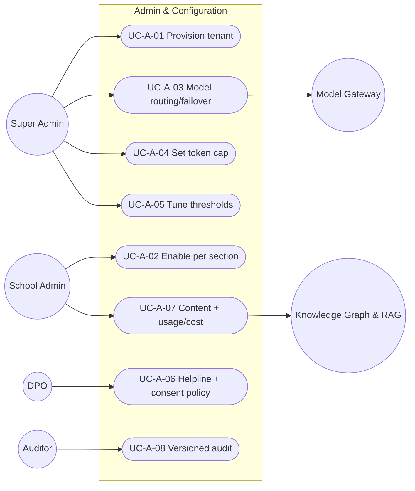

# MASTER SRS — P3 AI STUDENT COACH
## Part 5 (Use Cases) — Module 4.11: Admin & Configuration

*Layer 2 — Product & Functional · Standalone use-case document within the Part 5 set*

| Field | Value |
|---|---|
| Covers module | 4.11 — Admin & Configuration (AIC-FR-193–210) |
| Use-case range | UC-AIC-A-01 → UC-AIC-A-08 |
| Coverage | 1 use case per user story (US-AIC-A-01..08) |

---

## 5.11.1  Use-Case Diagram

*Actors:* primary — Super Admin, School Admin. Supporting — DPO, Auditor, Model Gateway, Knowledge Graph & RAG.

---

## 5.11.2  Use-Case Specifications

### UC-AIC-A-01 — Provision a tenant
| Field | Detail |
|---|---|
| Story / FRs | US-AIC-A-01 · AIC-FR-193 |
| Primary actor | Super Admin |
| Preconditions | Tenant school created in P1 |
| Main flow | 1. Super Admin enables P3, sets region + defaults. 2. Config versioned. |
| Alternate flows | A1: Region change later → re-consent gating where required (EC-AIC-A-06). |
| Exceptions | E1: Region unsupported → blocked. |
| Postconditions | Tenant configured for P3. |

### UC-AIC-A-02 — Enable P3 per section
| Field | Detail |
|---|---|
| Story / FRs | US-AIC-A-02 · AIC-FR-194 |
| Primary actor | School Admin |
| Preconditions | P3 provisioned for the school |
| Main flow | 1. School Admin enables/disables per grade/section. 2. Change applies to those students. |
| Alternate flows | A1: Disable with active sessions → end gracefully (BR-AIC-A-06). |
| Exceptions | E1: Cross-school attempt → denied. |
| Postconditions | Rollout controlled per section. |

### UC-AIC-A-03 — Configure model routing/failover
| Field | Detail |
|---|---|
| Story / FRs | US-AIC-A-03 · AIC-FR-195 |
| Primary actor | Super Admin |
| Preconditions | Provider keys held |
| Main flow | 1. Super Admin sets tier routing + failover order. 2. Applies to subsequent requests. |
| Alternate flows | A1: Provider outage → failover to next healthy provider (EC-AIC-A-01). |
| Exceptions | E1: Invalid key → rejected; not routed. |
| Postconditions | Availability and cost balanced. |

### UC-AIC-A-04 — Set token cap
| Field | Detail |
|---|---|
| Story / FRs | US-AIC-A-04 · AIC-FR-196 |
| Primary actor | Super Admin |
| Preconditions | Authorized |
| Main flow | 1. Super Admin sets per-student cap + throttle policy. 2. Enforced per policy. |
| Alternate flows | A1: Cap lowered below current usage → throttle to Tier B/C (EC-AIC-A-03). |
| Exceptions | E1: Cap = 0/below floor → rejected (BR-AIC-A-05). |
| Postconditions | Cost bounded. |

### UC-AIC-A-05 — Tune detection thresholds
| Field | Detail |
|---|---|
| Story / FRs | US-AIC-A-05 · AIC-FR-197 |
| Primary actor | Super Admin |
| Preconditions | Authorized |
| Main flow | 1. Super Admin sets similarity/relevance/confidence/volume/cooldown. 2. Owning modules apply them. |
| Alternate flows | A1: Concurrent edit → last-write-wins; both audited (EC-AIC-A-02). |
| Exceptions | E1: Out of range → rejected. |
| Postconditions | Integrity/quality balanced. |

### UC-AIC-A-06 — Manage helpline + consent policy
| Field | Detail |
|---|---|
| Story / FRs | US-AIC-A-06 · AIC-FR-199/202 |
| Primary actor | DPO / School Admin |
| Preconditions | Authorized; safety-critical approver role |
| Main flow | 1. DPO sets helpline registry + consent policy/jurisdiction/expiry. 2. Approver confirms. 3. Modules 4.5/4.10 enforce. |
| Alternate flows | A1: Helpline incomplete → save blocked. |
| Exceptions | E1: Without approver → held pending (BR-AIC-A-04). |
| Postconditions | Safe and compliant configuration in force. |

### UC-AIC-A-07 — Manage content and view usage/cost
| Field | Detail |
|---|---|
| Story / FRs | US-AIC-A-07 · AIC-FR-200/203 |
| Primary actor | School Admin |
| Preconditions | Authorized; school scope |
| Main flow | 1. Admin uploads content (license-gated via 4.7). 2. Reviews school usage + cost reports. |
| Alternate flows | A1: License revoked via console → content removed from index (EC-AIC-A-07). |
| Exceptions | E1: Unsupported format/oversize → rejected. |
| Postconditions | Curriculum reflected within budget. |

### UC-AIC-A-08 — Versioned audit of changes
| Field | Detail |
|---|---|
| Story / FRs | US-AIC-A-08 · AIC-FR-208/209 |
| Primary actor | Auditor |
| Preconditions | Audit access in scope |
| Main flow | 1. Auditor queries config changes. 2. Versioned entries with actor/before-after/timestamp returned. |
| Alternate flows | A1: Query beyond retention → out-of-window note. |
| Exceptions | E1: Out-of-scope query → denied. |
| Postconditions | Governance demonstrable. |

---

### Gate status — Part 5, Module 4.11
| Gate item | Status |
|---|---|
| Use-case diagram | Pass |
| Spec per story (full structure) | Pass — UC-AIC-A-01..08 |
| >=1 use case per story | Pass — 8 → 8 |
| >=1 alternate flow each | Pass |

---

## PART 5 — CLOSE-OUT (All Modules)

| Module | Use-Case Range | UCs |
|---|---|---|
| 4.1 Tutor Engine | UC-AIC-T-01..10 | 10 |
| 4.2 Homework Assistant | UC-AIC-H-01..08 | 8 |
| 4.3 Revision Coach | UC-AIC-R-01..09 | 9 |
| 4.4 Career Coach | UC-AIC-C-01..08 | 8 |
| 4.5 Wellbeing Coach | UC-AIC-W-01..08 | 8 |
| 4.6 Student Learning Profile | UC-AIC-P-01..07 | 7 |
| 4.7 Knowledge Graph & RAG | UC-AIC-K-01..07 | 7 |
| 4.8 Personalization & Recommendation | UC-AIC-N-01..08 | 8 |
| 4.9 Teacher Oversight | UC-AIC-O-01..07 | 7 |
| 4.10 Consent & Safety | UC-AIC-S-01..08 | 8 |
| 4.11 Admin & Configuration | UC-AIC-A-01..08 | 8 |
| **Total** | **11 modules** | **88 use cases** |

*Part 5 complete — Layer 2 (Parts 4 + 5) closed. Next: Layer 3 — Part 6 (UI/UX Specifications).*
