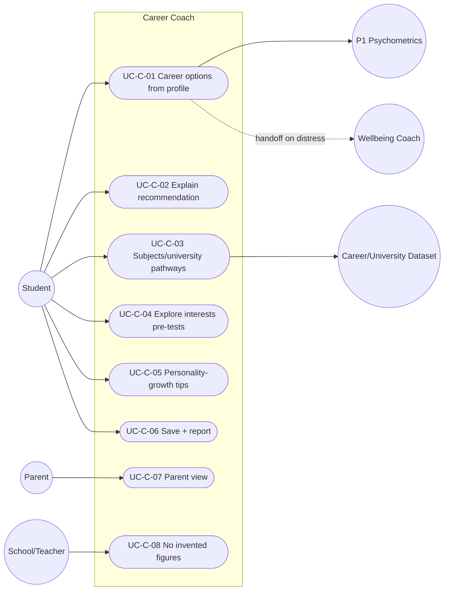

# MASTER SRS — P3 AI STUDENT COACH
## Part 5 (Use Cases) — Module 4.4: Career Coach

*Layer 2 — Product & Functional · Standalone use-case document within the Part 5 set*

| Field | Value |
|---|---|
| Covers module | 4.4 — Career Coach (AIC-FR-061–080) |
| Use-case range | UC-AIC-C-01 → UC-AIC-C-08 |
| Coverage | 1 use case per user story (US-AIC-C-01..08) |

---

## 5.4.1  Use-Case Diagram

*Actors:* primary — Student. Supporting — P1 Psychometrics (read-only), Career/University Dataset (G11), Wellbeing Coach (handoff), Parent (read), School/Teacher (assurance).

---

## 5.4.2  Use-Case Specifications

### UC-AIC-C-01 — Career options from profile
| Field | Detail |
|---|---|
| Story / FRs | US-AIC-C-01 · AIC-FR-061/062/063 |
| Primary actor | Student |
| Preconditions | Psychometrics present in P1; consent active |
| Main flow | 1. Student requests career guidance. 2. Module reads psychometrics read-only + performance + interests. 3. Ranked career options returned. |
| Alternate flows | A1: Psychometrics absent → interest exploration (UC-C-04). |
| Exceptions | E1: P1 read failure → fallback to interest mode; retry. |
| Postconditions | Options shown; no psychometric score recomputed (BR-AIC-C-01). |

### UC-AIC-C-02 — Explain a recommendation
| Field | Detail |
|---|---|
| Story / FRs | US-AIC-C-02 · AIC-FR-076 |
| Primary actor | Student |
| Preconditions | A recommendation exists |
| Main flow | 1. Student opens "why". 2. Module shows the profile factors that produced it. |
| Alternate flows | A1: Low-confidence factor → shown with a confidence caveat. |
| Exceptions | E1: Missing factor data → explanation notes the gap. |
| Postconditions | Student understands the basis. |

### UC-AIC-C-03 — Subject and university pathways
| Field | Detail |
|---|---|
| Story / FRs | US-AIC-C-03 · AIC-FR-066/067 |
| Primary actor | Student |
| Preconditions | A target career or interest |
| Main flow | 1. Student selects a target. 2. Module maps Cambridge subjects + entry requirements + >=1 university pathway from the dataset. |
| Alternate flows | A1: Multiple regions → student picks region scope. |
| Exceptions | E1: Unsupported region → data-not-available (BR-AIC-C-05). |
| Postconditions | Pathway with requirements shown. |

### UC-AIC-C-04 — Explore interests before tests
| Field | Detail |
|---|---|
| Story / FRs | US-AIC-C-04 · AIC-FR-069/075 |
| Primary actor | Student |
| Preconditions | Psychometrics may be absent |
| Main flow | 1. Module runs an interest-exploration conversation. 2. Suggests directions without profile-based matching. 3. Recommends taking the tests. |
| Alternate flows | A1: Psychometrics taken later → switch to profile matching (UC-C-01). |
| Exceptions | E1: Off-scope (visa/legal) → declined; redirect to academic pathway. |
| Postconditions | Student starts thinking about direction. |

### UC-AIC-C-05 — Personality-growth tips
| Field | Detail |
|---|---|
| Story / FRs | US-AIC-C-05 · AIC-FR-068 |
| Primary actor | Student |
| Preconditions | Psychometrics present |
| Main flow | 1. Student requests growth guidance. 2. Module gives actionable, non-clinical tips referencing specific dimensions. |
| Alternate flows | A1: Wellbeing concern surfaces → handoff to Wellbeing Coach (UC-C-... / BR-AIC-C-04). |
| Exceptions | E1: Stale psychometrics (>12mo) → recency note. |
| Postconditions | Growth suggestions delivered. |

### UC-AIC-C-06 — Save options and generate report
| Field | Detail |
|---|---|
| Story / FRs | US-AIC-C-06 · AIC-FR-070/071/072 |
| Primary actor | Student |
| Preconditions | Recommendations exist |
| Main flow | 1. Student bookmarks options. 2. Module writes recommendations to P1 (recommendations only). 3. Optional PDF report generated. |
| Alternate flows | A1: Writeback fails → cached + retried. |
| Exceptions | E1: Token cap → review of saved content only. |
| Postconditions | Options saved; report available. |

### UC-AIC-C-07 — Parent views recommendations
| Field | Detail |
|---|---|
| Story / FRs | US-AIC-C-07 · AIC-FR-079 |
| Primary actor | Parent |
| Preconditions | Parent linked to the child |
| Main flow | 1. Parent opens the child's recommendations read-only. |
| Alternate flows | A1: No recommendations yet → empty state. |
| Exceptions | E1: Not linked → access denied. |
| Postconditions | Parent informed; cannot edit or trigger writeback. |

### UC-AIC-C-08 — No invented figures
| Field | Detail |
|---|---|
| Story / FRs | US-AIC-C-08 · AIC-FR-065 |
| Primary actor | System (School assurance) |
| Preconditions | A quantitative claim is candidate output |
| Main flow | 1. Module checks the claim against the dataset. 2. Sourced → shown with reference. 3. Unsourced → withheld with a note. |
| Alternate flows | A1: Qualitative info still provided when figure withheld. |
| Exceptions | E1: Dataset unavailable → qualitative only. |
| Postconditions | No fabricated salary/outlook figure shown. |

---

### Gate status — Part 5, Module 4.4
| Gate item | Status |
|---|---|
| Use-case diagram | Pass |
| Spec per story (full structure) | Pass — UC-AIC-C-01..08 |
| >=1 use case per story | Pass — 8 → 8 |
| >=1 alternate flow each | Pass |

*Next: Module 4.5 (Wellbeing Coach) use cases.*
