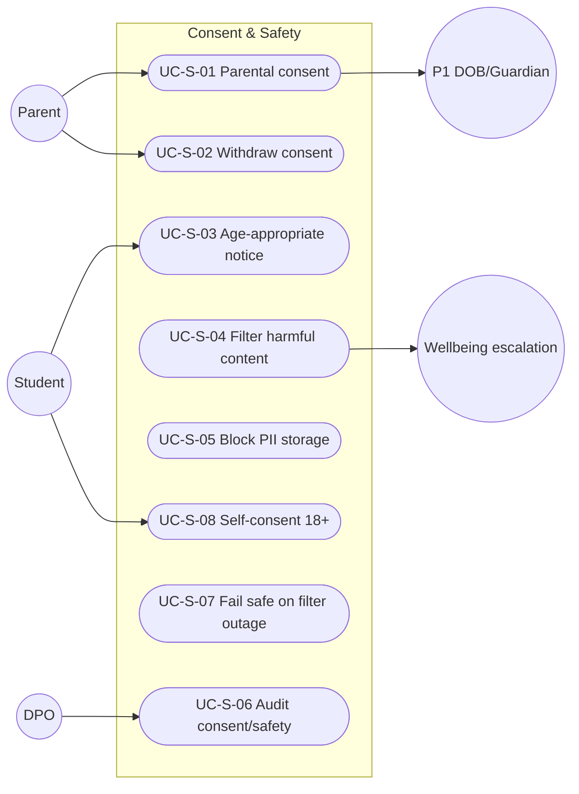

# MASTER SRS — P3 AI STUDENT COACH
## Part 5 (Use Cases) — Module 4.10: Consent & Safety

*Layer 2 — Product & Functional · Standalone use-case document within the Part 5 set*

| Field | Value |
|---|---|
| Covers module | 4.10 — Consent & Safety (AIC-FR-176–192) |
| Use-case range | UC-AIC-S-01 → UC-AIC-S-08 |
| Coverage | 1 use case per user story (US-AIC-S-01..08) |

---

## 5.10.1  Use-Case Diagram

*Actors:* primary — Parent, Student. Supporting — P1 (DOB/guardian link), Wellbeing escalation path, DPO.

---

## 5.10.2  Use-Case Specifications

### UC-AIC-S-01 — Give parental consent
| Field | Detail |
|---|---|
| Story / FRs | US-AIC-S-01 · AIC-FR-176/177/178 |
| Primary actor | Parent |
| Preconditions | Under-18 student onboarded; guardian linked in P1 |
| Main flow | 1. Activation requested. 2. Age computed from P1 DOB. 3. Guardian presented consent scope + notice. 4. Consent recorded; activation enabled. |
| Alternate flows | A1: Two guardians → either may consent. |
| Exceptions | E1: DOB missing → activation blocked; School Admin alerted. |
| Postconditions | Consent on record; student can start. |

### UC-AIC-S-02 — Withdraw consent
| Field | Detail |
|---|---|
| Story / FRs | US-AIC-S-02 · AIC-FR-180 |
| Primary actor | Parent |
| Preconditions | Active consent exists |
| Main flow | 1. Guardian withdraws. 2. Access suspended within window. 3. Audit written. |
| Alternate flows | A1: Either of two guardians withdraws → access suspended. |
| Exceptions | E1: Active session → ends gracefully (EC-AIC-S-02). |
| Postconditions | Access paused; reversible only by new consent. |

### UC-AIC-S-03 — Age-appropriate notice
| Field | Detail |
|---|---|
| Story / FRs | US-AIC-S-03 · AIC-FR-182 |
| Primary actor | Student |
| Preconditions | First activation |
| Main flow | 1. Student shown an age-appropriate notice in set language before first use. |
| Alternate flows | A1: Policy changed → re-notice on next entry. |
| Exceptions | E1: Notice undisplayable in set language → English fallback. |
| Postconditions | Student understands the coach's purpose. |

### UC-AIC-S-04 — Filter harmful content
| Field | Detail |
|---|---|
| Story / FRs | US-AIC-S-04 · AIC-FR-184/185 |
| Primary actor | System (Safety Service) |
| Preconditions | Any input/output processed |
| Main flow | 1. Input and output screened. 2. Clean content proceeds. 3. Disallowed content blocked. |
| Alternate flows | A1: Risk language → route to Wellbeing escalation (AIC-FR-188). |
| Exceptions | E1: Classifier outage → fail closed (UC-S-07). |
| Postconditions | No harmful content shown/stored. |

### UC-AIC-S-05 — Block PII storage
| Field | Detail |
|---|---|
| Story / FRs | US-AIC-S-05 · AIC-FR-186 |
| Primary actor | System |
| Preconditions | Student enters input |
| Main flow | 1. Financial/credential/ID detected. 2. Blocked/redacted; not stored or echoed; student warned. |
| Alternate flows | A1: Repeated attempts → surfaced to School Admin. |
| Exceptions | E1: Partial detection → conservative block. |
| Postconditions | Sensitive data not retained. |

### UC-AIC-S-06 — Audit consent and safety events
| Field | Detail |
|---|---|
| Story / FRs | US-AIC-S-06 · AIC-FR-189 |
| Primary actor | DPO |
| Preconditions | Audit access |
| Main flow | 1. DPO queries consent + safety events. 2. Immutable entries returned. |
| Alternate flows | A1: Export for compliance. |
| Exceptions | E1: Out-of-scope → denied. |
| Postconditions | Compliance demonstrable. |

### UC-AIC-S-07 — Fail safe on filter outage
| Field | Detail |
|---|---|
| Story / FRs | US-AIC-S-07 · AIC-FR-187 |
| Primary actor | System |
| Preconditions | Safety classifier degraded/unavailable |
| Main flow | 1. Outage detected. 2. Output blocked (fail closed). 3. Safe handling + ops alert. |
| Alternate flows | A1: Partial degradation → fail closed only for affected categories. |
| Exceptions | E1: Recovery → normal screening resumes. |
| Postconditions | No unscreened content ever shown. |

### UC-AIC-S-08 — Self-consent (18+)
| Field | Detail |
|---|---|
| Story / FRs | US-AIC-S-08 · AIC-FR-183 |
| Primary actor | Student (18+) |
| Preconditions | Age >=18 per P1 DOB |
| Main flow | 1. Student completes self-consent. 2. Activation enabled without guardian record. |
| Alternate flows | A1: Turns 18 mid-enrollment → self-consent path opens (EC-AIC-S-01). |
| Exceptions | E1: DOB indicates under-18 → guardian consent required. |
| Postconditions | Adult student activated. |

---

### Gate status — Part 5, Module 4.10
| Gate item | Status |
|---|---|
| Use-case diagram | Pass |
| Spec per story (full structure) | Pass — UC-AIC-S-01..08 |
| >=1 use case per story | Pass — 8 → 8 |
| >=1 alternate flow each | Pass |

*Next: Module 4.11 (Admin & Configuration) use cases.*
