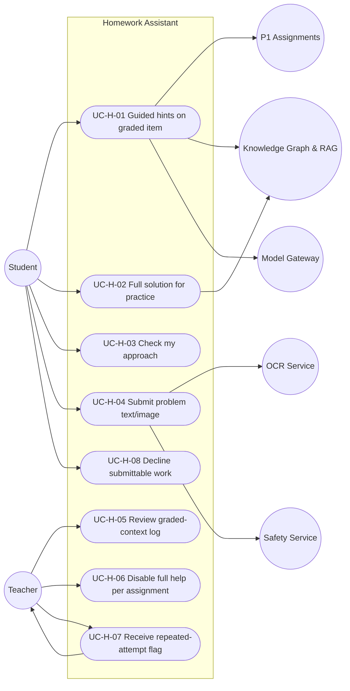

# MASTER SRS — P3 AI STUDENT COACH
## Part 5 (Use Cases) — Module 4.2: Homework Assistant

*Layer 2 — Product & Functional · Standalone use-case document within the Part 5 set*

| Field | Value |
|---|---|
| Product | P3 — AI Student Coach |
| Covers module | 4.2 — Homework Assistant (AIC-FR-021–040) |
| Version | 1.0 (Draft — Layer 2 in progress) |
| Classification | Internal — Consultant Use Only |
| Use-case range | UC-AIC-H-01 → UC-AIC-H-08 |
| Coverage | 1 use case per Homework Assistant user story (US-AIC-H-01..08) |

---

## 5.2.1  Use-Case Diagram

*Actors:* primary — Student, Teacher. Supporting — P1 Assignments, Knowledge Graph & RAG, OCR Service, Model Gateway, Safety Service.

---

## 5.2.2  Use-Case Specifications

### UC-AIC-H-01 — Get Guided hints on a graded item
| Field | Detail |
|---|---|
| Story / FRs | US-AIC-H-01 · AIC-FR-021/022/023/025/026 |
| Primary actor | Student |
| Preconditions | Student authenticated; an active graded assignment exists in P1 within its submission window |
| Main flow | 1. Student asks about the item. 2. Module queries P1 for assignment context and computes topic similarity. 3. Similarity >=0.85 and in-window → Guided mode selected. 4. Module returns hints / Socratic prompts / altered-value example, grounded on RAG. 5. Turn tagged Guided and logged for the teacher within 30s. |
| Alternate flows | A1: Submission window closed → Full-solution mode (UC-H-02). A2: Multiple matching items → highest-similarity in-window item governs (EC-AIC-H-07). |
| Exceptions | E1: P1 lookup unavailable → fail-safe to Guided (BR-AIC-H-01). E2: Direct-answer demand → hint only; increment attempt counter. E3: No grounded source → uncertainty (4.2.9). |
| Postconditions | Student receives integrity-preserving help; teacher log updated; exact answer never disclosed. |

### UC-AIC-H-02 — Get a full worked solution for practice
| Field | Detail |
|---|---|
| Story / FRs | US-AIC-H-02 · AIC-FR-024/027 |
| Primary actor | Student |
| Preconditions | The item is practice, non-graded, or a closed-window graded item |
| Main flow | 1. Student requests help on the item. 2. Module confirms non-graded/closed status via P1. 3. Full-solution mode returns a complete, step-by-step grounded solution. |
| Alternate flows | A1: Item is actually an open graded match → switch to Guided (UC-H-01). |
| Exceptions | E1: No grounded source → uncertainty, no fabrication. |
| Postconditions | Student receives a complete worked solution; no graded record affected. |

### UC-AIC-H-03 — Check my approach
| Field | Detail |
|---|---|
| Story / FRs | US-AIC-H-03 · AIC-FR-038 |
| Primary actor | Student |
| Preconditions | Student has an approach/working to submit |
| Main flow | 1. Student submits their method. 2. Module evaluates validity and identifies the first error step. 3. For a graded item, it points to the error without revealing the final answer. |
| Alternate flows | A1: Approach is correct → module confirms the method is sound and stops short of the graded answer. |
| Exceptions | E1: Approach text exceeds 4,000 chars → validation error (4.2.8). |
| Postconditions | Student learns where their method breaks down; integrity preserved. |

### UC-AIC-H-04 — Submit a problem by text or image
| Field | Detail |
|---|---|
| Story / FRs | US-AIC-H-04 · AIC-FR-034/037 |
| Primary actor | Student |
| Preconditions | Student is in the Homework Assistant |
| Main flow | 1. Student types the problem or uploads an image (<=10 MB JPG/PNG). 2. For an image, OCR extracts text and shows it for confirmation. 3. On confirmation, processing proceeds (UC-H-01/H-02). |
| Alternate flows | A1: Student edits extracted text before confirming. |
| Exceptions | E1: Image unreadable → prompt retype/clearer photo. E2: Image too large → reject (4.2.9). |
| Postconditions | Problem captured; image not retained beyond extraction (BR-AIC-H-05). |

### UC-AIC-H-05 — Review graded-context turn log
| Field | Detail |
|---|---|
| Story / FRs | US-AIC-H-05 · AIC-FR-028/029 |
| Primary actor | Teacher |
| Preconditions | Teacher assigned to the class; graded-context turns exist |
| Main flow | 1. Teacher opens the log (via 4.9 console). 2. Each turn shows student, item, timestamp, and mode tag. 3. Teacher reviews entries. |
| Alternate flows | A1: Teacher filters by student/assignment/date (AIC-FR-169). |
| Exceptions | E1: Teacher not assigned to the class → access denied (BR-AIC-O-01). |
| Postconditions | Teacher has verified integrity; logs remain immutable. |

### UC-AIC-H-06 — Disable full help per assignment
| Field | Detail |
|---|---|
| Story / FRs | US-AIC-H-06 · AIC-FR-031 |
| Primary actor | Teacher |
| Preconditions | Teacher assigned to the class; assignment exists |
| Main flow | 1. Teacher disables full help on the assignment. 2. Setting propagates within 30s. 3. Subsequent matching queries return the disabled-state message. |
| Alternate flows | A1: Teacher later re-enables → behaviour restored within 30s. |
| Exceptions | E1: Propagation delay → pending state shown; alert if unresolved. |
| Postconditions | Item-specific help is blocked; action audited. |

### UC-AIC-H-07 — Receive repeated-attempt flag
| Field | Detail |
|---|---|
| Story / FRs | US-AIC-H-07 · AIC-FR-036 |
| Primary actor | Teacher (System raises) |
| Preconditions | A graded item is in window |
| Main flow | 1. Student makes >=3 direct-answer attempts on the same item in a session. 2. Module raises a flag with turn references. 3. Teacher receives the flag in the queue. |
| Alternate flows | A1: Teacher acknowledges with a note (UC in 4.9). |
| Exceptions | E1: Notification channel unavailable → flag still visible in queue. |
| Postconditions | Teacher is informed; Guided mode continues. |

### UC-AIC-H-08 — Decline to produce submittable graded work
| Field | Detail |
|---|---|
| Story / FRs | US-AIC-H-08 · AIC-FR-030 |
| Primary actor | Student (System enforces) |
| Preconditions | An active graded item exists |
| Main flow | 1. Student requests the module write/finish/rewrite the work for submission. 2. Module declines and offers to teach the concept. 3. No submittable artifact is produced. |
| Alternate flows | A1: Student reframes as "practice" but it matches an active graded item → decline holds (BR-AIC-H-03). |
| Exceptions | E1: Pasted third-party work → module declines to process it as submittable (EC-AIC-H-09). |
| Postconditions | No graded artifact produced; teaching offered; attempt logged. |

---

### Layer 2 gate status — Part 5, Module 4.2 (Homework Assistant Use Cases)

| Gate item | Status |
|---|---|
| Use-case diagram present | Pass — Student + Teacher + supporting systems + 8 use cases |
| Use-case specification per story | Pass — UC-AIC-H-01..08 (full structure) |
| Minimum 1 use case per user story | Pass — 8 stories → 8 use cases |
| At least one alternate flow per use case | Pass — every UC has >=1 alternate flow |

*Next: Part 5 — Module 4.3 (Revision Coach) use cases, UC-AIC-R-01 onward.*
