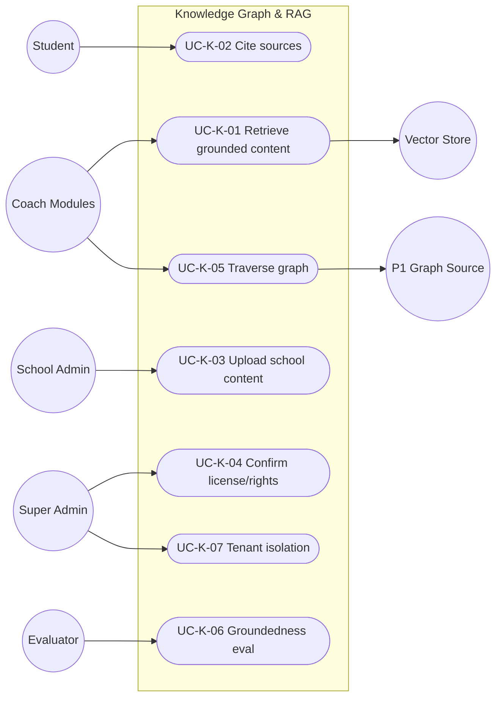

# MASTER SRS — P3 AI STUDENT COACH
## Part 5 (Use Cases) — Module 4.7: Knowledge Graph & RAG

*Layer 2 — Product & Functional · Standalone use-case document within the Part 5 set*

| Field | Value |
|---|---|
| Covers module | 4.7 — Knowledge Graph & RAG (AIC-FR-121–140) |
| Use-case range | UC-AIC-K-01 → UC-AIC-K-07 |
| Coverage | 1 use case per user story (US-AIC-K-01..07) |

---

## 5.7.1  Use-Case Diagram

*Actors:* primary — Coach Modules (system). Supporting — Student, School Admin, Super Admin, Evaluator, Vector Store, P1 graph source.

---

## 5.7.2  Use-Case Specifications

### UC-AIC-K-01 — Retrieve grounded content
| Field | Detail |
|---|---|
| Story / FRs | US-AIC-K-01 · AIC-FR-127/130/138 |
| Primary actor | Coach Module (system) |
| Preconditions | Tenant corpus indexed; student stage known |
| Main flow | 1. Module requests retrieval with student scope. 2. Semantic search over tenant/stage corpus. 3. Chunks above threshold returned. |
| Alternate flows | A1: Multilingual mismatch → translate + cite original (EC-AIC-K-01). |
| Exceptions | E1: Below threshold → uncertainty signal (AIC-FR-128). E2: Vector store down → cached/last-good or uncertainty. |
| Postconditions | Grounded, in-scope chunks returned. |

### UC-AIC-K-02 — Cite sources
| Field | Detail |
|---|---|
| Story / FRs | US-AIC-K-02 · AIC-FR-129 |
| Primary actor | Student |
| Preconditions | Response uses corpus content |
| Main flow | 1. Each corpus-derived claim carries >=1 resolvable reference. 2. Student opens a reference. |
| Alternate flows | A1: Conflicting sources → discrepancy note + lowered confidence. |
| Exceptions | E1: No qualifying source → no citation; uncertainty stated. |
| Postconditions | Student can verify content. |

### UC-AIC-K-03 — Upload school content
| Field | Detail |
|---|---|
| Story / FRs | US-AIC-K-03 · AIC-FR-124 |
| Primary actor | School Admin |
| Preconditions | Authorized; supported format |
| Main flow | 1. Admin uploads content + metadata (stage/subject/language). 2. Content staged pending license confirmation. |
| Alternate flows | A1: Reupload/replace existing → versioned. |
| Exceptions | E1: Unsupported format / >100 MB → rejected. E2: Unsafe content → quarantined. |
| Postconditions | Content staged, not yet retrievable. |

### UC-AIC-K-04 — Confirm license/rights
| Field | Detail |
|---|---|
| Story / FRs | US-AIC-K-04 · AIC-FR-125 |
| Primary actor | Super Admin |
| Preconditions | Staged content exists |
| Main flow | 1. Super Admin confirms license/rights. 2. Content indexed within the reindex window; becomes retrievable. |
| Alternate flows | A1: Rights later revoked → removed from index (BR-AIC-K-06). |
| Exceptions | E1: No confirmation → content not indexed (BR-AIC-K-01). |
| Postconditions | Only licensed content is retrievable. |

### UC-AIC-K-05 — Traverse the knowledge graph
| Field | Detail |
|---|---|
| Story / FRs | US-AIC-K-05 · AIC-FR-121/122/123 |
| Primary actor | Coach Module (system) |
| Preconditions | Graph synced from P1 |
| Main flow | 1. Module issues a traversal (e.g., Topic → Objectives → Assessments). 2. Linked nodes returned. |
| Alternate flows | A1: Missing node (sync drop) → fall back to parent-topic scope (EC-AIC-K-06). |
| Exceptions | E1: Graph unavailable → degrade to corpus-only retrieval. |
| Postconditions | Personalization/recommendation inputs available. |

### UC-AIC-K-06 — Groundedness evaluation
| Field | Detail |
|---|---|
| Story / FRs | US-AIC-K-06 · AIC-FR-137 |
| Primary actor | Evaluator |
| Preconditions | Responses logged with groundedness signal |
| Main flow | 1. Evaluator reads per-response groundedness. 2. Aggregates against KPI-AIC-09/10. |
| Alternate flows | A1: Sampled human review of low-groundedness responses. |
| Exceptions | E1: Missing signal → flagged for instrumentation fix. |
| Postconditions | Groundedness/hallucination tracked. |

### UC-AIC-K-07 — Tenant isolation
| Field | Detail |
|---|---|
| Story / FRs | US-AIC-K-07 · AIC-FR-131 |
| Primary actor | Super Admin (assurance) |
| Preconditions | Multiple tenants |
| Main flow | 1. A retrieval scoped to Tenant A queries only Tenant A's corpus/graph. |
| Alternate flows | A1: Identical content in two tenants → indexed separately, no sharing. |
| Exceptions | E1: Cross-tenant attempt → denied; security event raised. |
| Postconditions | No cross-tenant leakage. |

---

### Gate status — Part 5, Module 4.7
| Gate item | Status |
|---|---|
| Use-case diagram | Pass |
| Spec per story (full structure) | Pass — UC-AIC-K-01..07 |
| >=1 use case per story | Pass — 7 → 7 |
| >=1 alternate flow each | Pass |

*Next: Module 4.8 (Personalization & Recommendation) use cases.*
