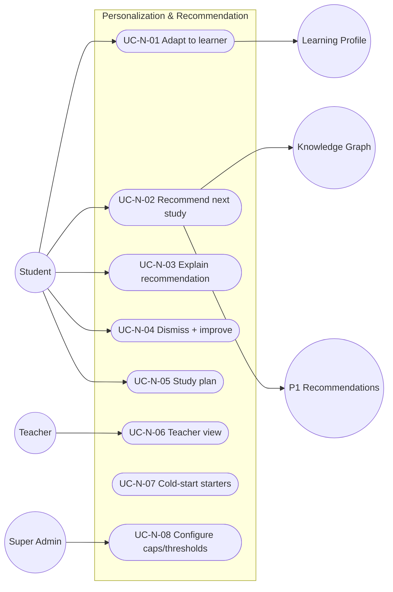

# MASTER SRS — P3 AI STUDENT COACH
## Part 5 (Use Cases) — Module 4.8: Personalization & Recommendation Engine

*Layer 2 — Product & Functional · Standalone use-case document within the Part 5 set*

| Field | Value |
|---|---|
| Covers module | 4.8 — Personalization & Recommendation (AIC-FR-141–160) |
| Use-case range | UC-AIC-N-01 → UC-AIC-N-08 |
| Coverage | 1 use case per user story (US-AIC-N-01..08) |

---

## 5.8.1  Use-Case Diagram

*Actors:* primary — Student. Supporting — Learning Profile, Knowledge Graph, P1 (recommendation writeback), Teacher, Super Admin.

---

## 5.8.2  Use-Case Specifications

### UC-AIC-N-01 — Adapt to the learner
| Field | Detail |
|---|---|
| Story / FRs | US-AIC-N-01 · AIC-FR-141 |
| Primary actor | Student |
| Preconditions | Profile available with sufficient confidence |
| Main flow | 1. Engine reads profile. 2. Tutoring depth/style/pace adapt. |
| Alternate flows | A1: Preference changed → subsequent responses reflect it. |
| Exceptions | E1: Below confidence threshold → stage default (BR-AIC-N-03). |
| Postconditions | Responses fit the student. |

### UC-AIC-N-02 — Recommend next study
| Field | Detail |
|---|---|
| Story / FRs | US-AIC-N-02 · AIC-FR-142/143 |
| Primary actor | Student |
| Preconditions | Profile + graph available |
| Main flow | 1. Engine produces next-best topic + revision items within stage. 2. Recommendations written to P1. |
| Alternate flows | A1: Writeback fails → cached + retried. |
| Exceptions | E1: Out-of-stage candidate → blocked (BR-AIC-N-01). |
| Postconditions | Student has a next step. |

### UC-AIC-N-03 — Explain a recommendation
| Field | Detail |
|---|---|
| Story / FRs | US-AIC-N-03 · AIC-FR-147 |
| Primary actor | Student |
| Preconditions | A recommendation exists |
| Main flow | 1. Student opens "why". 2. Engine shows the signal that produced it. |
| Alternate flows | A1: Low-confidence basis → caveat shown. |
| Exceptions | E1: Missing signal → generic stage rationale. |
| Postconditions | Student trusts the recommendation. |

### UC-AIC-N-04 — Dismiss and improve
| Field | Detail |
|---|---|
| Story / FRs | US-AIC-N-04 · AIC-FR-148 |
| Primary actor | Student |
| Preconditions | A recommendation is shown |
| Main flow | 1. Student dismisses with optional reason. 2. Item deprioritized for cooldown; future set adjusts. |
| Alternate flows | A1: Student dismisses everything → engine diversifies sources (EC-AIC-N-03). |
| Exceptions | E1: Reason >300 chars → validation error. |
| Postconditions | Recommendations become more relevant. |

### UC-AIC-N-05 — Generate a study plan
| Field | Detail |
|---|---|
| Story / FRs | US-AIC-N-05 · AIC-FR-145 |
| Primary actor | Student |
| Preconditions | In-stage scope; horizon set (1–90 days) |
| Main flow | 1. Student requests a plan. 2. Engine returns an ordered topic sequence with target dates. |
| Alternate flows | A1: Plan beyond stage → limited to in-stage topics. |
| Exceptions | E1: Horizon out of range → validation error. |
| Postconditions | Student has a clear path. |

### UC-AIC-N-06 — Teacher views recommendations
| Field | Detail |
|---|---|
| Story / FRs | US-AIC-N-06 · AIC-FR-156 |
| Primary actor | Teacher |
| Preconditions | Teacher assigned to the student's class |
| Main flow | 1. Teacher opens a student's recommendations read-only. |
| Alternate flows | A1: None yet → empty state. |
| Exceptions | E1: Not assigned → access denied. |
| Postconditions | Teacher aligns support. |

### UC-AIC-N-07 — Cold-start starters
| Field | Detail |
|---|---|
| Story / FRs | US-AIC-N-07 · AIC-FR-149 |
| Primary actor | Student (new) |
| Preconditions | No interaction history |
| Main flow | 1. Engine serves stage-default recommendations at low confidence. 2. Refines as data accrues. |
| Alternate flows | A1: Early signals raise confidence → personalization begins. |
| Exceptions | E1: Profile store down → general suggestions. |
| Postconditions | New student is not stuck. |

### UC-AIC-N-08 — Configure caps/thresholds
| Field | Detail |
|---|---|
| Story / FRs | US-AIC-N-08 · AIC-FR-152/153 |
| Primary actor | Super Admin |
| Preconditions | Authorized |
| Main flow | 1. Super Admin sets volume cap, confidence threshold, cooldown. 2. Engine enforces them next cycle. |
| Alternate flows | A1: Value out of range → rejected. |
| Exceptions | E1: Unauthorized → denied. |
| Postconditions | Quality/fatigue controlled. |

---

### Gate status — Part 5, Module 4.8
| Gate item | Status |
|---|---|
| Use-case diagram | Pass |
| Spec per story (full structure) | Pass — UC-AIC-N-01..08 |
| >=1 use case per story | Pass — 8 → 8 |
| >=1 alternate flow each | Pass |

*Next: Module 4.9 (Teacher Oversight) use cases.*
