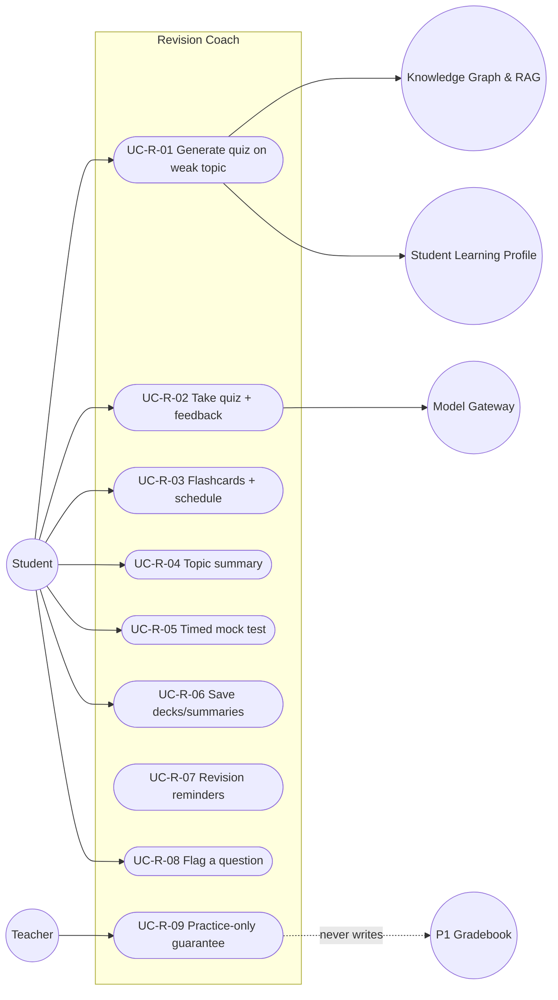

# MASTER SRS — P3 AI STUDENT COACH
## Part 5 (Use Cases) — Module 4.3: Revision Coach

*Layer 2 — Product & Functional · Standalone use-case document within the Part 5 set*

| Field | Value |
|---|---|
| Covers module | 4.3 — Revision Coach (AIC-FR-041–060) |
| Use-case range | UC-AIC-R-01 → UC-AIC-R-09 |
| Coverage | 1 use case per user story (US-AIC-R-01..09) |

---

## 5.3.1  Use-Case Diagram

*Actors:* primary — Student. Supporting — Knowledge Graph & RAG, Student Learning Profile, Model Gateway, P1 Gradebook (negative dependency — never written), Teacher (assurance).

---

## 5.3.2  Use-Case Specifications

### UC-AIC-R-01 — Generate a quiz on a weak topic
| Field | Detail |
|---|---|
| Story / FRs | US-AIC-R-01 · AIC-FR-041/043/057 |
| Primary actor | Student |
| Preconditions | Student authenticated; consent active; in-stage topic |
| Main flow | 1. Student names a topic or selects a weak topic. 2. Module confirms the topic is in-stage syllabus. 3. RAG-grounded items generated; difficulty set from profile. 4. Quiz presented. |
| Alternate flows | A1: New student, no weak data → stage-core topics used (EC-AIC-R-01). |
| Exceptions | E1: Out-of-syllabus topic → declined with alternatives. E2: No corpus content → suppressed. |
| Postconditions | A practice quiz exists within stage scope. |

### UC-AIC-R-02 — Take a quiz and receive feedback
| Field | Detail |
|---|---|
| Story / FRs | US-AIC-R-02 · AIC-FR-044/056 |
| Primary actor | Student |
| Preconditions | A generated quiz exists |
| Main flow | 1. Student answers. 2. Objective items auto-scored on submit. 3. Per-question feedback shown. 4. Answer-review with explanations available. |
| Alternate flows | A1: Student exits mid-quiz → progress saved; resumable. |
| Exceptions | E1: Generation/provider error mid-quiz → retry; saved answers preserved. |
| Postconditions | Score + feedback recorded as practice; performance feeds profile; nothing written to P1 (UC-R-09). |

### UC-AIC-R-03 — Create flashcards on a schedule
| Field | Detail |
|---|---|
| Story / FRs | US-AIC-R-03 · AIC-FR-046/047 |
| Primary actor | Student |
| Preconditions | In-stage topic/weak set |
| Main flow | 1. Student requests a deck. 2. Cards generated (front/back). 3. Spaced-repetition schedule applied. 4. Due cards resurface on/after due date. |
| Alternate flows | A1: Very large deck → capped; offered in batches (EC-AIC-R-07). |
| Exceptions | E1: No corpus content → suppressed. |
| Postconditions | Deck created and scheduled. |

### UC-AIC-R-04 — Get a topic summary
| Field | Detail |
|---|---|
| Story / FRs | US-AIC-R-04 · AIC-FR-048/049 |
| Primary actor | Student |
| Preconditions | In-stage topic |
| Main flow | 1. Student requests a summary. 2. Module returns a <=400-word grounded summary with >=1 source. |
| Alternate flows | A1: Student requests extended version → longer summary (BR-AIC-R-07 exception). |
| Exceptions | E1: No qualifying source → uncertainty. |
| Postconditions | Summary delivered with sources. |

### UC-AIC-R-05 — Take a timed mock test
| Field | Detail |
|---|---|
| Story / FRs | US-AIC-R-05 · AIC-FR-051 |
| Primary actor | Student |
| Preconditions | In-stage scope; duration set (5–180 min) |
| Main flow | 1. Student starts the timed test. 2. Timer enforced; answers auto-saved every 30s. 3. Auto-submit at expiry; results shown. |
| Alternate flows | A1: Connection lost → answers saved; resume on reconnect (EC-AIC-R-05). |
| Exceptions | E1: Duration out of range → validation error. |
| Postconditions | Practice result recorded; not a graded record. |

### UC-AIC-R-06 — Save and organize decks/summaries
| Field | Detail |
|---|---|
| Story / FRs | US-AIC-R-06 · AIC-FR-052/060 |
| Primary actor | Student |
| Preconditions | A deck/summary exists |
| Main flow | 1. Student saves with a name. 2. Item stored under the student's account. 3. Optional PDF export. |
| Alternate flows | A1: Duplicate name → prompt rename or auto-suffix. |
| Exceptions | E1: Name >100 chars → validation error. |
| Postconditions | Item retrievable by the owning student only. |

### UC-AIC-R-07 — Receive revision reminders
| Field | Detail |
|---|---|
| Story / FRs | US-AIC-R-07 · AIC-FR-053 |
| Primary actor | Student |
| Preconditions | Spaced-repetition items scheduled |
| Main flow | 1. Items become due. 2. Reminder sent on chosen channel, capped at 2/day. |
| Alternate flows | A1: Student inactive for days → backlog consolidated; cap holds (EC-AIC-R-04). |
| Exceptions | E1: Channel = none → no reminder sent. |
| Postconditions | Student is prompted to revise within cap. |

### UC-AIC-R-08 — Flag a question
| Field | Detail |
|---|---|
| Story / FRs | US-AIC-R-08 · AIC-FR-059 |
| Primary actor | Student |
| Preconditions | A generated question is shown |
| Main flow | 1. Student flags it with a reason. 2. Item recorded and excluded from the student's next generation on that topic. |
| Alternate flows | A1: Flagged by >=3 students → withheld pending review (BR-AIC-R-05). |
| Exceptions | E1: Reason >300 chars → validation error. |
| Postconditions | Flag recorded; quality loop updated. |

### UC-AIC-R-09 — Practice-only guarantee
| Field | Detail |
|---|---|
| Story / FRs | US-AIC-R-09 · AIC-FR-045 |
| Primary actor | System (Teacher/School assurance) |
| Preconditions | Any revision activity |
| Main flow | 1. Revision results are marked practice. 2. No result is written to the P1 gradebook. |
| Alternate flows | A1: Performance feeds the profile (4.6) but not the gradebook. |
| Exceptions | E1: Attempted write to P1 gradebook → blocked (BR-AIC-R-01). |
| Postconditions | Gradebook integrity preserved. |

---

### Gate status — Part 5, Module 4.3
| Gate item | Status |
|---|---|
| Use-case diagram | Pass |
| Spec per story (full structure) | Pass — UC-AIC-R-01..09 |
| >=1 use case per story | Pass — 9 → 9 |
| >=1 alternate flow each | Pass |

*Next: Module 4.4 (Career Coach) use cases.*
