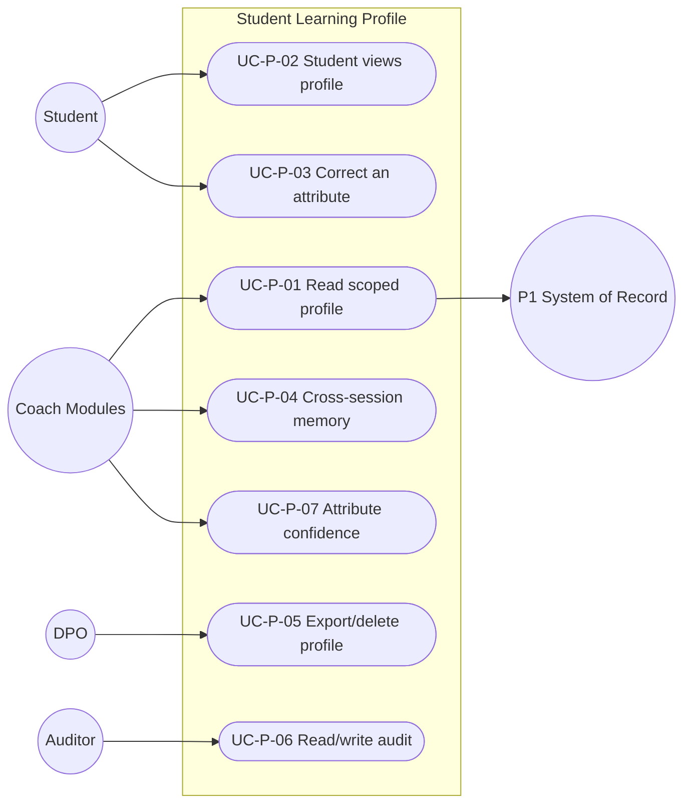

# MASTER SRS — P3 AI STUDENT COACH
## Part 5 (Use Cases) — Module 4.6: Student Learning Profile

*Layer 2 — Product & Functional · Standalone use-case document within the Part 5 set*

| Field | Value |
|---|---|
| Covers module | 4.6 — Student Learning Profile (AIC-FR-101–120) |
| Use-case range | UC-AIC-P-01 → UC-AIC-P-07 |
| Coverage | 1 use case per user story (US-AIC-P-01..07) |

---

## 5.6.1  Use-Case Diagram

*Actors:* primary — Coach Modules (system), Student. Supporting — P1 (system of record), DPO, Auditor.

---

## 5.6.2  Use-Case Specifications

### UC-AIC-P-01 — Read a scoped profile
| Field | Detail |
|---|---|
| Story / FRs | US-AIC-P-01 · AIC-FR-104/119 |
| Primary actor | Coach Module (system) |
| Preconditions | Caller authenticated with a scope |
| Main flow | 1. Module requests the profile with its scope. 2. Only scoped fields returned. 3. Read logged. |
| Alternate flows | A1: Personalization engine requests recommendation inputs → graph-linked fields included. |
| Exceptions | E1: Out-of-scope field requested → omitted. |
| Postconditions | Caller gets only permitted fields; read audited. |

### UC-AIC-P-02 — Student views their profile
| Field | Detail |
|---|---|
| Story / FRs | US-AIC-P-02 · AIC-FR-110 |
| Primary actor | Student |
| Preconditions | Authenticated student |
| Main flow | 1. Student opens profile. 2. Derived attributes + preferences shown. |
| Alternate flows | A1: Low-confidence attributes shown with caveat. |
| Exceptions | E1: Profile empty (new) → friendly empty state. |
| Postconditions | Student sees what the coach has learned. |

### UC-AIC-P-03 — Correct an inferred attribute
| Field | Detail |
|---|---|
| Story / FRs | US-AIC-P-03 · AIC-FR-111 |
| Primary actor | Student |
| Preconditions | An inferred attribute exists |
| Main flow | 1. Student submits a correction. 2. Attribute marked student-corrected; adaptation adjusts. 3. Audit + history written. |
| Alternate flows | A1: System keeps re-inferring → correction holds until higher-confidence evidence (BR-AIC-P-02). |
| Exceptions | E1: Empty/invalid request → rejected. |
| Postconditions | Correction applied and retained in history. |

### UC-AIC-P-04 — Continue via cross-session memory
| Field | Detail |
|---|---|
| Story / FRs | US-AIC-P-04 · AIC-FR-108 |
| Primary actor | Coach Module (system) |
| Preconditions | Student has prior history |
| Main flow | 1. Memory key resolved. 2. Prior weak topics/preferences recalled. |
| Alternate flows | A1: Two devices → last-write-wins with history (BR-AIC-P-03). |
| Exceptions | E1: Store unavailable → cached/last-known marked stale. |
| Postconditions | Continuity preserved. |

### UC-AIC-P-05 — Export or delete a profile
| Field | Detail |
|---|---|
| Story / FRs | US-AIC-P-05 · AIC-FR-112/116 |
| Primary actor | DPO (School Admin scope) |
| Preconditions | Authorized data-rights request |
| Main flow | 1. Authorized export → portable file. 2. Deletion → P3-derived data removed/anonymized within window; P1 untouched. |
| Alternate flows | A1: Parent requests child deletion → routed through School Admin/DPO. |
| Exceptions | E1: Unauthorized → denied + logged. |
| Postconditions | Data right fulfilled; audit written. |

### UC-AIC-P-06 — Audit profile reads/writes
| Field | Detail |
|---|---|
| Story / FRs | US-AIC-P-06 · AIC-FR-120 |
| Primary actor | Auditor |
| Preconditions | Audit access in scope |
| Main flow | 1. Auditor queries the log. 2. Entries show actor/fields/timestamp/purpose. |
| Alternate flows | A1: Query beyond retention → out-of-window note. |
| Exceptions | E1: Out-of-scope query → denied. |
| Postconditions | Access is accountable. |

### UC-AIC-P-07 — Use attribute confidence
| Field | Detail |
|---|---|
| Story / FRs | US-AIC-P-07 · AIC-FR-107 |
| Primary actor | Coach Module (system) |
| Preconditions | Inferred attributes exist |
| Main flow | 1. Module reads attribute + confidence (0–1). 2. Module weights or filters by confidence. |
| Alternate flows | A1: Below consumer threshold → fall back to stage default. |
| Exceptions | E1: Missing confidence → treated as lowest. |
| Postconditions | Consumers weight attributes appropriately. |

---

### Gate status — Part 5, Module 4.6
| Gate item | Status |
|---|---|
| Use-case diagram | Pass |
| Spec per story (full structure) | Pass — UC-AIC-P-01..07 |
| >=1 use case per story | Pass — 7 → 7 |
| >=1 alternate flow each | Pass |

*Next: Module 4.7 (Knowledge Graph & RAG) use cases.*
