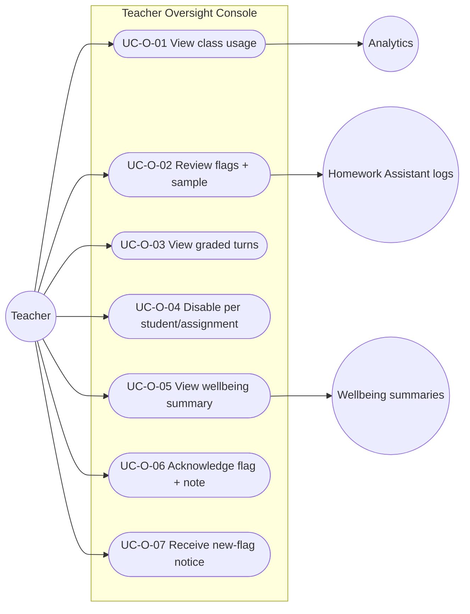

# MASTER SRS — P3 AI STUDENT COACH
## Part 5 (Use Cases) — Module 4.9: Teacher Oversight Console

*Layer 2 — Product & Functional · Standalone use-case document within the Part 5 set*

| Field | Value |
|---|---|
| Covers module | 4.9 — Teacher Oversight Console (AIC-FR-161–175) |
| Use-case range | UC-AIC-O-01 → UC-AIC-O-07 |
| Coverage | 1 use case per user story (US-AIC-O-01..07) |

---

## 5.9.1  Use-Case Diagram

*Actors:* primary — Teacher. Supporting — Homework Assistant logs (4.2), Wellbeing summaries (4.5), Analytics.

---

## 5.9.2  Use-Case Specifications

### UC-AIC-O-01 — View class usage
| Field | Detail |
|---|---|
| Story / FRs | US-AIC-O-01 · AIC-FR-161/172 |
| Primary actor | Teacher |
| Preconditions | Teacher assigned to class |
| Main flow | 1. Teacher opens dashboard. 2. Per-class/per-student usage shown for assigned classes only. |
| Alternate flows | A1: Filter by section/date. |
| Exceptions | E1: No data → empty state. |
| Postconditions | Teacher understands engagement. |

### UC-AIC-O-02 — Review flags and sample transcripts
| Field | Detail |
|---|---|
| Story / FRs | US-AIC-O-02 · AIC-FR-162/163 |
| Primary actor | Teacher |
| Preconditions | Graded-context activity exists |
| Main flow | 1. Teacher opens the flag queue. 2. Reviews 100% flagged + >=5% random sample. |
| Alternate flows | A1: Filter by flag type/student. |
| Exceptions | E1: Large queue → newest-first pagination. |
| Postconditions | Integrity reviewed efficiently. |

### UC-AIC-O-03 — View graded-context turns
| Field | Detail |
|---|---|
| Story / FRs | US-AIC-O-03 · AIC-FR-164 |
| Primary actor | Teacher |
| Preconditions | Graded turns logged |
| Main flow | 1. Teacher opens the turn log. 2. Each turn shows mode tag (Guided/Full-solution). |
| Alternate flows | A1: Drill into a specific student/item. |
| Exceptions | E1: Item beyond retention → shown anonymized. |
| Postconditions | Teacher trusts integrity controls. |

### UC-AIC-O-04 — Disable per student/assignment
| Field | Detail |
|---|---|
| Story / FRs | US-AIC-O-04 · AIC-FR-165/166 |
| Primary actor | Teacher |
| Preconditions | Teacher assigned to class |
| Main flow | 1. Teacher disables coach for a student or full help for an assignment. 2. Propagates within 30s. |
| Alternate flows | A1: Re-enable later → restored within 30s. |
| Exceptions | E1: Admin override conflict → most recent authorized action wins; both audited (EC-AIC-O-02). |
| Postconditions | Control applied; audited. |

### UC-AIC-O-05 — View wellbeing summary
| Field | Detail |
|---|---|
| Story / FRs | US-AIC-O-05 · AIC-FR-167 |
| Primary actor | Teacher |
| Preconditions | Class wellbeing alert exists |
| Main flow | 1. Teacher views class-level summary alerts. |
| Alternate flows | A1: Alert for non-class student → not shown to this teacher. |
| Exceptions | E1: Attempt to open confidential detail → denied (BR-AIC-O-02). |
| Postconditions | Teacher aware; confidentiality preserved. |

### UC-AIC-O-06 — Acknowledge a flag with a note
| Field | Detail |
|---|---|
| Story / FRs | US-AIC-O-06 · AIC-FR-168 |
| Primary actor | Teacher |
| Preconditions | An open flag exists |
| Main flow | 1. Teacher acknowledges with a note. 2. Teacher/timestamp/note recorded. |
| Alternate flows | A1: Co-teacher acknowledges → attributed to the acting teacher. |
| Exceptions | E1: Empty note → blocked. |
| Postconditions | Record retained immutably. |

### UC-AIC-O-07 — Receive a new-flag notice
| Field | Detail |
|---|---|
| Story / FRs | US-AIC-O-07 · AIC-FR-170 |
| Primary actor | Teacher |
| Preconditions | Notification channel set |
| Main flow | 1. New flag raised. 2. Notification sent on chosen channel. |
| Alternate flows | A1: Channel unavailable → flag still visible in queue. |
| Exceptions | E1: Channel = none → no push; queue only. |
| Postconditions | Teacher acts promptly. |

---

### Gate status — Part 5, Module 4.9
| Gate item | Status |
|---|---|
| Use-case diagram | Pass |
| Spec per story (full structure) | Pass — UC-AIC-O-01..07 |
| >=1 use case per story | Pass — 7 → 7 |
| >=1 alternate flow each | Pass |

*Next: Module 4.10 (Consent & Safety) use cases.*
