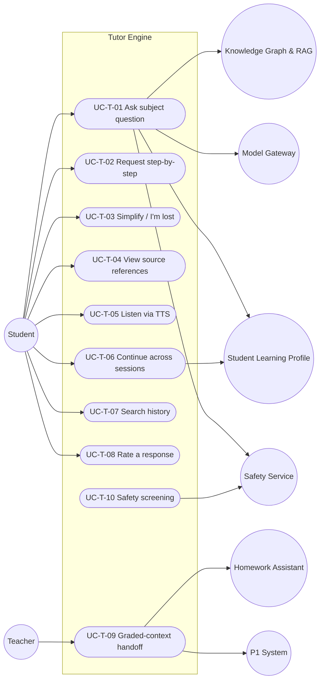

# MASTER SRS — P3 AI STUDENT COACH
## Part 5 (Use Cases) — Module 4.1: Tutor Engine

*Layer 2 — Product & Functional · Standalone use-case document within the Part 5 set*

| Field | Value |
|---|---|
| Product | P3 — AI Student Coach |
| Covers module | 4.1 — Tutor Engine (AIC-FR-001–020) |
| Version | 1.0 (Draft — Layer 2 in progress) |
| Classification | Internal — Consultant Use Only |
| Use-case range | UC-AIC-T-01 → UC-AIC-T-10 |
| Coverage | 1 use case per Tutor Engine user story (US-AIC-T-01..10) |

---

## 5.1.1  Use-Case Diagram

*Actors:* primary — Student. Secondary/supporting — P1 System, Knowledge Graph & RAG, Model Gateway, Safety Service, Homework Assistant, Student Learning Profile, Teacher (oversight of graded-context turns).

---

## 5.1.2  Use-Case Specifications

### UC-AIC-T-01 — Ask a subject question
| Field | Detail |
|---|---|
| Story / FRs | US-AIC-T-01 · AIC-FR-001/002/004/005/007 |
| Primary actor | Student |
| Preconditions | Student authenticated; consent active (4.10); set language present; P3 enabled for section |
| Main flow | 1. Student enters a stage-relevant question. 2. Safety Service screens the input (UC-T-10). 3. Engine resolves set language and reads the Learning Profile (4.6). 4. RAG retrieves grounded chunks (4.7). 5. Model Gateway routes to the appropriate tier. 6. Engine returns an adaptive, grounded answer in the set language with source references. 7. Turn is logged. |
| Alternate flows | A1: Query language differs from set language → engine offers a switch (AIC-FR-003) and continues on confirmation. A2: Graded-context detected → branch to UC-T-09. |
| Exceptions | E1: No grounded source above threshold → uncertainty response (4.1.9). E2: Token cap reached → Tier B/C (4.1.9). E3: Provider unavailable → reroute/retry. |
| Postconditions | Student receives a grounded answer; profile signals updated; turn stored within retention policy. |

### UC-AIC-T-02 — Request step-by-step explanation
| Field | Detail |
|---|---|
| Story / FRs | US-AIC-T-02 · AIC-FR-008 |
| Primary actor | Student |
| Preconditions | An active tutoring conversation exists |
| Main flow | 1. Student requests step-by-step. 2. Engine restructures the explanation into discrete numbered steps, each one operation/idea. 3. Dependent steps reference the prior result. 4. Response returned in set language. |
| Alternate flows | A1: Topic is a graded item → steps delivered as Guided hints, not the final answer (branch to UC-T-09). |
| Exceptions | E1: Insufficient grounded detail → uncertainty + offer teacher note. |
| Postconditions | Student receives an ordered, dependency-aware explanation. |

### UC-AIC-T-03 — Simplify / "I'm lost"
| Field | Detail |
|---|---|
| Story / FRs | US-AIC-T-03 · AIC-FR-009 |
| Primary actor | Student |
| Preconditions | A prior explanation was shown |
| Main flow | 1. Student selects "I'm lost". 2. Engine produces a simpler re-explanation: shorter sentences, >=1 concrete example, not verbatim repeat. 3. Response returned in set language. |
| Alternate flows | A1: Repeated "I'm lost" → engine changes approach (analogy/visual description) rather than re-simplifying the same path. |
| Exceptions | E1: No simpler grounded framing available → engine states this and offers a teacher note. |
| Postconditions | Student receives a distinct, simpler explanation; difficulty signal recorded. |

### UC-AIC-T-04 — View source references
| Field | Detail |
|---|---|
| Story / FRs | US-AIC-T-04 · AIC-FR-004/005/006 |
| Primary actor | Student |
| Preconditions | A response containing corpus-derived claims exists |
| Main flow | 1. Engine displays >=1 source reference per factual claim. 2. Student opens a reference to view source metadata (title/stage/subject). |
| Alternate flows | A1: Conflicting sources → engine shows consensus + discrepancy note (EC-AIC-T-08). |
| Exceptions | E1: No qualifying source → uncertainty statement, no fabricated citation. |
| Postconditions | Student can verify the basis of the answer. |

### UC-AIC-T-05 — Listen via TTS
| Field | Detail |
|---|---|
| Story / FRs | US-AIC-T-05 · AIC-FR-012 |
| Primary actor | Student |
| Preconditions | A text response is displayed; TTS available |
| Main flow | 1. Student taps read-aloud. 2. Engine plays TTS in the set language. 3. On-screen text stays synchronized (ACC-AIC-07). |
| Alternate flows | A1: Student changes playback while listening (pause/resume). |
| Exceptions | E1: TTS unavailable in set language → fall back to English + notice (links localization gap). |
| Postconditions | Student hears the response with synchronized text. |

### UC-AIC-T-06 — Continue across sessions (memory)
| Field | Detail |
|---|---|
| Story / FRs | US-AIC-T-06 · AIC-FR-010/011 |
| Primary actor | Student |
| Preconditions | Student has prior interaction history |
| Main flow | 1. Student starts a new session. 2. Engine resolves the memory key (4.6) and recalls weak topics/preferences. 3. Follow-ups omitting the subject resolve to prior context. |
| Alternate flows | A1: New student with no history → stage-default behaviour; profile building begins (EC-AIC-T-06). |
| Exceptions | E1: Profile store unavailable → cached/last-known used and marked stale. |
| Postconditions | Continuity preserved; profile read logged. |

### UC-AIC-T-07 — Search conversation history
| Field | Detail |
|---|---|
| Story / FRs | US-AIC-T-07 · AIC-FR-020 |
| Primary actor | Student |
| Preconditions | Student has past conversations within the retention window |
| Main flow | 1. Student enters a keyword/date filter. 2. Engine returns the student's own matching conversations. 3. Student opens a prior conversation. |
| Alternate flows | A1: Date filter spans beyond retention → expired items shown as anonymized/unavailable. |
| Exceptions | E1: No matches → empty-state message. |
| Postconditions | Student retrieves a prior explanation; no other student's data returned (AIC-FR-117). |

### UC-AIC-T-08 — Rate a response
| Field | Detail |
|---|---|
| Story / FRs | US-AIC-T-08 · AIC-FR-019 |
| Primary actor | Student |
| Preconditions | A response is displayed |
| Main flow | 1. Student selects helpful/not helpful. 2. Optional reason entered. 3. Rating stored against the response with timestamp. |
| Alternate flows | A1: Student edits a prior rating → latest rating retained with history. |
| Exceptions | E1: Reason exceeds 500 chars → validation error (4.1.8). |
| Postconditions | Rating recorded; feeds quality signals. |

### UC-AIC-T-09 — Graded-context handoff
| Field | Detail |
|---|---|
| Story / FRs | US-AIC-T-09 · AIC-FR-018 (→ Module 4.2) |
| Primary actor | Student (Teacher as oversight actor) |
| Preconditions | An active graded assignment exists in P1 |
| Main flow | 1. Engine detects the query matches an active graded item at similarity >=0.85. 2. Control passes to the Homework Assistant in Guided mode. 3. Turn is tagged Guided and logged for the teacher (AIC-FR-028/029). |
| Alternate flows | A1: P1 lookup unavailable → fail-safe to Guided (BR-AIC-H-01). A2: Submission window closed → Full-solution mode (AIC-FR-035). |
| Exceptions | E1: Direct-answer demand → hint only; repeated attempts flagged to teacher (AIC-FR-036). |
| Postconditions | Integrity preserved; teacher-visible log updated. |

### UC-AIC-T-10 — Safety screening of interaction
| Field | Detail |
|---|---|
| Story / FRs | US-AIC-T-10 · AIC-FR-013 (→ Module 4.10) |
| Primary actor | System (Safety Service); Student as subject |
| Preconditions | Any input or output is processed |
| Main flow | 1. Safety Service screens input before processing and output before display. 2. Clean content proceeds. 3. Event logged. |
| Alternate flows | A1: Risk language detected → route to Wellbeing escalation (BR-AIC-W-06). |
| Exceptions | E1: Classifier unavailable → fail closed; block output (AIC-FR-187). E2: Financial/credential/ID detected → block, no store/echo (AIC-FR-186). |
| Postconditions | No unscreened content shown or stored; safety event audited. |

---

### Layer 2 gate status — Part 5, Module 4.1 (Tutor Engine Use Cases)

| Gate item | Status |
|---|---|
| Use-case diagram present | Pass — actors + 10 use cases + supporting systems |
| Use-case specification per story | Pass — UC-AIC-T-01..10 (full ID/actor/pre/main/alt/exception/post) |
| Minimum 1 use case per user story | Pass — 10 stories → 10 use cases |
| At least one alternate flow per use case | Pass — every UC has >=1 alternate flow |

*Next: Part 5 — Module 4.2 (Homework Assistant) use cases, UC-AIC-H-01 onward.*
