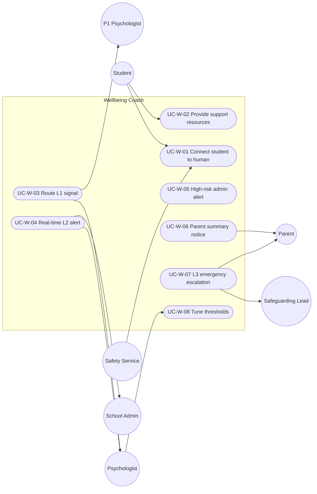

# MASTER SRS — P3 AI STUDENT COACH
## Part 5 (Use Cases) — Module 4.5: Wellbeing Coach

*Layer 2 — Product & Functional · Standalone use-case document within the Part 5 set*

| Field | Value |
|---|---|
| Covers module | 4.5 — Wellbeing Coach (AIC-FR-081–100) |
| Use-case range | UC-AIC-W-01 → UC-AIC-W-08 |
| Coverage | 1 use case per user story (US-AIC-W-01..08) |
| Safety note | Crisis wording, helplines, and thresholds require clinician/DPO sign-off (ASM-AIC-03). Use cases specify routing, not clinical content. |

---

## 5.5.1  Use-Case Diagram

*Actors:* primary — Student. Supporting — Safety Service, P1 Psychologist module, Psychologist, School Admin, Safeguarding Lead, Parent.

---

## 5.5.2  Use-Case Specifications

### UC-AIC-W-01 — Connect a distressed student to a human
| Field | Detail |
|---|---|
| Story / FRs | US-AIC-W-01 · AIC-FR-086/088/089 |
| Primary actor | Student |
| Preconditions | Consent active; safety service operating |
| Main flow | 1. Explicit-risk language detected. 2. Supportive non-clinical safe response shown with configured helpline. 3. Psychologist + School Admin alerted <=60s. 4. Immutable audit record written. |
| Alternate flows | A1: Helpline unconfigured → suppress line; human escalation still fires; config alert raised. |
| Exceptions | E1: Alert delivery fails → backup recipient (BR-AIC-W-05); never dropped. |
| Postconditions | A human is engaged; AI is never the sole responder. |

### UC-AIC-W-02 — Provide support resources
| Field | Detail |
|---|---|
| Story / FRs | US-AIC-W-02 · AIC-FR-091(check-in)/092 |
| Primary actor | Student |
| Preconditions | Student requests support or a light check-in |
| Main flow | 1. Student asks for support / does a check-in. 2. Module offers resources (counselor, configured helpline) without diagnosis or assessment questioning. |
| Alternate flows | A1: Distress detected during check-in → classify and escalate per level. |
| Exceptions | E1: No risk → no escalation; resources only. |
| Postconditions | Student knows where to turn; no false escalation. |

### UC-AIC-W-03 — Route an L1 signal
| Field | Detail |
|---|---|
| Story / FRs | US-AIC-W-03 · AIC-FR-085/090 |
| Primary actor | System → Psychologist |
| Preconditions | Engagement/sentiment threshold crossed |
| Main flow | 1. L1 classified. 2. Case queued to P1 Psychologist with context within 1h. 3. Audit written. |
| Alternate flows | A1: Repeated L1 over time → escalate priority/level. |
| Exceptions | E1: P1 queue down → backup channel to safeguarding lead. |
| Postconditions | Psychologist has an actionable, contextual case. |

### UC-AIC-W-04 — Real-time L2 alert
| Field | Detail |
|---|---|
| Story / FRs | US-AIC-W-04 · AIC-FR-086 |
| Primary actor | System → Psychologist + School Admin |
| Preconditions | Explicit-risk language detected |
| Main flow | 1. L2 classified. 2. Alert to psychologist + admin <=60s with context. 3. Safe response shown to student. 4. Audit written. |
| Alternate flows | A1: Off-hours → routed per on-call protocol. |
| Exceptions | E1: Delivery failure → backup recipient. |
| Postconditions | Immediate human action enabled. |

### UC-AIC-W-05 — High-risk admin alert
| Field | Detail |
|---|---|
| Story / FRs | US-AIC-W-05 · AIC-FR-086/087 |
| Primary actor | School Admin |
| Preconditions | L2/L3 case raised |
| Main flow | 1. Admin receives the alert. 2. Admin coordinates the safeguarding response. |
| Alternate flows | A1: Cluster of cases → admin sees the pattern (EC-AIC-W-... ). |
| Exceptions | E1: Admin channel down → backup recipient. |
| Postconditions | School-level response initiated. |

### UC-AIC-W-06 — Parent summary notice
| Field | Detail |
|---|---|
| Story / FRs | US-AIC-W-06 · AIC-FR-093 |
| Primary actor | Parent |
| Preconditions | Child wellbeing concern raised |
| Main flow | 1. Parent receives a summary-level notice. 2. Confidential detail withheld (psychologist only). |
| Alternate flows | A1: Parent requests detail → only summary provided. |
| Exceptions | E1: No linked parent → notice routed per protocol. |
| Postconditions | Parent informed without confidentiality breach. |

### UC-AIC-W-07 — L3 emergency escalation
| Field | Detail |
|---|---|
| Story / FRs | US-AIC-W-07 · AIC-FR-087 |
| Primary actor | Safeguarding Lead |
| Preconditions | Imminent-risk pattern detected |
| Main flow | 1. L3 classified. 2. Safeguarding lead + emergency contact alerted immediately per P1 protocol. 3. Safe response shown. 4. Audit written. |
| Alternate flows | A1: Emergency contact unreachable → next contact, then safeguarding lead (EC-AIC-W-04). |
| Exceptions | E1: Student recants → escalation stands (BR-AIC-W-03). |
| Postconditions | Immediate protective response triggered. |

### UC-AIC-W-08 — Tune detection thresholds
| Field | Detail |
|---|---|
| Story / FRs | US-AIC-W-08 · AIC-FR-095/096 |
| Primary actor | Psychologist / Super Admin |
| Preconditions | Authorized role |
| Main flow | 1. Authorized user adjusts thresholds. 2. New values govern subsequent classification. 3. False-positive/negative feedback recorded for tuning. |
| Alternate flows | A1: Invalid value → rejected; last valid retained. |
| Exceptions | E1: Unauthorized role → denied. |
| Postconditions | Sensitivity balanced; changes audited. |

---

### Gate status — Part 5, Module 4.5
| Gate item | Status |
|---|---|
| Use-case diagram | Pass |
| Spec per story (full structure) | Pass — UC-AIC-W-01..08 |
| >=1 use case per story | Pass — 8 → 8 |
| >=1 alternate flow each | Pass |

*Next: Module 4.6 (Student Learning Profile) use cases.*
