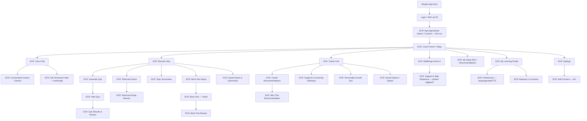
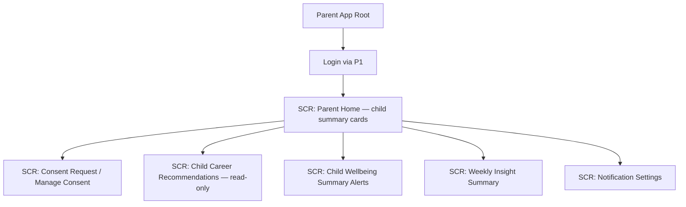
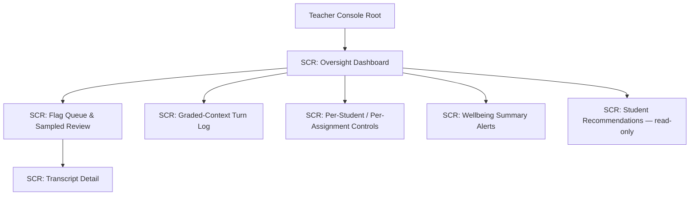
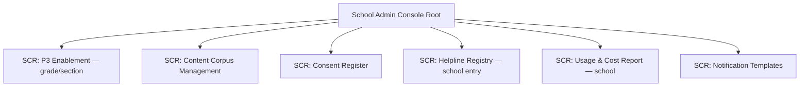
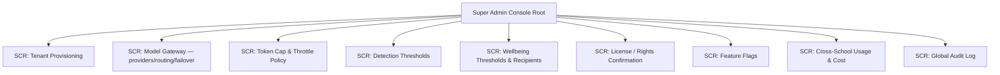

# MASTER SRS — P3 AI STUDENT COACH
## Part 6 — UI/UX Specifications

*Layer 3 — UI/UX & Experience*

| Field | Value |
|---|---|
| Product | P3 — AI Student Coach |
| Document | Master SRS — Part 6 of 17 |
| Version | 1.0 (Draft — Layer 3 in progress) |
| Classification | Internal — Consultant Use Only |
| Identifier prefix | AIC-UIR (UI Requirement) |
| Cross-reference | Accessibility detail lives in Part 2.5 (ACC-AIC-01..12) and is not restated here — Section 6.5 cross-references it. |

---

## 6.1  Design Principles

Maximum 5, each one sentence, each measurable.

| ID | Principle | Measurable Test |
|---|---|---|
| AIC-UIR-001 | Every primary action is reachable within 2 taps from the student home screen. | Tap-count audit on Tutor, Revision, Career, Wellbeing entry points |
| AIC-UIR-002 | No AI response is shown without either a source reference or an explicit uncertainty statement. | 100% of corpus-derived responses carry a citation or uncertainty tag (AIC-FR-005/128) |
| AIC-UIR-003 | A teacher reaches any flagged integrity item within 2 taps from the oversight dashboard. | Tap-count audit on Module 4.9 console |
| AIC-UIR-004 | Every screen renders correctly in English, Urdu, and Arabic, including RTL layout. | Localization + RTL QA pass on 100% of screens (Section 6.6) |
| AIC-UIR-005 | A wellbeing safe response is visible within 1 second of an L2/L3 detection, with no intervening screen. | Latency audit on Module 4.5 safe-response render |

---

## 6.2  Navigation Structure

Five distinct surfaces. Each tree shows root to leaf screen.

### 6.2.1  Student App (Web, iOS, Android)

### 6.2.2  Parent App

### 6.2.3  Teacher Console (within P1 web portal, P3 tab)

### 6.2.4  School Admin Console (web)

### 6.2.5  Super Admin Console (web)

| ID | Requirement |
|---|---|
| AIC-UIR-006 | The navigation structure shall match the trees in 6.2.1–6.2.5; no screen shall exist outside this structure without a documented addition to this part. |
| AIC-UIR-007 | Each surface shall expose only the screens permitted by the role's permission matrix (Part 2.4 and module-level permission tables). |

---

## 6.3  Design System Basics

### 6.3.1  Typography Scale

| Token | Use | Size (px / rem) | Weight | Line Height |
|---|---|---|---|---|
| Display | Hero/empty-state headline | 32 / 2.0rem | 700 | 1.25 |
| H1 | Screen title | 24 / 1.5rem | 700 | 1.3 |
| H2 | Section header | 20 / 1.25rem | 600 | 1.35 |
| H3 | Card/subsection title | 16 / 1.0rem | 600 | 1.4 |
| Body | Default text | 14 / 0.875rem | 400 | 1.5 |
| Body-large | Tutor chat response text | 16 / 1.0rem | 400 | 1.6 |
| Caption | Metadata, timestamps, source refs | 12 / 0.75rem | 400 | 1.4 |
| Label | Buttons, form labels | 13 / 0.8125rem | 600 | 1.3 |

| ID | Requirement |
|---|---|
| AIC-UIR-008 | The system shall use language-specific font stacks: English — "Inter", system-ui, sans-serif; Urdu — "Noto Nastaliq Urdu", "Jameel Noori Nastaleeq", sans-serif; Arabic — "Noto Naskh Arabic", "Noto Sans Arabic", sans-serif. |
| AIC-UIR-009 | Body text minimum size shall be 14px (or 16px for Urdu/Arabic scripts, which require larger size for legibility). |

### 6.3.2  Colour Palette

| Token | Hex | Use |
|---|---|---|
| Primary | #1F4E79 | Headers, primary actions, brand |
| Primary-Light | #4F86B5 | Hover/active states, links |
| Secondary | #2E8B57 | Success, positive trend, confirm actions |
| Accent | #D98C2B | Highlights, recommendations, badges |
| Warning | #C9A227 | Caution states (e.g., approaching token cap) |
| Danger | #C0392B | Errors, integrity violations, disable actions |
| Critical-Safety | #8E1F2F | Wellbeing L2/L3 alert chrome (never used for routine UI) |
| Neutral-900 | #1A1A1A | Primary text |
| Neutral-600 | #595959 | Secondary text |
| Neutral-300 | #BFBFBF | Borders, dividers |
| Neutral-100 | #F4F6F8 | Page background |
| Surface | #FFFFFF | Card/panel background |

| ID | Requirement |
|---|---|
| AIC-UIR-010 | Critical-Safety (#8E1F2F) shall be reserved exclusively for Wellbeing L2/L3 alert UI and shall not be reused for any other screen state, to avoid alert fatigue or false urgency. |
| AIC-UIR-011 | All text/background colour pairs shall meet the contrast ratios in ACC-AIC-02 (Part 2.5). |

### 6.3.3  Spacing Scale

| Token | Value |
|---|---|
| space-1 | 4px |
| space-2 | 8px |
| space-3 | 12px |
| space-4 | 16px |
| space-5 | 24px |
| space-6 | 32px |
| space-7 | 48px |
| space-8 | 64px |

### 6.3.4  Grid System

| Breakpoint | Columns | Gutter | Margin |
|---|---|---|---|
| Mobile (< 600px) | 4 | 16px | 16px |
| Tablet (600–1024px) | 8 | 20px | 24px |
| Desktop (> 1024px) | 12 | 24px | 32px |

### 6.3.5  Iconography Rules

| ID | Requirement |
|---|---|
| AIC-UIR-012 | Icons shall use a single outline style at 24x24px default size with 2px stroke weight; no mixed filled/outline icons on the same screen. |
| AIC-UIR-013 | Every icon-only control shall carry an accessible label (ACC-AIC-03) and shall not rely on icon meaning alone (ACC-AIC-10). |
| AIC-UIR-014 | Directional icons (arrows, chevrons) shall mirror automatically in RTL layout (Section 6.6). |

---

## 6.4  Responsive Breakpoints

| Breakpoint | Range | Layout Change | Component Behaviour |
|---|---|---|---|
| Mobile-S | 320–599px | Single column; bottom tab navigation | Chat input docked to bottom; cards stack full-width |
| Mobile-L | 600–767px | Single column, wider cards | Side-by-side action buttons where space allows |
| Tablet | 768–1023px | Two-column where applicable (e.g., Revision Hub list + detail) | Console screens show condensed sidebar |
| Desktop | 1024–1439px | Multi-column dashboards (Teacher/Admin consoles) | Persistent sidebar navigation |
| Desktop-Wide | >=1440px | Max content width 1280px, centered | Additional analytics panels visible (Admin consoles) |

| ID | Requirement |
|---|---|
| AIC-UIR-015 | Every student-facing screen shall be specified and tested at Mobile-S, Tablet, and Desktop per Part 7 wireframe requirements. |
| AIC-UIR-016 | Console screens (Teacher, School Admin, Super Admin) shall be specified at Tablet and Desktop; Mobile-S is read-only summary only. |

---

## 6.5  Accessibility Standards

Full requirements are specified once in **Part 2.5 (ACC-AIC-01..12)** and are not restated here. This section confirms scope only.

| ID | Requirement |
|---|---|
| AIC-UIR-017 | Every screen specified in Part 7 shall be checked against ACC-AIC-01..12 before being marked complete (Layer 3 KPI, Section 6.3 of the Production Guide). |
| AIC-UIR-018 | Wellbeing safe-response screens (Module 4.5) shall meet AAA contrast (>=7:1) for critical text, exceeding the AA floor in ACC-AIC-02, given their safety-critical nature. |

---

## 6.6  RTL Language Rules

Applies to Urdu and Arabic.

| ID | Rule |
|---|---|
| AIC-UIR-019 | The entire layout shall mirror horizontally in RTL mode: navigation, icons (per AIC-UIR-014), progress bars, charts' reading order, and form field order. |
| AIC-UIR-020 | Text shall flow right-to-left; numerals shall render as Western Arabic digits (0–9) by default for both Urdu and Arabic, configurable to Eastern Arabic-Indic digits per tenant locale preference. |
| AIC-UIR-021 | Mixed-direction content (e.g., a Maths equation or English term inside an Urdu sentence) shall apply Unicode bidi isolation so the embedded LTR content does not break sentence flow. |
| AIC-UIR-022 | Source-reference citations, timestamps, and IDs shall remain LTR even inside an RTL screen, per standard bidi convention. |
| AIC-UIR-023 | Date format shall follow the tenant locale setting (e.g., DD/MM/YYYY) independent of text direction. |
| AIC-UIR-024 | The TTS read-aloud control (AIC-FR-012) shall sit on the leading edge (right side in RTL) consistent with mirrored layout. |
| AIC-UIR-025 | Chat bubbles shall align to the leading edge per direction: Student messages trailing-aligned, Coach messages leading-aligned, mirrored correctly in RTL. |

*Open item: AIC-UIR-020's numeral default (Western Arabic digits) is a convention choice for Pakistan-based Urdu UI; confirm with client design preference before Part 7 wireframes lock, since Arabic-locale tenants outside Pakistan may expect Eastern Arabic-Indic digits as their default rather than an opt-in.*

---

### Layer 3 gate status — Part 6

| Gate item | Minimum Standard | Status |
|---|---|---|
| Design principles | Max 5, measurable | Pass — 5 principles, each with a measurable test |
| Navigation tree | Full root-to-screen tree | Pass — 5 surfaces, all screens named with SCR IDs ready for Part 7 |
| Design system | Colours + typography defined | Pass — full token tables (type, colour, spacing, grid, icon) |
| Responsive specs | Breakpoints defined | Pass — 5 breakpoints with layout/component behaviour |
| Accessibility | Cross-referenced, not duplicated | Pass — points to Part 2.5; scope confirmed here |
| RTL rules | Mirror logic, fonts, layout | Pass — 7 rules incl. numerals, bidi, chat alignment |

*Next: Part 7 — Screen Specifications. Every SCR-tagged screen above gets a full spec (purpose, wireframes desktop/tablet/mobile, components, actions, validation, loading/empty/error states). Given the screen count (~40 across 5 surfaces), Part 7 will be built in batches by surface, starting with the Student App.*
