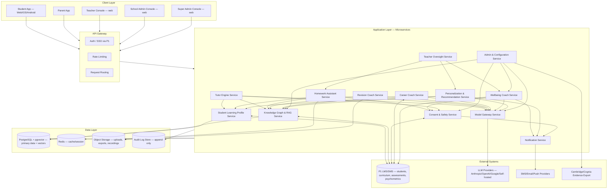

# MASTER SRS — P3 AI STUDENT COACH
## Part 8 — Solution Architecture
### 8.2 High-Level Architecture

*Layer 4 — Technical & Architecture*

| Field | Value |
|---|---|
| Product | P3 — AI Student Coach |
| Identifier range (this section) | AIC-TR-004 → AIC-TR-015 |
| Architecture style | Microservices, API-first, event-aware for cross-service notifications |

---

## 8.2.1  Architecture Diagram (Figure 1)

**Figure 1 caption:** P3 high-level architecture — five client surfaces route through a shared API gateway into thirteen application services, which read/write a shared data layer and integrate with P1 (system of record) and external LLM/messaging providers. Component names match the module numbering in Part 4 (4.1–4.11) plus two cross-cutting services (Model Gateway, Notification) not separately numbered as student-facing modules.

---

## 8.2.2  Component Inventory

| Component | Corresponds to | Type |
|---|---|---|
| Student App, Parent App, Teacher Console, School Admin Console, Super Admin Console | Part 6/7 surfaces | Client |
| API Gateway (Auth, Rate Limiting, Routing) | Cross-cutting | Gateway |
| Tutor Engine Service | Module 4.1 | Application |
| Homework Assistant Service | Module 4.2 | Application |
| Revision Coach Service | Module 4.3 | Application |
| Career Coach Service | Module 4.4 | Application |
| Wellbeing Coach Service | Module 4.5 | Application |
| Student Learning Profile Service | Module 4.6 | Application |
| Knowledge Graph & RAG Service | Module 4.7 | Application |
| Personalization & Recommendation Service | Module 4.8 | Application |
| Teacher Oversight Service | Module 4.9 | Application |
| Consent & Safety Service | Module 4.10 | Application |
| Admin & Configuration Service | Module 4.11 | Application |
| Model Gateway Service | Cross-cutting (Gap G1) | Application |
| Notification Service | Cross-cutting | Application |
| PostgreSQL + pgvector | Section 8.1.3 | Data |
| Redis | Cross-cutting cache | Data |
| Object Storage | Uploads/exports/recordings | Data |
| Audit Log Store | BR-AIC-018 and module-level audit rules | Data |
| P1 LMS/SMS | DEP-AIC-01 | External |
| LLM Providers | Section 8.1.1 | External |
| SMS/Email/Push Providers | Notification delivery | External |
| Cambridge/Cognia Evidence Export | CMP-AIC-06/07 | External |

---

## 8.2.3  Architecture Requirements

| ID | Requirement |
|---|---|
| AIC-TR-004 | Each application service shall be independently deployable and independently scalable. |
| AIC-TR-005 | No client surface shall call an application service directly; all traffic shall route through the API Gateway. |
| AIC-TR-006 | No application service shall call an LLM provider SDK directly; all model calls shall route through the Model Gateway Service. |
| AIC-TR-007 | The Wellbeing Coach Service and Consent & Safety Service shall expose a priority/bypass path that is not subject to the standard rate-limiting tier applied to other services, consistent with AIC-FR-099 (safety bypasses cost throttling). |
| AIC-TR-008 | The Knowledge Graph & RAG Service and Student Learning Profile Service shall be the only services with write access to P1 via the integration layer for recommendations/summaries/flags; no other service shall write to P1 directly. |
| AIC-TR-009 | The Audit Log Store shall be append-only at the infrastructure level (no update/delete permission granted to any application service's database role). |
| AIC-TR-010 | The Teacher Oversight Service shall read from, and never write to, the Homework Assistant Service's and Wellbeing Coach Service's underlying data; oversight actions (enable/disable, acknowledge) are written via each owning service's API, not direct database access. |
| AIC-TR-011 | The Notification Service shall be the sole integration point to SMS/Email/Push providers; no application service shall hold provider credentials directly. |
| AIC-TR-012 | Each application service shall expose its own health-check endpoint to the API Gateway for routing and failover decisions. |
| AIC-TR-013 | Service-to-service calls within the Application Layer shall use synchronous request/response for read operations and an event/queue mechanism for cross-service notifications that do not require an immediate response (e.g., Wellbeing Coach notifying Teacher Oversight of a new summary alert). |
| AIC-TR-014 | The Admin & Configuration Service shall be the only service with write access to runtime configuration (thresholds, caps, routing) consumed by other services; other services shall read configuration, not own it. |
| AIC-TR-015 | All service-to-service and service-to-data-layer traffic shall occur within a private network boundary; only the API Gateway shall be internet-facing. |

---

### Layer 4 gate status — Part 8.2

| Gate item | Minimum Standard | Status |
|---|---|---|
| High-level architecture | All major components and connections shown | Pass — Figure 1, 22 components, full inventory table |
| Architecture diagram annotated | Components named, data flow shown | Pass |

*Next: 8.3 — System Context Diagram (P3 as a black box with all external actors and systems).*
