# MASTER SRS — P3 AI STUDENT COACH
## Part 8 — Solution Architecture
### 8.3 System Context Diagram

*Layer 4 — Technical & Architecture*

| Field | Value |
|---|---|
| Product | P3 — AI Student Coach |
| Identifier range (this section) | AIC-TR-016 → AIC-TR-024 |
| Purpose | Show P3 as a single black box with every human actor and external system that crosses its boundary, and the nature of each crossing. |

---

## 8.3.1  System Context Diagram (Figure 2)

```mermaid
flowchart TB
    STUDENT([Student]) -- asks questions, submits homework, takes quizzes, check-ins --> P3
    P3 -- tutoring, revision, career guidance, safe responses --> STUDENT

    PARENT([Parent / Guardian]) -- gives/withdraws consent, views summaries --> P3
    P3 -- consent requests, weekly insights, wellbeing summaries --> PARENT

    TEACHER([Teacher]) -- reviews flags, sets controls --> P3
    P3 -- oversight data, recommendations, wellbeing summaries --> TEACHER

    PSYCH([Psychologist]) -- configures thresholds, manages cases --> P3
    P3 -- escalation cases, confidential context --> PSYCH

    SCHOOLADMIN([School Admin]) -- enables P3, manages content/consent/helpline --> P3
    P3 -- usage/cost/consent reports --> SCHOOLADMIN

    SUPERADMIN([Super Admin]) -- configures platform, gateway, thresholds --> P3
    P3 -- cross-school analytics, audit log --> SUPERADMIN

    DPO([DPO / Auditor]) -- queries compliance --> P3
    P3 -- audit records, consent register --> DPO

    SAFELEAD([Safeguarding Lead / Emergency Contact]) -. receives L3 alerts .-> P3
    P3 -. immediate escalation .-> SAFELEAD

    subgraph P3[" P3 — AI STUDENT COACH (system boundary) "]
        CORE[ ]
    end

    P3 <--> P1[(P1 — LMS/SMS<br/>system of record)]
    P3 --> LLM[LLM Providers<br/>Anthropic / OpenAI / Google / Self-hosted]
    P3 --> MSGPROV[SMS / Email / Push Providers]
    P3 --> ACCRED[Cambridge / Cognia<br/>accreditation bodies]
    HELPLINE[Configured Regional<br/>Helpline Services] -. referenced, never called by P3 .-> P3
```

**Figure 2 caption:** P3's system boundary with eight human-actor relationships and five external-system relationships. Dashed lines indicate safety-critical, low-frequency, high-priority interactions (wellbeing escalation, helpline reference); solid lines indicate routine operational interactions. P3 never autonomously contacts a Safeguarding Lead's personal channel or a helpline directly — it surfaces the helpline reference to the student and notifies the human recipient, who takes the actual action, consistent with Module 4.5's "detector and connector, not sole responder" principle.

---

## 8.3.2  Actor & External System Summary

| Actor / System | Relationship to P3 | Data Crossing the Boundary |
|---|---|---|
| Student | Primary user | Queries, submissions, consent self-action (18+), ratings, check-ins ↔ tutoring, revision, recommendations, safe responses |
| Parent / Guardian | Secondary user, consent authority | Consent decisions ↔ summaries, alerts, requests |
| Teacher | Oversight user | Control actions, acknowledgements ↔ oversight data, summaries |
| Psychologist | Safety configuration + case owner | Threshold config, case actions ↔ escalation cases, confidential context |
| School Admin | Tenant-scope configuration | Enablement, content, consent/helpline config ↔ reports |
| Super Admin | Platform-scope configuration | Gateway, cap, threshold config ↔ cross-tenant analytics, audit |
| DPO / Auditor | Compliance oversight | Query requests ↔ audit/consent records |
| Safeguarding Lead / Emergency Contact | Crisis-path recipient (human) | Receives L3 alert only — no routine interaction |
| P1 (LMS/SMS) | System of record | Bidirectional: P3 reads profile/curriculum/assessments/psychometrics; P3 writes recommendations/summaries/flags only (BR-AIC-011) |
| LLM Providers | Inference supplier | P3 sends prompts/context, receives completions — never receives data beyond what's needed for the specific call |
| SMS/Email/Push Providers | Notification delivery | P3 sends notification payloads; provider returns delivery status |
| Cambridge/Cognia | Accreditation evidence consumer | P3 exports evidence bundles on request; no live system integration required at v1.0 |
| Configured Regional Helpline Services | Referenced resource, not integrated | P3 displays the helpline reference value; no API call or data exchange occurs |

---

## 8.3.3  Context-Level Requirements

| ID | Requirement |
|---|---|
| AIC-TR-016 | P3 shall expose exactly one integration contract per external system (P1, each LLM provider, each notification provider); no ad hoc or undocumented integration paths are permitted. |
| AIC-TR-017 | P3 shall never initiate direct contact with a Safeguarding Lead's or Emergency Contact's personal device/number on its own initiative outside the configured alert channel defined in Module 4.5; all such contact is routed through the configured notification channel, not a freeform message. |
| AIC-TR-018 | P3 shall treat the helpline value as display-only reference data; no component shall call, message, or otherwise integrate with a helpline service programmatically. |
| AIC-TR-019 | Every actor-to-P3 relationship shown in Figure 2 shall map to a permission entry in the relevant module's permission table (Parts 4/5); no actor shall have an undocumented access path. |
| AIC-TR-020 | P1 shall remain the sole system of record for identity, enrollment, curriculum, assessments, and psychometrics; P3 shall not duplicate write-authority over any of these domains. |
| AIC-TR-021 | Data sent to an LLM provider shall be limited to the minimum context required for the specific request (no bulk profile export to a provider call). |
| AIC-TR-022 | The DPO/Auditor relationship shall be read-only at the context boundary; no DPO/Auditor action shall modify student-facing behavior directly (configuration changes route through Super Admin/School Admin per Module 4.11). |
| AIC-TR-023 | The Cambridge/Cognia evidence export shall be a discrete, on-demand or scheduled export artifact (Part 3.6, RPT-AIC-06), not a live, continuously synchronized integration, at v1.0. |
| AIC-TR-024 | Any new external system added after v1.0 sign-off shall require a Part 17 change request before being added to this context diagram. |

---

### Layer 4 gate status — Part 8.3

| Gate item | Minimum Standard | Status |
|---|---|---|
| System context diagram | P3 as black box, all external actors/systems shown | Pass — Figure 2, 8 actors + 5 external systems |
| Diagram annotated | Relationships labeled with data direction | Pass |

*Next: 8.4 — Component Architecture (internal components, services, and their relationships — a deeper expansion of the Application Layer from 8.2).*
