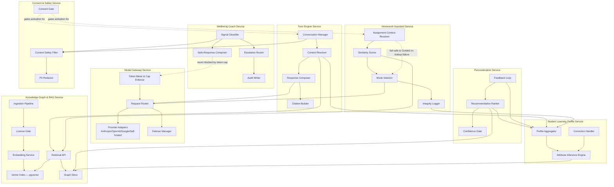

# MASTER SRS — P3 AI STUDENT COACH
## Part 8 — Solution Architecture
### 8.4 Component Architecture

*Layer 4 — Technical & Architecture*

| Field | Value |
|---|---|
| Product | P3 — AI Student Coach |
| Identifier range (this section) | AIC-TR-025 → AIC-TR-040 |
| Scope note | Internal components are detailed for the eight services with non-trivial internal logic. Revision Coach, Career Coach, Teacher Oversight, and Admin & Configuration are orchestration services that compose these primitives (RAG retrieval, Model Gateway, Profile reads, Consent/Safety checks) and are not re-decomposed here — see their Part 4 module specs for behaviour. |

---

## 8.4.1  Component Diagram (Figure 3)

**Figure 3 caption:** Internal components of the eight architecturally significant services. Dashed lines mark safety/integrity-critical relationships called out explicitly in Part 4 business rules (fail-safe defaulting, safety-bypass-of-cost-controls, consent gating). Solid arrows show standard data/control flow.

---

## 8.4.2  Component Descriptions

| Service | Component | Responsibility | Maps to Rule(s) |
|---|---|---|---|
| Model Gateway | Request Router | Directs each call to the configured Tier A/B/C provider per Section 8.1.1 | AIC-TR-006 |
| Model Gateway | Provider Adapters | One adapter per provider, normalizing request/response shape | — |
| Model Gateway | Failover Manager | Reroutes to the next healthy provider on outage | EC-AIC-A-01 |
| Model Gateway | Token Meter & Cap Enforcer | Tracks per-student monthly usage; throttles to Tier B/C at cap; never throttles a Wellbeing safe-response | BR-AIC-009, AIC-FR-099 |
| Knowledge Graph & RAG | Ingestion Pipeline | Accepts uploaded content, routes to License Gate | AIC-FR-124 |
| Knowledge Graph & RAG | License Gate | Blocks indexing until rights confirmed | BR-AIC-K-01 |
| Knowledge Graph & RAG | Embedding Service | Chunks and embeds approved content | AIC-FR-126 |
| Knowledge Graph & RAG | Vector Index | pgvector store, tenant-isolated | BR-AIC-K-07 |
| Knowledge Graph & RAG | Graph Store | Student/Course/Objective/Assessment/Resource/Recommendation graph | AIC-FR-121 |
| Knowledge Graph & RAG | Retrieval API | Scoped semantic retrieval with threshold and citation metadata | AIC-FR-127/129 |
| Tutor Engine | Conversation Manager | Session state, turn history | AIC-FR-010 |
| Tutor Engine | Context Resolver | Pulls profile + retrieval context for the current turn; detects graded-context handoff trigger | AIC-FR-018 |
| Tutor Engine | Response Composer | Assembles the model prompt and post-processes the response | — |
| Tutor Engine | Citation Builder | Attaches source references or uncertainty signal | AIC-FR-005/006 |
| Homework Assistant | Assignment Context Resolver | Queries P1 for active assignment/window | AIC-FR-021 |
| Homework Assistant | Similarity Scorer | Computes topic similarity against active items | AIC-FR-022 |
| Homework Assistant | Mode Selector | Chooses Guided/Full-solution; fail-safe to Guided on resolver failure | BR-AIC-H-01 |
| Homework Assistant | Integrity Logger | Writes immutable, mode-tagged turn log for teacher visibility | AIC-FR-028/029 |
| Wellbeing Coach | Signal Classifier | Detects L1/L2/L3 signal level from interaction content | AIC-FR-083 |
| Wellbeing Coach | Escalation Router | Routes to Psychologist/Admin/Safeguarding per level, with backup-recipient failover | BR-AIC-W-05 |
| Wellbeing Coach | Safe-Response Composer | Builds the non-clinical safe response and helpline reference | AIC-FR-088 |
| Wellbeing Coach | Audit Writer | Immutable escalation record | AIC-FR-090 |
| Personalization | Recommendation Ranker | Scores candidate recommendations from profile + graph signals | AIC-FR-142/146 |
| Personalization | Confidence Gate | Suppresses low-confidence personalization in favor of stage defaults | BR-AIC-N-03 |
| Personalization | Feedback Loop | Folds accept/dismiss signals back into ranking | AIC-FR-148 |
| Consent & Safety | Consent Gate | Blocks service entry points for under-18 students without recorded consent | BR-AIC-S-01 |
| Consent & Safety | Content Safety Filter | Screens all input/output; fails closed on outage | BR-AIC-S-03/04 |
| Consent & Safety | PII Redactor | Blocks/redacts financial, credential, and ID data | BR-AIC-S-05 |
| Student Learning Profile | Profile Aggregator | Merges P1 read-only fields with P3-derived attributes | AIC-FR-101 |
| Student Learning Profile | Attribute Inference Engine | Derives weak/strong topics, learning style, confidence scores | AIC-FR-102/107 |
| Student Learning Profile | Correction Handler | Applies and retains student-submitted corrections | BR-AIC-P-02 |

---

## 8.4.3  Component-Level Requirements

| ID | Requirement |
|---|---|
| AIC-TR-025 | The Consent Gate component shall be invoked by every student-facing entry point (Tutor Engine, Homework Assistant, Revision Coach, Career Coach, Wellbeing Coach) before any request reaches application logic. |
| AIC-TR-026 | The Content Safety Filter shall be invoked on both the inbound request and the outbound response of every student-facing component, not on one side only. |
| AIC-TR-027 | The License Gate shall be the only path by which content enters the Embedding Service; no component shall bypass it for any reason, including urgent content needs. |
| AIC-TR-028 | The Token Meter & Cap Enforcer shall expose a bypass flag usable only by the Wellbeing Coach's Safe-Response Composer, set at the architecture level so no future service can claim the same bypass without an explicit change request (Part 17). |
| AIC-TR-029 | The Mode Selector shall default to Guided on any failure, timeout, or ambiguous result from the Assignment Context Resolver or Similarity Scorer. |
| AIC-TR-030 | The Escalation Router shall write to the Audit Writer before or atomically with sending any recipient notification, so an audit record cannot be lost even if notification delivery fails. |
| AIC-TR-031 | The Recommendation Ranker shall query the Confidence Gate before surfacing any personalized item; items failing the gate shall fall back to stage-default content rather than being withheld silently. |
| AIC-TR-032 | The Correction Handler shall version every correction rather than overwrite the prior inferred value, preserving history per BR-AIC-P-03. |
| AIC-TR-033 | The Citation Builder shall be unable to emit a response with neither a citation nor an explicit uncertainty marker — this is enforced as a non-optional post-processing step, not a best-effort one. |
| AIC-TR-034 | The Failover Manager shall log every failover event with the failed provider, the provider routed to, and the reason, for inclusion in the Part 9 API/operations monitoring. |
| AIC-TR-035 | The Graph Store shall be updated only by a defined sync process from P1; no application component shall write graph nodes/edges representing P1-owned entities (courses, assessments) directly. |
| AIC-TR-036 | The PII Redactor shall run before any content reaches persistent storage, not only before display, so blocked content is never written even transiently. |
| AIC-TR-037 | The Similarity Scorer's threshold shall be a runtime-configurable value read from the Admin & Configuration Service, not a hardcoded constant. |
| AIC-TR-038 | The Safe-Response Composer shall source its helpline reference from the Admin & Configuration Service's helpline registry at request time, never from a cached or hardcoded value. |
| AIC-TR-039 | Every component listed in 8.4.2 shall expose internal metrics (latency, error rate, and — where applicable — the specific business signal such as cache-hit rate or escalation count) to the Part 11 monitoring stack. |
| AIC-TR-040 | Revision Coach, Career Coach, Teacher Oversight, and Admin & Configuration shall compose the components above via their documented APIs only; they shall not access another service's internal components (e.g., Vector Index, Audit Writer) directly. |

---

### Layer 4 gate status — Part 8.4

| Gate item | Minimum Standard | Status |
|---|---|---|
| Component architecture | Internal components, services, relationships shown | Pass — Figure 3, 8 services decomposed, 28 components |
| Diagram annotated | Components named, critical relationships flagged | Pass |

*Next: 8.5 — Integration Architecture (all third-party integrations with data flow direction).*
