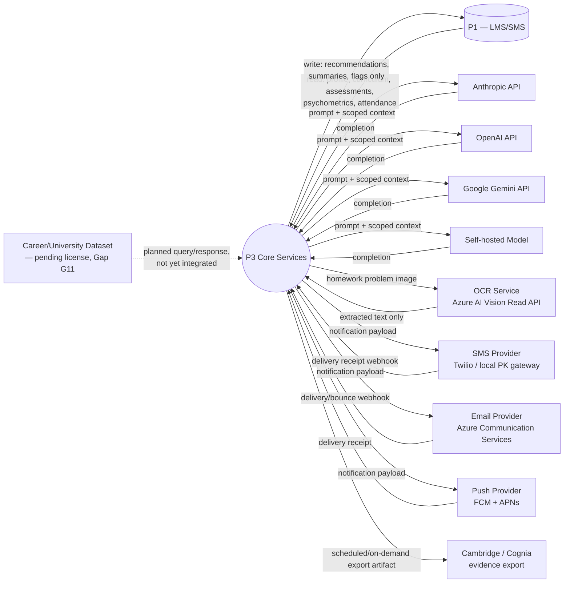

# MASTER SRS — P3 AI STUDENT COACH
## Part 8 — Solution Architecture
### 8.5 Integration Architecture

*Layer 4 — Technical & Architecture*

| Field | Value |
|---|---|
| Product | P3 — AI Student Coach |
| Identifier range (this section) | AIC-TR-041 → AIC-TR-052 |
| Scope note | This section maps every third-party integration and its data-flow direction. Full per-endpoint detail (auth method, payload schema, failure handling) is specified in Part 9.5; this section establishes the map and the architectural boundary rules. |

---

## 8.5.1  Integration Map (Figure 4)

**Figure 4 caption:** Nine active integration points and one planned-but-not-yet-licensed integration (career/university dataset, Gap G11). Arrows show data-flow direction; P1 is the only bidirectional integration, and even there, P3's write path is restricted to three data types (BR-AIC-011).

---

## 8.5.2  Integration Summary

| Integration | Purpose | Direction | Frequency | Data Exchanged |
|---|---|---|---|---|
| P1 — LMS/SMS | System-of-record sync | Bidirectional (read-heavy, write-restricted) | Real-time reads on request; writes on recommendation/flag generation | Read: profile, enrollment, curriculum, assessments, psychometrics, attendance. Write: recommendations, session summaries, flags only |
| Anthropic API | Tier A inference (primary) | Outbound request / inbound response | Per tutoring/wellbeing/career request | Scoped prompt context (no bulk profile); completion text |
| OpenAI API | Tier A inference (failover) | Outbound request / inbound response | On Anthropic failover, or per gateway routing policy | Scoped prompt context; completion text |
| Google Gemini API | Tier B inference (synthesis, long-context) | Outbound request / inbound response | Per revision/summary/long-document request | Scoped prompt context; completion text |
| Self-hosted model | Tier C inference (classification) | Internal call (within private network) / response | High-frequency (language detection, intent, safety pre-screen) | Short text input; classification output |
| OCR Service (Azure AI Vision) | Homework image-to-text extraction | Outbound image / inbound text | Per image upload (AIC-FR-037) | Image (ephemeral, not retained — BR-AIC-H-05); extracted text only |
| SMS Provider | Wellbeing/consent/reminder delivery | Outbound payload / inbound delivery receipt | Per triggered notification | Recipient number, message content, delivery status |
| Email Provider | Reports, summaries, consent requests | Outbound payload / inbound delivery/bounce | Per triggered notification | Recipient address, message content, delivery status |
| Push Provider (FCM/APNs) | In-app/mobile alerts | Outbound payload / inbound delivery receipt | Per triggered notification | Device token, payload, delivery status |
| Cambridge/Cognia evidence export | Accreditation evidence | Outbound artifact only | Per term or on demand (RPT-AIC-06) | Session summaries, recommendations, intervention records (export bundle, no live sync — AIC-TR-023) |
| Career/University Dataset (planned) | Sourced career/salary/entry-requirement data | Outbound query / inbound dataset (not yet active) | TBD pending Gap G11 resolution | TBD — qualitative-only output until licensed (BR-AIC-C-03) |

---

## 8.5.3  Integration Architecture Requirements

| ID | Requirement |
|---|---|
| AIC-TR-041 | Every integration in Figure 4 shall have exactly one owning component responsible for the connection (Model Gateway for LLMs, Notification Service for SMS/Email/Push, Knowledge Graph & RAG for OCR-fed content, Student Learning Profile/Knowledge Graph for P1). |
| AIC-TR-042 | No integration other than P1 shall be granted write access to any P3 data store; all other integrations are either pure outbound (export) or request/response (inference, OCR) with no persistent write-back beyond the calling component's own response handling. |
| AIC-TR-043 | The OCR integration shall not persist the submitted image beyond the extraction operation; only the extracted text is retained, consistent with BR-AIC-H-05. |
| AIC-TR-044 | All outbound calls to LLM providers shall pass through the Model Gateway's Token Meter & Cap Enforcer (8.4.2) before dispatch, except calls flagged with the Wellbeing safety bypass (AIC-TR-028). |
| AIC-TR-045 | Notification provider credentials (SMS/Email/Push) shall be held only by the Notification Service; no other component shall hold or use these credentials directly (restates AIC-TR-011 at the integration layer). |
| AIC-TR-046 | Delivery-receipt webhooks from SMS/Email/Push providers shall be authenticated (signature verification) before being processed, to prevent spoofed delivery-status injection. |
| AIC-TR-047 | The Cambridge/Cognia evidence export shall not expose a live API endpoint to the accreditation body at v1.0; export is a generated artifact retrieved by the School Admin, per AIC-TR-023. |
| AIC-TR-048 | The Career/University Dataset integration shall remain inactive (no calls made) until Gap G11 is resolved with a licensed source; until then, Career Coach (Module 4.4) shall operate in qualitative-only mode per BR-AIC-C-03. |
| AIC-TR-049 | No integration in this section shall send a student's full profile, full conversation history, or psychometric raw scores to an LLM provider; only the minimum scoped context for the specific request is sent (restates AIC-TR-021 with integration-specific scope). |
| AIC-TR-050 | Each integration shall have a documented timeout and retry policy; a failed retry shall surface the relevant module's standard error state (per Part 4 error-state tables) rather than a generic failure. |
| AIC-TR-051 | All integration traffic to external providers shall use TLS 1.3 in transit, consistent with the Part 10 security NFR target (to be finalized in Part 10). |
| AIC-TR-052 | Any new third-party integration proposed after v1.0 sign-off shall be added to Figure 4 and this table via a Part 17 change request before implementation begins. |

---

### Layer 4 gate status — Part 8.5

| Gate item | Minimum Standard | Status |
|---|---|---|
| Integration architecture | All third-party integrations with data-flow direction | Pass — Figure 4, 9 active + 1 planned integration, full direction labeling |
| Integration map | Visual required | Pass |

*Next: 8.6 — Data Architecture Overview (data domains, data flow, storage strategy).*
