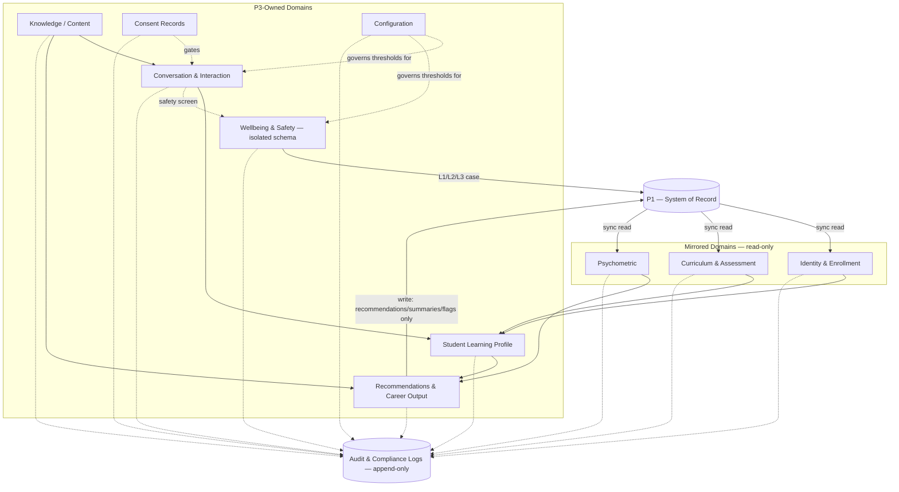

# MASTER SRS — P3 AI STUDENT COACH
## Part 8 — Solution Architecture
### 8.6 Data Architecture Overview

*Layer 4 — Technical & Architecture*

| Field | Value |
|---|---|
| Product | P3 — AI Student Coach |
| Identifier range (this section) | AIC-TR-053 → AIC-TR-064 |
| Scope note | This section defines data domains, flow, and storage strategy at the architecture level. Full schemas, table specs, and field-level data dictionary are in Part 9.3. |

---

## 8.6.1  Data Domains

| Domain | Description | Classification | Owner | Storage | Retention |
|---|---|---|---|---|---|
| Identity & Enrollment | Student/guardian identity, enrollment, stage/section | PII | P1 (mirrored read-only in P3) | PostgreSQL (cached mirror) | Mirrors P1; P3 cache refreshed on read, no independent retention clock |
| Curriculum & Assessment | Subjects, learning objectives, assessment results, attendance | Sensitive (academic) | P1 (mirrored read-only in P3) | PostgreSQL (cached mirror) | Mirrors P1 |
| Psychometric | Personality, aptitude, IQ, EQ, career test results | Highly sensitive | P1 (mirrored read-only in P3) | PostgreSQL (cached mirror), no separate copy beyond active session use | Mirrors P1; not duplicated into long-term P3 storage beyond reference for recommendation generation |
| Conversation & Interaction | Tutor chat, homework turns, revision sessions, check-ins | Sensitive (PII + academic) | P3 | PostgreSQL | 24 months rolling, then anonymized (BR-AIC-012) |
| Student Learning Profile | Derived weak/strong topics, learning style, confidence scores, preferences | Sensitive | P3 | PostgreSQL | 24 months, then anonymized; corrections retained in version history |
| Knowledge/Content (corpus, embeddings, graph) | Licensed curriculum content, vectors, graph nodes/edges | Confidential (licensing-restricted) | P3 (license-gated per BR-AIC-K-01) | PostgreSQL + pgvector | Until license revoked or content superseded |
| Recommendations & Career Output | Generated recommendations, career options, study plans | Sensitive | P3 (write-back subset to P1) | PostgreSQL | 24 months, then anonymized |
| Wellbeing & Safety | Signals, escalation records, safe-response logs, check-in self-reports | Highly sensitive / safeguarding | P3 (confidential, Psychologist-scoped) | PostgreSQL (isolated schema, stricter access control) | **See Gap G14 below — likely longer than 24 months for safeguarding defensibility, pending DPO/legal confirmation** |
| Consent Records | Consent register, scope, withdrawal history | PII / legal record | P3 | PostgreSQL | Retained per compliance policy; not anonymized while a student is active, since consent status must remain verifiable |
| Configuration | Thresholds, caps, routing, helpline registry, feature flags | Operational (non-PII) | P3 (Admin & Configuration Service) | PostgreSQL | Versioned indefinitely (governance requirement, AIC-TR-002/032-class) |
| Audit & Compliance Logs | All reads/writes/escalations/config changes | Sensitive (cross-domain) | P3 (append-only) | PostgreSQL (append-only partition) or dedicated log store | Per compliance retention policy (Part 3.5); immutable |
| Notification & Delivery | Notification payloads, delivery status | Transient | P3 (Notification Service) | Redis (short-lived) + PostgreSQL (delivery status summary) | Short-lived; delivery status retained briefly for audit, not the full payload long-term |

---

## 8.6.2  Data Flow Diagram (Figure 5)

**Figure 5 caption:** Mirrored domains flow one-way from P1 into P3's cache. P3-owned domains derive from mirrored data and from direct interaction. The Wellbeing & Safety domain is architecturally isolated (own schema, stricter access) and is the only domain besides Recommendations permitted to write back to P1, and only via the defined escalation case path. Every domain emits to the append-only Audit store.

---

## 8.6.3  Storage Strategy

| Decision | Detail |
|---|---|
| Primary store | Single PostgreSQL instance (Section 8.1.3) with **schema-per-domain** separation (e.g., `conversation`, `profile`, `wellbeing`, `consent`, `config`, `audit`), not separate databases, to keep referential integrity for cross-domain joins while preserving logical isolation |
| Wellbeing schema isolation | The `wellbeing` schema uses stricter row-level security: only the Wellbeing Coach Service and Psychologist-scoped queries may read confidential fields; Teacher Oversight and Parent-facing reads hit a separate summary view, never the base table (enforces BR-AIC-O-02/BR-AIC-W-07 at the storage level) |
| Vector storage | pgvector extension within the `knowledge` schema, tenant-partitioned (BR-AIC-K-07) |
| Cache | Redis for session state, in-flight conversation context, and notification queuing — no domain data persists in Redis beyond the active session TTL |
| Object storage | Used only for two transient/derived purposes: (1) ephemeral homework images, deleted immediately after OCR extraction (BR-AIC-H-05); (2) generated export artifacts (PDF reports, CSV exports), retained per the relevant report's own policy (Part 3.6) |
| Multi-tenancy | Row-level tenant_id scoping on every table in every schema, enforced at the database role level, not application-layer filtering alone (consistent with BR-AIC-K-07's principle applied database-wide) |
| Mirrored-domain freshness | Identity/Curriculum/Psychometric mirrors refresh on read with a short cache TTL (seconds-to-minutes range, finalized in Part 9.3) rather than batch nightly sync, so P3 never acts on stale enrollment/assignment data |
| Anonymization mechanism | At 24 months, PII-bearing fields in eligible domains are nulled/hashed in place rather than rows deleted, preserving aggregate analytics validity (Part 3.2.9-style reporting) without retaining identifiable data |

---

## 8.6.4  Data Architecture Requirements

| ID | Requirement |
|---|---|
| AIC-TR-053 | Every table in every schema shall carry a `tenant_id` column enforced by row-level security; no query shall be able to return cross-tenant rows regardless of application-layer logic. |
| AIC-TR-054 | The `wellbeing` schema's confidential fields shall be inaccessible to any database role other than the Wellbeing Coach Service and an explicit Psychologist-scoped read role. |
| AIC-TR-055 | Teacher and Parent wellbeing views shall query a dedicated summary view, never the base confidential table, enforced by database grants, not application logic alone. |
| AIC-TR-056 | Mirrored-domain data (Identity, Curriculum, Psychometric) shall never be the target of a P3 write operation under any circumstance. |
| AIC-TR-057 | Ephemeral homework images shall be deleted from object storage within 60 seconds of successful text extraction, and immediately on extraction failure once the student is notified. |
| AIC-TR-058 | The anonymization process for 24-month-aged data shall null or hash identifying fields in place; it shall not be implemented as row deletion, to preserve referential integrity for any retained aggregate analytics. |
| AIC-TR-059 | Audit log writes shall be transactionally linked to the operation they record where technically feasible (e.g., an escalation and its audit record commit together or neither commits), consistent with AIC-TR-030. |
| AIC-TR-060 | Configuration data shall be versioned with no hard delete; superseded configuration values remain queryable for audit (Part 11.7/17.5 decision log alignment). |
| AIC-TR-061 | Redis shall not be used as a system of record for any data domain; a Redis outage shall degrade performance, not cause data loss, for any domain in Section 8.6.1. |
| AIC-TR-062 | Cross-domain joins required for a single service operation (e.g., Personalization reading Profile + Graph) shall occur within the database via standard query joins where both domains share the PostgreSQL instance, avoiding unnecessary service-to-service round trips. |
| AIC-TR-063 | The Consent Records domain shall not be subject to the standard 24-month anonymization cycle while the associated student account remains active, since consent validity must remain verifiable for the life of the account. |
| AIC-TR-064 | Backup and disaster-recovery coverage (detailed in Part 11.6) shall apply uniformly across all schemas; no domain, including Wellbeing, shall be excluded from backup on confidentiality grounds — confidentiality is enforced via access control, not by omitting safety-critical data from backup. |

---

## 8.6.5  Open Item From This Section

| Ref | Gap | Why it matters | Default until resolved |
|---|---|---|---|
| G14 | Wellbeing & Safety record retention period | The standard 24-month/anonymize policy (BR-AIC-012) is a general P3 default; safeguarding records commonly require longer retention for legal defensibility and child-protection practice (e.g., until the student reaches majority plus a defined period). Anonymizing a safeguarding record too early could remove evidence needed in a future safeguarding or legal review. | Wellbeing escalation audit records (not routine interaction logs — the escalation record specifically) are held beyond the standard 24-month window pending a confirmed figure; **DPO/legal counsel to confirm the exact retention period for Pakistan and any other operating jurisdiction.** Owner: DPO/Legal. Target: align with the existing 03 Jul 2026 wellbeing sign-off batch (ASM-AIC-03). |

---

### Layer 4 gate status — Part 8.6

| Gate item | Minimum Standard | Status |
|---|---|---|
| Data architecture overview | Data domains, data flow, storage strategy | Pass — 12 domains, Figure 5 data flow diagram, full storage strategy table |
| Diagram annotated | Domains and flow direction labeled | Pass |

*Next: 8.7 — AI Architecture (LLM selection, agent design, memory, RAG, guardrails).*
