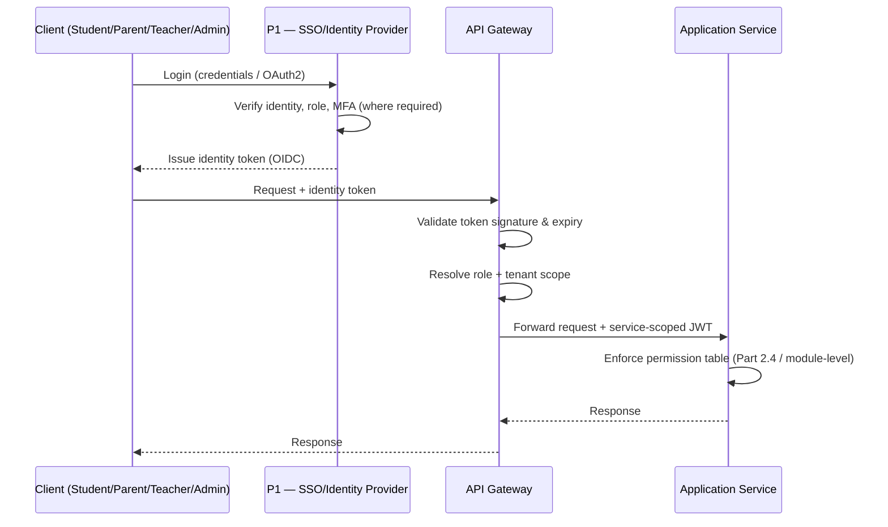
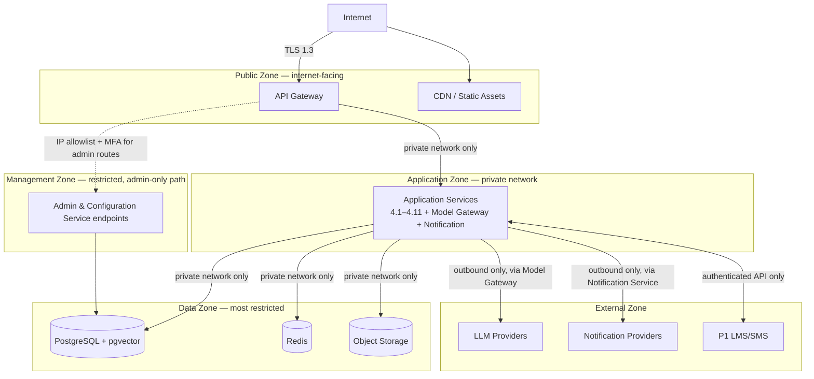

# MASTER SRS — P3 AI STUDENT COACH
## Part 8 — Solution Architecture
### 8.8 Security Architecture

*Layer 4 — Technical & Architecture*

| Field | Value |
|---|---|
| Product | P3 — AI Student Coach |
| Identifier range (this section) | AIC-TR-085 → AIC-TR-104 |
| Scope note | Detailed control implementation (per-endpoint auth, encryption algorithm parameters) is finalized in Part 9.6. This section establishes the architecture: auth layers, network zones, data protection strategy, and OWASP Top 10 coverage. |

---

## 8.8.1  Authentication & Authorization Layers

**Layer summary:**

| Layer | Mechanism | Applies to |
|---|---|---|
| Identity | P1 SSO (OIDC/OAuth2) — P3 has no independent identity store | All human actors (DEP-AIC-05) |
| MFA | Required for Super Admin and School Admin always; required for Psychologist given confidential wellbeing access; optional but encouraged for Teacher; not applicable to Student/Parent at v1.0 unless P1 enforces it | Admin, Psychologist roles (mandatory) |
| Gateway token validation | Signature + expiry check on every request; no request reaches an application service without a valid token | All requests |
| Service-to-service auth | Internal JWT, scoped per calling service, short-lived | All inter-service calls (8.2/8.4) |
| Authorization (RBAC) | Enforced per the Part 2.4 role/permission matrix and each module's permission table | All actions |
| Session management | Session TTL configurable per role; Student/Parent sessions longer-lived than Admin sessions, which expire faster given access to sensitive configuration | All authenticated sessions |

**AIC-TR-085:** P3 shall not implement an independent password store; all authentication shall delegate to P1's identity provider.
**AIC-TR-086:** MFA shall be mandatory (not optional) for Super Admin, School Admin, and Psychologist roles, given their access to consent records, wellbeing data, and platform configuration.
**AIC-TR-087:** A request without a valid, unexpired token shall be rejected at the API Gateway and shall never reach an application service.
**AIC-TR-088:** Service-to-service JWTs shall be scoped to the minimum permission needed for the specific call and shall expire within minutes, not hours.
**AIC-TR-089:** Admin console session TTL shall be shorter than Student/Parent app session TTL, reflecting the higher sensitivity of admin actions.

---

## 8.8.2  Network Security Zones (Figure 7)

**Figure 7 caption:** Four internal zones plus the external zone. Only the API Gateway and CDN are internet-facing (restates AIC-TR-015); the Data Zone is reachable only from the Application Zone, never directly from the Gateway or the internet; the Management Zone applies an additional IP-allowlist and MFA gate on top of standard authentication for admin-configuration routes.

**AIC-TR-090:** No component outside the Public Zone shall be directly reachable from the internet; the Data Zone in particular shall have no internet-routable address.
**AIC-TR-091:** Admin & Configuration Service endpoints shall be reachable only through an additional IP-allowlist control layered on top of standard authentication (Management Zone), in addition to the MFA requirement in AIC-TR-086.
**AIC-TR-092:** Network traffic between zones shall be restricted by firewall rules to the specific ports/protocols required for each documented integration (8.5) and inter-service call (8.4); default-deny shall apply to undocumented paths.
**AIC-TR-093:** The Data Zone shall not initiate outbound connections to the External Zone; all external calls originate from the Application Zone.

---

## 8.8.3  Data Protection

| Control | Implementation |
|---|---|
| Encryption in transit | TLS 1.3 for all external traffic (restates AIC-TR-051) and for all internal zone-to-zone traffic |
| Encryption at rest | AES-256 for the database volume, object storage, and backups |
| Field-level encryption | Additional column-level encryption for the highest-sensitivity fields: Wellbeing & Safety domain confidential fields, Psychometric mirror fields, and Consent Records — encrypted independently of volume-level encryption, so a volume-level compromise alone does not expose these fields in plaintext |
| Key management | Managed key vault (Azure Key Vault, per the Section 8.1.2 cloud recommendation); provider API keys and field-level encryption keys are never stored in application code or environment files in plaintext (restates BR-AIC-A-07 at the architecture level) |
| Key rotation | Provider API keys and field-level encryption keys rotated on a defined schedule (finalized in Part 9.6) and immediately on suspected compromise |
| PII minimization | Per AIC-TR-049, only minimum scoped context is sent to LLM providers; no field-level-encrypted data is decrypted for an LLM call unless that specific field is required for the request |
| Backup encryption | Backups inherit the same AES-256-at-rest standard; backup access requires the same RBAC as production data (no weaker control on backup copies) |

**AIC-TR-094:** Wellbeing & Safety confidential fields, Psychometric mirror fields, and Consent Records shall use field-level encryption independent of and in addition to volume-level encryption.
**AIC-TR-095:** No encryption key shall be stored in source code, application configuration files, or environment variables in plaintext; all keys are retrieved at runtime from the managed key vault.
**AIC-TR-096:** Backup copies shall carry the same encryption standard and access control as production data; no exception is made for backups on the basis of being "just a backup."

---

## 8.8.4  OWASP Top 10 Coverage

| OWASP Risk | P3 Control |
|---|---|
| Broken Access Control | RBAC enforced at API Gateway + service layer + database row-level security (AIC-TR-053); permission tables in Part 2.4 and every module |
| Cryptographic Failures | TLS 1.3 in transit, AES-256 at rest, field-level encryption for highest-sensitivity domains (8.8.3) |
| Injection | Parameterized queries only; no dynamic SQL construction from user input; LLM output never executed as code or query (AIC-TR-078) |
| Insecure Design | Defense-in-depth guardrails (8.7.5); fail-closed safety filter (BR-AIC-S-04); threat modeling reviewed per module addition (AIC-TR-084) |
| Security Misconfiguration | Configuration versioned and audited (AIC-TR-060); default-deny network rules (AIC-TR-092) |
| Vulnerable & Outdated Components | Dependency scanning in CI/CD pipeline (Part 11.3); model-version upgrades gated by evaluation suite (AIC-TR-080) |
| Identification & Authentication Failures | MFA mandatory for high-sensitivity roles (AIC-TR-086); no independent password store (AIC-TR-085); short-lived service tokens (AIC-TR-088) |
| Software & Data Integrity Failures | Immutable audit logs (AIC-TR-009); integrity-critical deterministic checks independent of model behavior (AIC-TR-073) |
| Security Logging & Monitoring Failures | Append-only audit store (8.6); per-component metrics to monitoring (AIC-TR-039); webhook signature verification (AIC-TR-046) |
| Server-Side Request Forgery | Outbound calls restricted to the documented integration list (8.5); no user-supplied URL is fetched by a server-side component without allowlist validation |

**AIC-TR-097:** Every OWASP Top 10 category in the table above shall be re-validated as part of the Part 15.5 security test plan before each major release.

---

## 8.8.5  Additional Security Requirements

**AIC-TR-098:** The API Gateway shall apply rate limiting per authenticated identity (not per IP alone, since school networks may share a small number of public IPs), with the Wellbeing Coach and Consent & Safety bypass path (AIC-TR-007/028) exempted from this limit.
**AIC-TR-099:** Failed authentication attempts shall be rate-limited and logged; a defined threshold of failed attempts shall trigger a temporary lockout per P1's existing account-lockout policy, not a separate P3-specific policy that could conflict with it.
**AIC-TR-100:** Any security incident affecting the Wellbeing & Safety or Consent Records domains shall trigger an accelerated notification path to the DPO, distinct from standard incident handling, given the safeguarding sensitivity of these domains.
**AIC-TR-101:** Penetration testing scope (finalized in Part 15.5) shall explicitly include the Management Zone admin-configuration path and the prompt-injection vectors identified in 8.7.5.
**AIC-TR-102:** Object storage holding ephemeral homework images shall be configured with no public read access under any circumstance, consistent with AIC-TR-043/057's short-lived retention.
**AIC-TR-103:** Cross-tenant security testing (verifying BR-AIC-K-07/AIC-TR-053 tenant isolation) shall be a mandatory test category, not an optional one, given the multi-tenant SaaS model.
**AIC-TR-104:** A confirmed data breach affecting Identity, Psychometric, Wellbeing, or Consent domains shall follow the regulatory notification timelines applicable under the tenant's jurisdiction (GDPR 72-hour notification where applicable, or the locally applicable standard) — exact timelines per jurisdiction to be confirmed with DPO/legal counsel and finalized in Part 16 risk register.

---

### Layer 4 gate status — Part 8.8

| Gate item | Minimum Standard | Status |
|---|---|---|
| Security architecture | Auth layers, data protection, network security zones | Pass — auth sequence diagram, Figure 7 zone diagram, data protection table |
| OWASP Top 10 | Every control maps to implementation (Layer 4 KPI, Section 6.4) | Pass — all 10 categories mapped |
| Security diagram | Required | Pass — Figure 7 |

*Next: 8.9 — Cloud Architecture (cloud services used, regions, availability zones, scaling strategy) — closes Part 8.*
