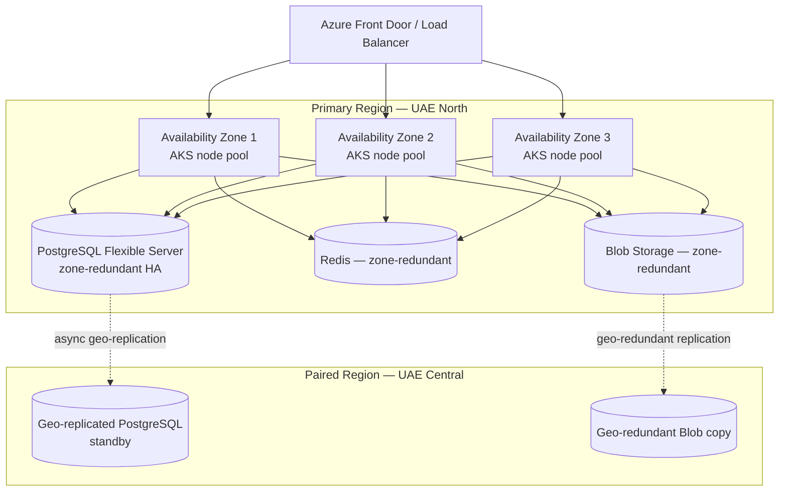

# MASTER SRS — P3 AI STUDENT COACH
## Part 8 — Solution Architecture
### 8.9 Cloud Architecture (closes Part 8)

*Layer 4 — Technical & Architecture*

| Field | Value |
|---|---|
| Product | P3 — AI Student Coach |
| Identifier range (this section) | AIC-TR-105 → AIC-TR-118 |
| Scope note | Builds directly on the Section 8.1.2 cloud recommendation (Azure, UAE North). Detailed environment-by-environment configuration (Dev/QA/UAT/Prod) is in Part 11.2. |

---

## 8.9.1  Cloud Services Used

| Layer | Azure Service | Purpose |
|---|---|---|
| Compute | Azure Kubernetes Service (AKS) | Hosts all 13 application services (8.2) as independently scalable containers |
| Primary database | Azure Database for PostgreSQL — Flexible Server, with pgvector extension | Relational data + vector store (Section 8.1.3) |
| Cache | Azure Cache for Redis | Session state, short-term memory (8.7.3) |
| Object storage | Azure Blob Storage | Ephemeral homework images, export artifacts (8.6.3) |
| API management / gateway | Azure API Management + Azure Front Door | API Gateway component (8.2), CDN for static assets |
| Multi-model AI access | Azure AI Foundry | Routes to OpenAI and Anthropic models from within the Azure ecosystem (Section 8.1.1 Tier A) |
| Secrets / key management | Azure Key Vault | Provider keys, field-level encryption keys (8.8.3) |
| Monitoring | Azure Monitor + Application Insights | Component metrics, logging (AIC-TR-039; detailed in Part 11.5) |
| Container registry | Azure Container Registry | Stores service container images for AKS deployment |
| Cross-cloud call (not Azure-hosted) | Google Gemini API (Google Cloud) | Tier B inference (Section 8.1.1) — called cross-cloud from AKS via the Model Gateway, not migrated onto Azure |

**AIC-TR-105:** The cross-cloud call to Google's Gemini API shall be monitored for latency separately from same-cloud calls (Anthropic/OpenAI via Azure AI Foundry), since cross-cloud network hops introduce a different latency profile than intra-Azure calls.

---

## 8.9.2  Regions & Availability Zones (Figure 8)

Azure's UAE North region (Dubai) offers three availability zones and is paired with UAE Central for disaster recovery purposes — this is the confirmed basis for the region selection made in Section 8.1.2.

**Figure 8 caption:** Application services and data stores are distributed across three availability zones within UAE North for intra-region resilience; UAE Central serves as the geo-redundant pair for disaster recovery. Exact RPO/RTO figures for the geo-replication are finalized in Part 10.4 and Part 11.6.

**AIC-TR-106:** Application services (AKS node pools) shall be distributed across all three availability zones in UAE North, so a single zone failure does not take the platform offline.
**AIC-TR-107:** The primary PostgreSQL instance shall be deployed in zone-redundant HA configuration; a zone failure shall fail over without manual intervention.
**AIC-TR-108:** Geo-replication to UAE Central shall be configured for the primary database and object storage; exact replication lag tolerance is set as an RPO target in Part 10.4.
**AIC-TR-109:** If, following the Gap G12 latency test (Section 8.1.4), UAE North does not meet the latency target for Lahore/Karachi-based users, the region decision shall be revisited before production launch — this is a confirmed pre-launch gate, not a post-launch optimization.

---

## 8.9.3  Scaling Strategy

| Dimension | Strategy |
|---|---|
| Application services | Horizontal autoscaling per AKS pod, triggered on CPU utilization and request-queue depth; each of the 13 services (8.2) scales independently since load patterns differ (e.g., Tutor Engine scales with concurrent chat sessions, Admin & Configuration rarely scales beyond a baseline) |
| Database (mirrored-domain reads) | Read replicas added as student count grows toward the 100,000+ target, offloading Identity/Curriculum/Psychometric mirror reads (8.6.1) from the primary write instance |
| Database (vector search) | pgvector remains the v1.0 choice (Section 8.1.3); the documented migration trigger (query latency degrading below the Part 10 NFR target) governs the move to a dedicated vector-search service if/when triggered |
| Cache | Redis scales vertically initially; cluster mode is the documented next step if session volume at scale exceeds a single-instance capacity |
| Model Gateway | Scales independently of other services since inference call volume is the dominant cost and load driver; configured with its own autoscaling profile distinct from lighter services like Admin & Configuration |
| Notification Service | Scales with notification volume, which spikes predictably around specific events (e.g., bulk weekly parent summaries) — scheduled scale-up for known batch windows, autoscale for unscheduled spikes |
| Growth path | 500–2,000 students (current) → 100,000+ (target) scaling is staged: Phase 1 (current scale) runs on a modest AKS node count and single-region deployment; Phase 2 (growth) adds read replicas and expands node pools; Phase 3 (100,000+) re-evaluates the vector-store and cross-cloud Gemini latency decisions made at v1.0 |

**AIC-TR-110:** Each application service shall have its own autoscaling configuration; no service shall share a fixed scaling policy with another service by default.
**AIC-TR-111:** The Model Gateway Service's autoscaling shall be tied to inference request queue depth specifically, not generic CPU metrics alone, since inference calls are I/O-bound (waiting on provider response) rather than CPU-bound.
**AIC-TR-112:** A staged scaling plan (current → growth → 100,000+ target) shall be documented and reviewed at each major enrollment milestone, not designed once and left unrevisited.
**AIC-TR-113:** Database read-replica addition shall be triggered by a defined read-latency threshold (finalized in Part 10), not by a fixed student-count number alone, since actual load depends on usage patterns as well as headcount.

---

## 8.9.4  Cost & Operational Notes

**AIC-TR-114:** Cross-cloud egress costs (Azure-to-Google for Gemini calls) shall be tracked separately in the Part 13 operational cost model, since this cost is structurally different from intra-Azure traffic.
**AIC-TR-115:** Reserved-capacity or committed-use discounts shall be evaluated for the AKS compute layer once Phase 2 scale is reached, per standard Azure cost-optimization practice — not committed to prematurely at current (Phase 1) scale, where flexibility matters more than discount.
**AIC-TR-116:** The AWS Bedrock alternative (documented in Section 8.1.2) shall remain a documented fallback architecture, re-evaluated if the Gap G12 latency test or contract terms change the cloud provider decision.
**AIC-TR-117:** Disaster recovery failover from UAE North to UAE Central shall be tested at least once before production launch and on a recurring schedule thereafter (frequency finalized in Part 11.6).
**AIC-TR-118:** All cloud architecture decisions in this section are subject to re-verification against current Azure service/region capability documentation before Part 11 environment build-out, since cloud provider capabilities (zone support, new services) change over time.

---

### Layer 4 gate status — Part 8.9

| Gate item | Minimum Standard | Status |
|---|---|---|
| Cloud architecture | Cloud services, regions, availability zones, scaling strategy | Pass — full service table, Figure 8 region/AZ diagram, staged scaling strategy |
| Cloud diagram | Required | Pass — Figure 8 |

---

## PART 8 — CLOSE-OUT (All Sub-Sections)

| Section | Title | Figure | AIC-TR Range | Count |
|---|---|---|---|---|
| 8.1 | Platform Analysis | — (3 comparison tables) | — | — |
| 8.2 | High-Level Architecture | Figure 1 | AIC-TR-004–015 | 12 |
| 8.3 | System Context Diagram | Figure 2 | AIC-TR-016–024 | 9 |
| 8.4 | Component Architecture | Figure 3 | AIC-TR-025–040 | 16 |
| 8.5 | Integration Architecture | Figure 4 | AIC-TR-041–052 | 12 |
| 8.6 | Data Architecture Overview | Figure 5 | AIC-TR-053–064 | 12 |
| 8.7 | AI Architecture | Figure 6 + orchestration diagram | AIC-TR-065–084 | 20 |
| 8.8 | Security Architecture | Figure 7 + auth sequence diagram | AIC-TR-085–104 | 20 |
| 8.9 | Cloud Architecture | Figure 8 | AIC-TR-105–118 | 14 |
| **Total** | **9 sub-sections** | **8 figures + 2 sequence diagrams** | **AIC-TR-001–118** | **118 technical requirements** |

*Part 8 complete. Open items carried forward: G12 (cloud latency test), G13 (LLM pricing re-verification before Part 13), G14 (wellbeing record retention period). Next: Part 9 — Technical Specifications (frontend/backend stack, database design with full data dictionary, API specifications, third-party integration detail, security specifications).*
