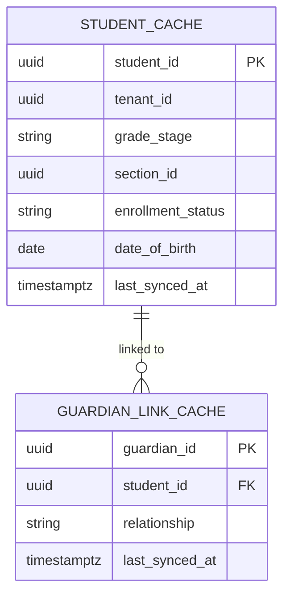
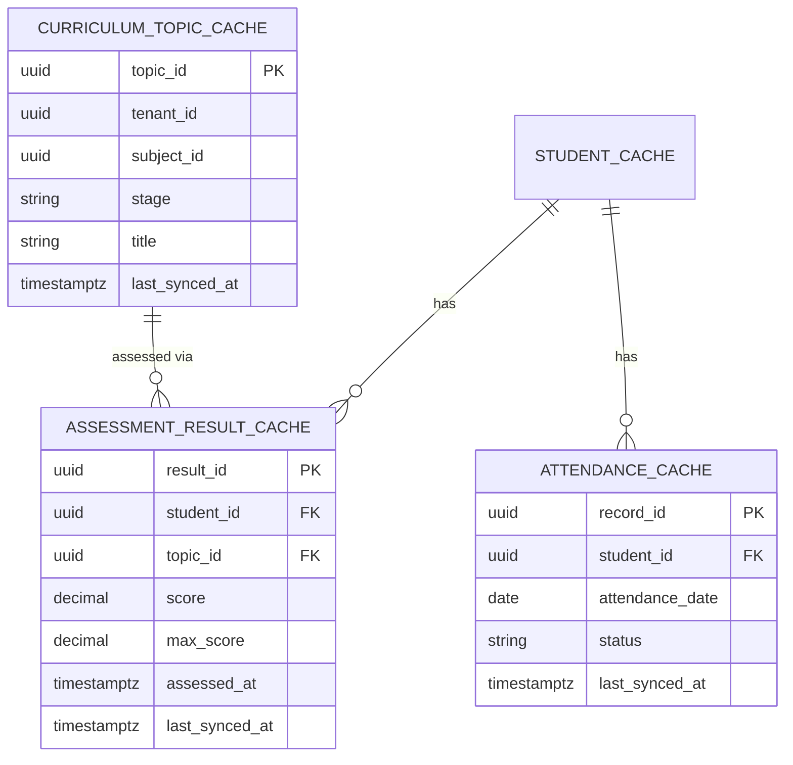
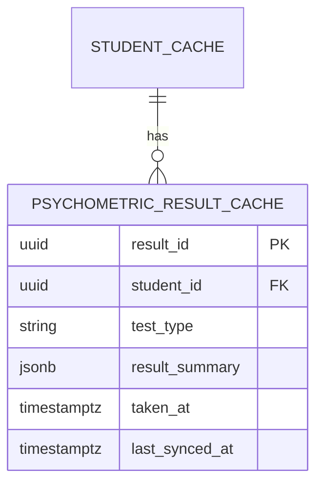
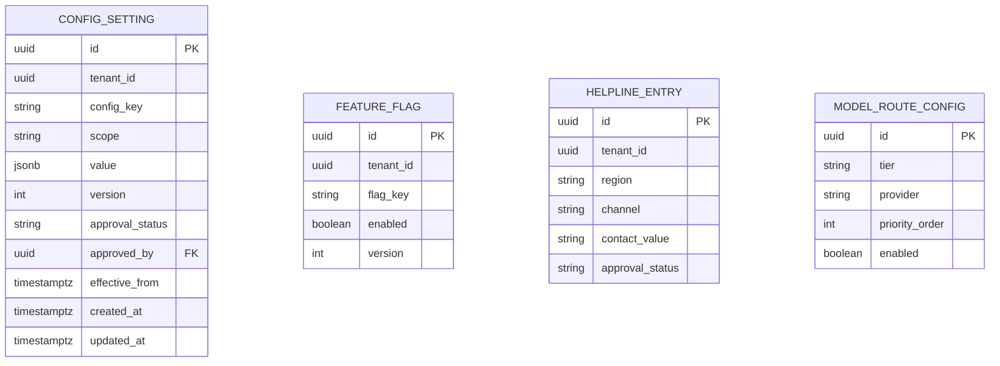
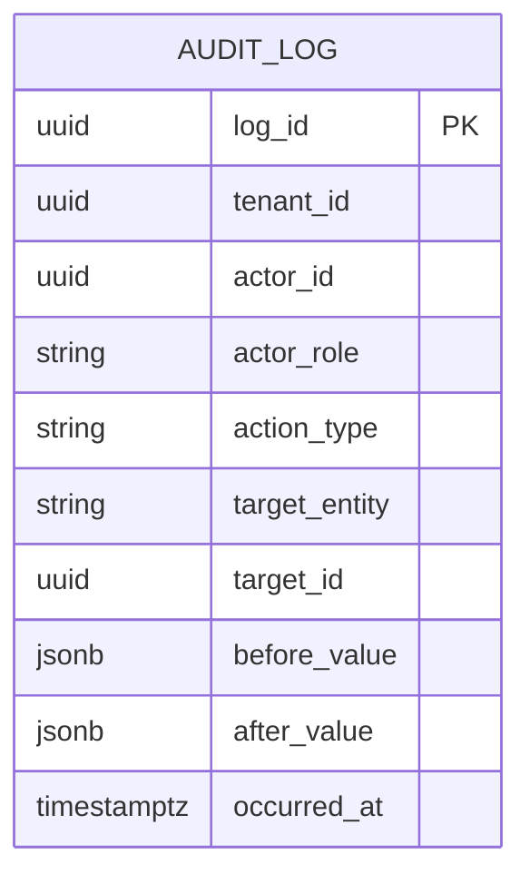

# MASTER SRS — P3 AI STUDENT COACH
## Part 9 — Technical Specifications
### 9.3 Database Design — Batch A: Mirrored Domains, Configuration, Audit

*Layer 4 — Technical & Architecture*

| Field | Value |
|---|---|
| Product | P3 — AI Student Coach |
| Identifier range (this document) | AIC-TR-139 → AIC-TR-148 |
| Domains covered | Identity & Enrollment, Curriculum & Assessment, Psychometric (all mirrored read-only from P1), Configuration, Audit & Compliance Logs |
| Colour-coding note | Mermaid ER diagrams do not support per-entity fill colour reliably across renderers; each domain is therefore rendered as its own figure with a colour swatch in its heading, consistent with the Part 6.3 palette, as the colour-coding mechanism for this markdown deliverable. |

---

## 9.3.0  Shared Field Convention (stated once, applies to every table in Part 9.3)

Per Rule 5 (one statement, one location), the following fields are **not repeated** in every entity's field list below; they apply to all P3-owned tables unless explicitly noted otherwise.

| Field | Type | Constraint | Description |
|---|---|---|---|
| `id` | UUID | PK, system-generated (`gen_random_uuid()`) | Primary key for P3-owned entities |
| `tenant_id` | UUID | NOT NULL, FK → `tenant.id`, indexed | Enforces row-level tenant isolation (AIC-TR-053) |
| `created_at` | timestamptz | NOT NULL, default `now()` | Row creation timestamp |
| `updated_at` | timestamptz | NOT NULL, default `now()`, auto-updated on write | Last modification timestamp |

Mirrored (P1-sourced) tables use **P1's own identifier** as their primary key (not a P3-generated UUID), since they represent a cached read of an external system of record, and additionally carry a `last_synced_at` field per the mirrored-domain freshness policy (8.6.3).

---

## 9.3.1  Identity & Enrollment Domain (mirrored) — 🔵 `#1F4E79`

**Figure 9a — Identity & Enrollment ER diagram.**

| Table | Field | Type | Constraint | Description |
|---|---|---|---|---|
| `student_cache` | `student_id` | UUID | PK (= P1 student ID) | Mirrors P1's student identifier; P3 never generates its own |
| `student_cache` | `tenant_id` | UUID | NOT NULL, indexed | Tenant scope |
| `student_cache` | `grade_stage` | string | NOT NULL | Cambridge stage, drives stage-scoped retrieval (BR-AIC-K-02) |
| `student_cache` | `section_id` | UUID | NOT NULL | P1 section reference |
| `student_cache` | `enrollment_status` | enum | NOT NULL — {active, suspended, graduated, alumni} | Gates P3 access alongside Consent Records |
| `student_cache` | `date_of_birth` | date | NOT NULL, not future-dated | Drives the age-gating logic in Module 4.10 (AIC-FR-177) |
| `student_cache` | `last_synced_at` | timestamptz | NOT NULL | Cache freshness; refreshed on read per short TTL (8.6.3) |
| `guardian_link_cache` | `guardian_id` | UUID | PK | Mirrors P1 guardian identifier |
| `guardian_link_cache` | `student_id` | UUID | FK → `student_cache.student_id`, NOT NULL | Links guardian to student |
| `guardian_link_cache` | `relationship` | enum | NOT NULL — {parent, legal_guardian} | Determines consent authority (Module 4.10) |

**Indexes:** `student_cache(tenant_id, section_id)` — supports School Admin per-section queries (SCR-SENABLE-001). `guardian_link_cache(student_id)` — supports consent-gate lookups (AIC-FR-176).
**Constraints:** `student_cache.enrollment_status` and `date_of_birth` are NOT NULL — AIC-TR-056 prohibits P3 writes to this table; any row without a valid DOB blocks activation per the 4.10.9 error state rather than defaulting to an assumed age.

**AIC-TR-139:** `student_cache` and `guardian_link_cache` shall be populated only by the P1 sync process (8.5/8.6); no application service shall insert or update these tables directly.

---

## 9.3.2  Curriculum & Assessment Domain (mirrored) — 🟢 `#2E8B57`

**Figure 9b — Curriculum & Assessment ER diagram.**

| Table | Field | Type | Constraint | Description |
|---|---|---|---|---|
| `curriculum_topic_cache` | `topic_id` | UUID | PK (= P1/Cambridge topic ID) | Anchors the Knowledge Graph's Topic node (9.3.5) |
| `curriculum_topic_cache` | `subject_id` | UUID | NOT NULL | Subject grouping |
| `curriculum_topic_cache` | `stage` | string | NOT NULL | Scopes retrieval (BR-AIC-K-02) |
| `curriculum_topic_cache` | `title` | string | NOT NULL | Display name |
| `assessment_result_cache` | `result_id` | UUID | PK (= P1 result ID) | Mirrors P1 assessment record |
| `assessment_result_cache` | `student_id` | UUID | FK → `student_cache.student_id`, NOT NULL | — |
| `assessment_result_cache` | `topic_id` | UUID | FK → `curriculum_topic_cache.topic_id` | Nullable if assessment spans multiple topics |
| `assessment_result_cache` | `score` / `max_score` | decimal | NOT NULL, `score` <= `max_score` | Feeds weak/strong topic inference (AIC-FR-102) |
| `assessment_result_cache` | `assessed_at` | timestamptz | NOT NULL | — |
| `attendance_cache` | `record_id` | UUID | PK | Mirrors P1 attendance record |
| `attendance_cache` | `attendance_date` | date | NOT NULL | — |
| `attendance_cache` | `status` | enum | NOT NULL — {present, absent, late, excused} | — |

**Indexes:** `assessment_result_cache(student_id, topic_id, assessed_at DESC)` — supports recency-ordered profile inference queries. `curriculum_topic_cache(tenant_id, stage, subject_id)` — supports RAG scope resolution (AIC-FR-130).

**AIC-TR-140:** `curriculum_topic_cache.topic_id` shall be the canonical join key between this domain and the Knowledge Graph's Topic node (9.3.5), avoiding a duplicate topic-identifier scheme between P1-mirrored and P3-owned tables.

---

## 9.3.3  Psychometric Domain (mirrored) — 🟣 `#6B4FA0`

**Figure 9c — Psychometric ER diagram.**

| Table | Field | Type | Constraint | Description |
|---|---|---|---|---|
| `psychometric_result_cache` | `result_id` | UUID | PK (= P1 result ID) | Mirrors P1 psychometric record |
| `psychometric_result_cache` | `student_id` | UUID | FK → `student_cache.student_id`, NOT NULL | — |
| `psychometric_result_cache` | `test_type` | enum | NOT NULL — {personality, career_riasec, aptitude, iq, eq} | Distinguishes the five test families from the P1 SRS (3.7.3) |
| `psychometric_result_cache` | `result_summary` | jsonb | NOT NULL | Structured result payload; schema varies by `test_type`, validated at the application layer (Pydantic/class-validator, 9.2), not enforced at the column level given the variant structure |
| `psychometric_result_cache` | `taken_at` | timestamptz | NOT NULL | Drives the 12-month recency check (BR-AIC-C-06) |

**Field-level encryption:** Per AIC-TR-094, `result_summary` is field-level encrypted in addition to volume-level encryption, given its highly sensitive classification (8.6.1).
**Indexes:** `psychometric_result_cache(student_id, test_type, taken_at DESC)` — supports "most recent result per test type" queries used by Career Coach (Module 4.4).

**AIC-TR-141:** No P3 service shall write to `psychometric_result_cache`; Career Coach and Personalization read this table but never recompute or persist a derived score back into it (BR-AIC-015/BR-AIC-C-01).

---

## 9.3.4  Configuration Domain (P3-owned) — 🟠 `#D98C2B`

**Figure 9d — Configuration ER diagram.**

| Table | Field | Type | Constraint | Description |
|---|---|---|---|---|
| `config_setting` | `config_key` | string | NOT NULL | e.g., `homework.similarity_threshold`, `token.monthly_cap` |
| `config_setting` | `scope` | enum | NOT NULL — {global, tenant} | Distinguishes Super Admin global config from School Admin tenant-scoped config |
| `config_setting` | `value` | jsonb | NOT NULL | Setting value; type validated at the application layer per key |
| `config_setting` | `version` | integer | NOT NULL, monotonic increment | Supports AIC-TR-060 (no hard delete, superseded values queryable) |
| `config_setting` | `approval_status` | enum | NOT NULL — {pending, approved} | Enforces AIC-TR-091/BR-AIC-A-04 for safety-critical settings |
| `config_setting` | `approved_by` | UUID | FK → admin user (P1-mirrored identity), nullable until approved | — |
| `config_setting` | `effective_from` | timestamptz | NOT NULL | A pending change has no effect until approved and this timestamp is reached |
| `feature_flag` | `flag_key` | string | NOT NULL | e.g., `career_coach.enabled`, `mock_test.enabled` |
| `feature_flag` | `enabled` | boolean | NOT NULL | — |
| `helpline_entry` | `region` | string | NOT NULL | — |
| `helpline_entry` | `channel` | enum | NOT NULL — {phone, sms, chat, website} | — |
| `helpline_entry` | `contact_value` | string | NOT NULL, non-empty | Read live by the Safe-Response Composer (AIC-TR-038) — never cached client-side |
| `model_route_config` | `tier` | enum | NOT NULL — {A, B, C} | — |
| `model_route_config` | `provider` | enum | NOT NULL — {anthropic, openai, google, self_hosted} | — |
| `model_route_config` | `priority_order` | integer | NOT NULL | Failover order within a tier (8.4.2 Failover Manager) |

**Indexes:** `config_setting(tenant_id, config_key, version DESC)` — retrieves the latest approved version per key. `helpline_entry(tenant_id, region)` UNIQUE — one active entry per region per tenant.
**Constraints:** No row in `config_setting`, `feature_flag`, `helpline_entry`, or `model_route_config` is ever hard-deleted (AIC-TR-060); a superseding insert with an incremented `version` is used instead.

**AIC-TR-142:** `config_setting` rows with `scope = 'global'` shall have a NULL `tenant_id`; application logic shall treat a global row as the default for any tenant without an overriding tenant-scoped row of the same `config_key`.
**AIC-TR-143:** A pending (`approval_status = 'pending'`) row shall never be read by an application service's runtime configuration lookup; only `approved` rows are live.

---

## 9.3.5  Audit & Compliance Logs Domain (P3-owned, append-only) — ⚫ `#1A1A1A`

**Figure 9e — Audit & Compliance Logs ER diagram.**

| Field | Type | Constraint | Description |
|---|---|---|---|
| `log_id` | UUID | PK | — |
| `tenant_id` | UUID | NOT NULL, indexed | — |
| `actor_id` | UUID | NULLABLE (NULL for system-initiated actions, e.g., automated escalation) | — |
| `actor_role` | string | NOT NULL | Role at time of action (denormalized, since a role's permissions may change later — audit must reflect what was true then) |
| `action_type` | string | NOT NULL | e.g., `consent.approved`, `config.updated`, `escalation.l2_raised`, `homework.mode_selected` |
| `target_entity` | string | NOT NULL | Table/domain affected |
| `target_id` | UUID | NOT NULL | Row affected |
| `before_value` / `after_value` | jsonb | NULLABLE (NULL for create/delete-only events as appropriate) | Change diff |
| `occurred_at` | timestamptz | NOT NULL, default `now()` | No `updated_at` — this table has no update path |

**Constraints:** `audit_log` has **no UPDATE or DELETE grant** for any application database role (AIC-TR-009); the table is INSERT-only at the database permission level, not merely by application convention.
**Indexes:** `audit_log(tenant_id, target_entity, target_id, occurred_at DESC)` — supports per-entity audit history queries (e.g., SCR-AUDIT-001). `audit_log(action_type, occurred_at DESC)` — supports compliance queries by action category.
**Partitioning:** `audit_log` is partitioned by month on `occurred_at` to keep the append-only table performant at scale (100,000+ students generating high event volume); partition strategy finalized in Part 11.

**AIC-TR-144:** The database role used by every application service shall have INSERT-only privilege on `audit_log`; UPDATE and DELETE privileges shall not exist for any role, including administrative database roles used by the application (a true administrative break-glass procedure for exceptional correction is a separate, heavily logged-itself process outside normal operation).
**AIC-TR-145:** Every row in `audit_log` shall resolve `actor_role` from the session at the time of the action, not from a live lookup of the actor's current role, to preserve historical accuracy.
**AIC-TR-146:** `audit_log` partitions shall never be dropped on the standard 24-month anonymization cycle (AIC-TR-058); audit retention follows the compliance policy (Part 3.5), which may exceed the standard interaction-data retention window.
**AIC-TR-147:** Wellbeing-domain audit entries (escalation records) within `audit_log` shall be tagged distinctly (`target_entity = 'wellbeing_escalation'`) to support the longer retention policy pending Gap G14 resolution, without requiring a structurally separate table.
**AIC-TR-148:** Configuration changes to safety-critical settings (`config_setting` rows requiring approval) shall produce two linked audit entries — the request and the approval — both queryable as a single change history.

---

### Layer 4 gate status — Part 9.3 Batch A

| Gate item | Minimum Standard | Status |
|---|---|---|
| ERD coverage | Every entity in this batch is in an ERD | Pass — Figures 9a–9e |
| Data dictionary | Every field documented | Pass — type, constraints, description per field |
| Table specs, indexes, constraints | Required | Pass |

*Next: Part 9.3 Batch B — Conversation & Interaction, Student Learning Profile, Knowledge/Content domains (the core AI-facing data model).*
