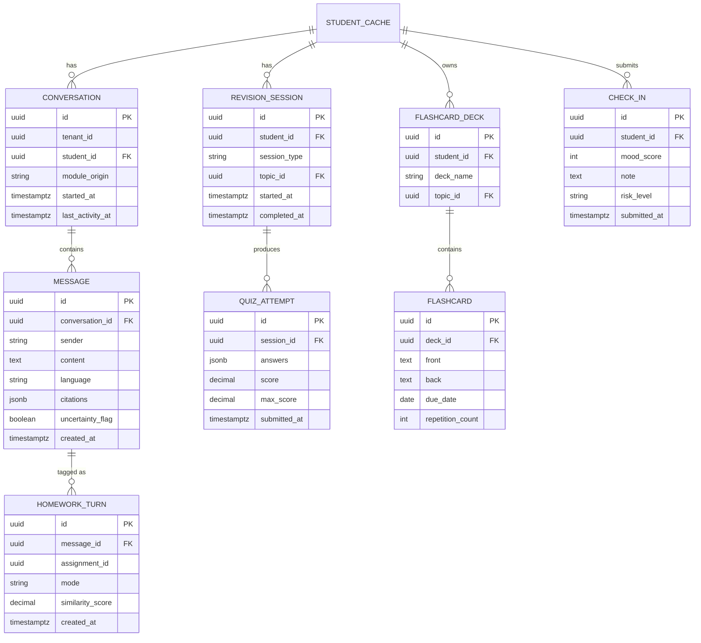
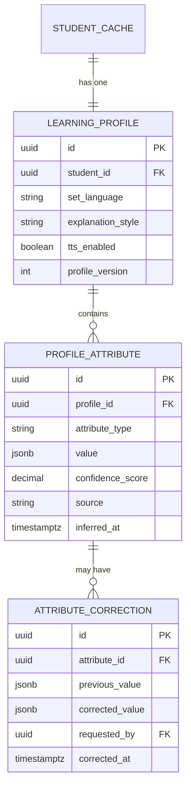
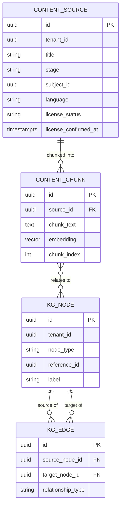

# MASTER SRS — P3 AI STUDENT COACH
## Part 9 — Technical Specifications
### 9.3 Database Design — Batch B: Conversation & Interaction, Student Learning Profile, Knowledge/Content

*Layer 4 — Technical & Architecture*

| Field | Value |
|---|---|
| Product | P3 — AI Student Coach |
| Identifier range (this document) | AIC-TR-149 → AIC-TR-160 |
| Domains covered | Conversation & Interaction, Student Learning Profile, Knowledge/Content (the core AI-facing data model) |
| Shared convention | `id`, `tenant_id`, `created_at`, `updated_at` apply to every table below per 9.3.0 (Batch A) and are not repeated. |

---

## 9.3.6  Conversation & Interaction Domain (P3-owned) — 🔵 `#4F86B5`

**Figure 9f — Conversation & Interaction ER diagram.**

| Table | Field | Type | Constraint | Description |
|---|---|---|---|---|
| `conversation` | `student_id` | UUID | FK → `student_cache.student_id`, NOT NULL | — |
| `conversation` | `module_origin` | enum | NOT NULL — {tutor, homework, career, wellbeing} | Which module initiated the thread |
| `conversation` | `last_activity_at` | timestamptz | NOT NULL | Drives the 24-month retention clock (AIC-TR-058) |
| `message` | `conversation_id` | UUID | FK → `conversation.id`, NOT NULL | — |
| `message` | `sender` | enum | NOT NULL — {student, coach} | — |
| `message` | `content` | text | NOT NULL, 1–4,000 chars (4.1.8) | — |
| `message` | `language` | enum | NOT NULL — {en, ur, ar} | — |
| `message` | `citations` | jsonb | NULLABLE | Array of source references attached by the Citation Builder (8.4.2) |
| `message` | `uncertainty_flag` | boolean | NOT NULL, default `false` | Set when AIC-FR-005's uncertainty path fires; mutually informative with `citations` (a coach message should have non-empty `citations` OR `uncertainty_flag = true`, enforced at the application layer per AIC-TR-033) |
| `homework_turn` | `message_id` | UUID | FK → `message.id`, NOT NULL, UNIQUE | One-to-one extension of a coach message when it occurs in graded context |
| `homework_turn` | `assignment_id` | UUID | NOT NULL | P1 assignment reference (not a local FK, since assignments are P1-owned) |
| `homework_turn` | `mode` | enum | NOT NULL — {guided, full_solution} | The teacher-visible mode tag (AIC-FR-028) |
| `homework_turn` | `similarity_score` | decimal | NOT NULL, 0.00–1.00 | Score that triggered mode selection (AIC-FR-022) |
| `revision_session` | `session_type` | enum | NOT NULL — {quiz, mock_test, flashcard_review, summary} | — |
| `revision_session` | `topic_id` | UUID | FK → `curriculum_topic_cache.topic_id` | — |
| `quiz_attempt` | `answers` | jsonb | NOT NULL | Submitted answer set |
| `quiz_attempt` | `score` / `max_score` | decimal | NOT NULL | — |
| `flashcard_deck` | `deck_name` | string | NOT NULL, unique per student (4.3.8) | — |
| `flashcard` | `due_date` | date | NOT NULL | Spaced-repetition scheduling (AIC-FR-047) |
| `flashcard` | `repetition_count` | integer | NOT NULL, default 0 | Spaced-repetition algorithm state |
| `check_in` | `mood_score` | integer | NULLABLE, 1–10 (4.5.8) | — |
| `check_in` | `risk_level` | enum | NOT NULL — {none, l1, l2, l3} | Output of the Signal Classifier (8.4.2); drives escalation but the case itself lives in the Wellbeing domain (Batch C) |

**Field-level note:** `homework_turn` rows are immutable once written (BR-AIC-H-07) — no UPDATE grant on this table for any application role, same pattern as `audit_log`.
**Indexes:** `message(conversation_id, created_at)`. `homework_turn(assignment_id, mode)` — supports the teacher turn-log view (SCR-TLOG-001). `flashcard(deck_id, due_date)` — supports due-card queries (SCR-FLASH-002). `check_in(student_id, submitted_at DESC)`.

**AIC-TR-149:** `homework_turn` shall have no UPDATE or DELETE grant for any application database role, consistent with BR-AIC-H-07's immutability requirement, enforced identically to the `audit_log` pattern (AIC-TR-144).
**AIC-TR-150:** The application layer shall enforce that no `message` row with `sender = 'coach'` is committed unless it has either a non-empty `citations` array or `uncertainty_flag = true` — this is the database-adjacent enforcement point for AIC-TR-033.

---

## 9.3.7  Student Learning Profile Domain (P3-owned) — 🟢 `#3A7D5C`

**Figure 9g — Student Learning Profile ER diagram.**

| Table | Field | Type | Constraint | Description |
|---|---|---|---|---|
| `learning_profile` | `student_id` | UUID | FK → `student_cache.student_id`, UNIQUE, NOT NULL | One profile per student |
| `learning_profile` | `set_language` | enum | NOT NULL — {en, ur, ar} | Drives AIC-FR-002 and all RTL rendering (Part 6.6) |
| `learning_profile` | `explanation_style` | enum | NOT NULL — {concise, detailed, example_led} | (4.6.8) |
| `learning_profile` | `profile_version` | integer | NOT NULL, monotonic | Supports AIC-TR-113-class versioning for the profile as a whole |
| `profile_attribute` | `attribute_type` | enum | NOT NULL — {weak_topic, strong_topic, learning_style_signal, engagement_level} | — |
| `profile_attribute` | `value` | jsonb | NOT NULL | Variant shape per `attribute_type` |
| `profile_attribute` | `confidence_score` | decimal | NOT NULL, 0.00–1.00 | AIC-FR-107; consumed by the Confidence Gate (8.4.2) |
| `profile_attribute` | `source` | enum | NOT NULL — {inferred, student_corrected} | Distinguishes machine inference from a student correction |
| `attribute_correction` | `attribute_id` | UUID | FK → `profile_attribute.id`, NOT NULL | — |
| `attribute_correction` | `previous_value` / `corrected_value` | jsonb | NOT NULL | Preserves history per BR-AIC-P-02/AIC-TR-032 — never overwritten in place |
| `attribute_correction` | `requested_by` | UUID | FK → `student_cache.student_id` | The student who submitted the correction |

**Indexes:** `profile_attribute(profile_id, attribute_type, inferred_at DESC)` — retrieves the latest value per attribute type. `attribute_correction(attribute_id, corrected_at DESC)` — full correction history per attribute.
**Constraints:** A `profile_attribute` row is never overwritten when corrected; instead, `source` flips to `student_corrected` on a **new** row, and the prior row is superseded (queryable via `attribute_correction`), consistent with AIC-TR-032's versioning requirement.

**AIC-TR-151:** `profile_attribute` updates resulting from a student correction shall always create a new row plus an `attribute_correction` entry, never an in-place UPDATE of `value`, to preserve full history.
**AIC-TR-152:** `learning_profile.set_language` changes shall take effect for the next interaction only; an in-flight response already generated in the prior language is not retroactively changed.

---

## 9.3.8  Knowledge/Content Domain (P3-owned, license-gated) — 🟡 `#B8902E`

**Figure 9h — Knowledge/Content ER diagram.**

| Table | Field | Type | Constraint | Description |
|---|---|---|---|---|
| `content_source` | `title` | string | NOT NULL | — |
| `content_source` | `stage` / `subject_id` | string / UUID | NOT NULL | Scopes retrieval (BR-AIC-K-02) |
| `content_source` | `language` | enum | NOT NULL — {en, ur, ar} | — |
| `content_source` | `license_status` | enum | NOT NULL — {pending, confirmed, revoked}, default `pending` | Gates indexing (BR-AIC-K-01) |
| `content_source` | `license_confirmed_at` | timestamptz | NULLABLE | Set when Super Admin confirms (UC-K-04) |
| `content_chunk` | `source_id` | UUID | FK → `content_source.id`, NOT NULL | — |
| `content_chunk` | `chunk_text` | text | NOT NULL | — |
| `content_chunk` | `embedding` | vector | NOT NULL (pgvector type) | Dimension fixed per the embedding model in use (Section 8.1.1 Tier B); re-embedding required on embedding-model change (EC-AIC-K-07) |
| `content_chunk` | `chunk_index` | integer | NOT NULL | Ordering within source document |
| `kg_node` | `node_type` | enum | NOT NULL — {student, course, learning_objective, topic, assessment, resource, recommendation} | Per AIC-FR-121 |
| `kg_node` | `reference_id` | UUID | NOT NULL | Points to the underlying entity (e.g., a `curriculum_topic_cache.topic_id` for a Topic node) |
| `kg_edge` | `source_node_id` / `target_node_id` | UUID | FK → `kg_node.id`, NOT NULL | — |
| `kg_edge` | `relationship_type` | enum | NOT NULL — {covers, assesses, recommends, prerequisite_of} | — |

**Critical constraint:** `content_chunk` rows are only retrievable (queryable by the Retrieval API, 8.4.2) when their parent `content_source.license_status = 'confirmed'` — enforced as a mandatory JOIN/filter condition in every retrieval query, not merely application convention, given BR-AIC-K-01's importance.
**Tenant isolation:** `content_source.tenant_id` (and transitively `content_chunk` via `source_id`) is the enforcement point for BR-AIC-K-07 — no retrieval query omits this filter (AIC-TR-053).
**Indexes:** `content_chunk` uses a pgvector HNSW or IVFFlat index (finalized in Part 11 based on corpus size) on `embedding`, partitioned conceptually by `tenant_id` via the WHERE-clause-enforced isolation above. `kg_edge(source_node_id)` and `kg_edge(target_node_id)` for bidirectional traversal (AIC-FR-123).

**AIC-TR-153:** Every retrieval query against `content_chunk` shall include `content_source.license_status = 'confirmed'` as a mandatory filter, implemented at the query-builder level so it cannot be omitted by a future code change without a deliberate override.
**AIC-TR-154:** `content_chunk.embedding` shall be re-generated for all rows of a given `source_id` if the embedding model changes; mixed-model vectors shall never coexist in a single similarity search (EC-AIC-K-07).
**AIC-TR-155:** `kg_node` rows of type `course`, `learning_objective`, and `assessment` shall be created and updated only by the P1 graph-sync process (AIC-TR-035); `topic` nodes derive from `curriculum_topic_cache`; only `recommendation` nodes are written by a P3 application service (Personalization).
**AIC-TR-156:** When `content_source.license_status` transitions to `revoked`, all associated `content_chunk` rows shall become unreachable to the Retrieval API within the window defined in BR-AIC-K-06, whether by a status-filter check (immediate) or physical deletion (per the reindex job's schedule) — the filter check is the primary, immediate control; physical cleanup is the secondary, scheduled control.
**AIC-TR-157:** `kg_node.reference_id` shall be validated against its corresponding source table (e.g., `curriculum_topic_cache` for `topic` nodes) at write time, preventing orphaned graph nodes.

---

## 9.3.9  Cross-Batch Notes

**AIC-TR-158:** The `vector` column type (pgvector extension) requires the `pgvector` extension to be enabled on the PostgreSQL instance before any migration touching `content_chunk` runs; this is a documented prerequisite for the Part 11 environment build, not assumed implicit.
**AIC-TR-159:** Foreign keys crossing from P3-owned tables to mirrored tables (e.g., `conversation.student_id` → `student_cache.student_id`) shall use `ON DELETE RESTRICT`, not `CASCADE` — a P1-side student removal should not silently cascade-delete P3 interaction history; deletion/anonymization of P3 data follows the documented retention process (AIC-TR-058), not a database cascade.
**AIC-TR-160:** All `jsonb` columns with variant schemas (`profile_attribute.value`, `psychometric_result_cache.result_summary`, `config_setting.value`) shall have their expected shape documented per enum value in the Part 9 technical appendix (Appendix C cross-reference) so the variant structure is not left implicit in code alone.

---

### Layer 4 gate status — Part 9.3 Batch B

| Gate item | Minimum Standard | Status |
|---|---|---|
| ERD coverage | Every entity in this batch is in an ERD | Pass — Figures 9f–9h |
| Data dictionary | Every field documented | Pass |
| Table specs, indexes, constraints | Required | Pass — including the license-gate enforcement detail critical to BR-AIC-K-01 |

*Next: Part 9.3 Batch C — Recommendations & Career Output, Wellbeing & Safety, Consent Records, Notification & Delivery (closes the database design section).*
